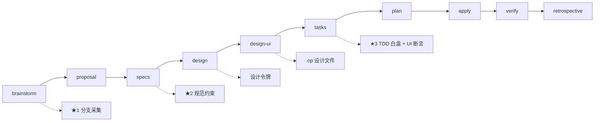

# OpenCode + OpenSpec + Superpowers + OpenPencil 集成方案

## 一、方案概述

将 OpenCode、OpenSpec、Superpowers、OpenPencil 四工具深度融合，形成从需求到交付的完整规范驱动开发链路。

### 整体工作流



### 四工具定位

| 工具 | 定位 | 核心职责 |
|------|------|----------|
| OpenCode | AI 编码平台 | 执行环境、配置中心 |
| OpenSpec | 规范驱动开发 (SDD) | 变更管理、需求沉淀、artifact 生命周期 |
| Superpowers | 工程方法论 + 技能系统 | TDD、代码审查、git worktree、branch 管理 |
| OpenPencil | AI 原生设计工具 | UI 设计稿生成、设计令牌管理 |

### 全局规则
项目级全局规则（语言、图表格式、编码规范等）由各项目在 `AGENTS.md` 中定义，
通过 `opencode.json` 的 `instructions` 在运行时注入到每个 artifact 上下文。
本文档不重复定义 — 具体规则请参考对应项目的 AGENTS.md。

---

## 二、前置条件

| 工具 | 版本要求 |
|------|---------|
| Node.js | ≥ 20.0.0 |
| npm | ≥ 9.0.0 |
| OpenCode | 最新版 |
| OpenPencil CLI | 需安装（可选，用于 UI 设计环节） |

---

## 三、安装配置

### 3.1 安装 OpenSpec

```bash
# 探测：已安装则跳过
command -v openspec >/dev/null 2>&1 && echo "openspec 已安装，跳过" || npm install -g @fission-ai/openspec@latest
openspec --version
```

执行 `openspec init` 后，需切换至 **workflows profile** 以启用完整工作流命令：

```bash
cd {project-directory}
openspec init
# 切换至 Expanded Profile（启用 opsx:new, opsx:ff, opsx:continue, opsx:verify 等命令）
openspec config profile    # 选择 workflows
openspec update            # 更新配置
```

> 注意：Base (Core) Profile 仅包含 `propose`、`explore`、`apply`、`sync`、`archive` 五个命令，文档列出的 `/opsx:new`、`/opsx:ff`、`/opsx:continue`、`/opsx:verify` 等命令需 Expanded Profile 才能使用。

### 3.2 安装 Superpowers 插件

在 `opencode.json` 中添加 plugin，或通过 CLI 安装：

```bash
# 探测：检查 opencode.json 中是否已配置 superpowers 插件
grep -q "superpowers" opencode.json 2>/dev/null && echo "Superpowers 插件已配置，跳过" || opencode plugin superpowers@git+https://github.com/obra/superpowers.git
```

### 3.3 下载 superpowers-bridge schema

```bash
# 探测：目录已存在则跳过下载和复制
if [ -d "openspec/schemas/superpowers-bridge" ]; then
  echo "superpowers-bridge schema 已存在，跳过"
else
  git clone https://github.com/JiangWay/openspec-schemas.git /tmp/openspec-schemas
  cp -r /tmp/openspec-schemas/superpowers-bridge openspec/schemas/
  rm -rf /tmp/openspec-schemas
fi
openspec schema validate superpowers-bridge
```

### 3.4 安装 OpenPencil CLI + 配置 MCP

```bash
# 探测：已安装则跳过
command -v op >/dev/null 2>&1 && echo "OpenPencil CLI 已安装，跳过" || npm install -g @zseven-w/openpencil
op --version
```

在 `opencode.json` 中配置 MCP 服务器（详见 4.1）。

### 3.5 扩展 schema 添加 design-ui artifact

`superpowers-bridge` schema **v1.0+ 已内置 design-ui artifact**，
位于 `design → design-ui → tasks` 依赖链中，无需手动添加。

如需在旧版本中自行扩展，参考以下结构：

```yaml
- id: design-ui
  generates: design-ui/
  description: UI 设计稿（OpenPencil 格式），从 design.md 前端章节生成
  template: design-ui.md
  instruction: |
    使用 OpenPencil 生成 UI 设计稿。
    从 design.md 的 §Frontend Architecture 和 §UI Design Tokens 提取信息。
    为 specs/ 中的每个 capability 生成对应的 .op 设计文件。
    使用 MCP 工具或 op CLI 创建设计。
    输出目录：design-ui/<capability-name>.op
  requires:
    - design
```

并更新 tasks 的 requires 依赖链：

```yaml
- id: tasks
  requires:
    - specs
    - design
    - design-ui
```

### 3.6 创建 design-ui.md 模板

在 `openspec/schemas/superpowers-bridge/templates/design-ui.md` 中创建：

```markdown
# UI 设计稿

## 概述
本目录包含变更相关的 UI 设计稿，使用 OpenPencil 格式（.op 文件）。

## 关联 Capabilities

| Capability | 设计文件 | 说明 |
|------------|----------|------|
| {capability-name} | {capability-name}.op | {description} |

## 设计规范

从 design.md 提取的样式要求：

### 配色方案
- 主色：{primary-color}
- 辅助色：{secondary-color}
- 背景色：{background-color}

### 组件规范
- 按钮样式
- 卡片样式
- 列表样式

## 组件清单
- Header：顶部导航栏
- Content：主内容区域
- Footer：底部信息区

## 使用说明
1. 使用 OpenPencil 打开 .op 文件
2. 参考设计稿进行代码实现
3. 可导出为 PNG 或代码（React/Vue）
```

---

## 四、配置文件模板

### 4.1 opencode.json

```json
{
  "$schema": "https://opencode.ai/config.json",
  "plugin": [
    "superpowers@git+https://github.com/obra/superpowers.git"
  ],
  "mcp": {
    "openpencil": {
      "type": "remote",
      "url": "http://127.0.0.1:3100/mcp"
    }
  },
  "instructions": [
    "AGENTS.md"
  ],
  "permission": {
    "skill": {
      "*": "allow"
    }
  },
  "agent": {
    "plan": {
      "permission": {
        "skill": {
          "*": "allow"
        }
      }
    }
  }
}
```

### 4.2 AGENTS.md

```markdown
# {项目名称} - 项目指南

## 全局规则
- 语言：{language-convention}（例如：简体中文、English 等）
- 图表格式：{diagram-convention}（例如：mermaid、PlantUML 等）
- 沟通风格：{communication-style}（例如：简洁、详细等）

## 技术栈
- {后端框架及版本}
- {数据库及版本}
- {前端框架及版本}

## 四工具协同规则

### 1. OpenSpec 变更管理

使用 **superpowers-bridge** schema（已内置 design-ui artifact）：
- 创建变更：`/opsx:new {任务名} --schema superpowers-bridge`
- 规划阶段：`/opsx:ff` 一次性生成或 `/opsx:continue` 逐步推进
- 执行阶段：`/opsx:apply`（自动启用 TDD + 代码审查）
- 验证阶段：`/opsx:verify`
- 归档阶段：`/opsx:archive`

### 2. Superpowers 执行规范

- **TDD 强制**：RED → GREEN → REFACTOR，生产代码必须先有失败测试
- **代码审查**：每任务 subagent 审查 + 整体最终审查
- **Git Worktree**：apply 阶段自动创建隔离工作目录
- **Branch 收尾**：完成 retrospective + archive 后才能开 PR

### 3. OpenPencil UI 设计规范

#### brainstorm 阶段 - 前端设计意图采集

在 brainstorm 中主动询问前端设计意图（页面结构、交互方式、设计风格）。
> 具体的业务流程分支询问规则由 `AGENTS.md` 的 "项目特定规则" 定义。

#### design-ui 阶段 - 设计稿生成

从 design.md 的 §Frontend Architecture 和 §UI Design Tokens 提取信息，生成 .op 设计文件。

#### apply 阶段 - 前端 TDD 验证

前端组件 TDD 测试应验证以下内容（具体粒度由项目 `AGENTS.md` 定义）：
1. **设计令牌一致性**：渲染后断言颜色/间距/字体等与 design.md 匹配
2. **DOM 结构匹配**：组件层级与 .op 设计文件一致
3. **交互行为验证**：点击/悬停/输入后的状态变化

### 4. 项目特定规则

以下规则由各项目在其 `AGENTS.md` 中自定义，本文档不重复约束：
- 业务流程分支规则（brainstorm 阶段的正常/异常/边界问题询问项）
- 技术规范规则（提案/规格/设计阶段的数据库、API、模块约定）
- 非功能约束模板（specs 阶段的性能/安全/并发要求及阈值）
- 验证检查扩展项（verify 阶段的额外检查项）

## OpenSpec 命令速查

| 命令 | 说明 |
|------|------|
| /opsx:new {任务名} --schema superpowers-bridge | 创建变更 |
| /opsx:ff {任务名} | 一次性生成所有规划文档 |
| /opsx:continue | 逐步推进至下一阶段 |
| /opsx:apply | 执行实现（TDD + 代码审查） |
| /opsx:verify | 验证 |
| /opsx:archive | 归档 |

## Superpowers 核心技能

| 技能 | 说明 |
|------|------|
| superpowers:brainstorming | 需求探索 |
| superpowers:writing-plans | 任务拆解为微步骤 |
| superpowers:subagent-driven-development | 子代理驱动开发 + TDD |
| superpowers:using-git-worktrees | Git worktree 隔离 |
| superpowers:finishing-a-development-branch | 分支收尾 |
| superpowers:requesting-code-review | 代码审查 |
```

### 4.3 openspec/config.yaml

```yaml
schema: superpowers-bridge

context: |
  项目：{project-name}
  技术栈：{tech-stack}

rules:
  proposal:
    - 必须包含回滚方案
  specs:
    - 每个 Requirement 必须包含正常/异常 Scenario
```

> **注意**：`config.yaml` 仅存放通用 OpenSpec 配置。项目特定规则（语言、图表格式、模块/数据库/API 约束等）由各项目 `AGENTS.md` 定义，不放在此文件中。

---

## 五、统一工作流

### 5.1 命令表

> **前置要求**：以下命令需 OpenSpec Expanded (workflows) Profile 支持，通过 `openspec config profile` 切换。

| 命令 | 说明 |
|------|------|
| `/opsx:new {任务名} --schema superpowers-bridge` | 创建变更 |
| `/opsx:ff {任务名}` | 一次性生成所有规划文档 |
| `/opsx:continue` | 推进到下一未生成的 artifact |
| `/opsx:apply` | 执行实现（worktree → TDD → 代码审查） |
| `/opsx:verify` | 10 项验证 |
| `/opsx:continue`（apply 后） | 推进到 retrospective |
| `/opsx:archive` | 归档 |

### 5.2 阶段详解

#### 5.2.1 brainstorm

- **输入**：用户需求描述
- **输出**：`brainstorm.md`（原始决策日志）
- **调用技能**：`superpowers:brainstorming`
- **增强行为**：
  1. 询问前端设计意图（页面结构/交互/风格）
  2. 确认正常流程、分支流程、异常流程、边界条件
     > 具体的业务流程分支询问项由项目 `AGENTS.md` 定义
  3. 探索 2-3 种方案并做权衡
  4. **涉及前端 UI 时**：询问目标平台、UI 设计参数、E2E 测试工具，将结果写入 `AGENTS.md` 的 `## 前端测试配置`

#### 5.2.2 proposal

- **输入**：`brainstorm.md`
- **输出**：`proposal.md`
- **任务**：提炼变更动机、变更内容、Capabilities 清单、影响范围

#### 5.2.3 design

- **输入**：`brainstorm.md`
- **输出**：`design.md`
- **结构**：Context → Goals/Non-Goals → Decisions → Risks/Trade-offs → Migration Plan → Open Questions
- **关键章节**：§Frontend Architecture、§UI Design Tokens（作为 design-ui 的输入源）

#### 5.2.4 specs

- **输入**：`proposal.md`
- **输出**：`specs/{capability}/spec.md`
- **增强模板**：

```markdown
### Requirement: {名称}

#### 正常流程
- **Scenario**: {典型成功路径}
- **Given**: {前置条件} / **When**: {操作} / **Then**: {预期结果}

#### 异常流程
- **Scenario**: {参数非法}
- **Given**: {输入无效值} / **When**: {操作} / **Then**: {错误处理}

- **Scenario**: {依赖超时/不可用}
- **Given**: {模拟超时} / **When**: {操作} / **Then**: {降级/重试}

#### 边界值流程（建议）
- **Scenario**: {临界值}
- **Given**: {最大/最小值} / **When**: {操作} / **Then**: {边界行为}

### 测试用例

| ID | 类型 | 场景描述 | 输入 | 预期输出 | 依赖 |
|----|------|---------|------|---------|------|
| TC-001 | 正常 | ... | ... | ... | 无 |
| TC-002 | 异常 | ... | ... | ... | 无 |

> **非功能约束**（性能、安全、并发等）按项目需求补充，
> 具体模板和阈值由各项目 `AGENTS.md` 定义，本文档不预设。
> 简单变更可省略非功能约束章节。
```

#### 5.2.5 design-ui

- **输入**：`design.md` 的 §Frontend Architecture + §UI Design Tokens + `AGENTS.md` 的 `## 前端测试配置`
- **输出**：`design-ui/{capability}.op`
- **工具**：OpenPencil MCP（`openpencil_design`）
- **平台感知流程**：
  1. 读取 `AGENTS.md` 获取目标平台和设计参数（由 brainstorm 写入）
  2. 按平台确定画布策略：
     - Web 桌面 → canvasWidth: 1200
     - Web 移动端 → canvasWidth: 375
     - 小程序 → canvasWidth: 375
     - Flutter/RN → 组件级设计，无固定画布
  3. 为每个有 UI 变化的 capability 生成 `.op` 设计文件
- **产物用途**：前端实现的视觉参考、导出代码的测试基线

#### 5.2.6 tasks

- **输入**：`specs/` + `design.md` + `design-ui/`
- **输出**：`tasks.md`
- **特点**：前后端任务分组，前端任务引用 `.op` 设计稿路径

#### 5.2.6.b E2E 测试生成（仅前端 UI 变更）

当变更涉及前端 UI 时，在 `5.2.6 tasks` 完成后、`5.2.7 plan` 之前执行：

- **输入**：`specs/` 中的 Scenario + `AGENTS.md` 的 `## 前端测试配置`
- **输出**：`tests/e2e/{capability}/{scenario}.spec.*`
- **流程**：
  1. 读取 `AGENTS.md` 获取目标平台和 E2E 工具
  2. 检测 E2E 工具是否可用
  3. 可用 → 为每个 Scenario 生成 E2E 测试代码，工具不可用时在 `tasks.md` 标注降级
  4. 平台和工具均由项目 `AGENTS.md` 定义，本文档不做预设

#### 5.2.7 plan

- **输入**：`tasks.md` + `design.md`
- **输出**：`plan.md`（微步骤分解）
- **调用技能**：`superpowers:writing-plans`
- **增强要求**：每个微步骤标注 TDD 的白盒测试要求

#### 5.2.8 apply

- **输入**：`plan.md`
- **调用技能**：`superpowers:subagent-driven-development`（含 TDD + 代码审查）
- **TDD 增强要求**：

**分支覆盖**：每条件分支（if/else/switch）编写独立测试
```
if (条件) → 测试 条件=true 和 条件=false
switch(值) → 测试 每个 case + default
```

**圈复杂度**：方法复杂度 ≥ 3 时，覆盖所有独立路径

**依赖隔离**：
- 外部依赖通过接口抽象，测试时注入 mock/stub
- 优先使用 DI 框架或函数式参数传递
- 禁止在测试中连接真实外部服务
- 使用内存数据库/模拟文件系统代替真实基础设施

**UI 一致性断言**：
- 设计令牌：断言 `backgroundColor` / `color` / `fontSize` / `borderRadius` 与 design.md 一致
- DOM 结构：断言组件层级与 .op 设计稿一致
- 交互行为：断言点击/悬停/输入后的状态变化
- 快照比对：OpenPencil 导出代码 → `toMatchSnapshot()`

**E2E 测试执行（仅前端 UI 变更）**：
- 读取 `AGENTS.md` 的 `## 前端测试配置` 获取平台和工具
- 启动 dev server，运行 E2E 测试套件
- 验证每个 Scenario 的预期结果
- 工具不可用时在 `tasks.md` 标注降级

#### 5.2.9 verify

- **输入**：apply 完成的代码 + 所有 artifact
- **输出**：`verify.md`
- **PRECHECK**：

```bash
git log --oneline $(git merge-base HEAD origin/main)..HEAD | wc -l  # 必须 > 0
grep -c '^- \[x\]' openspec/changes/<name>/tasks.md                # 必须 > 0
```

**10 项检查**：

| # | 检查项 | 验证方式 | 阻塞 |
|---|--------|---------|------|
| 1 | 结构验证 | `openspec validate --all --json` 全部 valid | ✅ |
| 2 | 任务完成 | 所有 `- [ ]` 已变为 `- [x]` | ✅ |
| 3 | Delta Spec 同步 | 比对 `changes/<name>/specs/` 与 `openspec/specs/` 差异 | ✅ |
| 4 | 设计/规格一致性（含 UI） | 设计决策对齐 + 设计令牌断言 + DOM 结构比对 | ⚠️ |
| 5 | 实现信号 | 所有代码已提交（worktree 干净） | ✅ |
| 6 | 路由泄漏检测 | `docs/superpowers/specs/` 无泄漏产物 | ⚠️ |
| 7 | 延迟测试等价性 | `plan.md` 中 `[~]` 任务有等价自动化测试覆盖 | ❓ |
| **8*** | **性能基线** | 运行性能测试，确认响应时间 ≤ specs 阈值 | ⚠️ |
| **9*** | **安全合规** | 运行 SAST/lint 扫描，无高危漏洞 | ⚠️ |
| **10*** | **并发正确性** | 运行并发测试，无竞态条件/死锁 | ⚠️ |
| **11†** | **E2E 回归通过** | 运行 E2E 测试套件，全部通过 | ✅ |

> `*` 标记的检查项（8-10）为**项目可选扩展**，仅当项目 `AGENTS.md` 中定义了对应的非功能约束时启用。
> `†` 标记的检查项（11）仅在**涉及前端 UI 且 E2E 工具可用**时启用。
> 基础 schema 的 7 项检查（1-7）为必选，不依赖项目配置。

**Overall Decision**：

```markdown
## Overall Decision
- [ ] ✅ PASS
- [ ] ⚠️ PASS WITH WARNINGS（见第 4/6/8/9/10 项）
- [ ] ❌ FAIL（见第 1/2/3/5 项）
```

#### 5.2.10 retrospective

- **输入**：verify.md 为 PASS
- **输出**：`retrospective.md`
- **结构**：§0 Evidence → §1 Wins → §2 Misses → §3 Plan Deviations → §4 Skill Compliance → §5 Surprises → §6 Promote Candidates

### 5.3 端到端示例

```bash
# 1. 创建变更
/opsx:new {change-name} --schema superpowers-bridge

# 2. 一次性生成所有规划文档（brainstorm → proposal → specs → design → design-ui → tasks → plan）
/opsx:ff {change-name}

# 3. 执行实现（TDD + 代码审查 + 前端设计验证）
/opsx:apply

# 4. 验证（10 项检查）
/opsx:verify

# 5. 推进到回顾
/opsx:continue

# 6. 归档
/opsx:archive
# → 开 PR（归档后变更目录移至 archive/，spec 已同步）
```

---

## 六、目录结构

```
{project-directory}/
├── opencode.json                          # OpenCode 配置（含 plugin + MCP）
├── AGENTS.md                              # 四工具协同规则
├── openspec/
│   ├── config.yaml                        # schema: superpowers-bridge
│   ├── schemas/
│   │   └── superpowers-bridge/            # 扩展后的 schema（含 design-ui）
│   │       ├── schema.yaml
│   │       ├── INTEGRATION.md
│   │       ├── templates/
│   │       │   ├── brainstorm.md
│   │       │   ├── proposal.md
│   │       │   ├── spec.md                # 增强模板
│   │       │   ├── design.md
│   │       │   ├── design-ui.md           # 新增
│   │       │   ├── tasks.md
│   │       │   ├── plan.md
│   │       │   ├── verify.md
│   │       │   └── retrospective.md
│   │       └── ...
│   ├── changes/
│   │   └── {change-name}/
│   │       ├── brainstorm.md
│   │       ├── proposal.md
│   │       ├── specs/{capability}/spec.md
│   │       ├── design.md
│   │       ├── design-ui/{capability}.op
│   │       ├── tasks.md
│   │       ├── plan.md
│   │       ├── verify.md
│   │       └── retrospective.md
│   └── specs/
└── doc/
    └── OpenCode-OpenSpec-Superpowers-OpenPencil-集成方案.md
```

---

## 七、验证清单

| 步骤 | 检查项 | 验证方式 |
|------|--------|---------|
| 1 | OpenSpec 安装 | `openspec --version` |
| 2 | superpowers-bridge schema 正确 | `openspec schema validate superpowers-bridge` |
| 3 | schema 列表可见 | `openspec schemas` 包含 superpowers-bridge |
| 4 | design-ui artifact 生效 | 创建变更后检查 design-ui/ 目录生成 |
| 5 | Superpowers 插件生效 | 确认 plugin 已安装 |
| 6 | OpenPencil CLI 可用 | `op --version` |
| 7 | MCP 服务可连接 | OpenPencil 桌面应用已启动 |
| 8 | 端到端流程正常 | 执行一次完整流程：new → ff → apply → verify → continue → archive |

---

## 八、官方资源

- OpenSpec 官方文档：https://opencode.ai/docs/
- Superpowers 官方仓库：https://github.com/obra/superpowers
- superpowers-bridge schema：https://github.com/JiangWay/openspec-schemas/tree/main/superpowers-bridge
- OpenSpec 社区 schemas：https://github.com/Fission-AI/OpenSpec/blob/main/docs/customization.md
- OpenPencil 官网：https://op.zseven.tech/
- OpenPencil GitHub：https://github.com/ZSeven-W/openpencil
- OpenPencil Skill：https://github.com/ZSeven-W/openpencil-skill
- OpenPencil MCP 文档：https://github.com/ZSeven-W/openpencil/tree/main/packages/pen-mcp
