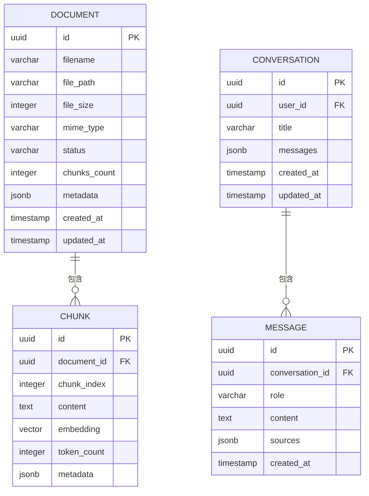

# RAG 文档问答系统 - 数据库设计说明书 (DBD)

## 1. 数据模型概述

### 设计理念

**范式级别**: 
- 核心业务表遵循**第三范式 (3NF)**，消除数据冗余
- 为优化查询性能，在对话历史表中适度**反规范化**（JSONB 存储消息列表）

**读写分离策略**:
- MVP 阶段：单数据库实例（读写混合）
- 未来扩展：Pinecone 专门处理向量检索，关系型数据库处理元数据查询

**分库分表策略**:
- Pinecone Serverless 自动处理向量数据分片
- 文档元数据表按 `created_at` 范围分区（年为单位）
- 对话记录表按 `user_id` 哈希分区（未来支持多租户）

### ER 图



### 命名规范

| 对象类型 | 命名规则 | 示例 |
|----------|----------|------|
| **表名** | 小写复数，下划线分隔 | `documents`, `conversations` |
| **字段名** | 小写单数，下划线分隔 | `file_path`, `created_at` |
| **主键** | 固定为 `id` (UUID 类型) | `id` |
| **外键** | `{关联表名}_id` | `document_id`, `conversation_id` |
| **索引** | `idx_{表名}_{字段名}` | `idx_documents_status` |
| **唯一索引** | `uq_{表名}_{字段名}` | `uq_conversations_user_title` |

---

## 2. 逻辑数据模型 (Logical Model)

### 实体列表

#### 2.1 documents (文档元数据表)

**业务描述**: 存储上传文档的基本信息和处理状态

**字段详情**:

| 字段名 | 类型 | 长度 | 必填 | 默认值 | 说明 | 查询场景 |
|--------|------|------|------|--------|------|----------|
| id | UUID | - | Y | gen_random_uuid() | 文档唯一标识 | 主键查询 |
| filename | VARCHAR | 255 | Y | - | 原始文件名 | 列表展示 |
| file_path | VARCHAR | 500 | Y | - | 本地存储路径 | 文件读取 |
| file_size | INTEGER | - | Y | - | 文件大小 (字节) | 大小展示 |
| mime_type | VARCHAR | 50 | Y | - | MIME 类型 | 格式验证 |
| status | VARCHAR | 20 | Y | 'processing' | 处理状态: processing/ready/failed | 状态筛选 |
| chunks_count | INTEGER | - | N | NULL | 分块数量 | 进度展示 |
| metadata | JSONB | - | N | NULL | 额外元数据 (页数、字数等) | 详细信息 |
| created_at | TIMESTAMP | - | Y | CURRENT_TIMESTAMP | 创建时间 | 排序 |
| updated_at | TIMESTAMP | - | Y | CURRENT_TIMESTAMP | 更新时间 | - |

**主键/外键**:
- 主键：`PRIMARY KEY (id)`
- 无外键（独立表）

**索引设计**:

| 索引名 | 类型 | 字段 | 用途 | 选择性 |
|--------|------|------|------|--------|
| `pk_documents` | 主键索引 | id | 快速定位文档 | 100% |
| `idx_documents_status` | 普通索引 | status | 按状态筛选文档 | 低 (3 个枚举值) |
| `idx_documents_created_at` | 普通索引 | created_at DESC | 按时间倒序排列 | 中 |
| `idx_documents_status_created` | 复合索引 | status, created_at DESC | 组合查询（某状态的文档列表） | 中 |

---

#### 2.2 chunks (文档块表)

**业务描述**: 存储文档分块的原文内容（向量存储在 Pinecone）

**字段详情**:

| 字段名 | 类型 | 长度 | 必填 | 默认值 | 说明 | 查询场景 |
|--------|------|------|------|--------|------|----------|
| id | UUID | - | Y | gen_random_uuid() | 块唯一标识 | 主键查询 |
| document_id | UUID | - | Y | - | 所属文档 ID | 关联查询 |
| chunk_index | INTEGER | - | Y | - | 块索引序号 | 顺序读取 |
| content | TEXT | - | Y | - | 原始文本内容 | 引用展示 |
| token_count | INTEGER | - | Y | - | Token 数量 | 统计计算 |
| metadata | JSONB | - | N | NULL | 位置信息（章节、页码） | 引用标注 |

**主键/外键**:
- 主键：`PRIMARY KEY (id)`
- 外键：`FOREIGN KEY (document_id) REFERENCES documents(id) ON DELETE CASCADE`

**索引设计**:

| 索引名 | 类型 | 字段 | 用途 | 选择性 |
|--------|------|------|------|--------|
| `pk_chunks` | 主键索引 | id | 快速定位块 | 100% |
| `idx_chunks_document_id` | 普通索引 | document_id | 查询某文档的所有块 | 高 |
| `idx_chunks_doc_idx` | 复合索引 | document_id, chunk_index | 按顺序读取文档块 | 高 |

**注意**: 
- **向量数据不存储在此表**，而是存储在 Pinecone 中
- Pinecone 中的元数据包含 `document_id` 和 `chunk_id`，用于关联查询

---

#### 2.3 conversations (对话表)

**业务描述**: 存储对话会话的元数据和完整消息历史

**字段详情**:

| 字段名 | 类型 | 长度 | 必填 | 默认值 | 说明 | 查询场景 |
|--------|------|------|------|--------|------|----------|
| id | UUID | - | Y | gen_random_uuid() | 对话唯一标识 | 主键查询 |
| user_id | UUID | - | N | NULL | 用户 ID(MVP 为空) | 用户维度统计 |
| title | VARCHAR | 200 | N | NULL | 对话标题 (自动生成) | 列表展示 |
| messages | JSONB | - | N | NULL | 完整消息列表 | 历史记录加载 |
| created_at | TIMESTAMP | - | Y | CURRENT_TIMESTAMP | 创建时间 | 排序 |
| updated_at | TIMESTAMP | - | Y | CURRENT_TIMESTAMP | 最后更新时间 | 最近对话 |

**主键/外键**:
- 主键：`PRIMARY KEY (id)`
- 外键：`FOREIGN KEY (user_id) REFERENCES users(id) ON DELETE SET NULL`（MVP 阶段可选）

**索引设计**:

| 索引名 | 类型 | 字段 | 用途 | 选择性 |
|--------|------|------|------|--------|
| `pk_conversations` | 主键索引 | id | 快速定位对话 | 100% |
| `idx_conversations_user_id` | 普通索引 | user_id | 查询某用户的所有对话 | 高（多租户时） |
| `idx_conversations_updated_at` | 普通索引 | updated_at DESC | 按最近活动时间排序 | 中 |
| `idx_conversations_user_updated` | 复合索引 | user_id, updated_at DESC | 某用户的对话列表（按时间） | 高 |

**反规范化说明**:
- `messages` 字段采用 JSONB 存储完整对话历史，避免单独 MESSAGE 表的 JOIN 开销
- 适用于读多写少场景，符合对话历史的访问模式

---

#### 2.4 messages (对话消息表) - 可选

**业务描述**: 如果 messages 不从 conversations 拆分，则此表不需要

**两种设计方案对比**:

| 方案 | 优点 | 缺点 | 适用场景 |
|------|------|------|----------|
| **方案 A: JSONB 存储** | 读取快（单次查询）、结构简单 | 难以单独更新某条消息 | MVP 阶段推荐 |
| **方案 B: 独立表存储** | 灵活（可单独操作消息）、易扩展 | 需要 JOIN，查询复杂 | 大规模多租户 |

**本设计选择方案 A**（messages 作为 conversations 的 JSONB 字段）

**理由**:
1. MVP 阶段对话量小（每对话≤10 轮）
2. 对话历史通常整体加载，无需单独查询某条消息
3. 简化查询逻辑，提升读取性能

---

### 数据关系总结

| 关系类型 | 表 A | 表 B | 关系 | 基数 |
|----------|------|------|------|------|
| 父子关系 | documents | chunks | 文档包含多个块 | 1:N |
| 聚合关系 | conversations | messages | 对话包含多条消息 | 1:N (JSONB 内嵌) |
| 归属关系 | conversations | users | 用户拥有对话 | 1:N (可选) |

---

## 3. 物理数据模型 (Physical Model)

### 存储引擎

**选择**: PostgreSQL 14+

**理由**:
1. **JSONB 支持**: 优秀的半结构化数据存储能力
2. **pgvector 扩展**: 原生支持向量数据类型（未来可本地存储向量）
3. **异步支持**: 与 FastAPI 的 async/await 完美集成
4. **成熟稳定**: 社区活跃，文档丰富

### 字符集与排序规则

```sql
-- 数据库创建时的配置
CREATE DATABASE rag_qa_system
    WITH ENCODING = 'UTF8'
         LC_COLLATE = 'zh_CN.UTF-8'
         LC_CTYPE = 'zh_CN.UTF-8'
         TEMPLATE = template0;
```

**配置说明**:
- 字符集：`UTF8`（支持中文、emoji 等）
- 排序规则：`zh_CN.UTF-8`（中文拼音排序）

### 分区策略

#### 3.1 documents 表分区（按时间范围）

```sql
-- 主表
CREATE TABLE documents (
    LIKE documents INCLUDING ALL
) PARTITION BY RANGE (created_at);

-- 2026 年分区
CREATE TABLE documents_2026 PARTITION OF documents
    FOR VALUES FROM ('2026-01-01') TO ('2027-01-01');

-- 2027 年分区
CREATE TABLE documents_2027 PARTITION OF documents
    FOR VALUES FROM ('2027-01-01') TO ('2028-01-01');
```

**分区键选择理由**:
- 文档上传时间天然有序
- 历史文档查询频率低，可归档

#### 3.2 Pinecone 向量分片（自动管理）

```python
# Pinecone Serverless 自动处理分片
# 无需手动配置，按 namespace 逻辑隔离
index.upsert(
    vectors=vectors,
    namespace="doc_{document_id}"  # 按文档隔离
)
```

### 容量预估

#### 初始数据量（MVP 阶段）

| 表名 | 初始记录数 | 单条大小 | 总大小 | 年增长率 |
|------|------------|----------|--------|----------|
| documents | 1,000 | 500 bytes | 0.5 MB | 200% |
| chunks | 50,000 | 2 KB | 100 MB | 200% |
| conversations | 500 | 10 KB | 5 MB | 300% |
| **合计** | - | - | **~106 MB** | - |

#### 存储规划

| 存储类型 | 用途 | 初始容量 | 1 年后预估 |
|----------|------|----------|------------|
| PostgreSQL | 元数据 | 1 GB | 5 GB |
| 本地文件系统 | 原始文档 | 10 GB | 50 GB |
| Pinecone | 向量数据 | 100 MB | 500 MB |

**建议**:
- 数据库磁盘：起步 50GB SSD
- 文件存储：起步 100GB（可动态扩容）

---

## 4. 数据流与安全

### 数据字典

#### 4.1 documents.status 枚举值

| 值 | 说明 | 触发条件 |
|----|------|----------|
| `processing` | 处理中 | 文档刚上传，正在解析/向量化 |
| `ready` | 就绪 | 向量化完成，可被检索 |
| `failed` | 失败 | 解析失败或 API 调用失败 |

#### 4.2 messages.role 枚举值

| 值 | 说明 | 示例 |
|----|------|------|
| `user` | 用户消息 | "如何申请年假？" |
| `assistant` | AI 回答 | "根据公司规定..." |

### 敏感数据保护

#### 4.3 传输层加密

```yaml
TLS 配置:
  强制 HTTPS: true
  TLS 版本：1.3+
  证书：Let's Encrypt 或云厂商 SSL
```

#### 4.4 静态数据加密

**Pinecone 向量数据**:
- Pinecone 托管服务自动加密（AES-256）
- 无需额外配置

**PostgreSQL 敏感字段**:
```sql
-- 使用 pgcrypto 扩展加密用户信息（未来扩展）
CREATE EXTENSION IF NOT EXISTS pgcrypto;

-- 加密存储示例
INSERT INTO users (email, encrypted_password)
VALUES ('user@example.com', pgp_sym_encrypt('password123', '${ENCRYPTION_KEY}'));
```

#### 4.5 数据脱敏规则

**日志输出**:
```python
import re

def mask_sensitive_data(text: str) -> str:
    # 隐藏 API Key
    text = re.sub(r'sk-[a-zA-Z0-9]{32}', 'sk-***', text)
    # 隐藏邮箱
    text = re.sub(r'[a-z0-9._%+-]+@[a-z0-9.-]+\.[a-z]{2,}', '***@***.***', text)
    return text
```

**审计日志**:
- 记录操作类型和时间
- 不记录完整的请求体（避免泄露文档内容）

### 备份与恢复

#### 4.6 备份策略

| 数据类型 | 备份方式 | 频率 | 保留周期 | RPO | RTO |
|----------|----------|------|----------|-----|-----|
| PostgreSQL | pg_dump + cron | 每日凌晨 2 点 | 30 天 | ≤24h | ≤1h |
| Pinecone | 托管服务自动备份 | 实时 | 永久 | ~0 | ~0 |
| 本地文件 | rsync + OSS | 每小时 | 90 天 | ≤1h | ≤2h |

#### 4.7 恢复流程

```bash
# PostgreSQL 恢复示例
psql -U postgres rag_qa_system < /backups/rag_qa_system_20260304.sql

# Pinecone 恢复（联系官方支持）
# 通常无需手动恢复，自动故障转移

# 文件恢复示例
rsync -avz /backups/documents/ /app/storage/documents/
```

---

## 5. SQL 规范示例

### CRUD 操作示例

#### 5.1 插入文档记录

```sql
INSERT INTO documents (
    id, filename, file_path, file_size, mime_type, status, metadata
) VALUES (
    gen_random_uuid(),
    '员工手册.pdf',
    '/storage/documents/abc123.pdf',
    2458624,
    'application/pdf',
    'processing',
    '{"pages": 50, "word_count": 15000}'::jsonb
);
```

#### 5.2 查询文档列表（带分页和排序）

```sql
SELECT 
    id, filename, file_size, mime_type, status, 
    chunks_count, created_at, updated_at
FROM documents
WHERE status = 'ready'
ORDER BY created_at DESC
LIMIT 20 OFFSET 0;
```

#### 5.3 更新文档状态

```sql
UPDATE documents
SET 
    status = 'ready',
    chunks_count = 85,
    updated_at = CURRENT_TIMESTAMP
WHERE id = 'abc123-uuid-456';
```

#### 5.4 删除文档（级联删除 chunks）

```sql
-- 开启事务
BEGIN;

-- 删除文档（chunks 会因 ON DELETE CASCADE 自动删除）
DELETE FROM documents WHERE id = 'abc123-uuid-456';

-- 提交事务
COMMIT;
```

#### 5.5 查询对话历史（含消息）

```sql
SELECT 
    c.id, c.title, c.messages, c.created_at, c.updated_at
FROM conversations c
WHERE c.user_id IS NULL  -- MVP 阶段无用户
ORDER BY c.updated_at DESC
LIMIT 10;
```

### 复杂查询优化

#### 5.6 统计某状态下的文档总数

```sql
-- 使用索引覆盖扫描
SELECT COUNT(*) as total
FROM documents
WHERE status = 'ready';
```

**执行计划分析**:
```sql
EXPLAIN ANALYZE
SELECT COUNT(*) FROM documents WHERE status = 'ready';

-- 预期输出:
-- Aggregate  (cost=100.43..100.44 rows=1 width=8)
--   ->  Index Only Scan using idx_documents_status on documents  (cost=0.43..100.43 rows=1 width=0)
--         Index Cond: (status = 'ready'::text)
```

#### 5.7 查询某文档的所有块（按顺序）

```sql
SELECT 
    chunk_index, content, metadata
FROM chunks
WHERE document_id = 'abc123-uuid-456'
ORDER BY chunk_index ASC;
```

**优化建议**:
- 使用复合索引 `idx_chunks_doc_idx(document_id, chunk_index)`
- 避免 SELECT *，只查询需要的字段

#### 5.8 从 JSONB 中提取对话标题

```sql
SELECT 
    id,
    COALESCE(
        title,
        messages->0->>'content'  -- 提取第一条用户消息作为标题
    ) as effective_title
FROM conversations
ORDER BY updated_at DESC;
```

### 性能调优建议

#### 5.9 慢查询监控

```sql
-- 启用 pg_stat_statements 扩展
CREATE EXTENSION IF NOT EXISTS pg_stat_statements;

-- 查询最慢的 10 个 SQL
SELECT 
    query, calls, total_time, mean_time, rows
FROM pg_stat_statements
ORDER BY mean_time DESC
LIMIT 10;
```

#### 5.10 索引使用率分析

```sql
SELECT 
    schemaname, tablename, indexname, idx_scan, idx_tup_read
FROM pg_stat_user_indexes
ORDER BY idx_scan ASC;
```

**优化动作**:
- 长期未使用的索引考虑删除（减少写入开销）
- 高频查询但未命中索引的考虑新增索引

---

## 6. Pinecone 向量数据设计

### Index 配置

```python
from pinecone import Pinecone, ServerlessSpec

pc = Pinecone(api_key=os.getenv("PINECONE_API_KEY"))

# 创建 Index
pc.create_index(
    name="rag-documents",
    dimension=1536,  # text-embedding-v4 维度
    metric="cosine",  # 余弦相似度
    spec=ServerlessSpec(
        cloud="aws",
        region="us-east-1"
    )
)
```

### 向量元数据结构

每个向量在 Pinecone 中的结构:

```python
{
    "id": "chunk_abc123",  # 与 chunks 表的 id 对应
    "values": [0.012, -0.045, ...],  # 1536 维向量
    "metadata": {
        "document_id": "doc_xyz789",
        "chunk_index": 5,
        "content": "原文片段（前 500 字符）",
        "filename": "员工手册.pdf",
        "page": 3
    }
}
```

### 查询优化

```python
# 语义检索示例
index = pc.Index("rag-documents")

response = index.query(
    vector=query_embedding,
    top_k=10,
    filter={"document_id": {"$in": ["doc_1", "doc_2"]}},  # 限定文档范围
    include_metadata=True,
    include_values=False  # 不返回向量值，节省流量
)
```

---

## 7. 附录：DDL 脚本

### 完整建表语句

```sql
-- 启用扩展
CREATE EXTENSION IF NOT EXISTS "uuid-ossp";
CREATE EXTENSION IF NOT EXISTS "pgcrypto";

-- documents 表
CREATE TABLE documents (
    id UUID PRIMARY KEY DEFAULT gen_random_uuid(),
    filename VARCHAR(255) NOT NULL,
    file_path VARCHAR(500) NOT NULL,
    file_size INTEGER NOT NULL,
    mime_type VARCHAR(50) NOT NULL,
    status VARCHAR(20) NOT NULL DEFAULT 'processing',
    chunks_count INTEGER,
    metadata JSONB,
    created_at TIMESTAMP NOT NULL DEFAULT CURRENT_TIMESTAMP,
    updated_at TIMESTAMP NOT NULL DEFAULT CURRENT_TIMESTAMP
);

-- 索引
CREATE INDEX idx_documents_status ON documents(status);
CREATE INDEX idx_documents_created_at ON documents(created_at DESC);
CREATE INDEX idx_documents_status_created ON documents(status, created_at DESC);

-- chunks 表
CREATE TABLE chunks (
    id UUID PRIMARY KEY DEFAULT gen_random_uuid(),
    document_id UUID NOT NULL REFERENCES documents(id) ON DELETE CASCADE,
    chunk_index INTEGER NOT NULL,
    content TEXT NOT NULL,
    token_count INTEGER NOT NULL,
    metadata JSONB
);

-- 索引
CREATE INDEX idx_chunks_document_id ON chunks(document_id);
CREATE INDEX idx_chunks_doc_idx ON chunks(document_id, chunk_index);

-- conversations 表
CREATE TABLE conversations (
    id UUID PRIMARY KEY DEFAULT gen_random_uuid(),
    user_id UUID REFERENCES users(id) ON DELETE SET NULL,
    title VARCHAR(200),
    messages JSONB,
    created_at TIMESTAMP NOT NULL DEFAULT CURRENT_TIMESTAMP,
    updated_at TIMESTAMP NOT NULL DEFAULT CURRENT_TIMESTAMP
);

-- 索引
CREATE INDEX idx_conversations_user_id ON conversations(user_id);
CREATE INDEX idx_conversations_updated_at ON conversations(updated_at DESC);
CREATE INDEX idx_conversations_user_updated ON conversations(user_id, updated_at DESC);

-- 触发器：自动更新 updated_at
CREATE OR REPLACE FUNCTION update_updated_at_column()
RETURNS TRIGGER AS $$
BEGIN
    NEW.updated_at = CURRENT_TIMESTAMP;
    RETURN NEW;
END;
$$ LANGUAGE plpgsql;

CREATE TRIGGER update_documents_updated_at
    BEFORE UPDATE ON documents
    FOR EACH ROW
    EXECUTE FUNCTION update_updated_at_column();

CREATE TRIGGER update_conversations_updated_at
    BEFORE UPDATE ON conversations
    FOR EACH ROW
    EXECUTE FUNCTION update_updated_at_column();
```

---

**文档审批签字**:

| 角色 | 姓名 | 签字 | 日期 |
|------|------|------|------|
| 数据库架构师 | | | |
| 技术负责人 | | | |
| DBA 负责人 | | | |

---

**变更历史**:
| 版本 | 日期 | 作者 | 变更说明 |
|------|------|------|----------|
| v1.0 | 2026-03-04 | AI 数据库架构师 | 初始版本 |
