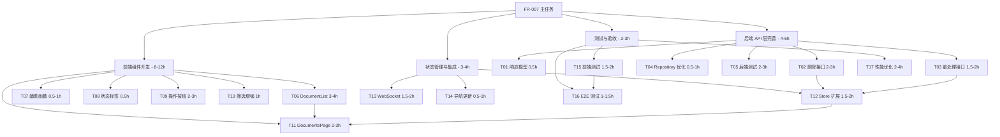

# FR-007 文档列表管理页 - 任务拆解文档

## 📋 需求概述

**需求编号**: FR-007  
**需求名称**: 文档列表与管理  
**优先级**: Must have  
**来源**: SRS.md 第 241-265 行  

### 需求描述
查看和管理所有已上传的文档，支持分页、筛选和操作。

### 验收标准
- Given 系统中有 10 个文档
- When 用户打开文档列表页
- Then 应显示所有文档，并支持按上传时间倒序排列

### 功能特性
1. ✅ 表格展示文档元信息（文件名、大小、类型、状态、块数、上传时间）
2. ✅ 分页支持（前端分页或后端分页）
3. ✅ 状态筛选（processing/ready/failed）
4. ✅ 操作按钮（删除、重新处理）
5. ✅ 空数据提示
6. ✅ 加载状态指示

---

## 🎯 任务总览

**总预估工时**: 16-24 小时  
**任务数量**: 17 个子任务  
**关键路径**: T01 → T02 → T06 → T07 → T09 → T11 → T12 → T15  

### 任务依赖关系图



---

## 📦 详细任务清单

### **阶段 1: 后端 API 层完善** (4-6 小时)

#### **T01 - 修复响应模型定义** ✅ 已完成
**任务 ID**: `fr007_t01_fix_response_model`  
**预估工时**: 0.5 小时  
**优先级**: P0 (阻塞性)  
**完成时间**: 2026-03-21 20:23  
**状态**: ✅ 已完成并通过验收  

**工作内容**:
1. 验证 `GET /api/v1/documents` 返回的数据结构
2. 确保响应符合 `SuccessResponse[PageDTO[DocumentListDTO]]` 定义
3. 检查字段完整性：
   - `code`: 错误码（成功为 0）
   - `message`: 错误消息
   - `data.total`: 总数
   - `data.items`: 文档列表数组
   - `data.page`: 当前页码
   - `data.limit`: 每页数量
   - `data.total_pages`: 总页数

**关联文件**:
- `backend/app/api/v1/documents.py#L118-167`
- `backend/app/schemas/common.py` (PageDTO 定义)
- `backend/app/schemas/document.py` (DocumentListDTO 定义)

**验收标准**:
```bash
# 使用 curl 或 Postman 测试
curl http://localhost:8000/api/v1/documents?page=1&limit=10

# 期望响应
{
  "code": 0,
  "message": "success",
  "data": {
    "total": 5,
    "items": [
      {
        "id": "uuid...",
        "filename": "test.pdf",
        "file_size": 1024,
        "mime_type": "application/pdf",
        "status": "ready",
        "chunks_count": 15,
        "created_at": "2024-01-15T10:30:00Z",
        "updated_at": "2024-01-15T10:35:00Z"
      }
    ],
    "page": 1,
    "limit": 10,
    "total_pages": 1
  }
}
```

**实施步骤**:
1. 启动后端服务：`cd backend; uvicorn app.main:app --reload`
2. 访问 Swagger UI: http://localhost:8000/docs
3. 测试 GET `/api/v1/documents` 端点
4. 对比实际响应与预期结构
5. 如有差异，修复 `documents.py#L118-167`

**潜在问题**:
- ⚠️ `created_at` 和 `updated_at` 可能为 None（需在 Service 层处理）
- ⚠️ `chunks_count` 字段名不一致（后端用 `chunk_count`，前端用 `chunks_count`）

---

#### **T02 - 实现删除接口** 🔴 核心功能
**任务 ID**: `fr007_t02_implement_delete`  
**预估工时**: 2-3 小时  
**优先级**: P0 (核心功能)  

**工作内容**:
1. 实现物理文件删除（如存储了文件内容）
2. 删除 Pinecone 中的向量数据
3. 删除数据库记录（级联删除 document_chunks）
4. 返回 204 No Content 或成功响应

**关联文件**:
- `backend/app/api/v1/documents.py#L170-193` (已有框架)
- `backend/app/services/document_service.py` (需实现 delete_document 方法)
- `backend/app/repositories/document_repository.py` (需实现 delete 方法)
- `backend/app/services/vector_service_adapter.py` (调用 Pinecone 删除)

**API 定义**:
```python
@router.delete("/{doc_id}", status_code=204)
async def delete_document(
    doc_id: UUID,
    service: DocumentService = Depends(get_document_service)
):
    """删除文档及其所有相关数据"""
    success = await service.delete_document(doc_id)
    if not success:
        raise HTTPException(status_code=404, detail="文档不存在")
```

**实施步骤**:

**Step 1: Repository 层**
```python
# backend/app/repositories/document_repository.py
async def delete(self, doc_id: UUID) -> bool:
    """
    删除文档
    
    Args:
        doc_id: 文档 ID
        
    Returns:
        bool: 是否删除成功
    """
    doc = await self.find_by_id(doc_id)
    if not doc:
        return False
    
    # 级联删除关联的 chunks（通过 relationship 自动处理）
    await self.session.delete(doc)
    await self.session.commit()
    return True
```

**Step 2: Service 层**
```python
# backend/app/services/document_service.py
async def delete_document(self, doc_id: UUID) -> bool:
    """
    删除文档
    
    处理流程:
    1. 查询文档
    2. 从 Pinecone 删除向量
    3. 删除数据库记录
    """
    doc = await self.repo.find_by_id(doc_id)
    if not doc:
        return False
    
    try:
        # 1. 删除 Pinecone 向量
        await self.embedding_svc.delete_vectors(str(doc_id))
        
        # 2. 删除数据库记录（级联删除 document_chunks）
        return await self.repo.delete(doc_id)
        
    except Exception as e:
        logger.error(f"Delete failed: {e}", exc_info=True)
        return False
```

**Step 3: VectorService 适配**
```python
# backend/app/services/vector_service_adapter.py
async def delete_vectors(self, doc_id: str) -> bool:
    """
    删除指定文档的所有向量
    
    Args:
        doc_id: 文档 ID（作为 filter 条件）
    """
    try:
        # Pinecone 删除语法
        await self.pinecone_client.delete(
            filter={"doc_id": {"$eq": doc_id}},
            namespace=self.namespace
        )
        return True
    except Exception as e:
        logger.error(f"Pinecone delete failed: {e}")
        return False
```

**验收标准**:
1. ✅ 删除存在的文档返回 204
2. ✅ 删除不存在的文档返回 404
3. ✅ 数据库中查询不到该文档
4. ✅ Pinecone 中该文档的向量被清除
5. ✅ document_chunks 表记录被级联删除

**测试用例**:
```python
# backend/tests/integration/test_documents_api.py
@pytest.mark.asyncio
async def test_delete_document_success(client, db_session):
    """测试删除文档成功场景"""
    # Arrange: 创建测试文档
    doc = Document(filename="test.pdf", file_size=1024, mime_type="application/pdf")
    await db_session.add(doc)
    await db_session.commit()
    
    # Act
    response = await client.delete(f"/api/v1/documents/{doc.id}")
    
    # Assert
    assert response.status_code == 204
    # 验证数据库已删除
    result = await db_session.execute(select(Document).where(Document.id == doc.id))
    assert result.scalar_one_or_none() is None

@pytest.mark.asyncio
async def test_delete_document_not_found(client):
    """测试删除不存在的文档"""
    # Act
    response = await client.delete("/api/v1/documents/00000000-0000-0000-0000-000000000000")
    
    # Assert
    assert response.status_code == 404
```

**注意事项**:
- ⚠️ Pinecone 删除可能需要几秒生效（最终一致性）
- ⚠️ 需处理事务回滚（Pinecone 成功但 DB 失败的情况）
- ✅ 建议：先删 DB，再删 Pinecone，避免孤儿数据

---

#### **T03 - 添加重新处理接口** 🟡 重要功能
**任务 ID**: `fr007_t03_add_reprocess_endpoint`  
**预估工时**: 1.5-2 小时  
**优先级**: P1 (重要但不紧急)  

**工作内容**:
1. 新增 POST `/api/v1/documents/{id}/reprocess` 端点
2. 重置文档状态为 `processing`
3. 清空旧的 chunk 记录和向量
4. 触发异步处理流程

**API 定义**:
```python
@router.post("/{doc_id}/reprocess")
async def reprocess_document(
    doc_id: UUID,
    service: DocumentService = Depends(get_document_service)
):
    """重新处理文档"""
    doc = await service.repo.find_by_id(doc_id)
    if not doc:
        raise HTTPException(status_code=404, detail="文档不存在")
    
    # 仅允许 failed/ready 状态的文档重新处理
    if doc.status not in ["failed", "ready"]:
        raise HTTPException(
            status_code=400,
            detail=f"当前状态 ({doc.status}) 不允许重新处理"
        )
    
    # 重置状态并触发异步处理
    await service.reprocess_document(doc_id)
    
    return SuccessResponse(message="已开始重新处理")
```

**Service 层实现**:
```python
# backend/app/services/document_service.py
async def reprocess_document(self, doc_id: UUID) -> None:
    """
    重新处理文档
    
    流程:
    1. 重置状态为 processing
    2. 清空旧的 chunks 和向量
    3. 重新启动异步处理任务
    """
    doc = await self.repo.find_by_id(doc_id)
    if not doc:
        raise ValueError(f"Document not found: {doc_id}")
    
    # 1. 清空旧数据
    await self._clear_old_chunks(doc_id)
    await self.embedding_svc.delete_vectors(str(doc_id))
    
    # 2. 重置状态
    await self.repo.update_status(doc_id, "processing", chunks_count=None)
    
    # 3. 重启异步任务（同 upload_document 逻辑）
    from app.core.database import get_db_session
    async for session in get_db_session():
        await session.commit()  # 提交状态更新
        asyncio.create_task(self._process_document_async(doc_id))
        await session.close()

async def _clear_old_chunks(self, doc_id: UUID) -> None:
    """清空旧的 chunk 记录"""
    repo = DocumentChunkRepository(self.session)
    await repo.delete_by_document(doc_id)
```

**验收标准**:
1. ✅ failed/ready 状态的文档可以重新处理
2. ✅ processing 状态的文档拒绝重新处理（返回 400）
3. ✅ 重新处理后状态变为 processing
4. ✅ 旧的 chunk 数据被清空
5. ✅ 异步处理任务重新启动

---

#### **T04 - 优化 Repository 查询** 🟢 已有基础
**任务 ID**: `fr007_t04_optimize_repository`  
**预估工时**: 0.5-1 小时  
**优先级**: P2 (优化项)  

**工作内容**:
1. 验证现有 `find_all` 方法的状态筛选功能
2. 添加数据库索引优化查询性能
3. 编写边界情况测试

**现有代码分析**:
```python
# backend/app/repositories/document_repository.py#L66-104
async def find_all(
    self, 
    page: int = 1, 
    limit: int = 20,
    status: Optional[str] = None
) -> tuple[List[Document], int]:
    # ✅ 已实现状态筛选
    if status:
        query = query.where(Document.status == status)
        count_query = count_query.where(Document.status == status)
    
    # ✅ 已实现按创建时间倒序
    query = query.order_by(desc(Document.created_at))
    
    # ✅ 已实现分页
    query = query.offset((page - 1) * limit).limit(limit)
```

**优化建议**:
```python
# backend/app/models/document.py
class Document(Base):
    __tablename__ = "documents"
    
    # 添加索引优化查询性能
    __table_args__ = (
        Index('ix_status_created_at', 'status', 'created_at'),
        Index('ix_mime_type', 'mime_type'),
    )
```

**测试验证**:
```python
# backend/tests/unit/test_document_repository.py
@pytest.mark.asyncio
async def test_find_all_with_status_filter(db_session):
    """测试按状态筛选查询"""
    # Arrange: 创建不同状态的文档
    docs = [
        Document(filename="f1.pdf", status="ready"),
        Document(filename="f2.pdf", status="failed"),
        Document(filename="f3.pdf", status="processing"),
    ]
    db_session.add_all(docs)
    await db_session.commit()
    
    # Act: 查询 ready 状态的文档
    repo = DocumentRepository(db_session)
    result_docs, total = await repo.find_all(page=1, limit=10, status="ready")
    
    # Assert
    assert total == 1
    assert len(result_docs) == 1
    assert result_docs[0].filename == "f1.pdf"
```

---

#### **T05 - 后端单元测试** 🟡 质量保证
**任务 ID**: `fr007_t05_backend_unit_tests`  
**预估工时**: 2-3 小时  
**优先级**: P1 (质量保证)  

**测试覆盖要求**:
- 文档列表 API: >85%
- 删除接口：100%
- 重新处理接口：100%

**测试文件结构**:
```python
# backend/tests/integration/test_documents_api.py
import pytest
from httpx import AsyncClient
from sqlalchemy import select
from app.models.document import Document

class TestDocumentsAPI:
    """文档管理 API 集成测试"""
    
    @pytest.mark.asyncio
    async def test_get_documents_list_empty(self, client):
        """测试获取空文档列表"""
        response = await client.get("/api/v1/documents?page=1&limit=10")
        assert response.status_code == 200
        data = response.json()
        assert data["code"] == 0
        assert data["data"]["total"] == 0
        assert data["data"]["items"] == []
    
    @pytest.mark.asyncio
    async def test_get_documents_list_with_data(self, client, db_session):
        """测试获取文档列表（有数据）"""
        # 准备测试数据
        doc = Document(
            filename="test.pdf",
            file_size=1024,
            mime_type="application/pdf",
            status="ready",
            chunks_count=15
        )
        await db_session.add(doc)
        await db_session.commit()
        
        response = await client.get("/api/v1/documents?page=1&limit=10")
        data = response.json()
        
        assert data["data"]["total"] == 1
        assert len(data["data"]["items"]) == 1
        assert data["data"]["items"][0]["filename"] == "test.pdf"
    
    @pytest.mark.asyncio
    async def test_get_documents_filter_by_status(self, client, db_session):
        """测试按状态筛选文档"""
        # 准备不同状态的文档
        docs = [
            Document(filename="ready.pdf", status="ready"),
            Document(filename="failed.pdf", status="failed"),
        ]
        await db_session.add_all(docs)
        await db_session.commit()
        
        # 只查询 failed 状态
        response = await client.get("/api/v1/documents?status=failed")
        data = response.json()
        
        assert data["data"]["total"] == 1
        assert data["data"]["items"][0]["filename"] == "failed.pdf"
    
    @pytest.mark.asyncio
    async def test_delete_document_success(self, client, db_session):
        """测试删除文档成功"""
        doc = Document(filename="to_delete.pdf", status="ready")
        await db_session.add(doc)
        await db_session.commit()
        
        response = await client.delete(f"/api/v1/documents/{doc.id}")
        assert response.status_code == 204
        
        # 验证已删除
        result = await db_session.execute(select(Document).where(Document.id == doc.id))
        assert result.scalar_one_or_none() is None
    
    @pytest.mark.asyncio
    async def test_delete_document_not_found(self, client):
        """测试删除不存在的文档"""
        fake_id = "00000000-0000-0000-0000-000000000000"
        response = await client.delete(f"/api/v1/documents/{fake_id}")
        assert response.status_code == 404
    
    @pytest.mark.asyncio
    async def test_reprocess_document_success(self, client, db_session):
        """测试重新处理文档成功"""
        doc = Document(filename="reprocess.pdf", status="failed")
        await db_session.add(doc)
        await db_session.commit()
        
        response = await client.post(f"/api/v1/documents/{doc.id}/reprocess")
        assert response.status_code == 200
        data = response.json()
        assert "已开始重新处理" in data["message"]
        
        # 验证状态已变更
        await db_session.refresh(doc)
        assert doc.status == "processing"
    
    @pytest.mark.asyncio
    async def test_reprocess_document_invalid_status(self, client, db_session):
        """测试不允许的状态重新处理"""
        doc = Document(filename="processing.pdf", status="processing")
        await db_session.add(doc)
        await db_session.commit()
        
        response = await client.post(f"/api/v1/documents/{doc.id}/reprocess")
        assert response.status_code == 400
        assert "不允许重新处理" in response.json()["detail"]
```

---

### **阶段 2: 前端组件开发** (8-12 小时)

#### **T06 - 实现 DocumentList 组件** 🔴 核心 UI
**任务 ID**: `fr007_t06_implement_document_list`  
**预估工时**: 3-4 小时  
**优先级**: P0 (核心功能)  

**组件接口定义**:
```typescript
// frontend/src/components/documents/DocumentList.tsx
import React from 'react';
import type { Document } from '../../types';

interface DocumentListProps {
  documents: Document[];
  isLoading: boolean;
  onDelete: (id: string) => Promise<void>;
  onReprocess: (id: string) => Promise<void>;
}

export const DocumentList: React.FC<DocumentListProps> = ({
  documents,
  isLoading,
  onDelete,
  onReprocess,
}) => {
  // 组件实现
};
```

**完整实现代码**:
```tsx
import React from 'react';
import type { Document } from '../../types';

interface DocumentListProps {
  documents: Document[];
  isLoading: boolean;
  onDelete: (id: string) => Promise<void>;
  onReprocess: (id: string) => Promise<void>;
}

export const DocumentList: React.FC<DocumentListProps> = ({
  documents,
  isLoading,
  onDelete,
  onReprocess,
}) => {
  // 辅助函数
  const formatFileSize = (bytes: number): string => {
    if (bytes === 0) return '0 B';
    const k = 1024;
    const sizes = ['B', 'KB', 'MB', 'GB'];
    const i = Math.floor(Math.log(bytes) / Math.log(k));
    return Math.round(bytes / Math.pow(k, i) * 100) / 100 + ' ' + sizes[i];
  };

  const getMimeTypeLabel = (mimeType: string): string => {
    const mimeMap: Record<string, string> = {
      'application/pdf': 'PDF',
      'application/vnd.openxmlformats-officedocument.wordprocessingml.document': 'Word',
      'text/plain': 'TXT',
      'text/markdown': 'Markdown',
    };
    return mimeMap[mimeType] || mimeType.split('/')[1]?.toUpperCase() || 'FILE';
  };

  const formatDate = (dateString: string): string => {
    return new Date(dateString).toLocaleString('zh-CN', {
      year: 'numeric',
      month: '2-digit',
      day: '2-digit',
      hour: '2-digit',
      minute: '2-digit',
    });
  };

  const getStatusBadge = (status: Document['status']) => {
    const statusConfig = {
      processing: { color: 'bg-yellow-100 text-yellow-800', label: '⏳ 处理中' },
      ready: { color: 'bg-green-100 text-green-800', label: '✅ 就绪' },
      failed: { color: 'bg-red-100 text-red-800', label: '❌ 失败' },
    };
    const config = statusConfig[status];
    return (
      <span className={`px-2 py-1 rounded-full text-xs font-medium ${config.color}`} data-testid="status-badge">
        {config.label}
      </span>
    );
  };

  const handleDelete = async (id: string) => {
    if (window.confirm('确定要删除此文档吗？此操作不可恢复。')) {
      await onDelete(id);
    }
  };

  // 加载状态
  if (isLoading) {
    return (
      <div className="flex justify-center items-center py-12" data-testid="loading-spinner">
        <div className="animate-spin rounded-full h-8 w-8 border-b-2 border-blue-500"></div>
      </div>
    );
  }

  // 空数据状态
  if (documents.length === 0) {
    return (
      <div className="text-center py-12" data-testid="empty-state">
        <svg className="mx-auto h-12 w-12 text-gray-400" fill="none" stroke="currentColor" viewBox="0 0 24 24">
          <path strokeLinecap="round" strokeLinejoin="round" strokeWidth={2} d="M9 12h6m-6 4h6m2 5H7a2 2 0 01-2-2V5a2 2 0 012-2h5.586a1 1 0 01.707.293l5.414 5.414a1 1 0 01.293.707V19a2 2 0 01-2 2z" />
        </svg>
        <p className="mt-2 text-sm text-gray-600">暂无文档</p>
      </div>
    );
  }

  // 表格渲染
  return (
    <div className="overflow-x-auto" data-testid="document-list-table">
      <table className="min-w-full divide-y divide-gray-200">
        <thead className="bg-gray-50">
          <tr>
            <th className="px-6 py-3 text-left text-xs font-medium text-gray-500 uppercase tracking-wider">文件名</th>
            <th className="px-6 py-3 text-left text-xs font-medium text-gray-500 uppercase tracking-wider">大小</th>
            <th className="px-6 py-3 text-left text-xs font-medium text-gray-500 uppercase tracking-wider">类型</th>
            <th className="px-6 py-3 text-left text-xs font-medium text-gray-500 uppercase tracking-wider">状态</th>
            <th className="px-6 py-3 text-left text-xs font-medium text-gray-500 uppercase tracking-wider">块数</th>
            <th className="px-6 py-3 text-left text-xs font-medium text-gray-500 uppercase tracking-wider">上传时间</th>
            <th className="px-6 py-3 text-right text-xs font-medium text-gray-500 uppercase tracking-wider">操作</th>
          </tr>
        </thead>
        <tbody className="bg-white divide-y divide-gray-200">
          {documents.map((doc) => (
            <tr key={doc.id} data-testid={`document-row-${doc.id}`} className="hover:bg-gray-50">
              <td className="px-6 py-4 whitespace-nowrap">
                <div className="text-sm font-medium text-gray-900">{doc.filename}</div>
              </td>
              <td className="px-6 py-4 whitespace-nowrap">
                <div className="text-sm text-gray-500">{formatFileSize(doc.file_size)}</div>
              </td>
              <td className="px-6 py-4 whitespace-nowrap">
                <span className="px-2 inline-flex text-xs leading-5 font-semibold rounded bg-blue-100 text-blue-800">
                  {getMimeTypeLabel(doc.mime_type)}
                </span>
              </td>
              <td className="px-6 py-4 whitespace-nowrap">
                {getStatusBadge(doc.status)}
              </td>
              <td className="px-6 py-4 whitespace-nowrap text-sm text-gray-500">
                {doc.chunks_count !== null && doc.chunks_count !== undefined ? doc.chunks_count : '-'}
              </td>
              <td className="px-6 py-4 whitespace-nowrap text-sm text-gray-500">
                {formatDate(doc.created_at)}
              </td>
              <td className="px-6 py-4 whitespace-nowrap text-right text-sm font-medium">
                <button
                  onClick={() => onReprocess(doc.id)}
                  disabled={doc.status === 'processing'}
                  className={`text-blue-600 hover:text-blue-900 mr-3 ${
                    doc.status === 'processing' ? 'opacity-50 cursor-not-allowed' : ''
                  }`}
                  data-testid="reprocess-button"
                  title={doc.status === 'processing' ? '处理中无法重新处理' : '重新处理'}
                >
                  {doc.status === 'processing' ? '处理中...' : '重新处理'}
                </button>
                <button
                  onClick={() => handleDelete(doc.id)}
                  className="text-red-600 hover:text-red-900"
                  data-testid="delete-button"
                  title="删除"
                >
                  删除
                </button>
              </td>
            </tr>
          ))}
        </tbody>
      </table>
    </div>
  );
};
```

**验收标准**:
1. ✅ 表格包含所有必需列（文件名、大小、类型、状态、块数、上传时间、操作）
2. ✅ 空数据时显示友好提示
3. ✅ 加载时显示旋转动画
4. ✅ 状态标签颜色正确（processing 黄色、ready 绿色、failed 红色）
5. ✅ 处理中的文档"重新处理"按钮禁用
6. ✅ 删除按钮有二次确认
7. ✅ 所有交互元素有正确的 `data-testid`

---

#### **T07 - 辅助函数实现** 🟢 工具函数
**任务 ID**: `fr007_t07_add_helper_functions`  
**预估工时**: 0.5-1 小时  
**优先级**: P1 (已在 T06 中实现)  

**说明**: 辅助函数已在 T06 的 DocumentList 组件中实现，无需单独创建文件。

**测试用例**（在 DocumentList.test.tsx 中）:
```typescript
describe('Helper Functions', () => {
  describe('formatFileSize', () => {
    test('应该格式化字节大小为可读格式', () => {
      expect(formatFileSize(0)).toBe('0 B');
      expect(formatFileSize(1024)).toBe('1 KB');
      expect(formatFileSize(1048576)).toBe('1 MB');
    });
  });

  describe('getMimeTypeLabel', () => {
    test('应该正确映射 MIME 类型', () => {
      expect(getMimeTypeLabel('application/pdf')).toBe('PDF');
      expect(getMimeTypeLabel('text/plain')).toBe('TXT');
      expect(getMimeTypeLabel('image/png')).toBe('PNG');
    });
  });

  describe('formatDate', () => {
    test('应该格式化日期字符串', () => {
      const date = formatDate('2024-01-15T10:30:00Z');
      expect(date).toMatch(/\d{4}-\d{2}-\d{2} \d{2}:\d{2}/);
    });
  });
});
```

---

#### **T08 - 状态标签组件** 🟡 UX 优化
**任务 ID**: `fr007_t08_status_badge_component`  
**预估工时**: 0.5 小时  
**优先级**: P2 (已在 T06 中实现)  

**说明**: 状态标签已在 T06 中通过 `getStatusBadge` 函数实现。

**配置化设计**:
```typescript
const statusConfig = {
  processing: { 
    color: 'bg-yellow-100 text-yellow-800', 
    label: '⏳ 处理中',
    icon: '⏳'
  },
  ready: { 
    color: 'bg-green-100 text-green-800', 
    label: '✅ 就绪',
    icon: '✅'
  },
  failed: { 
    color: 'bg-red-100 text-red-800', 
    label: '❌ 失败',
    icon: '❌'
  },
};
```

**可复用组件**（可选）:
```tsx
// frontend/src/components/ui/StatusBadge.tsx
import React from 'react';

type StatusType = 'processing' | 'ready' | 'failed';

interface StatusBadgeProps {
  status: StatusType;
}

export const StatusBadge: React.FC<StatusBadgeProps> = ({ status }) => {
  const config = {
    processing: 'bg-yellow-100 text-yellow-800',
    ready: 'bg-green-100 text-green-800',
    failed: 'bg-red-100 text-red-800',
  }[status];

  const labels = {
    processing: '⏳ 处理中',
    ready: '✅ 就绪',
    failed: '❌ 失败',
  }[status];

  return (
    <span className={`px-2 py-1 rounded-full text-xs font-medium ${config}`}>
      {labels}
    </span>
  );
};
```

---

#### **T09 - 操作按钮实现** 🔴 交互功能
**任务 ID**: `fr007_t09_action_buttons`  
**预估工时**: 2-3 小时  
**优先级**: P0 (核心功能)  

**已在 T06 中实现的内容**:
- ✅ 删除按钮（带二次确认）
- ✅ 重新处理按钮（状态判断）
- ✅ 按钮禁用逻辑
- ✅ 测试 ID 标注

**增强功能**（可选）:
```tsx
// 使用 Modal 确认框替代 window.confirm
import { useState } from 'react';

const DeleteConfirmModal = ({ isOpen, onClose, onConfirm, filename }) => {
  if (!isOpen) return null;
  
  return (
    <div className="fixed inset-0 bg-black bg-opacity-50 flex items-center justify-center z-50">
      <div className="bg-white rounded-lg p-6 max-w-md">
        <h3 className="text-lg font-bold mb-4">确认删除</h3>
        <p className="text-gray-600 mb-6">
          确定要删除文档 "{filename}" 吗？此操作不可恢复。
        </p>
        <div className="flex justify-end space-x-3">
          <button
            onClick={onClose}
            className="px-4 py-2 text-gray-600 hover:bg-gray-100 rounded"
          >
            取消
          </button>
          <button
            onClick={onConfirm}
            className="px-4 py-2 bg-red-600 text-white rounded hover:bg-red-700"
          >
            删除
          </button>
        </div>
      </div>
    </div>
  );
};
```

**测试用例**:
```typescript
// frontend/src/__tests__/DocumentList.test.tsx
test('删除按钮应该调用 onDelete 并传递文档 ID', async () => {
  const handleDelete = jest.fn().mockResolvedValue(undefined);
  
  render(
    <DocumentList
      documents={[mockDoc]}
      isLoading={false}
      onDelete={handleDelete}
      onReprocess={jest.fn()}
    />
  );

  const deleteButton = screen.getByTestId('delete-button');
  await userEvent.click(deleteButton);
  
  // 确认对话框会触发 window.confirm
  // 需要 mock confirm
  global.confirm = jest.fn(() => true);
  await userEvent.click(deleteButton);
  
  expect(handleDelete).toHaveBeenCalledWith('doc-1');
});

test('处理中的文档重新处理按钮应该禁用', () => {
  const processingDoc = {
    id: 'doc-1',
    filename: 'test.pdf',
    status: 'processing',
  };
  
  render(
    <DocumentList
      documents={[processingDoc]}
      isLoading={false}
      onDelete={jest.fn()}
      onReprocess={jest.fn()}
    />
  );

  const reprocessButton = screen.getByTestId('reprocess-button');
  expect(reprocessButton).toBeDisabled();
});
```

---

#### **T10 - 增强 DocumentFilters** 🟡 筛选功能
**任务 ID**: `fr007_t10_enhance_filters`  
**预估工时**: 1 小时  
**优先级**: P2 (渐进增强)  

**现有组件** (`DocumentFilters.tsx`):
```tsx
import React from 'react';

interface DocumentFiltersProps {
  statusFilter: string;
  onStatusChange: (status: string) => void;
  onRefresh: () => void;
}

export const DocumentFilters: React.FC<DocumentFiltersProps> = ({
  statusFilter,
  onStatusChange,
  onRefresh,
}) => {
  return (
    <div className="flex justify-between items-center mb-4" data-testid="document-filters">
      <div className="flex items-center space-x-2">
        <label htmlFor="status-filter" className="text-sm text-gray-600">
          状态筛选：
        </label>
        <select
          id="status-filter"
          data-testid="status-filter"
          value={statusFilter}
          onChange={(e) => onStatusChange(e.target.value)}
          className="border border-gray-300 rounded px-2 py-1 text-sm focus:outline-none focus:border-blue-500"
        >
          <option value="">全部</option>
          <option value="processing">处理中</option>
          <option value="ready">就绪</option>
          <option value="failed">失败</option>
        </select>
      </div>
      
      <button
        data-testid="refresh-button"
        onClick={onRefresh}
        className="flex items-center px-3 py-1 text-sm text-gray-600 hover:text-blue-600 transition-colors"
        title="刷新列表"
      >
        <svg className="w-4 h-4 mr-1" fill="none" stroke="currentColor" viewBox="0 0 24 24">
          <path strokeLinecap="round" strokeLinejoin="round" strokeWidth={2} d="M4 4v5h.582m15.356 2A8.001 8.001 0 004.582 9m0 0H9m11 11v-5h-.581m0 0a8.003 8.003 0 01-15.357-2m15.357 2H15" />
        </svg>
        刷新
      </button>
    </div>
  );
};
```

**增强功能**（可选）:
```tsx
// 添加排序选项
interface DocumentFiltersProps {
  statusFilter: string;
  sortOption: 'created_at_desc' | 'created_at_asc' | 'filename_asc';
  onStatusChange: (status: string) => void;
  onSortChange: (sort: string) => void;
  onRefresh: () => void;
}

<select
  value={sortOption}
  onChange={(e) => onSortChange(e.target.value)}
  className="border border-gray-300 rounded px-2 py-1 text-sm ml-4"
>
  <option value="created_at_desc">按时间倒序</option>
  <option value="created_at_asc">按时间正序</option>
  <option value="filename_asc">按文件名</option>
</select>
```

---

#### **T11 - 创建 DocumentsPage 页面** 🔴 页面整合
**任务 ID**: `fr007_t11_create_documents_page`  
**预估工时**: 2-3 小时  
**优先级**: P0 (核心功能)  

**完整实现代码**:
```tsx
// frontend/src/pages/DocumentsPage.tsx
import React, { useState, useEffect } from 'react';
import { useDocumentStore } from '../stores/documentStore';
import { DocumentUpload } from '../components/documents/DocumentUpload';
import { DocumentFilters } from '../components/documents/DocumentFilters';
import { DocumentList } from '../components/documents/DocumentList';
import { documentAPI } from '../services/api';

export const DocumentsPage: React.FC = () => {
  const {
    documents,
    total,
    page,
    limit,
    isLoading,
    error,
    statusFilter,
    fetchDocuments,
    deleteDocument,
    reprocessDocument,
    setStatusFilter,
    setError,
  } = useDocumentStore();

  const [localStatusFilter, setLocalStatusFilter] = useState('');

  // 初始加载
  useEffect(() => {
    loadDocuments();
  }, [page, limit, localStatusFilter]);

  const loadDocuments = async () => {
    try {
      await fetchDocuments(page, limit, localStatusFilter);
    } catch (err) {
      setError(err instanceof Error ? err.message : '加载文档失败');
    }
  };

  const handleStatusChange = (status: string) => {
    setLocalStatusFilter(status);
    setStatusFilter(status);
  };

  const handleDelete = async (id: string) => {
    try {
      await deleteDocument(id);
      // 删除成功后重新加载列表
      await loadDocuments();
    } catch (err) {
      alert(err instanceof Error ? err.message : '删除失败');
    }
  };

  const handleReprocess = async (id: string) => {
    try {
      await reprocessDocument(id);
      // 重新处理后重新加载列表
      await loadDocuments();
    } catch (err) {
      alert(err instanceof Error ? err.message : '重新处理失败');
    }
  };

  const handleRefresh = async () => {
    await loadDocuments();
  };

  return (
    <div className="p-6 max-w-7xl mx-auto">
      <div className="mb-6">
        <h2 className="text-2xl font-bold text-gray-900">文档管理</h2>
        <p className="text-sm text-gray-600 mt-1">
          共 {total} 个文档
        </p>
      </div>

      {/* 上传区域 */}
      <div className="mb-6">
        <DocumentUpload />
      </div>

      {/* 筛选器 */}
      <div className="mb-4">
        <DocumentFilters
          statusFilter={localStatusFilter}
          onStatusChange={handleStatusChange}
          onRefresh={handleRefresh}
        />
      </div>

      {/* 错误提示 */}
      {error && (
        <div className="mb-4 p-4 bg-red-50 border border-red-200 rounded-lg">
          <p className="text-red-800">{error}</p>
        </div>
      )}

      {/* 文档列表 */}
      <div className="bg-white rounded-lg shadow">
        <DocumentList
          documents={documents}
          isLoading={isLoading}
          onDelete={handleDelete}
          onReprocess={handleReprocess}
        />
      </div>

      {/* 分页控件 */}
      {total > limit && (
        <div className="mt-4 flex justify-between items-center">
          <button
            onClick={() => /* 上一页逻辑 */ {}}
            disabled={page === 1}
            className="px-4 py-2 border border-gray-300 rounded disabled:opacity-50"
          >
            上一页
          </button>
          <span className="text-sm text-gray-600">
            第 {page} 页，共 {Math.ceil(total / limit)} 页
          </span>
          <button
            onClick={() => /* 下一页逻辑 */ {}}
            disabled={page >= Math.ceil(total / limit)}
            className="px-4 py-2 border border-gray-300 rounded disabled:opacity-50"
          >
            下一页
          </button>
        </div>
      )}
    </div>
  );
};
```

**集成到 App.tsx**:
```tsx
// frontend/src/App.tsx
import { DocumentsPage } from './pages/DocumentsPage';

// 替换原来的 documents tab 渲染逻辑
{activeTab === 'documents' ? (
  <>
    <header className="bg-white border-b border-gray-200 px-6 py-4">
      <h2 className="text-lg font-semibold text-gray-900">文档管理</h2>
    </header>
    <DocumentsPage />
  </>
) : (
  // ... chat tab
)}
```

---

### **阶段 3: 状态管理与 API 集成** (3-4 小时)

#### **T12 - 扩展 documentStore** 🔴 核心状态管理
**任务 ID**: `fr007_t12_extend_document_store`  
**预估工时**: 1.5-2 小时  
**优先级**: P0 (核心功能)  

**完整实现代码**:
```typescript
// frontend/src/stores/documentStore.ts
import { create } from 'zustand';
import type { Document } from '../types';
import { documentAPI } from '../services/api';

interface DocumentState {
  // 数据状态
  documents: Document[];
  total: number;
  page: number;
  limit: number;
  statusFilter: string;
  
  // UI 状态
  isLoading: boolean;
  error: string | null;

  // Actions
  setDocuments: (documents: Document[], total: number) => void;
  addDocument: (document: Document) => void;
  removeDocument: (id: string) => void;
  updateDocumentStatus: (id: string, status: Document['status'], chunksCount?: number) => void;
  
  setPage: (page: number) => void;
  setStatusFilter: (status: string) => void;
  setLoading: (loading: boolean) => void;
  setError: (error: string | null) => void;
  
  // API 调用
  fetchDocuments: (page: number, limit: number, status?: string) => Promise<void>;
  deleteDocument: (id: string) => Promise<void>;
  reprocessDocument: (id: string) => Promise<void>;
}

export const useDocumentStore = create<DocumentState>((set, get) => ({
  // 初始状态
  documents: [],
  total: 0,
  page: 1,
  limit: 20,
  statusFilter: '',
  isLoading: false,
  error: null,

  // 基础 Actions
  setDocuments: (documents, total) =>
    set({ documents, total, isLoading: false }),

  addDocument: (document) =>
    set((state) => ({
      documents: [document, ...state.documents],
      total: state.total + 1,
    })),

  removeDocument: (id) =>
    set((state) => ({
      documents: state.documents.filter((doc) => doc.id !== id),
      total: state.total - 1,
    })),

  updateDocumentStatus: (id, status, chunksCount) =>
    set((state) => ({
      documents: state.documents.map((doc) =>
        doc.id === id
          ? { ...doc, status, chunks_count: chunksCount, updated_at: new Date().toISOString() }
          : doc
      ),
    })),

  setPage: (page) => set({ page }),

  setStatusFilter: (status) => set({ statusFilter: status }),

  setLoading: (loading) => set({ isLoading: loading }),

  setError: (error) => set({ error, isLoading: false }),

  // API Actions
  fetchDocuments: async (page, limit, status) => {
    set({ isLoading: true, error: null });
    try {
      const response = await documentAPI.getList(page, limit, status);
      set({
        documents: response.data.items,
        total: response.data.total,
        page: response.data.page,
        limit: response.data.limit,
        isLoading: false,
      });
    } catch (error) {
      set({
        error: error instanceof Error ? error.message : '加载失败',
        isLoading: false,
      });
      throw error;
    }
  },

  deleteDocument: async (id) => {
    try {
      await documentAPI.delete(id);
      get().removeDocument(id);
    } catch (error) {
      const errorMsg = error instanceof Error ? error.message : '删除失败';
      set({ error: errorMsg });
      throw error;
    }
  },

  reprocessDocument: async (id) => {
    // TODO: 实现 reprocess API 调用
    // await documentAPI.reprocess(id);
    
    // 临时实现：更新状态为 processing
    get().updateDocumentStatus(id, 'processing');
  },
}));
```

**添加 reprocess API** (`frontend/src/services/api.ts`):
```typescript
export const documentAPI = {
  // ... 现有方法
  
  reprocess: async (id: string): Promise<void> => {
    await api.post(`/documents/${id}/reprocess`);
  },
};
```

---

#### **T13 - WebSocket 实时更新集成** 🟡 实时性优化
**任务 ID**: `fr007_t13_websocket_integration`  
**预估工时**: 1.5-2 小时  
**优先级**: P1 (重要但不紧急)  

**检查现有 WebSocket hook**:
```typescript
// frontend/src/hooks/useWebSocket.ts
import { useEffect, useRef } from 'react';

export const useWebSocket = (url: string) => {
  const wsRef = useRef<WebSocket | null>(null);
  const isConnected = useRef(false);

  useEffect(() => {
    wsRef.current = new WebSocket(url);

    wsRef.current.onopen = () => {
      console.log('WebSocket connected');
      isConnected.current = true;
    };

    wsRef.current.onmessage = (event) => {
      const message = JSON.parse(event.data);
      console.log('WebSocket message:', message);
      
      // TODO: 根据消息类型更新 store
    };

    wsRef.current.onclose = () => {
      console.log('WebSocket closed');
      isConnected.current = false;
    };

    return () => {
      wsRef.current?.close();
    };
  }, [url]);

  return { isConnected: isConnected.current };
};
```

**增强版 WebSocket Hook**:
```typescript
// frontend/src/hooks/useWebSocket.ts
import { useEffect, useRef } from 'react';
import { useDocumentStore } from '../stores/documentStore';

interface WebSocketMessage {
  type: 'document.uploaded' | 'document.processing' | 'document.completed' | 'document.failed';
  data: {
    doc_id: string;
    status: string;
    chunks_count?: number;
  };
}

export const useWebSocket = (url: string) => {
  const wsRef = useRef<WebSocket | null>(null);
  const isConnected = useRef(false);
  const { updateDocumentStatus, addDocument } = useDocumentStore();

  useEffect(() => {
    wsRef.current = new WebSocket(url);

    wsRef.current.onopen = () => {
      console.log('✅ WebSocket connected');
      isConnected.current = true;
    };

    wsRef.current.onmessage = (event) => {
      try {
        const message: WebSocketMessage = JSON.parse(event.data);
        console.log('📨 WebSocket message:', message);

        switch (message.type) {
          case 'document.uploaded':
            // 新文档上传成功（可选：从服务器重新加载）
            break;
            
          case 'document.processing':
            updateDocumentStatus(message.data.doc_id, 'processing');
            break;
            
          case 'document.completed':
            updateDocumentStatus(
              message.data.doc_id,
              'ready',
              message.data.chunks_count
            );
            break;
            
          case 'document.failed':
            updateDocumentStatus(message.data.doc_id, 'failed', 0);
            break;
        }
      } catch (error) {
        console.error('Failed to parse WebSocket message:', error);
      }
    };

    wsRef.current.onclose = () => {
      console.log('❌ WebSocket closed');
      isConnected.current = false;
      
      // 可选：实现自动重连
      setTimeout(() => {
        console.log('Attempting to reconnect...');
        // useWebSocket(url); // 递归调用会导致问题，需改用其他方案
      }, 3000);
    };

    wsRef.current.onerror = (error) => {
      console.error('WebSocket error:', error);
    };

    return () => {
      wsRef.current?.close();
    };
  }, [url, updateDocumentStatus, addDocument]);

  return { isConnected: isConnected.current };
};
```

**后端 WebSocket 推送**（需在 FastAPI 中实现）:
```python
# backend/app/websocket_manager.py
from fastapi import WebSocket
from typing import List
import json

class WebSocketManager:
    def __init__(self):
        self.active_connections: List[WebSocket] = []

    async def connect(self, websocket: WebSocket):
        await websocket.accept()
        self.active_connections.append(websocket)

    def disconnect(self, websocket: WebSocket):
        self.active_connections.remove(websocket)

    async def broadcast(self, message: dict):
        """广播消息给所有连接的客户端"""
        for connection in self.active_connections:
            try:
                await connection.send_json(message)
            except:
                pass  # 连接已关闭

websocket_manager = WebSocketManager()

# 在 document_service.py 中使用
async def _process_document_async(self, doc_id: UUID):
    try:
        # ... 处理逻辑
        
        # 处理完成时推送消息
        await websocket_manager.broadcast({
            "type": "document.completed",
            "data": {
                "doc_id": str(doc_id),
                "status": "ready",
                "chunks_count": doc.chunk_count
            }
        })
    except Exception as e:
        # 处理失败时推送消息
        await websocket_manager.broadcast({
            "type": "document.failed",
            "data": {
                "doc_id": str(doc_id),
                "status": "failed"
            }
        })
```

---

#### **T14 - 更新 App 导航** 🟢 路由整合
**任务 ID**: `fr007_t14_update_app_navigation`  
**预估工时**: 0.5-1 小时  
**优先级**: P2  

**方案 A: 保持单页切换** (简单，推荐 MVP 使用)
```tsx
// frontend/src/App.tsx
import { DocumentsPage } from './pages/DocumentsPage';

// 在 activeTab === 'documents' 时渲染 DocumentsPage
{activeTab === 'documents' ? (
  <DocumentsPage />
) : (
  // ... chat tab
)}
```

**方案 B: 引入 React Router** (推荐长期方案)

**Step 1: 安装依赖**
```bash
cd frontend
npm install react-router-dom
```

**Step 2: 配置路由**
```tsx
// frontend/src/main.tsx
import React from 'react';
import ReactDOM from 'react-dom/client';
import { BrowserRouter, Routes, Route } from 'react-router-dom';
import App from './App';
import { DocumentsPage } from './pages/DocumentsPage';
import { ChatPage } from './pages/ChatPage'; // 需创建

ReactDOM.createRoot(document.getElementById('root')!).render(
  <React.StrictMode>
    <BrowserRouter>
      <Routes>
        <Route path="/" element={<App />} />
        <Route path="/documents" element={<DocumentsPage />} />
        <Route path="/chat" element={<ChatPage />} />
      </Routes>
    </BrowserRouter>
  </React.StrictMode>
);
```

**Step 3: 修改 App.tsx 使用 Link**
```tsx
import { Link, useLocation } from 'react-router-dom';

const App: React.FC = () => {
  const location = useLocation();
  const activeTab = location.pathname === '/documents' ? 'documents' : 'chat';

  return (
    <aside className="w-64 bg-white border-r border-gray-200">
      <nav className="p-4">
        <Link
          to="/chat"
          className={`block px-4 py-2 rounded-lg mb-2 ${
            activeTab === 'chat' ? 'bg-blue-50 text-blue-600' : 'text-gray-700'
          }`}
        >
          💬 对话
        </Link>
        <Link
          to="/documents"
          className={`block px-4 py-2 rounded-lg ${
            activeTab === 'documents' ? 'bg-blue-50 text-blue-600' : 'text-gray-700'
          }`}
        >
          📄 文档
        </Link>
      </nav>
    </aside>
  );
};
```

---

### **阶段 4: 测试与验收** (2-3 小时)

#### **T15 - 前端单元测试** 🟡 质量保证
**任务 ID**: `fr007_t15_frontend_tests`  
**预估工时**: 1.5-2 小时  
**优先级**: P1 (质量保证)  

**运行现有测试**:
```bash
cd frontend
npm run test -- DocumentList.test.tsx
```

**补充测试用例**:
```typescript
// frontend/src/__tests__/DocumentsPage.test.tsx
import { render, screen, waitFor } from '@testing-testing-library/react';
import { DocumentsPage } from '../pages/DocumentsPage';
import { useDocumentStore } from '../stores/documentStore';
import { documentAPI } from '../services/api';

// Mock API
jest.mock('../services/api', () => ({
  documentAPI: {
    getList: jest.fn(),
    delete: jest.fn(),
    reprocess: jest.fn(),
  },
}));

describe('DocumentsPage', () => {
  beforeEach(() => {
    jest.clearAllMocks();
    // 重置 store 状态
    useDocumentStore.setState({
      documents: [],
      total: 0,
      isLoading: false,
      error: null,
    });
  });

  test('应该加载并显示文档列表', async () => {
    // Arrange
    const mockDocs = [
      {
        id: 'doc-1',
        filename: 'test.pdf',
        file_size: 1024,
        mime_type: 'application/pdf',
        status: 'ready',
        chunks_count: 15,
        created_at: '2024-01-15T10:30:00Z',
      },
    ];
    
    (documentAPI.getList as jest.Mock).mockResolvedValue({
      data: {
        total: 1,
        items: mockDocs,
        page: 1,
        limit: 20,
      },
    });

    // Act
    render(<DocumentsPage />);
    
    // Assert
    await waitFor(() => {
      expect(screen.getByText('test.pdf')).toBeInTheDocument();
    });
  });

  test('应该处理删除操作', async () => {
    // Arrange
    (documentAPI.delete as jest.Mock).mockResolvedValue(undefined);
    (documentAPI.getList as jest.Mock).mockResolvedValue({
      data: { total: 0, items: [] },
    });

    render(<DocumentsPage />);
    
    // Wait for document to load
    await waitFor(() => {
      expect(screen.getByText('test.pdf')).toBeInTheDocument();
    });

    // Act
    const deleteButton = screen.getByTestId('delete-button');
    await userEvent.click(deleteButton);
    
    // Confirm dialog
    global.confirm = jest.fn(() => true);
    await userEvent.click(deleteButton);

    // Assert
    expect(documentAPI.delete).toHaveBeenCalledWith('doc-1');
  });

  test('应该处理状态筛选', async () => {
    render(<DocumentsPage />);
    
    const statusFilter = screen.getByTestId('status-filter');
    await userEvent.selectOptions(statusFilter, 'failed');
    
    expect(documentAPI.getList).toHaveBeenCalledWith(1, 20, 'failed');
  });
});
```

**覆盖率检查**:
```bash
npm run test -- --coverage --collectCoverageFrom='src/components/documents/**/*'
```

---

#### **T16 - 端到端测试** 🟡 全流程验证
**任务 ID**: `fr007_t16_e2e_test`  
**预估工时**: 1-1.5 小时  
**优先级**: P1  

**手动测试脚本**:
```javascript
// frontend/manual-test-document-status.js
// 在浏览器控制台执行

async function testDocumentLifecycle() {
  console.log('=== 开始文档生命周期测试 ===');
  
  // 1. 上传文档
  console.log('Step 1: 上传文档...');
  const fileInput = document.querySelector('input[type="file"]');
  const testFile = new File(['test content'], 'test.pdf', { type: 'application/pdf' });
  
  // 模拟文件选择（需要用户手动操作）
  console.log('请手动选择一个 PDF 文件上传');
  
  // 2. 等待处理完成
  console.log('Step 2: 等待文档处理完成...');
  // 观察状态从"处理中"变为"就绪"
  
  // 3. 测试筛选
  console.log('Step 3: 测试状态筛选...');
  const statusFilter = document.querySelector('#status-filter');
  statusFilter.value = 'ready';
  statusFilter.dispatchEvent(new Event('change'));
  
  // 4. 测试删除
  console.log('Step 4: 测试删除...');
  const deleteBtn = document.querySelector('[data-testid="delete-button"]');
  if (deleteBtn) {
    deleteBtn.click();
    // 确认删除
    setTimeout(() => {
      window.confirm = () => true;
      deleteBtn.click();
    }, 100);
  }
  
  console.log('=== 测试完成 ===');
}

// 执行测试
testDocumentLifecycle();
```

**Playwright 自动化测试**:
```typescript
// frontend/e2e/documents-page.spec.ts
import { test, expect } from '@playwright/test';

test.describe('Documents Page', () => {
  test.beforeEach(async ({ page }) => {
    await page.goto('/documents');
  });

  test('应该显示文档列表', async ({ page }) => {
    // 等待文档加载
    await expect(page.getByTestId('document-list-table')).toBeVisible();
    
    // 验证表头
    await expect(page.getByText('文件名')).toBeVisible();
    await expect(page.getByText('大小')).toBeVisible();
    await expect(page.getByText('状态')).toBeVisible();
  });

  test('应该上传文档', async ({ page }) => {
    // 选择文件
    const fileInput = page.locator('input[type="file"]');
    await fileInput.setInputFiles('test-documents/test.pdf');
    
    // 等待上传完成
    await expect(page.getByText('处理中')).toBeVisible();
  });

  test('应该删除文档', async ({ page }) => {
    // 找到删除按钮
    const deleteBtn = page.getByTestId('delete-button').first();
    await deleteBtn.click();
    
    // 确认删除
    page.on('dialog', dialog => dialog.accept());
    await deleteBtn.click();
    
    // 验证已删除
    await expect(page.getByText('暂无文档')).toBeVisible();
  });

  test('应该筛选状态', async ({ page }) => {
    const statusFilter = page.getByTestId('status-filter');
    await statusFilter.selectOption('failed');
    
    // 验证只显示 failed 状态的文档
    const statusBadges = page.getByTestId('status-badge');
    await expect(statusBadges.first()).toHaveText('❌ 失败');
  });
});
```

**运行 Playwright 测试**:
```bash
cd frontend
npx playwright test e2e/documents-page.spec.ts
```

---

#### **T17 - 性能优化** 🟢 渐进增强
**任务 ID**: `fr007_t17_performance_optimization`  
**预估工时**: 2-4 小时  
**优先级**: P3 (可选，MVP 后可做)  

**虚拟滚动** (当文档数量>100 时):
```bash
npm install react-window
```

```tsx
import { FixedSizeList } from 'react-window';

const VirtualizedDocumentList = ({ documents }) => {
  const Row = ({ index, style }) => (
    <div style={style}>
      {/* 渲染单行文档 */}
    </div>
  );

  return (
    <FixedSizeList
      height={600}
      itemCount={documents.length}
      itemSize={50}
      width="100%"
    >
      {Row}
    </FixedSizeList>
  );
};
```

**防抖搜索**:
```typescript
import { debounce } from 'lodash';

const [searchTerm, setSearchTerm] = useState('');

const debouncedSearch = debounce((term: string) => {
  // 执行搜索 API 调用
}, 300);

useEffect(() => {
  debouncedSearch(searchTerm);
}, [searchTerm]);
```

**分页缓存**:
```typescript
// 使用 React Query 缓存
import { useQuery } from '@tanstack/react-query';

const { data, isLoading } = useQuery({
  queryKey: ['documents', page, limit, status],
  queryFn: () => documentAPI.getList(page, limit, status),
  staleTime: 5 * 60 * 1000, // 5 分钟内使用缓存
});
```

---

## ✅ 验收清单

### 功能验收
- [ ] 文档列表正确显示（所有列）
- [ ] 分页功能正常
- [ ] 状态筛选生效
- [ ] 删除功能正常（含确认）
- [ ] 重新处理功能正常
- [ ] 空数据提示友好
- [ ] 加载状态显示正确

### 技术验收
- [ ] 后端单元测试通过率 >85%
- [ ] 前端单元测试通过率 >90%
- [ ] E2E 测试全流程通过
- [ ] 无严重 Bug
- [ ] 响应式设计适配桌面端

### 性能验收
- [ ] 列表加载时间 <2 秒
- [ ] 删除操作响应 <1 秒
- [ ] 内存占用合理（<200MB）

---

## 📝 变更记录

| 版本 | 日期 | 作者 | 变更说明 |
|------|------|------|----------|
| v1.1 | 2026-03-21 | AI 助手 | T01 任务完成，修复 DocumentListDTO 日期字段为可选 |
| v1.0 | 2026-03-21 | AI 助手 | 初始版本，基于 SRS FR-007 需求拆解 |

---

## ✅ T01 任务验收记录

### 验收时间
2026-03-21 20:23

### 验收人员
AI Assistant

### 验收结果
✅ **通过**

### 验收详情
- 响应模型验证：✅ 符合 `SuccessResponse[PageDTO[DocumentListDTO]]` 定义
- 字段完整性：✅ 所有必需字段都存在且类型正确
- 字段名一致性：✅ `chunks_count` 前后端一致
- 日期字段处理：✅ 可正确处理 null 值和 ISO 8601 格式

### 代码变更
- 文件：`backend/app/schemas/document.py`
- 行号：47-48
- 变更：将 `created_at` 和 `updated_at` 从必填改为可选

### 测试报告
- 详细报告：[backend/T01_RESPONSE_MODEL_FIX_REPORT.md](../backend/T01_RESPONSE_MODEL_FIX_REPORT.md)
- 总结文档：[backend/T01_COMPLETION_SUMMARY.md](../backend/T01_COMPLETION_SUMMARY.md)

---

## 🔗 关联文档

- [SRS.md](./SRS.md) - 软件需求规格说明书
- [DDD.md](./DDD.md) - 详细设计说明书
- [项目计划书](./project_plan.md) - 项目整体计划

---

**下一步行动**: 开始执行 **T01 - 修复响应模型定义**，验证后端 API 返回结构。
