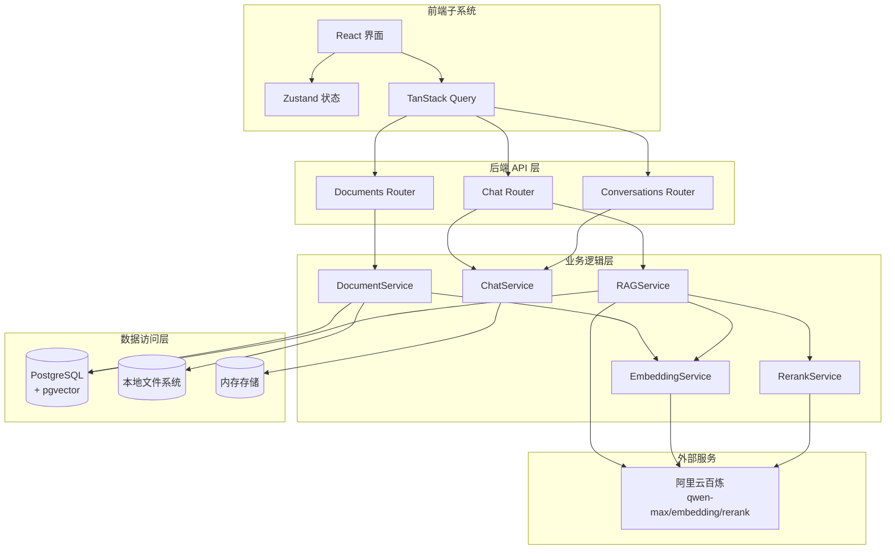
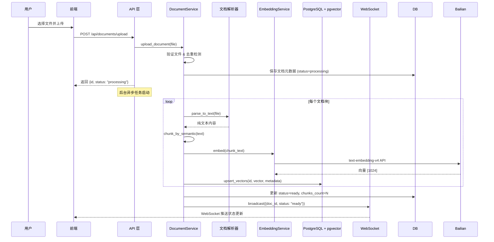
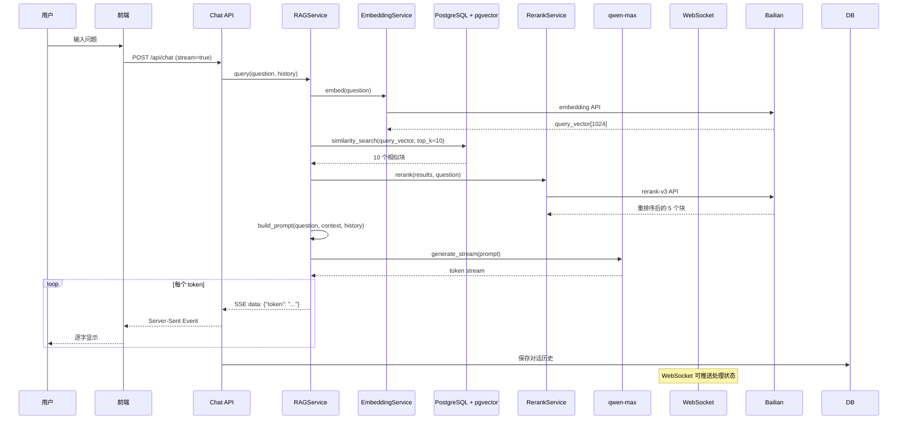
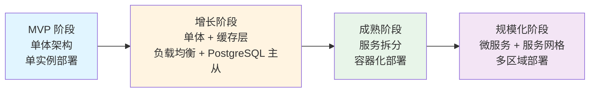

# RAG 文档问答系统 - 系统架构说明书 (SAD)

## 1. 架构概述

### 设计原则
- **高内聚低耦合**: 各模块职责单一，通过明确定义的接口通信
- **异步优先**: I/O 操作全部异步化，提升吞吐量
- **配置驱动**: 所有魔法数字通过环境变量配置，支持多环境部署
- **可观测性**: 内置日志、指标追踪，便于问题诊断
- **渐进式演进**: MVP 采用单体架构，预留微服务拆分能力

### 架构风格
**分层架构 (Layered Architecture)** + **事件驱动 (Event-Driven)**

```
┌─────────────────────────────────────┐
│         Presentation Layer          │
│    (React SPA + TypeScript)         │
└─────────────────────────────────────┘
                  ↕ HTTP/REST + SSE
┌─────────────────────────────────────┐
│         Application Layer           │
│    (FastAPI API Endpoints)          │
└─────────────────────────────────────┘
                  ↕ Service Interface
┌─────────────────────────────────────┐
│         Business Logic Layer        │
│  (RAG Service, Document Service)    │
└─────────────────────────────────────┘
                  ↕ Repository Pattern
┌─────────────────────────────────────┐
│         Data Access Layer           │
│   (Pinecone, Local FS, Memory)      │
└─────────────────────────────────────┘
```

### 技术栈全景图

| 层级 | 技术选型 | 版本 | 选型理由 |
|------|----------|------|----------||
| **前端框架** | React | 19+ | 生态成熟，组件丰富，性能优秀 |
| **构建工具** | Vite | 5+ | 极速冷启动，HMR 体验好 |
| **类型系统** | TypeScript | 5+ | 类型安全，IDE 友好 |
| **样式方案** | TailwindCSS | 3+ | 原子化 CSS，开发效率高 |
| **状态管理** | Zustand | 4+ | 轻量简洁，替代 Redux |
| **数据请求** | TanStack Query | 5+ | 强大的服务端状态管理 |
| **后端框架** | FastAPI | 0.109.2 | 原生异步，自动 OpenAPI 文档 |
| **AI 框架** | LangChain | 0.1.4 | RAG 工具链完善，抽象优雅 |
| **LLM SDK** | langchain-openai | 0.0.5 | OpenAI 兼容，无缝切换模型 |
| **向量数据库** | PostgreSQL + pgvector | Latest | 与业务数据统一存储，免运维成本 |
| **ORM 框架** | SQLAlchemy | 2.0.25 | 异步支持，类型安全 |
| **数据库驱动** | asyncpg | 0.29.0 | 高性能异步 PostgreSQL 驱动 |
| **文档解析** | PyMuPDF, python-docx | 1.23.8, 1.1.0 | 解析效果好，社区活跃 |
| **日志框架** | structlog | 24.1.0 | 结构化日志，便于分析 |
| **部署容器** | Docker | Latest | 环境一致性，便于 CI/CD |

---

## 2. 系统逻辑视图

### 模块划分

#### 2.1 前端子系统 (Frontend Subsystem)
**职责**: 用户界面展示、交互处理、状态管理

**核心模块**:
- `ChatModule`: 对话界面、流式响应渲染、历史管理
- `DocumentModule`: 文档上传、列表展示、进度跟踪（WebSocket）
- `SharedModule`: 通用组件、工具函数、API 客户端

#### 2.2 后端 API 层 (API Gateway Layer)
**职责**: HTTP 请求路由、参数验证、认证鉴权、响应格式化

**端点分组**:
- `/api/v1/documents/*`: 文档管理相关（上传、列表、删除）
- `/api/v1/chat/*`: 对话相关（SSE 流式问答）
- `/api/v1/conversations/*`: 会话历史相关（列表、删除）
- `/ws`: WebSocket 连接（文档状态推送）

#### 2.3 业务逻辑层 (Business Logic Layer)
**职责**: 核心 RAG 流程编排、业务规则实现

**核心服务**:
- `DocumentService` (709 行): 文档上传验证、解析编排、分块向量化、状态管理
- `RAGService` (439 行): 检索、重排序、回答生成（流式 SSE）
- `ChatService` (243 行): 对话上下文管理、消息持久化
- `EmbeddingService` (184 行): 文本向量化（调用百炼 API）
- `RerankService` (82 行): 检索结果重排序（调用百炼 API）
- `VectorServiceAdapter` (289 行): 向量存储适配器（PostgreSQL/Pinecone 切换）

#### 2.4 数据访问层 (Data Access Layer)
**职责**: 数据持久化、缓存管理、外部服务集成

**存储策略**:
- **PostgreSQL + pgvector**: 向量数据存储（主存储）+ 业务关系数据
- **本地文件系统**: 原始文档存储（可选，小文件直接存数据库）
- **内存存储**: 对话历史（Session）、临时缓存

**关键特性**:
- 使用 `VectorServiceAdapter` 适配器模式，支持 PostgreSQL/Pinecone 切换
- 异步数据库会话管理 (`AsyncSession`)
- Repository 模式封装数据访问细节

**Repository 列表**:
- `DocumentRepository` (325 行): 文档 CRUD、分块查询、内容合并
- `ConversationRepository`: 对话 CRUD、消息管理

### 模块交互图



### 关键业务流程架构

#### 2.5 文档上传与向量化流程



#### 2.6 RAG 问答流程



---

## 3. 系统物理视图 (部署架构)

### 网络拓扑

```
                    ┌──────────────────┐
                    │   Cloudflare     │
                    │     CDN/WAF      │
                    └────────┬─────────┘
                             │ HTTPS
                    ┌────────▼─────────┐
                    │  Load Balancer   │
                    │   (可选/Nginx)   │
                    └────────┬─────────┘
                             │
        ┌────────────────────┼────────────────────┐
        │                    │                    │
┌───────▼────────┐  ┌───────▼────────┐  ┌───────▼────────┐
│  Frontend Pod  │  │  Backend Pod 1 │  │  Backend Pod 2 │
│  (Static Files)│  │  (FastAPI)     │  │  (FastAPI)     │
│  :80/:443      │  │  :8000         │  │  :8000         │
└────────────────┘  └───────┬─────────┘  └───────┬─────────┘
                             │                   │
                  ┌──────────┴──────────┐       │
                  │                     │       │
    ┌─────────────▼──────────┐  ┌───────▼───────▼───────┐
    │   PostgreSQL Cluster   │  │  阿里云百炼 API       │
    │   (+ pgvector)         │  │  (Public Internet)    │
    │   Port: 5432           │  │                       │
    └────────────────────────┘  └───────────────────────┘
```

### 节点规划

#### MVP 阶段 (单实例部署)
| 节点类型 | 配置 | 数量 | 用途 |
|----------|------|------|------|
| 应用服务器 | 4 核 8GB, 100GB SSD | 1 | 运行 FastAPI + 静态文件服务 |
| 数据库服务器 | 4 核 8GB, 200GB SSD | 1 | PostgreSQL + pgvector（可与应用同机） |
| 对象存储 | OSS/S3 | 1 | 存储原始文档（可选） |

#### 生产阶段 (高可用部署)
| 节点类型 | 配置 | 数量 | 用途 |
|----------|------|------|------|
| 负载均衡器 | Nginx/ALB | 1 | 流量分发、SSL 终止 |
| 应用节点 | 4 核 8GB | 2-4 | 无状态 FastAPI 实例 |
| 静态资源 | CDN | 1 | 前端文件加速 |
| 数据库主节点 | 8 核 16GB, 500GB SSD | 1 | PostgreSQL Primary |
| 数据库从节点 | 8 核 16GB, 500GB SSD | 1-2 | PostgreSQL Replica（读写分离） |

### 高可用设计

**故障转移策略**:
1. **健康检查**: 每 5 秒检测后端实例健康状态 (`GET /health`)
2. **自动剔除**: 连续 3 次失败则从负载均衡池移除
3. **优雅降级**: 
   - PostgreSQL 不可用 → 返回友好错误，提示系统维护中
   - 百炼 API 超时 → 重试 3 次后返回友好错误
   - pgvector 检索超时 → 降级到关键词检索（BM25，待实现）

**数据备份策略**:
- PostgreSQL 每日凌晨 2 点全量备份 + WAL 日志实时备份
- 文档元数据和向量数据统一备份
- RPO (恢复点目标): ≤1 小时（WAL 日志）
- RTO (恢复时间目标): ≤30 分钟

---

## 4. 非功能性架构设计

### 安全性架构

#### 4.1 传输层安全
```yaml
TLS 配置:
  版本：TLS 1.3
  加密套件: TLS_AES_256_GCM_SHA384
  证书：Let's Encrypt 或云厂商 SSL 证书
  强制 HTTPS: HSTS header (max-age=31536000)
```

#### 4.2 输入验证
```python
# 文件上传验证示例
class DocumentUploadValidator:
    ALLOWED_MIME_TYPES = {
        'application/pdf',
        'application/vnd.openxmlformats-officedocument.wordprocessingml.document',
        'text/markdown',
        'text/plain'
    }
    MAX_FILE_SIZE = 50 * 1024 * 1024  # 50MB
    
    async def validate(self, file: UploadFile):
        # 1. MIME 类型白名单
        if file.content_type not in self.ALLOWED_MIME_TYPES:
            raise HTTPException(400, "不支持的文件格式")
        
        # 2. 文件大小限制
        content = await file.read()
        if len(content) > self.MAX_FILE_SIZE:
            raise HTTPException(413, "文件超过 50MB")
        
        # 3. 文件签名验证 (防止 MIME 伪造)
        if not self._verify_magic_number(content):
            raise HTTPException(400, "文件损坏或格式不匹配")
```

#### 4.3 速率限制
```python
from slowapi import Limiter
from slowapi.util import get_remote_address

limiter = Limiter(key_func=get_remote_address)

@router.post("/chat")
@limiter.limit("60/minute")  # 单 IP 每分钟最多 60 次请求
async def chat(request: Request, ...):
    ...
```

#### 4.4 审计日志
```python
import structlog

logger = structlog.get_logger()

async def audit_log_middleware(request: Request, call_next):
    response = await call_next(request)
    
    # 记录关键操作
    if request.method == "POST" and "/documents" in request.url.path:
        logger.info(
            "document_uploaded",
            ip=request.client.host,
            user_agent=request.headers.get("user-agent"),
            filename=request.form.get("filename"),
            status=response.status_code
        )
    
    return response
```

### 性能架构

#### 4.5 缓存策略
```python
from functools import lru_cache
from cachetools import TTLCache

# 1. 嵌入向量缓存 (避免重复计算相同文本)
embedding_cache = TTLCache(maxsize=1000, ttl=3600)  # 1 小时过期

@lru_cache(maxsize=100)
def get_document_metadata(doc_id: str):
    """文档元数据缓存"""
    return db.query(Document).filter(Document.id == doc_id).first()
```

#### 4.6 异步 I/O
```python
# 所有 I/O 操作使用异步
import aiofiles
import httpx

async def process_document(file_path: str):
    # 异步文件读取
    async with aiofiles.open(file_path, 'rb') as f:
        content = await f.read()
    
    # 异步 API 调用
    async with httpx.AsyncClient() as client:
        response = await client.post(embedding_api, json={...})
```

#### 4.7 批量处理优化
```python
# 批量向量化（减少 API 调用次数）
async def batch_embed_documents(texts: List[str], batch_size: int = 32):
    batches = [texts[i:i+batch_size] for i in range(0, len(texts), batch_size)]
    
    tasks = [embed_batch(batch) for batch in batches]
    results = await asyncio.gather(*tasks)
    
    return [vec for batch_result in results for vec in batch_result]
```

### 可扩展性设计

#### 4.9 水平扩展预留
- **无状态设计**: 后端实例不保存会话状态，可任意扩缩容
- **会话外置**: 对话历史存储在 PostgreSQL，与具体实例解耦
- **PostgreSQL 主从复制**: 支持读写分离，提升查询性能
- **连接池优化**: `pool_size=20`, `max_overflow=40`，支持高并发

#### 4.10 模块化插件机制
```python
# 文档解析器注册表
parser_registry = {}

def register_parser(file_type: str):
    def decorator(cls):
        parser_registry[file_type] = cls
        return cls
    return decorator

@register_parser("pdf")
class PDFParser:
    async def parse(self, file: bytes) -> str:
        ...

# 新增格式只需添加新解析器，无需修改核心逻辑
```

def register_parser(file_type: str):
    def decorator(cls):
        parser_registry[file_type] = cls
        return cls
    return decorator

@register_parser("pdf")
class PDFParser:
    async def parse(self, file: bytes) -> str:
        ...

# 新增格式只需添加新解析器，无需修改核心逻辑
```

---

## 5. 关键技术决策记录 (ADR)

### ADR-001: 为什么选择 FastAPI 而不是 Flask/Django?

**背景**: 需要选择一个 Python Web 框架作为后端 API 基础

**选项对比**:

| 维度 | FastAPI | Flask | Django REST Framework |
|------|---------|-------|----------------------|
| 异步支持 | ✅ 原生异步 | ❌ 同步 (需额外扩展) | ⚠️ 部分异步 |
| 性能 | ⭐⭐⭐⭐⭐ | ⭐⭐⭐ | ⭐⭐⭐ |
| 自动文档 | ✅ OpenAPI 自动生成 | ❌ 需手动 | ⚠️ 需配置 |
| 类型检查 | ✅ Pydantic 强类型 | ❌ 弱类型 | ⚠️ 中等 |
| 学习曲线 | 平缓 | 平缓 | 陡峭 |
| 生态成熟度 | ⭐⭐⭐⭐ | ⭐⭐⭐⭐⭐ | ⭐⭐⭐⭐⭐ |

**最终决定**: **FastAPI**

**理由**:
1. 原生异步支持，契合 RAG 流程中大量 I/O 操作
2. 自动 OpenAPI 文档，减少维护成本
3. Pydantic 提供优秀的类型验证和序列化
4. 性能优于 Flask/Django，符合 NFR-001 性能需求

---

### ADR-002: 为什么选择 PostgreSQL + pgvector 而不是 Pinecone/Milvus?

**背景**: 需要选择向量数据库存储文档嵌入

**选项对比**:

| 维度 | PostgreSQL + pgvector | Pinecone | Milvus |
|------|----------------------|----------|--------|
| 部署方式 | 自建/云托管 | 全托管 SaaS | 自建/托管 |
| 运维成本 | ⭐⭐⭐ (需基础 DBA) | ⭐⭐⭐⭐⭐ (零运维) | ⭐⭐ (需运维) |
| 扩展性 | 手动扩展 | 自动扩展 | 手动分片 |
| 查询性能 | ⭐⭐⭐⭐ (HNW 索引) | ⭐⭐⭐⭐⭐ | ⭐⭐⭐⭐⭐ |
| 成本 (MVP) | 低 (复用现有 PG) | $0 起步 | 服务器成本 |
| 功能丰富度 | ⭐⭐⭐⭐ (SQL+ 向量) | ⭐⭐⭐⭐ | ⭐⭐⭐⭐⭐ |
| 数据一致性 | ⭐⭐⭐⭐⭐ (事务支持) | ⭐⭐⭐ | ⭐⭐⭐⭐ |

**最终决定**: **PostgreSQL + pgvector**

**理由**:
1. **简化架构**: 业务数据和向量数据统一存储，避免多数据库同步复杂性
2. **事务支持**: 文档上传和向量化可在同一事务中完成，保证数据一致性
3. **成本优势**: 无需额外部署和维护独立的向量数据库
4. **学习曲线**: 团队已熟悉 PostgreSQL，降低学习成本
5. **退出策略**: 通过 `VectorServiceAdapter` 适配器模式，未来可无缝切换至 Pinecone

**技术实现**:
```python
# app/services/vector_service_adapter.py
class VectorServiceAdapter:
    """
    向量服务适配器
    根据配置自动选择合适的向量服务实现（PostgreSQL 或 Pinecone）
    """
    def __init__(self, service_impl):
        self.service_impl = service_impl
        self.service_type = type(service_impl).__name__
```

**风险缓解**: 
- 单点故障风险 → PostgreSQL 高可用集群
- 性能瓶颈 → HNSW 索引优化、读写分离

---

### ADR-003: 为什么选择阿里云百炼而不是直接调用通义千问 API?

**背景**: 需要选择 LLM 服务提供商

**选项对比**:

| 维度 | 阿里云百炼 | 通义千问直连 | OpenAI |
|------|------------|-------------|--------|
| 模型丰富度 | ✅ 多种模型 (qwen/max/embedding/rerank) | ⚠️ 仅语言模型 | ✅ 齐全 |
| 国内访问速度 | ⭐⭐⭐⭐⭐ | ⭐⭐⭐⭐⭐ | ⭐⭐ |
| 价格 | ¥ 计费，性价比高 | ¥ 计费 | $ 计费，较贵 |
| 合规性 | ✅ 符合中国法规 | ✅ | ⚠️ 数据出境风险 |
| LangChain 集成 | ✅ langchain_openai 兼容 | ⚠️ 需适配 | ✅ 原生支持 |

**最终决定**: **阿里云百炼**

**理由**:
1. **一站式服务**: 同时提供 LLM(qwen-max)、Embedding、Rerank，统一账单
2. **低延迟**: 国内访问速度快于 OpenAI
3. **合规安全**: 数据不出境，符合《生成式 AI 管理办法》
4. **成本优势**: 中文场景下性价比优于 GPT-4

**技术实现**:
```python
from langchain_openai import ChatOpenAI

# 通过 base_url 重定向到百炼端点
llm = ChatOpenAI(
    model="qwen-max",
    openai_api_key=os.getenv("DASHSCOPE_API_KEY"),
    base_url="https://dashscope.aliyuncs.com/api/v1/services/aigc/text-generation/generation"
)
```

---

### ADR-004: 为什么采用分层单体架构而不是微服务？

**背景**: 确定系统初始架构风格

**选项对比**:

| 维度 | 分层单体架构 | 微服务架构 |
|------|------------|-----------||
| 开发效率 | ⭐⭐⭐⭐⭐ (代码集中) | ⭐⭐⭐ (需协调多服务) |
| 部署复杂度 | ⭐⭐⭐⭐⭐ (单次部署) | ⭐⭐ (需编排多个服务) |
| 调试难度 | ⭐⭐⭐⭐ (本地调试) | ⭐⭐ (分布式追踪) |
| 扩展粒度 | ⭐⭐ (整体扩展) | ⭐⭐⭐⭐⭐ (按需扩展) |
| 团队要求 | ⭐⭐⭐⭐ (1-2 人即可) | ⭐⭐ (需 DevOps 支持) |
| 初期成本 | ⭐⭐⭐⭐⭐ (低) | ⭐⭐ (高) |

**最终决定**: **分层单体架构，预留模块化拆分能力**

**理由**:
1. **团队规模**: MVP 阶段 2-3 人，微服务过度设计
2. **快速迭代**: 需求变化快，单体更灵活
3. **成本控制**: 减少服务器和运维开销
4. **退出策略**: 通过清晰的服务接口抽象，未来可按模块拆分为微服务

**架构层次**:
```
┌─────────────────────────────────────┐
│         Presentation Layer          │
│    (FastAPI API Endpoints)          │
└─────────────────────────────────────┘
              ↕ DI (Depends)
┌─────────────────────────────────────┐
│         Business Logic Layer        │
│  (RAGService, DocumentService)      │
└─────────────────────────────────────┘
              ↕ Repository Pattern
┌─────────────────────────────────────┐
│         Data Access Layer           │
│   (Repository + UnitOfWork)         │
└─────────────────────────────────────┘
```

**演进路线**:
```
Phase 1 (MVP): 单体 FastAPI 应用
       ↓
Phase 2 (增长): 抽离 DocumentService 为独立服务（文档处理耗时较长）
       ↓
Phase 3 (规模化): 抽离 RAGService、ChatService
```

---

## 6. 部署配置示例

### Docker Compose (开发环境)
```yaml
version: '3.8'

services:
  backend:
    build: ./backend
    ports:
      - "8000:8000"
    environment:
      - DASHSCOPE_API_KEY=${DASHSCOPE_API_KEY}
      - PINECONE_API_KEY=${PINECONE_API_KEY}
      - PINECONE_HOST=${PINECONE_HOST}
    volumes:
      - ./backend:/app
      - document_storage:/app/storage
    restart: unless-stopped
  
  frontend:
    build: ./frontend
    ports:
      - "3000:80"
    depends_on:
      - backend
    restart: unless-stopped

volumes:
  document_storage:
```

### 生产环境 Nginx 配置
```nginx
server {
    listen 80;
    server_name rag-system.example.com;
    return 301 https://$server_name$request_uri;
}

server {
    listen 443 ssl http2;
    server_name rag-system.example.com;
    
    ssl_certificate /etc/letsencrypt/live/rag-system.example.com/fullchain.pem;
    ssl_certificate_key /etc/letsencrypt/live/rag-system.example.com/privkey.pem;
    
    # 前端静态文件
    location / {
        root /var/www/frontend;
        try_files $uri $uri/ /index.html;
    }
    
    # 后端 API 代理
    location /api/ {
        proxy_pass http://localhost:8000;
        proxy_set_header Host $host;
        proxy_set_header X-Real-IP $remote_addr;
        proxy_set_header X-Forwarded-For $proxy_add_x_forwarded_for;
        
        # SSE 支持
        proxy_buffering off;
        proxy_cache off;
        proxy_read_timeout 300s;
    }
}
```

---

## 7. 监控与告警策略

### 关键指标监控
```yaml
metrics:
  - name: api_response_time
    threshold: p95 < 2000ms
    alert_if_exceeded: true
  
  - name: error_rate
    threshold: < 5%
    alert_if_exceeded: true
  
  - name: postgresql_query_latency
    threshold: p95 < 500ms
    alert_if_exceeded: true
  
  - name: active_conversations
    threshold: > 100
    alert_if_exceeded: false  # 仅记录，不告警
  
  - name: document_processing_queue
    threshold: > 50
    alert_if_exceeded: true  # 处理队列积压告警
```

### 日志级别规范
```python
LOG_LEVELS = {
    "DEBUG": "详细调试信息（本地开发）",
    "INFO": "关键业务操作（上传、查询、删除）",
    "WARNING": "可恢复的异常（API 超时重试）",
    "ERROR": "需要人工介入的错误（数据库连接失败）"
}
```

### WebSocket 连接监控
```python
# app/websocket_manager.py
class ConnectionManager:
    async def connect(self, websocket: WebSocket) -> str:
        await websocket.accept()
        self.active_connections.append(websocket)
        logger.info(
            "websocket_connected",
            connection_id=connection_id,
            total_connections=len(self.active_connections)
        )
        return connection_id
```

---

## 8. 附录：架构演进路线图



---

## 9. 关键技术决策记录 (ADR) - 补充

### ADR-005: WebSocket 实时推送机制设计

**背景**: 文档处理是异步任务，需要向客户端实时反馈处理进度

**选项对比**:

| 方案 | 优点 | 缺点 | 适用场景 |
|------|------|------|----------|
| **WebSocket** | ⭐⭐⭐⭐⭐ 双向通信，实时性好 | 需维护长连接 | 高频实时更新 |
| **SSE (Server-Sent Events)** | ⭐⭐⭐⭐ 简单，HTTP 兼容 | 仅服务端推送 | 单向通知 |
| **轮询 (Polling)** | ⭐⭐ 实现简单 | 延迟高，浪费资源 | 低频更新 |
| **Long Polling** | ⭐⭐⭐ 折中方案 | 实现复杂 | 中等频率 |

**最终决定**: **WebSocket**

**理由**:
1. **实时性强**: 文档处理完成后立即推送，无需等待
2. **带宽效率**: 仅在状态变化时发送消息
3. **扩展性**: 支持广播给多个订阅同一文档的客户端
4. **技术成熟**: FastAPI 原生支持 WebSocket

**技术实现**:
```python
# app/websocket_manager.py
class ConnectionManager:
    def __init__(self):
        self.active_connections: List[WebSocket] = []
    
    async def broadcast(self, message: dict):
        """广播消息到所有连接的客户端"""
        for connection in self.active_connections:
            await connection.send_json(message)

# app/main.py
@app.websocket("/ws")
async def websocket_endpoint(websocket: WebSocket):
    connection_id = await manager.connect(websocket)
    # 保持连接活跃，接收广播消息
```

**使用场景**:
- 文档上传后状态变更通知（processing → ready/failed）
- 分块数量更新通知
- 系统公告广播

---

### ADR-006: 异步任务处理策略

**背景**: 文档解析和向量化是耗时操作，不能阻塞 API 响应

**选项对比**:

| 方案 | 优点 | 缺点 | 适用场景 |
|------|------|------|----------||
| **FastAPI BackgroundTasks** | ⭐⭐⭐⭐ 简单，内置支持 | 进程重启丢失任务 | 短期任务 |
| **Celery + Redis** | ⭐⭐⭐⭐⭐ 分布式，可靠 | 增加基础设施复杂度 | 长期/定时任务 |
| **asyncio.create_task** | ⭐⭐⭐ 轻量级 | 错误处理复杂 | 简单异步 |
| **独立 Worker 进程** | ⭐⭐⭐⭐ 可控性强 | 需进程间通信 | 重任务 |

**最终决定**: **FastAPI BackgroundTasks + asyncio.create_task 混合**

**理由**:
1. **MVP 简洁性**: 避免引入 Celery 等重量级组件
2. **可靠性保障**: 通过数据库状态持久化，任务失败可恢复
3. **WebSocket 通知**: 处理完成后主动推送结果

**技术实现**:
```python
# app/api/v1/documents.py
@router.post("/upload")
async def upload_document(
    file: bytes = File(...),
    background_tasks: BackgroundTasks = None
):
    # 1. 保存文档元数据
    doc_id = await service.upload_document(file_content=file, ...)
    
    # 2. 添加后台任务（事务提交后执行）
    if background_tasks:
        background_tasks.add_task(service._process_document_async, doc_id)
    
    # 3. 立即返回
    return SuccessResponse(data={"id": doc_id, "status": "processing"})
```

**演进路线**:
- MVP: BackgroundTasks
- v2.0: 迁移至 Celery + Redis，支持分布式任务队列
- v3.0: 引入 Kubernetes Jobs，支持弹性伸缩

---

**文档审批签字**:

| 角色 | 姓名 | 签字 | 日期 |
|------|------|------|------|
| 首席架构师 | | | |
| 技术负责人 | | | |
| 运维负责人 | | | |

---

**变更历史**:
| 版本 | 日期 | 作者 | 变更说明 |
|------|------|------|----------|
| v1.0 | 2026-03-04 | AI 首席架构师 | 初始版本 |
