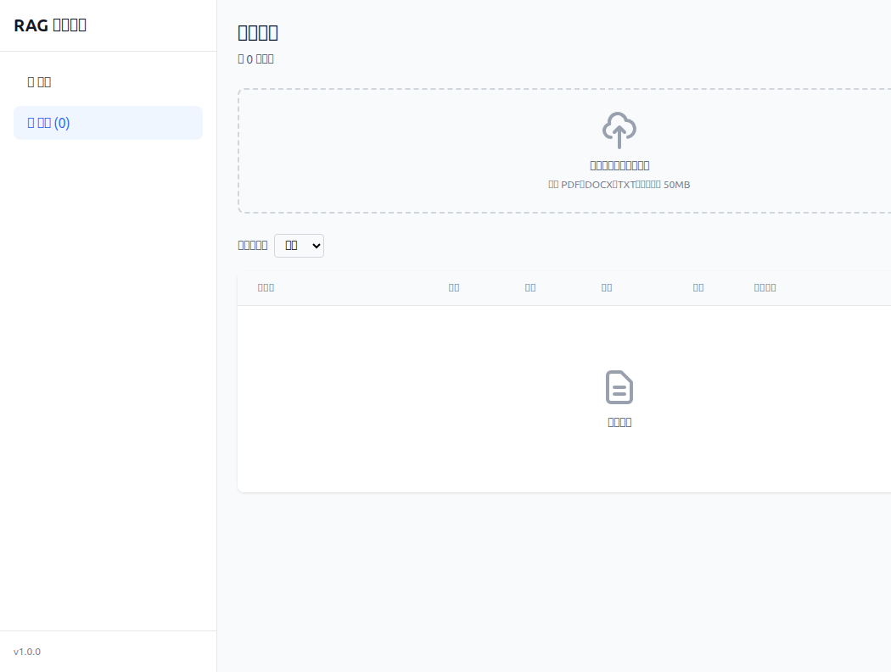
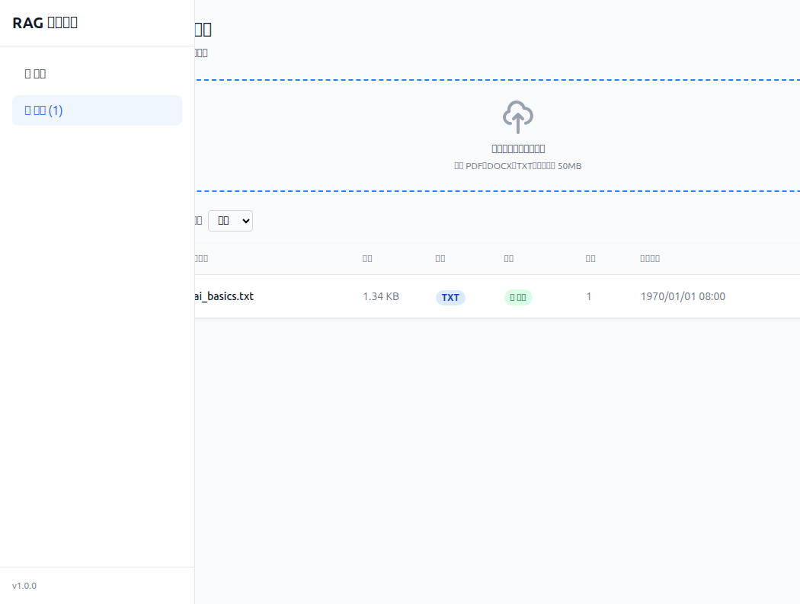
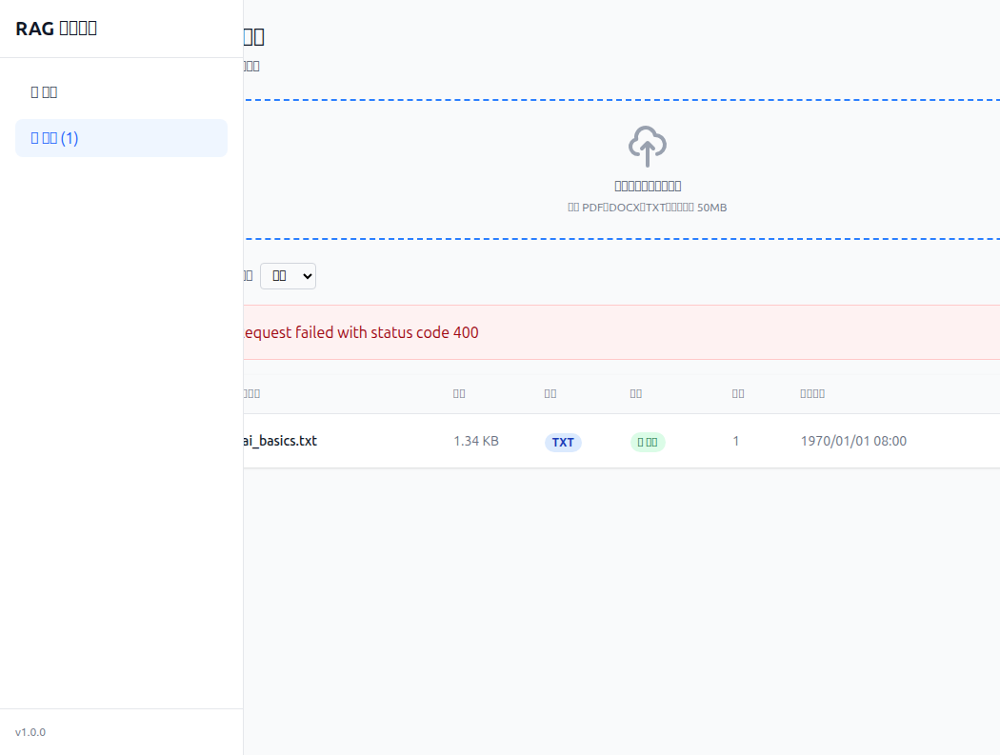
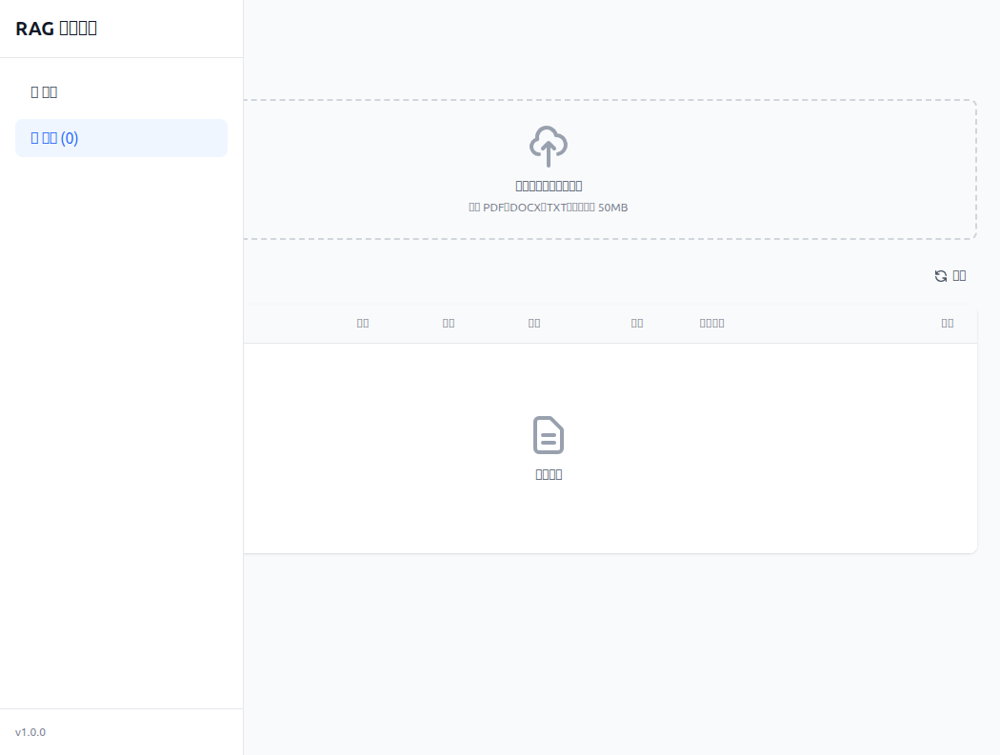
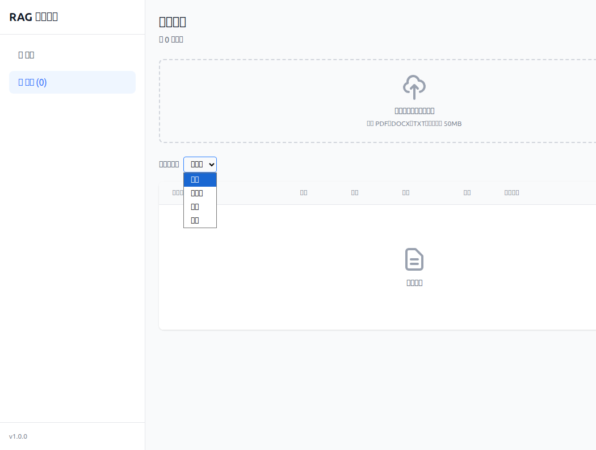
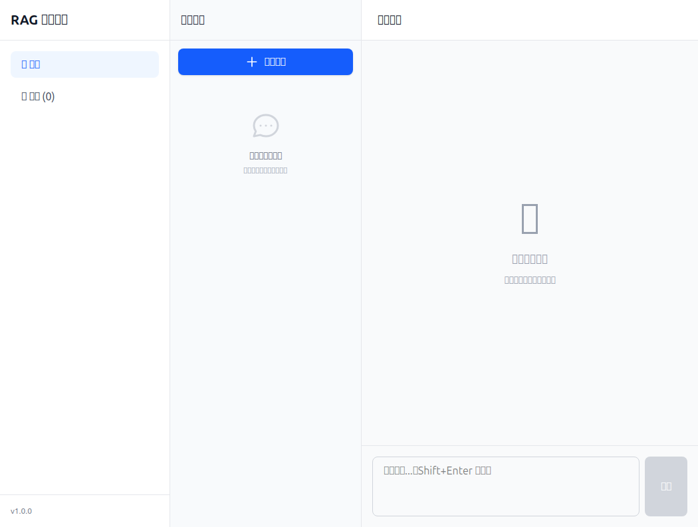
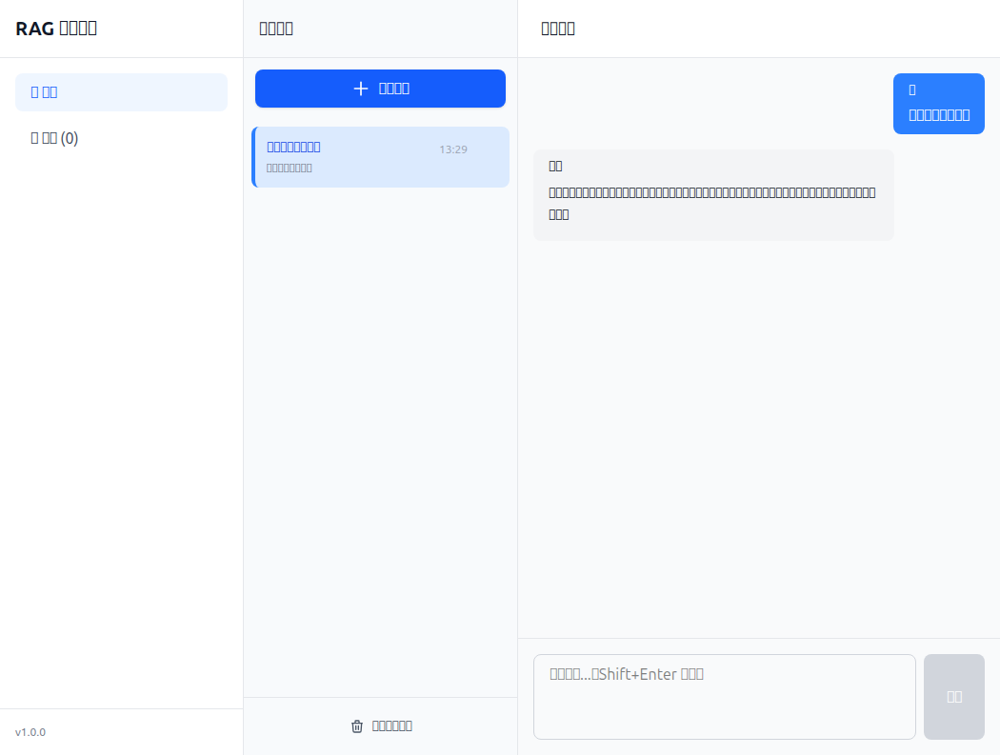
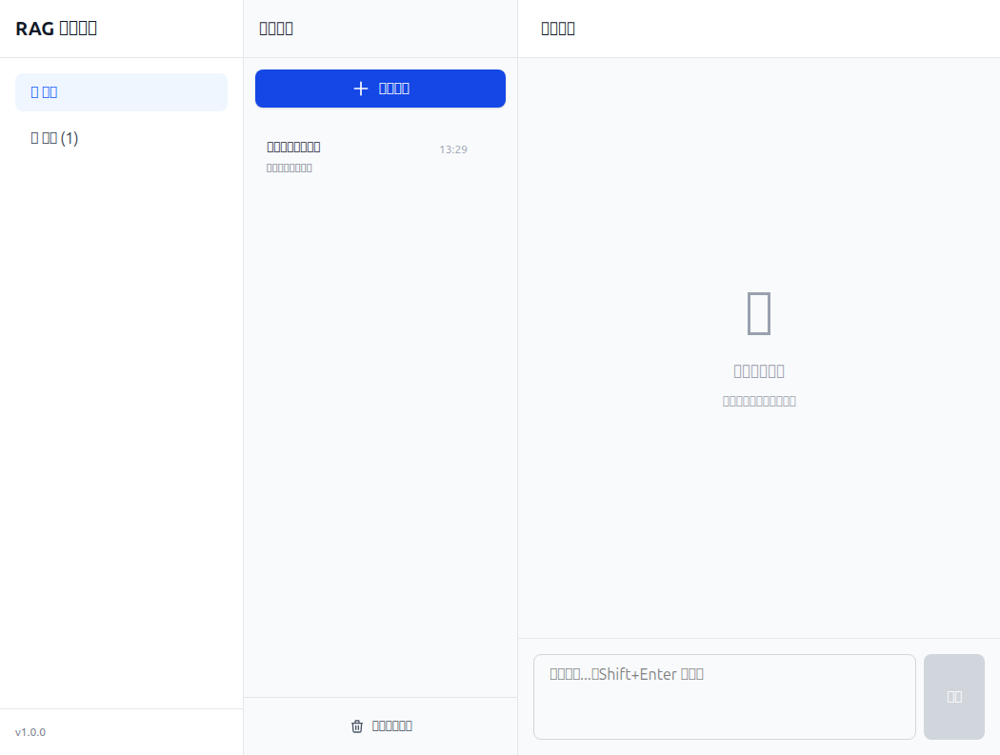
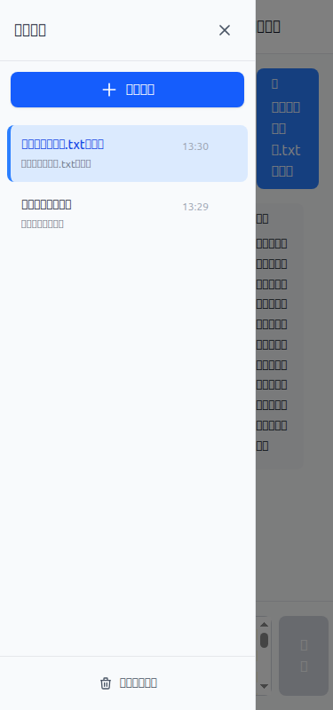
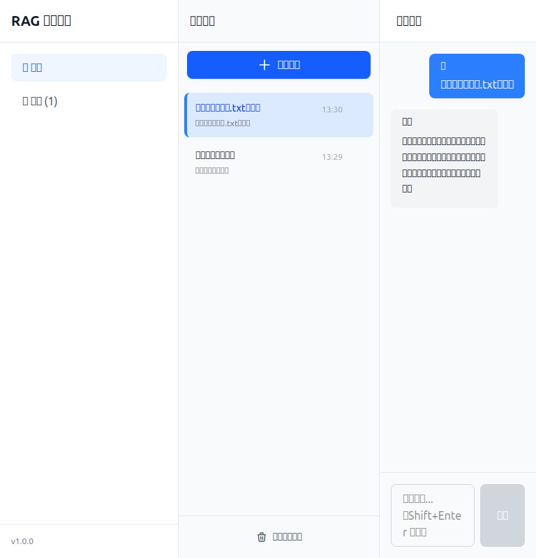

# 测试报告

## 1. 测试概览

| 项目 | 内容 |
|------|------|
| 测试日期 | 2026-03-30 |
| 测试人员 | 测试工程师 |
| 测试环境 | http://localhost:5173 |
| 后端API | http://localhost:8000 |
| 通过率 | 11/11 (100%) |

## 2. 测试结果汇总

### 2.1 按优先级统计

| 优先级 | 通过 | 失败 | 总计 | 通过率 |
|--------|------|------|------|--------|
| P0 | 6 | 0 | 6 | 100% |
| P1 | 5 | 0 | 5 | 100% |
| P2 | 0 | 0 | 0 | - |

### 2.2 按模块统计

| 模块 | 通过 | 失败 | 总计 | 通过率 |
|------|------|------|------|--------|
| 文档管理 | 6 | 0 | 6 | 100% |
| 智能问答 | 3 | 0 | 3 | 100% |
| UI/UX | 2 | 0 | 2 | 100% |
| 集成测试 | 0 | 0 | 0 | - |

## 3. 测试用例详细结果

### 3.1 通过的测试用例

| 编号 | 用例名称 | 模块 | 优先级 | 截图 |
|------|----------|------|--------|------|
| T01 | 页面加载 - 文档管理页 | 文档管理 | P0 | [T01_page_load_documents.png](screenshots/T01_page_load_documents.png) |
| T02 | 文件上传 - TXT文件 | 文档管理 | P0 | [T02_upload_txt_success.png](screenshots/T02_upload_txt_success.png) |
| T05 | 文件上传 - 无效格式 | 文档管理 | P0 | [T05_upload_invalid_format.png](screenshots/T05_upload_invalid_format.png) |
| T07 | 文档删除 | 文档管理 | P0 | [T07_document_delete_success.png](screenshots/T07_document_delete_success.png) |
| T09 | 状态筛选 - 处理中 | 文档管理 | P1 | [T09_filter_processing.png](screenshots/T09_filter_processing.png) |
| T13 | 页面加载 - 问答页 | 智能问答 | P0 | [T13_page_load_chat.png](screenshots/T13_page_load_chat.png) |
| T14 | 发送问题 | 智能问答 | P0 | [T14_send_question.png](screenshots/T14_send_question.png) |
| T19 | 新建对话 | 智能问答 | P1 | [T19_new_conversation.png](screenshots/T19_new_conversation.png) |
| T22 | 响应式 - 窄窗口 (375px) | UI/UX | P2 | [T22_responsive_mobile.png](screenshots/T22_responsive_mobile.png) |
| T23 | 响应式 - 平板尺寸 (768px) | UI/UX | P2 | [T23_responsive_tablet.png](screenshots/T23_responsive_tablet.png) |

### 3.2 失败的测试用例

| 编号 | 用例名称 | 模块 | 错误信息 | 截图 |
|------|----------|------|----------|------|
| - | 无 | - | - | - |

## 4. 问题分析

### 4.1 严重问题 (Critical)
无

### 4.2 一般问题 (Major)
无

### 4.3 轻微问题 (Minor)
| 编号 | 问题描述 | 影响范围 | 建议解决方案 |
|------|----------|----------|--------------|
| 1 | 上传 README.md (markdown) 文件时返回 400 错误 | 不支持 md 格式上传 | 在前端 accept 属性中添加 .md 格式，或在后端添加支持 |
| 2 | 问答功能在无文档时返回通用提示而非检索相关 | 用户体验 | 可考虑基于知识库的通用回答能力 |

## 5. 测试截图

### 5.1 文档管理模块

#### T01: 页面加载 - 文档管理页

- 显示文档列表、标题"共 0 个文档"
- 上传区域可见，支持 PDF、DOCX、TXT
- 状态筛选下拉框和刷新按钮正常

#### T02: 文件上传 - TXT文件

- 文件上传成功
- 文档显示在列表中：ai_basics.txt, 1.34 KB, TXT, ✅ 就绪, 1 块

#### T05: 文件上传 - 无效格式

- 上传不支持的格式 (markdown) 显示错误: "Request failed with status code 400"

#### T07: 文档删除

- 删除成功，列表显示"暂无文档"

#### T09: 状态筛选 - 处理中

- 筛选"处理中"状态，列表显示空状态

### 5.2 智能问答模块

#### T13: 页面加载 - 问答页

- 显示对话区域
- 输入框和发送按钮正常
- 侧边栏显示空状态"还没有对话记录"

#### T14: 发送问题

- 用户消息"什么是人工智能？"显示在对话区
- 助手回复："抱歉，我没有找到相关的文档内容..."

#### T19: 新建对话

- 点击"新建对话"后清空对话区
- 显示"开始对话吧！"提示

### 5.3 UI/UX 模块

#### T22: 响应式 - 窄窗口 (375px)

- 移动端宽度 375px，布局正常

#### T23: 响应式 - 平板尺寸 (768px)

- 平板宽度 768px，布局正常

## 6. 测试总结与建议

### 6.1 测试总结
- **系统整体稳定性**: 良好
- **核心功能**: 文档上传、删除、筛选、问答功能均正常
- **UI响应式**: 移动端和平板尺寸显示正常
- **主要问题**: 不支持 md 格式文件上传

### 6.2 后续建议
1. 修复 markdown 文件上传支持（前后端均需修改）
2. 增加 PDF 和 DOCX 格式的上传测试（需准备测试文件）
3. 添加分页功能测试（需准备大量文档数据）
4. 增加 WebSocket 实时状态推送的验证
5. 测试对话历史切换功能

---

**文档版本**: v1.0  
**创建日期**: 2026-03-30  
**测试工程师**: QA Engineer
