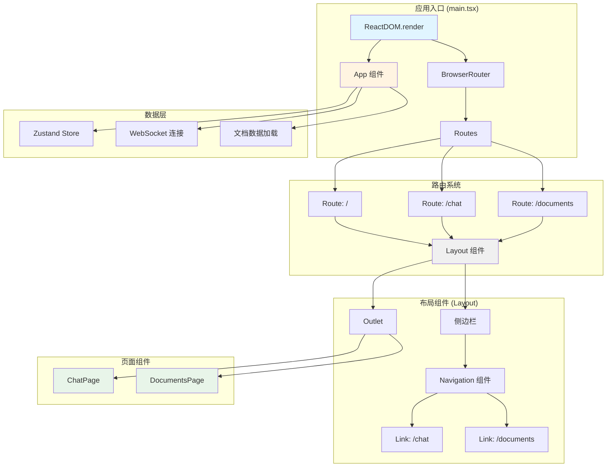
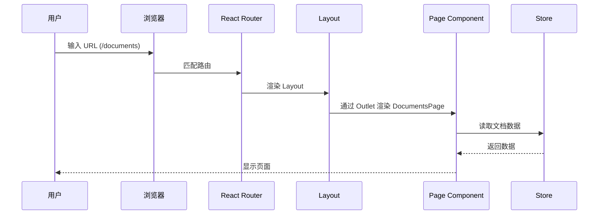
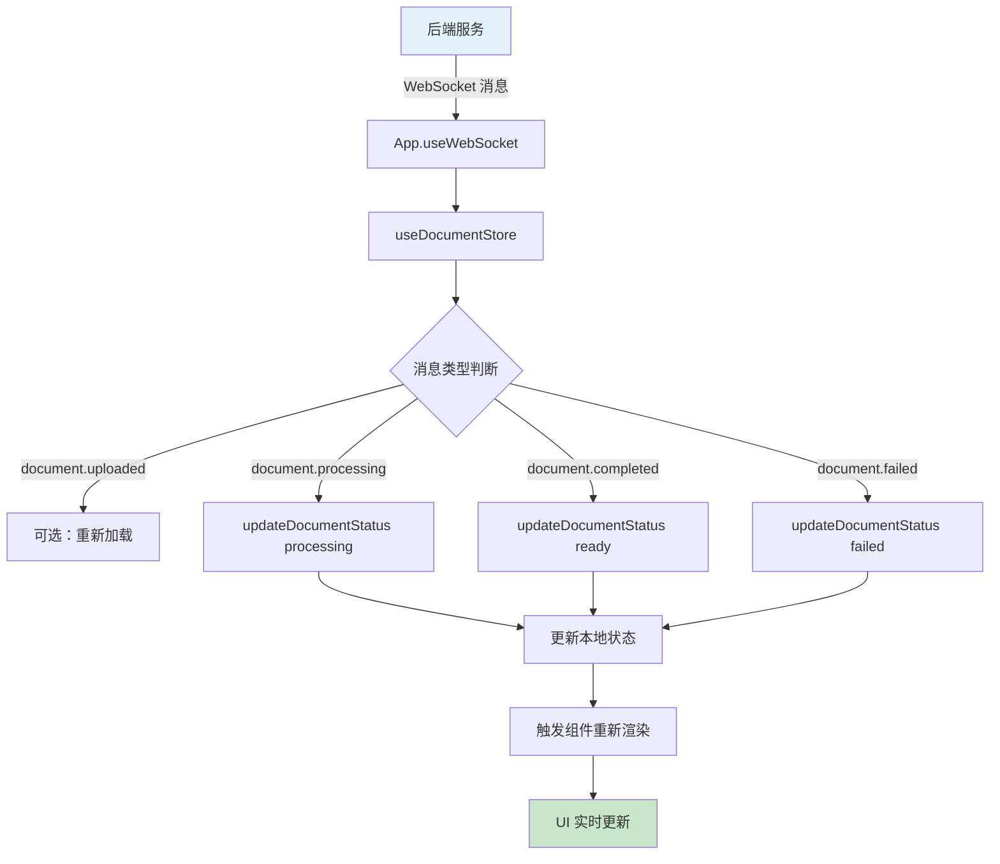

# React Router 架构图解

## 📐 整体架构



---

## 🎯 路由流程

### 用户访问流程



---

## 🏗️ 组件层级

```
React Root
└── App (数据加载，无 UI)
└── BrowserRouter
    └── Routes
        └── Route path="/"
            └── Layout
                ├── 侧边栏
                │   ├── Header (Logo)
                │   ├── Navigation
                │   │   ├── Link (/chat)
                │   │   └── Link (/documents)
                │   └── Footer (Version)
                └── main
                    └── Outlet (动态内容)
                        ├── ChatPage (/)
                        ├── ChatPage (/chat)
                        └── DocumentsPage (/documents)
```

---

## 🔄 数据流

### 导航切换流程

```mermaid
graph LR
    A[用户点击 Link] --> B[React Router 拦截]
    B --> C[更新 URL]
    C --> D[触发 history.pushState]
    D --> E[useLocation 检测到变化]
    E --> F[Navigation 重新渲染]
    F --> G[更新 activeTab 计算]
    G --> H[应用新的 CSS 类]
    H --> I[Layout 的 Outlet 切换]
    I --> J[渲染新页面组件]
    J --> K[从 Store 读取数据]
    K --> L[页面显示完成]
    
    style A fill:#ffebee
    style L fill:#e8f5e9
```



---

## 📦 状态管理

### Zustand Store 结构

```typescript
{
  // 文档状态
  documents: Document[],      // 文档列表
  total: number,              // 总数
  page: number,               // 当前页
  limit: number,              // 每页数量
  statusFilter: string,       // 筛选条件
  
  // UI 状态
  isLoading: boolean,         // 加载状态
  error: string | null,       // 错误信息
  
  // Actions
  fetchDocuments: Function,   // 获取文档
  deleteDocument: Function,   // 删除文档
  reprocessDocument: Function,// 重新处理
  setStatusFilter: Function,  // 设置筛选
}
```

### WebSocket 消息流



---

## 🎨 视觉架构

### 页面布局

```
┌────────────────────────────────────────────────────┐
│                   Browser Window                    │
├──────────┬─────────────────────────────────────────┤
│          │                                         │
│  Sidebar │           Main Content Area             │
│  (250px) │              (flex-1)                   │
│          │                                         │
│ ┌──────┐ │  ┌─────────────────────────────────┐   │
│ │ Logo │ │  │  Page Header (Chat/Documents)   │   │
│ └──────┘ │  └─────────────────────────────────┘   │
│          │                                         │
│ ┌──────┐ │  ┌─────────────────────────────────┐   │
│ │ 💬   │ │  │                                 │   │
│ │ Chat │ │  │     Page Content (Outlet)       │   │
│ └──────┘ │  │                                 │   │
│          │  │  - ChatMessages + ChatInput     │   │
│ ┌──────┐ │  │  - or DocumentsPage             │   │
│ │ 📄   │ │  │                                 │   │
│ │ Docs │ │  │                                 │   │
│ └──────┘ │  │                                 │   │
│          │  └─────────────────────────────────┘   │
│          │                                         │
│ ┌──────┐ │                                         │
│ │ v1.0 │ │                                         │
│ └──────┘ │                                         │
│          │                                         │
└──────────┴─────────────────────────────────────────┘
```

---

## 🔑 关键代码位置

### 1. 路由配置 (main.tsx)
```typescript
// Line 71-79
<Routes>
  <Route path="/" element={<Layout />}>
    <Route index element={<ChatPage />} />
    <Route path="documents" element={<DocumentsPage />} />
    <Route path="chat" element={<ChatPage />} />
  </Route>
</Routes>
```

### 2. 导航高亮逻辑 (main.tsx)
```typescript
// Line 11-40
const Navigation: React.FC = () => {
  const location = useLocation();
  const activeTab = location.pathname === '/documents' 
    ? 'documents' 
    : 'chat';
  
  return (
    <nav>
      <Link 
        to="/chat"
        className={activeTab === 'chat' 
          ? 'bg-blue-50 text-blue-600' 
          : 'text-gray-700 hover:bg-gray-100'}
      >
        💬 对话
      </Link>
      {/* ... */}
    </nav>
  );
};
```

### 3. 布局出口 (main.tsx)
```typescript
// Line 60-62
<main className="flex-1 flex flex-col overflow-hidden">
  <Outlet /> {/* 子路由渲染位置 */}
</main>
```

### 4. 数据加载 (App.tsx)
```typescript
// Line 17-26
const loadDocuments = async () => {
  try {
    const response = await documentAPI.getList(1, 100);
    setDocuments(response.data.items, response.data.total);
  } catch (error) {
    setError(error instanceof Error ? error.message : '加载失败');
  }
};

useEffect(() => {
  loadDocuments();
}, []);
```

---

## 🎯 设计模式应用

### 1. 组合模式 (Composite Pattern)
```
Layout = Sidebar + MainContent
MainContent = Outlet + PageComponent
```

### 2. 观察者模式 (Observer Pattern)
```
useLocation() 观察 URL 变化
useDocumentStore() 观察数据变化
```

### 3. 单一职责原则 (SRP)
```
App.tsx      → 数据加载
Layout.tsx   → 页面布局
Navigation.tsx → 导航菜单
ChatPage.tsx → 聊天功能
DocumentsPage.tsx → 文档管理
```

---

## 📊 性能优化点

### 1. 组件缓存
```typescript
// Layout 组件不会重新渲染，除非路由变化
const Layout: React.FC = () => { ... }
```

### 2. 按需加载（未来优化）
```typescript
// 可以使用 React.lazy 实现
const DocumentsPage = lazy(() => import('./pages/DocumentsPage'));
```

### 3. 避免不必要的重渲染
```typescript
// 使用 useMemo 和 useCallback
const activeTab = useMemo(() => 
  location.pathname === '/documents' ? 'documents' : 'chat', 
  [location.pathname]
);
```

---

## 🔮 扩展方向

### 添加新页面
```typescript
// 1. 创建页面组件
const SettingsPage: React.FC = () => { ... };

// 2. 添加路由
<Route path="settings" element={<SettingsPage />} />

// 3. 添加导航链接
<Link to="/settings">⚙️ 设置</Link>
```

### 添加认证守卫
```typescript
const ProtectedRoute: React.FC<{ children: React.ReactNode }> = ({ children }) => {
  const isAuthenticated = useAuth();
  if (!isAuthenticated) {
    return <Navigate to="/login" replace />;
  }
  return children;
};

// 使用
<Route path="documents" element={
  <ProtectedRoute>
    <DocumentsPage />
  </ProtectedRoute>
} />
```

---

**文档版本**: v1.0  
**更新时间**: 2026-03-22  
**维护者**: AI Assistant
