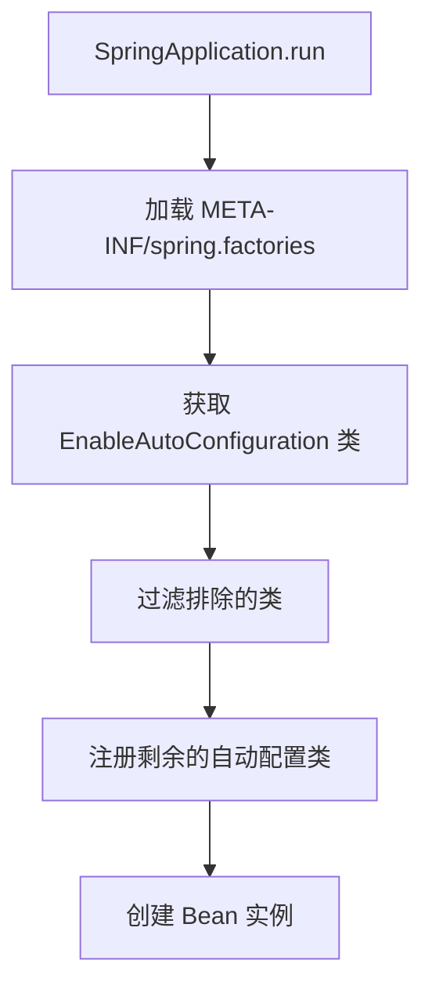

# Spring Boot 3.x 自动装配原理深度解析

> 本文为 AI 教育平台系列博客第一篇，讲解 Spring Boot 3.x 自动装配核心原理
> 
> 仓库地址：https://github.com/anomalyco/edu-ai-platform

---

## 一、背景

Spring Boot 为什么只需要一个 `@SpringBootApplication` 注解就能启动整个应用？本文将深入剖析其自动装配机制。

---

## 二、核心注解解析

### 2.1 @SpringBootApplication

```java
@Target(ElementType.TYPE)
@Retention(RetentionPolicy.RUNTIME)
@Documented
@Configuration
@EnableAutoConfiguration
@ComponentScan
public @interface SpringBootApplication {
    // 组合了三个核心注解
}
```

三个核心注解：
- `@Configuration`：标记为配置类
- `@EnableAutoConfiguration`：开启自动装配
- `@ComponentScan`：组件扫描

### 2.2 @EnableAutoConfiguration

```java
@Target(ElementType.TYPE)
@Retention(RetentionPolicy.RUNTIME)
@Documented
@Import(AutoConfigurationImportSelector.class)
public @interface EnableAutoConfiguration {
    String EXCLUDE_NAME = "exclude";
    String EXCLUDE_CONFIGURATION = "excludeName";
}
```

核心在于 `AutoConfigurationImportSelector`，它通过 `SpringFactoriesLoader` 加载自动配置类。

---

## 三、自动装配流程



### 3.1 SpringFactoriesLoader 机制

```java
public final class SpringFactoriesLoader {
    
    public static List<String> loadFactoryNames(Class<?> factoryType, 
            @Nullable ClassLoader classLoader) {
        // 从 META-INF/spring.factories 加载配置
    }
}
```

### 3.2 自动配置文件示例

```properties
# META-INF/spring.factories
org.springframework.boot.autoconfigure.EnableAutoConfiguration=\
org.springframework.boot.autoconfigure.web.servlet.WebMvcAutoConfiguration,\
org.springframework.boot.autoconfigure.data.redis.RedisAutoConfiguration,\
...
```

---

## 四、自定义 Starter

### 4.1 创建 Starter 项目

```xml
<!-- edu-spring-boot-starter/pom.xml -->
<groupId>com.edu</groupId>
<artifactId>edu-spring-boot-starter</artifactId>
```

### 4.2 定义配置属性类

```java
@ConfigurationProperties(prefix = "edu.auto")
public class EduAutoProperties {
    private boolean enabled = true;
    private String prefix;
    
    // getters/setters
}
```

### 4.3 创建自动配置类

```java
@Configuration
@EnableConfigurationProperties(EduAutoProperties.class)
@ConditionalOnProperty(prefix = "edu.auto", name = "enabled", havingValue = "true")
public class EduAutoConfiguration {
    
    @Bean
    @ConditionalOnMissingBean
    public EduService eduService(EduAutoProperties properties) {
        return new EduService(properties);
    }
}
```

### 4.4 注册自动配置

```properties
# META-INF/spring/org.springframework.boot.autoconfigure.AutoConfiguration.imports
# Spring Boot 3.x 使用 imports 文件
com.edu.starter.config.EduAutoConfiguration
```

---

## 五、条件装配注解

| 注解 | 作用 |
|------|------|
| @ConditionalOnBean | 存在指定 Bean 时 |
| @ConditionalOnMissingBean | 不存在指定 Bean 时 |
| @ConditionalOnClass | 存在指定类时 |
| @ConditionalOnMissingClass | 不存在指定类时 |
| @ConditionalOnProperty | 配置属性满足条件 |
| @ConditionalOnWebApplication | Web 应用时 |

---

## 六、项目代码

### 6.1 父项目 pom.xml

```xml
<groupId>com.edu</groupId>
<artifactId>edu-ai-platform</artifactId>
<version>0.1.0-SNAPSHOT</version>
<packaging>pom</packaging>
```

完整代码见：[edu-ai-platform/pom.xml](https://github.com/anomalyco/edu-ai-platform/pom.xml)

### 6.2 模块结构

```
edu-ai-platform/
├── pom.xml                    # 父项目
├── edu-user-service/          # 用户服务
└── edu-gateway/               # 网关服务
```

---

## 七、最佳实践

1. **按需引入依赖**：只引入需要的 Starter
2. **自定义配置**：通过 `application.yml` 覆盖默认配置
3. **排除不需要的自动配置**

```java
@SpringBootApplication(exclude = {DataSourceAutoConfiguration.class})
public class Application {}
```

---

## 八、总结

Spring Boot 自动装配核心原理：
1. `SpringFactoriesLoader` 加载 `META-INF/spring.factories`
2. `@Import` 导入 `AutoConfigurationImportSelector`
3. 通过 `@Conditional` 条件注解控制 Bean 创建
4. `ConfigurationProperties` 绑定配置属性

---

**下篇预告**：Nacos 注册中心核心原理与生产环境最佳实践

---

**参考**：
- Spring Boot 3.2.5 源码
- Spring Cloud Alibaba 2023.0.1.2
