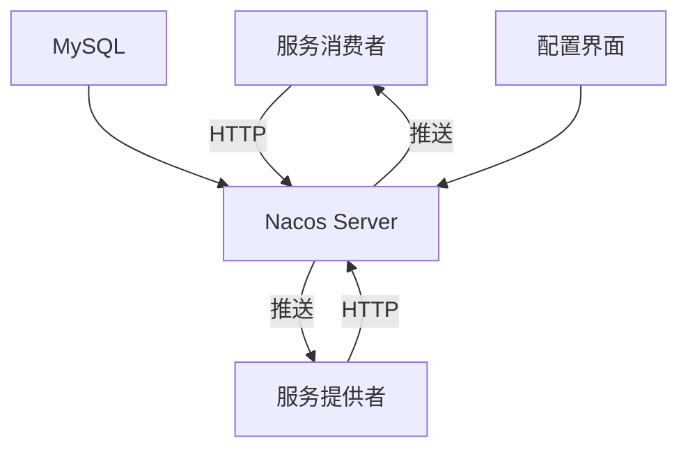
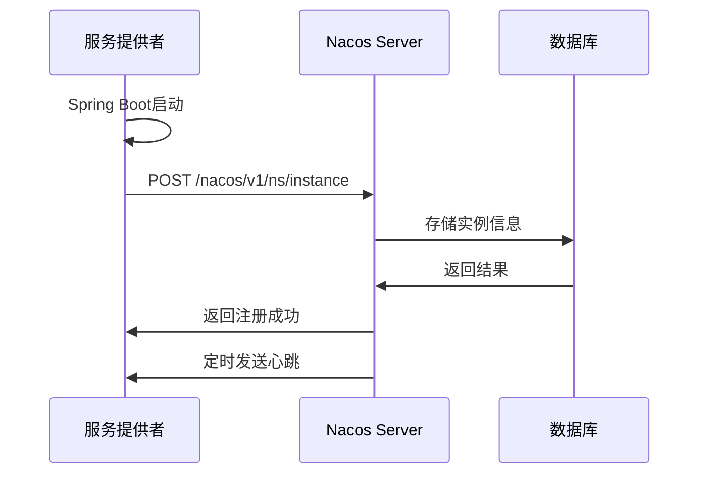

# Nacos 注册中心核心原理与生产环境最佳实践

> 本文为 AI 教育平台系列博客第二篇，讲解 Nacos 注册中心核心原理
> 
> 仓库地址：https://github.com/anomalyco/edu-ai-platform

---

## 一、背景

Nacos 是阿里巴巴开源的动态服务发现、配置管理和服务管理平台，本文深入剖析其核心原理。

---

## 二、Nacos 架构概览



### 2.1 核心概念

| 概念 | 说明 |
|------|------|
| Namespace | 命名空间，用于环境隔离 |
| Group | 分组，同一组服务一起管理 |
| Service | 服务名称 |
| Instance | 服务实例（IP:Port） |
| Cluster | 集群，实例的逻辑分组 |

---

## 三、服务注册原理

### 3.1 注册流程



### 3.2 Spring Cloud Alibaba 集成

```yaml
# edu-user-service/src/main/resources/application.yml
spring:
  cloud:
    nacos:
      discovery:
        server-addr: ${NACOS_SERVER:127.0.0.1:8848}
        namespace: ${NACOS_NAMESPACE:public}
        group: ${NACOS_GROUP:DEFAULT_GROUP}
```

### 3.2 核心注解

```java
@SpringBootApplication
@EnableDiscoveryClient  // 启用服务发现
public class UserServiceApplication {
    public static void main(String[] args) {
        SpringApplication.run(UserServiceApplication.class, args);
    }
}
```

---

## 四、心跳机制与健康检查

### 4.1 心跳类型

| 类型 | 间隔 | 作用 |
|------|------|------|
| 临时实例 | 5秒 | 客户端定时发送心跳 |
| 永久实例 | 不心跳 | 监听服务状态变化 |

### 4.2 健康检查原理

```java
// Nacos 客户端心跳发送
public class BeatReactor {
    public void addBeatInfo(String serviceName, BeatInfo beatInfo) {
        // 定时发送心跳
        executor.schedule(() -> {
            // 发送心跳请求
        }, beatInfo.getPeriod(), TimeUnit.MILLISECONDS);
    }
}
```

### 4.3 实例状态

| 状态 | 说明 |
|------|------|
| UP | 健康 |
| OUT_OF_SERVICE | 下线 |
| UNHEALTHY | 不健康 |
| STARTING | 启动中 |

---

## 五、AP/CP 模式深度对比

### 5.1 CAP 定理

```
一致性(Consistency) ←→ 可用性(Availability)
        ↓
    分区容错(Partition Tolerance) - 必须满足
```

### 5.2 Nacos 模式选择

| 模式 | 协议 | 使用场景 |
|------|------|----------|
| AP模式 | Raft | 服务注册与发现 |
| CP模式 | Distro | 配置管理 |

### 5.3 模式切换

```yaml
# Nacos 配置
nacos:
  raft:
    # true=CP, false=AP
    # 默认AP模式
```

---

## 六、命名空间与分组隔离

### 6.1 命名空间隔离

```
Namespace: public (默认)
├── Group: DEFAULT_GROUP
│   ├── edu-user-service
│   └── edu-course-service
├── Group: DEV_GROUP
│   └── edu-user-service-dev
└── Group: PROD_GROUP
    └── edu-user-service-prod
```

### 6.2 配置示例

```yaml
spring:
  cloud:
    nacos:
      discovery:
        namespace: ${NACOS_NAMESPACE:public}
        group: ${NACOS_GROUP:DEFAULT_GROUP}
```

---

## 七、生产环境最佳实践

### 7.1 集群部署

```yaml
# Nacos 集群配置（nacos.conf）
nacos.inetutils.ip-address=192.168.1.1
nacos.raft.port=9848
nacos.election.port=9849
```

### 7.2 服务元数据

```yaml
spring:
  cloud:
    nacos:
      discovery:
        metadata:
          version: v1.0
          env: dev
          region: bj
```

### 7.3 保护阈值

```java
// 设置保护阈值，避免雪崩
// 当健康实例占比低于阈值时，开启保护
nacos:
  discovery:
    # 保护阈值 0-1
    protect-threshold: 0.5
```

---

## 八、项目代码

### 8.1 服务注册配置

本项目使用 Spring Cloud Alibaba 自动配置机制，无需手动编写 NacosConfig 类。只需在 `pom.xml` 中引入依赖即可：

```xml
<!-- edu-user-service/pom.xml -->
<dependency>
    <groupId>com.alibaba.cloud</groupId>
    <artifactId>spring-cloud-starter-alibaba-nacos-discovery</artifactId>
</dependency>
```

启动类自动启用服务发现：

```java
// edu-user-service/src/main/java/com/edu/user/UserServiceApplication.java
@SpringBootApplication
@EnableDiscoveryClient  // 启用服务发现
@EnableFeignClients     // 启用 Feign 客户端
public class UserServiceApplication {
    public static void main(String[] args) {
        SpringApplication.run(UserServiceApplication.class, args);
    }
}
```

### 8.2 应用配置

```yaml
# edu-user-service/src/main/resources/application.yml
server:
  port: 8081

spring:
  application:
    name: edu-user-service
  cloud:
    nacos:
      discovery:
        server-addr: "127.0.0.1:8848"
        namespace: public
        group: DEFAULT_GROUP
  datasource:
    url: "jdbc:postgresql://localhost:5432/postgresql"
    username: postgresql
    password: mM6hbJXelbGd
    driver-class-name: org.postgresql.Driver
  data:
    redis:
      host: "127.0.0.1"
      port: 6379
      password: ""
      database: 0

mybatis-plus:
  configuration:
    map-underscore-to-camel-case: true
    log-impl: org.apache.ibatis.logging.stdout.StdOutImpl
  global-config:
    db-config:
      id-type: auto
      logic-delete-field: deleted
      logic-delete-value: 1
      logic-not-delete-value: 0

logging:
  level:
    com.edu: debug

jwt:
  secret: edu-ai-platform-secret-key-must-be-at-least-256-bits-long
  expiration: 86400000
```

完整代码见：[edu-user-service](https://github.com/anomalyco/edu-ai-platform/tree/main/edu-user-service)

---

## 九、总结

Nacos 核心原理：
1. **服务注册**：HTTP API 注册实例到 Nacos Server
2. **心跳机制**：定时发送心跳维持实例健康状态
3. **AP/CP双模式**：支持不同一致性需求场景
4. **命名空间隔离**：实现多环境服务隔离

---

**下篇预告**：教育平台 Maven 多模块设计与项目初始化

---

**参考**：
- Nacos 2.3.2 官方文档
- Spring Cloud Alibaba 2023.0.1.2
