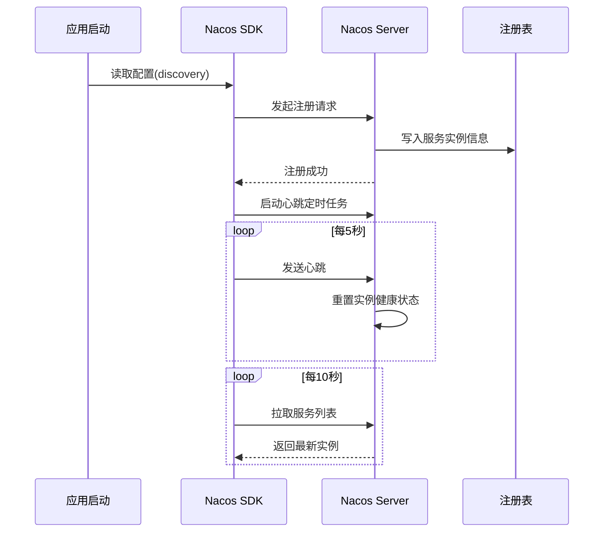
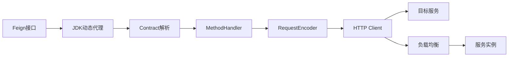
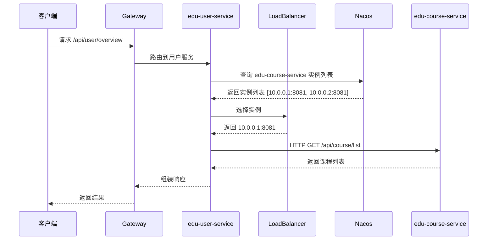

# Spring Boot + Nacos 实现服务注册与调用

> 本文为 AI 教育平台系列博客第四篇，讲解 Spring Boot + Nacos 服务注册与调用实战
> 
> 仓库地址：https://github.com/anomalyco/edu-ai-platform

---

## 一、背景

在微服务架构中，服务注册与调用是核心基础设施。本文基于教育平台项目，详细讲解如何使用 Spring Boot + Nacos + OpenFeign 实现服务注册与远程调用。

---

## 二、Nacos 服务注册

### 2.1 服务注册流程



### 2.2 核心配置

```yaml
# application.yml
spring:
  application:
    name: edu-user-service
  cloud:
    nacos:
      discovery:
        server-addr: 127.0.0.1:8848
        namespace: dev
        group: DEFAULT_GROUP
        metadata:
          version: 1.0.0
          region: cn-shanghai
        heart-beat-interval: 5000
        heart-beat-timeout: 15000
        ip-delete-timeout: 30000
```

### 2.3 @NacosInjected 源码解析

```java
// com.alibaba.nacos.spring.context.annotation.discovery.EnableNacosDiscovery
@Target(ElementType.TYPE)
@Retention(RetentionPolicy.RUNTIME)
@Documented
@Import(NacosDiscoveryBeanDefinitionRegistrar.class)
public @interface EnableNacosDiscovery {
    String[] value();
    String[] properties() default {};
}
```

核心注册逻辑：

```java
public class NacosDiscoveryBeanDefinitionRegistrar 
        implements ImportBeanDefinitionRegistrar, EnvironmentAware {
    
    @Override
    public void registerBeanDefinitions(
            AnnotationMetadata importingClassMetadata,
            BeanDefinitionRegistry registry) {
        
        // 1. 解析 @EnableNacosDiscovery 注解属性
        AnnotationAttributes attributes = AnnotationAttributes.fromMap(
                importingClassMetadata.getAnnotationAttributes(
                        EnableNacosDiscovery.class.getName()));
        
        // 2. 注册 NamingService Bean
        registerNacosNamingService(attributes, registry);
        
        // 3. 注册服务注册监听器
        registerServiceRegistryListener(registry);
    }
}
```

### 2.4 服务注册核心代码

```java
// com.alibaba.nacos.client.naming.NacosNamingService
public void registerInstance(String serviceName, String groupName, 
                             Instance instance) throws NacosException {
    // 1. 构建注册实例
    String groupedServiceName = NamingUtils.getGroupedName(serviceName, groupName);
    
    // 2. 如果实例是临时的，启用心跳
    if (instance.isEphemeral()) {
        BeatInfo beatInfo = new BeatInfo();
        beatInfo.setServiceName(groupedServiceName);
        beatInfo.setIp(instance.getIp());
        beatInfo.setPort(instance.getPort());
        beatInfo.setPeriod(instance.getInstanceHeartBeatInterval());
        
        // 3. 启动心跳定时任务
        beatReactor.addBeatInfo(groupedServiceName, beatInfo);
    }
    
    // 4. 发送注册请求到 Nacos Server
    serverProxy.registerService(groupedServiceName, groupName, instance);
}
```

---

## 三、OpenFeign 服务调用

### 3.1 OpenFeign 核心原理



### 3.2 Feign 客户端定义

```java
// edu-user-service/src/main/java/.../feign/CourseFeignClient.java
@FeignClient(
    name = "edu-course-service",
    path = "/api/course",
    configuration = FeignConfig.class,
    fallbackFactory = CourseFeignClientFallbackFactory.class
)
public interface CourseFeignClient {
    
    @GetMapping("/{courseId}")
    Result<CourseVO> getCourseById(@PathVariable("courseId") Long courseId);
    
    @GetMapping("/list")
    Result<List<CourseVO>> listCourses(
            @RequestParam("page") int page,
            @RequestParam("size") int size);
    
    @PostMapping("/enroll")
    Result<Void> enrollCourse(@RequestBody EnrollRequest request);
}
```

### 3.3 Feign 配置

```java
// edu-user-service/src/main/java/.../config/FeignConfig.java
@Configuration
public class FeignConfig {
    
    @Bean
    public RequestInterceptor requestInterceptor() {
        return requestTemplate -> {
            // 传递 TraceId
            String traceId = MDC.get("traceId");
            if (StringUtils.hasText(traceId)) {
                requestTemplate.header("X-Trace-Id", traceId);
            }
            
            // 传递用户上下文
            ServletRequestAttributes attrs = 
                    (ServletRequestAttributes) RequestContextHolder.getRequestAttributes();
            if (attrs != null) {
                String token = attrs.getRequest().getHeader("Authorization");
                if (StringUtils.hasText(token)) {
                    requestTemplate.header("Authorization", token);
                }
            }
        };
    }
    
    @Bean
    public Retryer retryer() {
        // 重试策略：最多3次，间隔100ms
        return new Retryer.Default(100, 1000, 3);
    }
    
    @Bean
    public Logger.Level feignLoggerLevel() {
        return Logger.Level.FULL;
    }
}
```

### 3.4 Fallback 降级处理

```java
// edu-user-service/src/main/java/.../feign/CourseFeignClientFallbackFactory.java
@Component
public class CourseFeignClientFallbackFactory 
        implements FallbackFactory<CourseFeignClient> {
    
    @Override
    public CourseFeignClient create(Throwable cause) {
        log.error("edu-course-service 调用失败: {}", cause.getMessage(), cause);
        
        return new CourseFeignClient() {
            @Override
            public Result<CourseVO> getCourseById(Long courseId) {
                return Result.fail("课程服务暂时不可用，请稍后重试");
            }
            
            @Override
            public Result<List<CourseVO>> listCourses(int page, int size) {
                return Result.fail("课程服务暂时不可用");
            }
            
            @Override
            public Result<Void> enrollCourse(EnrollRequest request) {
                return Result.fail("课程服务暂时不可用");
            }
        };
    }
}
```

### 3.5 启用 Feign

```java
// edu-user-service/src/main/java/.../UserServiceApplication.java
@SpringBootApplication
@EnableDiscoveryClient
@EnableFeignClients(basePackages = "com.edu.user.feign")
public class UserServiceApplication {
    public static void main(String[] args) {
        SpringApplication.run(UserServiceApplication.class, args);
    }
}
```

---

## 四、负载均衡策略

### 4.1 Spring Cloud LoadBalancer

Spring Cloud 2020.0.0 之后移除了 Ribbon，改用 Spring Cloud LoadBalancer。

```java
// edu-user-service/src/main/java/.../config/LoadBalancerConfig.java
@Configuration
public class LoadBalancerConfig {
    
    @Bean
    @LoadBalancerClient(name = "edu-course-service", configuration = CourseServiceLBConfig.class)
    public ReactorLoadBalancer<ServiceInstance> courseServiceLoadBalancer(
            Environment environment, LoadBalancerClientFactory factory) {
        String name = "edu-course-service";
        return new RoundRobinLoadBalancer(
                factory.getLazyProvider(name, ServiceInstanceListSupplier.class), 
                name);
    }
}
```

### 4.2 负载均衡策略对比

| 策略 | 适用场景 | 优点 | 缺点 |
|------|----------|------|------|
| **轮询(Round Robin)** | 实例性能相近 | 简单、公平 | 不考虑实例负载差异 |
| **随机(Random)** | 实例数量多 | 实现简单 | 可能分布不均 |
| **权重(Weighted)** | 实例性能不同 | 灵活、可调节 | 配置复杂 |
| **最少连接(Least Connection)** | 长连接场景 | 负载更均衡 | 实现复杂 |
| **一致性哈希(Consistent Hash)** | 缓存场景 | 相同请求路由到同一实例 | 实例变化时缓存失效 |

### 4.3 自定义负载均衡策略

```java
// edu-user-service/src/main/java/.../lb/WeightedResponseTimeLoadBalancer.java
public class WeightedResponseTimeLoadBalancer 
        extends RoundRobinLoadBalancer {
    
    private final ObjectProvider<ServiceInstanceListSupplier> supplierProvider;
    private final String serviceId;
    private final Map<String, Double> weights = new ConcurrentHashMap<>();
    
    public WeightedResponseTimeLoadBalancer(
            ObjectProvider<ServiceInstanceListSupplier> supplierProvider,
            String serviceId) {
        super(supplierProvider, serviceId);
        this.supplierProvider = supplierProvider;
        this.serviceId = serviceId;
    }
    
    @Override
    public Response<ServiceInstance> choose(Request request) {
        ServiceInstanceListSupplier supplier = supplierProvider.getIfAvailable();
        if (supplier == null) {
            return super.choose(request);
        }
        
        List<ServiceInstance> instances = supplier.get().blockFirst();
        if (CollectionUtils.isEmpty(instances)) {
            return super.choose(request);
        }
        
        // 基于响应时间计算权重
        return chooseByWeight(instances);
    }
    
    private Response<ServiceInstance> chooseByWeight(List<ServiceInstance> instances) {
        double totalWeight = weights.values().stream()
                .mapToDouble(Double::doubleValue).sum();
        
        double random = Math.random() * totalWeight;
        double currentWeight = 0;
        
        for (ServiceInstance instance : instances) {
            currentWeight += weights.getOrDefault(
                    instance.getInstanceId(), 1.0);
            if (random <= currentWeight) {
                return new DefaultResponse(instance);
            }
        }
        
        return new DefaultResponse(instances.get(0));
    }
}
```

---

## 五、服务调用完整示例

### 5.1 用户服务调用课程服务

```java
// edu-user-service/src/main/java/.../service/UserCourseService.java
@Service
@Slf4j
public class UserCourseService {
    
    private final CourseFeignClient courseFeignClient;
    private final ExamFeignClient examFeignClient;
    
    public UserCourseService(CourseFeignClient courseFeignClient,
                             ExamFeignClient examFeignClient) {
        this.courseFeignClient = courseFeignClient;
        this.examFeignClient = examFeignClient;
    }
    
    /**
     * 获取用户学习概览
     */
    public LearningOverviewVO getLearningOverview(Long userId) {
        // 1. 并行调用多个服务
        CompletableFuture<Result<List<CourseVO>>> coursesFuture = 
                CompletableFuture.supplyAsync(() -> 
                        courseFeignClient.listCourses(1, 10));
        
        CompletableFuture<Result<List<ExamVO>>> examsFuture = 
                CompletableFuture.supplyAsync(() -> 
                        examFeignClient.listUserExams(userId));
        
        // 2. 等待结果并组装
        CompletableFuture.allOf(coursesFuture, examsFuture).join();
        
        LearningOverviewVO overview = new LearningOverviewVO();
        overview.setCourses(coursesFuture.join().getData());
        overview.setExams(examsFuture.join().getData());
        
        return overview;
    }
    
    /**
     * 选课
     */
    @Transactional
    public void enrollCourse(Long userId, EnrollRequest request) {
        // 调用课程服务
        Result<Void> result = courseFeignClient.enrollCourse(request);
        if (!result.isSuccess()) {
            throw new BusinessException("选课失败: " + result.getMessage());
        }
        
        // 记录用户行为
        log.info("用户 {} 选课成功: {}", userId, request.getCourseId());
    }
}
```

### 5.2 统一响应封装

```java
// edu-user-service/src/main/java/.../common/Result.java
@Data
public class Result<T> implements Serializable {
    
    private int code;
    private String message;
    private T data;
    private long timestamp;
    
    public static <T> Result<T> success(T data) {
        Result<T> result = new Result<>();
        result.setCode(200);
        result.setMessage("success");
        result.setData(data);
        result.setTimestamp(System.currentTimeMillis());
        return result;
    }
    
    public static <T> Result<T> fail(String message) {
        Result<T> result = new Result<>();
        result.setCode(500);
        result.setMessage(message);
        result.setTimestamp(System.currentTimeMillis());
        return result;
    }
}
```

---

## 六、服务发现与调用流程

### 6.1 完整调用链路



### 6.2 服务实例健康检查

```java
// edu-user-service/src/main/java/.../config/HealthCheckConfig.java
@Configuration
public class HealthCheckConfig {
    
    @Bean
    public RestTemplate restTemplate() {
        return new RestTemplateBuilder()
                .setConnectTimeout(Duration.ofSeconds(3))
                .setReadTimeout(Duration.ofSeconds(5))
                .build();
    }
    
    @Scheduled(fixedRate = 30000)
    public void checkServiceHealth() {
        // 定期检查下游服务健康状态
        List<String> services = discoveryClient.getServices();
        for (String service : services) {
            List<ServiceInstance> instances = 
                    discoveryClient.getInstances(service);
            for (ServiceInstance instance : instances) {
                try {
                    String url = instance.getUri() + "/actuator/health";
                    ResponseEntity<String> response = 
                            restTemplate.getForEntity(url, String.class);
                    log.info("服务 {} 实例 {} 健康检查: {}", 
                            service, instance.getUri(), response.getStatusCode());
                } catch (Exception e) {
                    log.warn("服务 {} 实例 {} 健康检查失败: {}", 
                            service, instance.getUri(), e.getMessage());
                }
            }
        }
    }
}
```

---

## 七、最佳实践

### 7.1 服务调用超时配置

```yaml
spring:
  cloud:
    openfeign:
      client:
        config:
          default:
            connect-timeout: 3000
            read-timeout: 10000
          edu-course-service:
            connect-timeout: 5000
            read-timeout: 15000
```

### 7.2 服务调用链路追踪

```java
// edu-user-service/src/main/java/.../interceptor/TraceInterceptor.java
@Component
public class TraceInterceptor implements ClientHttpRequestInterceptor {
    
    @Override
    public ClientHttpResponse intercept(HttpRequest request, byte[] body,
            ClientHttpRequestExecution execution) throws IOException {
        
        String traceId = MDC.get("traceId");
        if (StringUtils.hasText(traceId)) {
            request.getHeaders().add("X-Trace-Id", traceId);
        }
        
        return execution.execute(request, body);
    }
}
```

### 7.3 服务调用监控

```java
// edu-user-service/src/main/java/.../monitor/FeignMetrics.java
@Component
public class FeignMetrics {
    
    private final MeterRegistry meterRegistry;
    
    public FeignMetrics(MeterRegistry meterRegistry) {
        this.meterRegistry = meterRegistry;
    }
    
    public void recordFeignCall(String serviceName, long duration, boolean success) {
        Timer.builder("feign.client.call.duration")
                .tag("service", serviceName)
                .tag("status", success ? "success" : "failure")
                .register(meterRegistry)
                .record(Duration.ofMillis(duration));
    }
}
```

---

## 八、项目代码

完整代码见：
- [edu-user-service](https://github.com/anomalyco/edu-ai-platform/tree/main/edu-user-service)
- [edu-user-service/feign](https://github.com/anomalyco/edu-ai-platform/tree/main/edu-user-service/src/main/java/com/edu/user/feign)
- [edu-user-service/config](https://github.com/anomalyco/edu-ai-platform/tree/main/edu-user-service/src/main/java/com/edu/user/config)

---

## 九、总结

Spring Boot + Nacos 服务注册与调用核心：
1. **服务注册**：应用启动时自动注册到 Nacos，定时发送心跳
2. **服务发现**：通过 Nacos 获取服务实例列表
3. **OpenFeign**：声明式 HTTP 客户端，简化服务调用
4. **负载均衡**：Spring Cloud LoadBalancer 实现实例选择
5. **降级处理**：Fallback 机制保证服务可用性

---

**上篇回顾**：Maven 多模块设计与项目初始化
**下篇预告**：Spring Cloud Gateway 核心原理与源码深度解析

---

**参考**：
- Nacos 2.x 官方文档
- Spring Cloud OpenFeign 官方文档
- Spring Cloud LoadBalancer 官方文档
