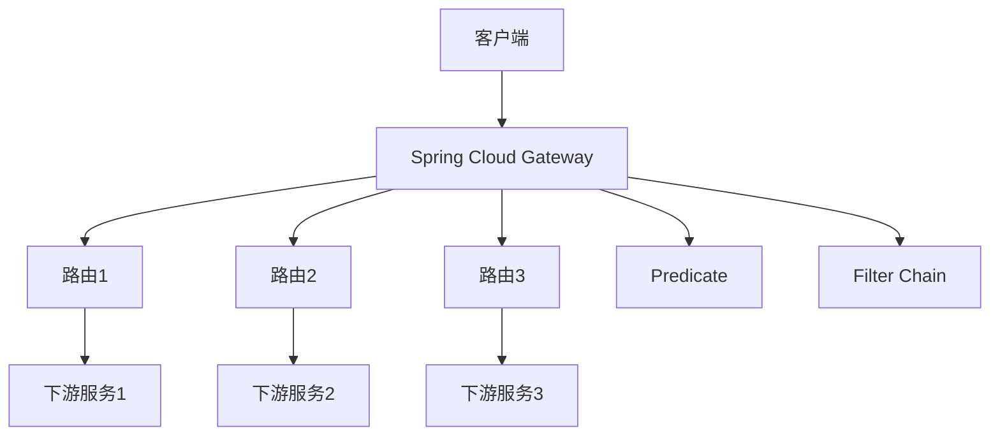
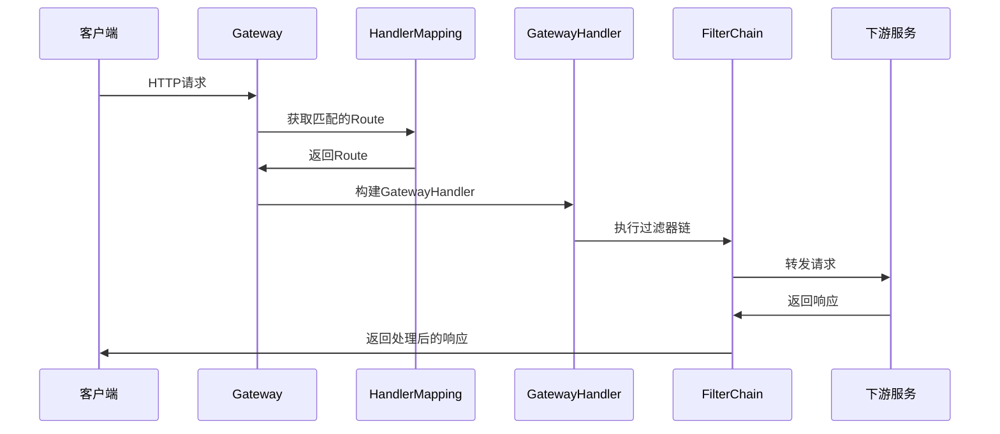

# Spring Cloud Gateway 核心原理与源码深度解析

> 本文为 AI 教育平台系列博客第五篇，讲解 Spring Cloud Gateway 核心原理
> 
> 仓库地址：https://github.com/anomalyco/edu-ai-platform

---

## 一、背景

Spring Cloud Gateway 是 Spring Cloud 生态中的 API 网关，本文深入剖析其核心原理。

---

## 二、Gateway 架构



### 2.1 核心概念

| 概念 | 说明 |
|------|------|
| Route | 路由定义，包括ID、URI、Predicate、Filter |
| Predicate | 谓词，用于匹配请求 |
| Filter | 过滤器，用于处理请求/响应 |
| GatewayHandlerMapping | 路由映射处理器 |
| GatewayFilterChain | 过滤器链执行器 |

---

## 三、工作原理

### 3.1 请求处理流程



### 3.2 核心组件

```java
// Gateway 自动配置
@Configuration
@EnableConfigurationProperties(GatewayProperties.class)
@ConditionalOnProperty(name = "spring.cloud.gateway.enabled", matchIfMissing = true)
public class GatewayAutoConfiguration {
    
    @Bean
    public RouteLocator routeLocator(
            RouteLocatorBuilder builder,
            GatewayProperties properties) {
        return builder.routes().build();
    }
    
    @Bean
    public GlobalFilter globalFilter() {
        return new CombinedGlobalFilter();
    }
}
```

---

## 四、路由配置

### 4.1 配置文件方式

```yaml
spring:
  cloud:
    gateway:
      routes:
        - id: edu-user-service
          uri: lb://edu-user-service
          predicates:
            - Path=/api/user/**
          filters:
            - StripPrefix=1
        - id: edu-course-service
          uri: lb://edu-course-service
          predicates:
            - Path=/api/course/**
          filters:
            - StripPrefix=1
```

### 4.2 Java Config 方式

```java
@Configuration
public class RouteConfig {
    
    @Bean
    public RouteLocator customRouteLocator(RouteLocatorBuilder builder) {
        return builder.routes()
                .route("edu-user-service", r -> r
                        .path("/user/**")
                        .filters(f -> f.stripPrefix(1))
                        .uri("lb://edu-user-service"))
                .route("edu-course-service", r -> r
                        .path("/course/**")
                        .filters(f -> f.stripPrefix(1))
                        .uri("lb://edu-course-service"))
                .build();
    }
}
```

### 4.3 Nacos 动态路由

```yaml
# Nacos 配置中心配置
spring:
  cloud:
    gateway:
      routes: ${routes_from_nacos}
```

---

## 五、Predicate 谓词

### 5.1 内置 Predicate

| 类型 | 示例 | 说明 |
|------|------|------|
| Path | `- Path=/api/**` | 路径匹配 |
| Method | `- Method=GET,POST` | 请求方法 |
| Header | `- Header=X-Request-Id, \d+` | 请求头 |
| Query | `- Query=username` | 查询参数 |
| Host | `- Host=edu-ai-platform.com` | 主机名 |
| Cookie | `- Cookie=session,.*` | Cookie |
| After | `- After=2024-01-01T00:00:00.000Z` | 时间之后 |
| Before | `- Before=2025-01-01T00:00:00.000Z` | 时间之前 |

### 5.2 自定义 Predicate

```java
@Component
public class CustomRoutePredicateFactory 
        extends AbstractRoutePredicateFactory<CustomRoutePredicateFactory.Config> {
    
    public CustomRoutePredicateFactory() {
        super(Config.class);
    }
    
    @Override
    public Predicate<ServerWebExchange> apply(Config config) {
        return exchange -> {
            // 自定义匹配逻辑
            return true;
        };
    }
    
    public static class Config {
        private String parameter;
    }
}
```

---

## 六、Filter 过滤器

### 6.1 内置 Filter

| 过滤器 | 说明 | 示例 |
|--------|------|------|
| StripPrefix | 去除路径前缀 | `- StripPrefix=1` |
| AddRequestHeader | 添加请求头 | `- AddRequestHeader=X-Request-Id,123` |
| AddResponseHeader | 添加响应头 | `- AddResponseHeader=X-Response-Time,${totalTime}` |
| PrefixPath | 添加路径前缀 | `- PrefixPath=/api` |
| RedirectTo | 重定向 | `- RedirectTo=302,https://example.com` |
| RemoveRequestParameter | 移除参数 | `- RemoveRequestParameter=token` |

### 6.2 自定义 GlobalFilter

```java
@Component
public class JwtAuthFilter implements GlobalFilter, Ordered {
    
    @Override
    public Mono<Void> filter(ServerWebExchange exchange, GatewayFilterChain chain) {
        // 获取Token
        String authHeader = exchange.getRequest()
                .getHeaders().getFirst("Authorization");
        
        if (!StringUtils.hasText(authHeader)) {
            // 未授权
            exchange.getResponse().setStatusCode(HttpStatus.UNAUTHORIZED);
            return exchange.getResponse().setComplete();
        }
        
        // 验证Token
        // ...
        
        // 传递给下游服务
        ServerHttpRequest mutatedRequest = exchange.getRequest().mutate()
                .header("X-User-Id", userId)
                .build();
        
        return chain.filter(exchange.mutate().request(mutatedRequest).build());
    }
    
    @Override
    public int getOrder() {
        return -100; // 优先级
    }
}
```

---

## 七、JWT 鉴权实现

### 7.1 白名单配置

```java
private static final List<String> WHITE_LIST = Arrays.asList(
    "/user/login",
    "/user/register",
    "/actuator/**"
);
```

### 7.2 Token 验证

```java
SecretKey key = Keys.hmacShaKeyFor(secret.getBytes(StandardCharsets.UTF_8));
Claims claims = Jwts.parser()
        .verifyWith(key)
        .build()
        .parseSignedClaims(token)
        .getPayload();

String userId = claims.getSubject();
```

### 7.3 传递给下游服务

```java
ServerHttpRequest mutatedRequest = request.mutate()
        .header("X-User-Id", userId)
        .header("X-User-Name", username)
        .build();
```

---

## 八、项目代码

### 8.1 JWT 鉴权过滤器

```java
// edu-gateway/src/main/java/.../filter/JwtAuthFilter.java
@Component
public class JwtAuthFilter implements GlobalFilter, Ordered {
    // JWT验证逻辑
}
```

### 8.2 路由配置

```java
// edu-gateway/src/main/java/.../route/RouteConfig.java
@Configuration
public class RouteConfig {
    @Bean
    public RouteLocator customRouteLocator(RouteLocatorBuilder builder) {
        // 路由定义
    }
}
```

完整代码见：[edu-gateway](https://github.com/anomalyco/edu-ai-platform/tree/main/edu-gateway)

---

## 九、最佳实践

### 9.1 路由优先级

- 路由顺序：按配置顺序匹配
- 建议：将精确路由放在前面

### 9.2 超时配置

```yaml
spring:
  cloud:
    gateway:
      httpclient:
        response-timeout: 30s
        connect-timeout: 5000
```

### 9.3 限流配置

```yaml
spring:
  cloud:
    gateway:
      routes:
        - id: limited-route
          uri: lb://service
          filters:
            - name: RequestRateLimiter
              args:
                redis-rate-limiter.replenishRate: 10
                redis-rate-limiter.burst-capacity: 20
```

---

## 十、总结

Spring Cloud Gateway 核心原理：
1. **路由机制**：RouteLocator 加载路由配置
2. **Predicate匹配**：请求匹配路由条件
3. **Filter链**：Pre/Post 两阶段过滤
4. **响应式编程**：WebFlux 异步非阻塞

---

**下篇预告**：Gateway + Nacos 深度集成实战

---

**参考**：
- Spring Cloud Gateway 4.x 官方文档
- Spring Cloud Alibaba 2023.0.1.2
