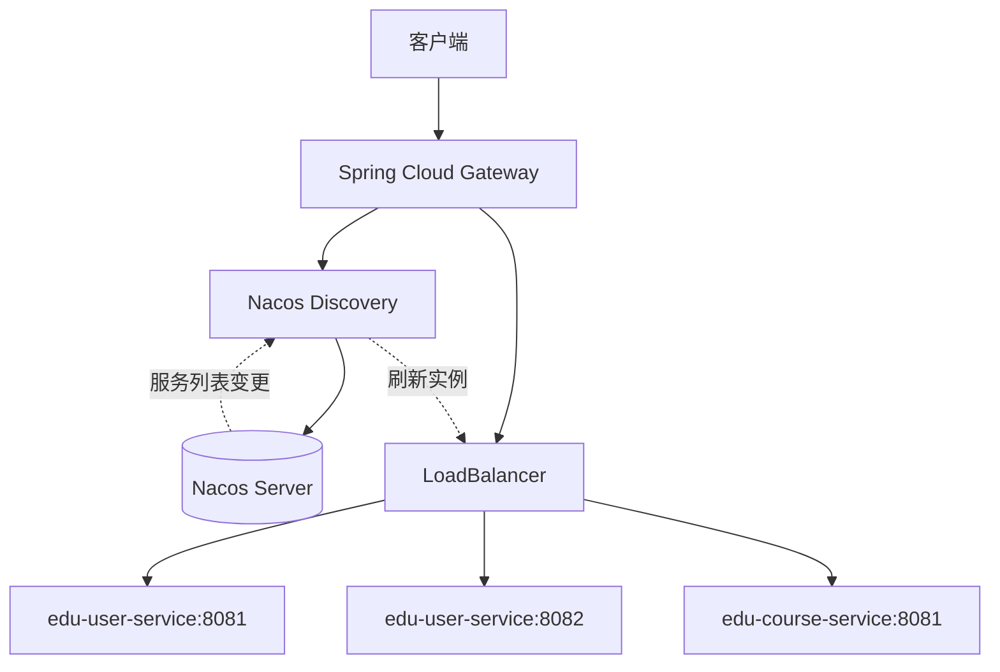
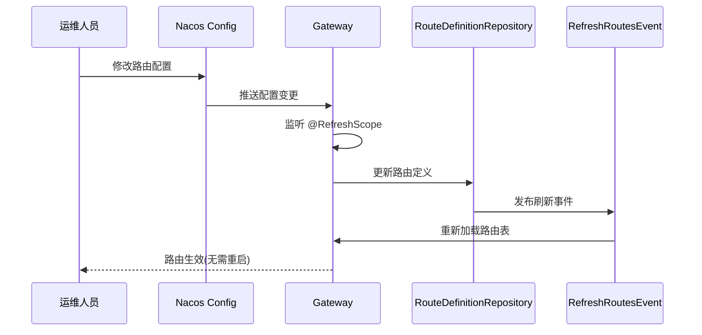

# Spring Cloud Gateway + Nacos 深度集成实战

> 本文为 AI 教育平台系列博客第六篇，讲解 Gateway 与 Nacos 深度集成实战
> 
> 仓库地址：https://github.com/anomalyco/edu-ai-platform

---

## 一、背景

在微服务架构中，网关是流量的第一入口。静态路由配置无法满足动态扩缩容、灰度发布等生产需求。本文将 Spring Cloud Gateway 与 Nacos 深度集成，实现服务发现路由、动态路由推送、权重路由、限流与 Sentinel 整合。

---

## 二、服务发现路由

### 2.1 架构设计



### 2.2 核心依赖

```xml
<!-- edu-gateway/pom.xml -->
<dependencies>
    <!-- Gateway 核心 -->
    <dependency>
        <groupId>org.springframework.cloud</groupId>
        <artifactId>spring-cloud-starter-gateway</artifactId>
    </dependency>
    
    <!-- Nacos 服务发现 -->
    <dependency>
        <groupId>com.alibaba.cloud</groupId>
        <artifactId>spring-cloud-starter-alibaba-nacos-discovery</artifactId>
    </dependency>
    
    <!-- Nacos 配置中心 -->
    <dependency>
        <groupId>com.alibaba.cloud</groupId>
        <artifactId>spring-cloud-starter-alibaba-nacos-config</artifactId>
    </dependency>
    
    <!-- LoadBalancer 负载均衡 -->
    <dependency>
        <groupId>org.springframework.cloud</groupId>
        <artifactId>spring-cloud-starter-loadbalancer</artifactId>
    </dependency>
    
    <!-- Sentinel 网关流控 -->
    <dependency>
        <groupId>com.alibaba.cloud</groupId>
        <artifactId>spring-cloud-alibaba-sentinel-gateway</artifactId>
    </dependency>
    
    <dependency>
        <groupId>com.alibaba.cloud</groupId>
        <artifactId>spring-cloud-starter-alibaba-sentinel</artifactId>
    </dependency>
</dependencies>
```

### 2.3 服务发现路由配置

```yaml
# edu-gateway/src/main/resources/application.yml
spring:
  application:
    name: edu-gateway
  cloud:
    nacos:
      discovery:
        server-addr: 127.0.0.1:8848
        namespace: dev
        group: DEFAULT_GROUP
      config:
        server-addr: 127.0.0.1:8848
        namespace: dev
        group: DEFAULT_GROUP
        file-extension: yaml
    gateway:
      discovery:
        locator:
          enabled: true          # 开启服务发现
          lower-case-service-id: true  # 服务名小写
      routes:
        - id: edu-user-service
          uri: lb://edu-user-service    # lb:// 协议启用负载均衡
          predicates:
            - Path=/api/user/**
          filters:
            - StripPrefix=1
        - id: edu-course-service
          uri: lb://edu-course-service
          predicates:
            - Path=/api/course/**
          filters:
            - StripPrefix=1
        - id: edu-exam-service
          uri: lb://edu-exam-service
          predicates:
            - Path=/api/exam/**
          filters:
            - StripPrefix=1
```

### 2.4 lb:// 协议工作原理

```java
// org.springframework.cloud.gateway.filter.RouteToRequestUrlFilter
public class RouteToRequestUrlFilter implements GlobalFilter, Ordered {
    
    @Override
    public Mono<Void> filter(ServerWebExchange exchange, GatewayFilterChain chain) {
        Route route = exchange.getAttribute(GATEWAY_ROUTE_ATTR);
        if (route == null) {
            return chain.filter(exchange);
        }
        
        URI uri = exchange.getRequest().getURI();
        String schemePrefix = route.getUri().getScheme();
        
        // 判断是否为 lb:// 协议
        if ("lb".equalsIgnoreCase(schemePrefix)) {
            // 1. 提取服务名
            String serviceId = route.getUri().getHost();
            
            // 2. 通过 LoadBalancer 选择实例
            // 3. 替换 URI 为实际实例地址
            // 4. 传递给下游服务
        }
        
        return chain.filter(exchange);
    }
}
```

---

## 三、动态路由

### 3.1 动态路由架构



### 3.2 Nacos 配置中心路由定义

在 Nacos 控制台创建配置：

- **Data ID**: `edu-gateway-routes.yaml`
- **Group**: `DEFAULT_GROUP`
- **配置格式**: YAML

```yaml
# Nacos 配置内容
spring:
  cloud:
    gateway:
      routes:
        - id: edu-user-service
          uri: lb://edu-user-service
          predicates:
            - Path=/api/user/**
          filters:
            - StripPrefix=1
            - name: RequestRateLimiter
              args:
                redis-rate-limiter.replenishRate: 10
                redis-rate-limiter.burstCapacity: 20
        - id: edu-course-service
          uri: lb://edu-course-service
          predicates:
            - Path=/api/course/**
          filters:
            - StripPrefix=1
        - id: edu-homework-service
          uri: lb://edu-homework-service
          predicates:
            - Path=/api/homework/**
          filters:
            - StripPrefix=1
```

### 3.3 动态路由监听器

```java
// edu-gateway/src/main/java/.../config/DynamicRouteConfig.java
@Configuration
@RefreshScope
public class DynamicRouteConfig {
    
    @Autowired
    private RouteDefinitionWriter routeDefinitionWriter;
    
    @Autowired
    private ApplicationEventPublisher publisher;
    
    /**
     * 从 Nacos 加载路由配置
     */
    @NacosValue(value = "${spring.cloud.gateway.routes:[]}", autoRefreshed = true)
    private String routesConfig;
    
    /**
     * 监听路由配置变化并动态更新
     */
    @NacosConfigListener(dataId = "edu-gateway-routes.yaml", groupId = "DEFAULT_GROUP")
    public void onRouteConfigChanged(String newConfig) {
        log.info("路由配置变更，开始更新路由表");
        updateRoutes(newConfig);
    }
    
    private void updateRoutes(String config) {
        try {
            List<RouteDefinition> newRoutes = parseRoutes(config);
            
            // 1. 清除旧路由
            routeDefinitionWriter.getRouteDefinitions()
                    .collectList()
                    .block()
                    .forEach(route -> {
                        routeDefinitionWriter.delete(Mono.just(route.getId())).block();
                    });
            
            // 2. 写入新路由
            newRoutes.forEach(route -> {
                routeDefinitionWriter.save(Mono.just(route)).block();
            });
            
            // 3. 发布刷新事件
            publisher.publishEvent(new RefreshRoutesEvent(this));
            
            log.info("路由表更新完成，共 {} 条路由", newRoutes.size());
        } catch (Exception e) {
            log.error("路由配置更新失败", e);
        }
    }
    
    private List<RouteDefinition> parseRoutes(String config) {
        // 解析 YAML/JSON 配置为 RouteDefinition 列表
        ObjectMapper mapper = new ObjectMapper(new YAMLFactory());
        return mapper.readValue(config, new TypeReference<List<RouteDefinition>>() {});
    }
}
```

### 3.4 自定义路由定义仓库

```java
// edu-gateway/src/main/java/.../repository/NacosRouteDefinitionRepository.java
@Component
public class NacosRouteDefinitionRepository implements RouteDefinitionRepository {
    
    private final Map<String, RouteDefinition> routes = new ConcurrentHashMap<>();
    
    @Override
    public Flux<RouteDefinition> getRouteDefinitions() {
        return Flux.fromIterable(routes.values());
    }
    
    @Override
    public Mono<Void> save(Mono<RouteDefinition> route) {
        return route.flatMap(r -> {
            routes.put(r.getId(), r);
            log.info("保存路由: {}", r.getId());
            return Mono.empty();
        });
    }
    
    @Override
    public Mono<Void> delete(Mono<String> routeId) {
        return routeId.flatMap(id -> {
            routes.remove(id);
            log.info("删除路由: {}", id);
            return Mono.empty();
        });
    }
    
    /**
     * 批量更新路由
     */
    public void updateRoutes(List<RouteDefinition> newRoutes) {
        // 清除不在新列表中的路由
        Set<String> newIds = newRoutes.stream()
                .map(RouteDefinition::getId)
                .collect(Collectors.toSet());
        
        routes.keySet().removeIf(id -> !newIds.contains(id));
        
        // 更新或新增路由
        newRoutes.forEach(route -> routes.put(route.getId(), route));
    }
}
```

---

## 四、权重路由与灰度发布

### 4.1 权重路由配置

```yaml
spring:
  cloud:
    gateway:
      routes:
        # 主版本 80% 流量
        - id: edu-user-service-v1
          uri: lb://edu-user-service
          predicates:
            - Path=/api/user/**
            - Weight=service-group, 80
          filters:
            - StripPrefix=1
        
        # 灰度版本 20% 流量
        - id: edu-user-service-v2
          uri: lb://edu-user-service
          predicates:
            - Path=/api/user/**
            - Weight=service-group, 20
          filters:
            - StripPrefix=1
            - AddRequestHeader=X-Gray-Version, true
```

### 4.2 Weight Route Predicate Factory 原理

```java
// org.springframework.cloud.gateway.handler.predicate.WeightRoutePredicateFactory
public class WeightRoutePredicateFactory 
        extends AbstractRoutePredicateFactory<WeightRoutePredicateFactory.Config> {
    
    @Override
    public Predicate<ServerWebExchange> apply(Config config) {
        return exchange -> {
            String group = config.getGroup();
            int weight = config.getWeight();
            
            // 1. 从权重计算器中获取当前分组的路由权重
            // 2. 生成随机数判断是否命中
            // 3. 将选择结果存入 exchange 属性
            exchange.getAttributes().put(
                    WEIGHT_ATTR_PREFIX + group, chosenRouteId);
            
            return true;
        };
    }
    
    public static class Config {
        private String group;   // 权重分组
        private int weight;     // 权重值 (0-100)
    }
}
```

### 4.3 基于 Header 的灰度路由

```java
// edu-gateway/src/main/java/.../predicate/GrayRoutePredicateFactory.java
@Component
public class GrayRoutePredicateFactory 
        extends AbstractRoutePredicateFactory<GrayRoutePredicateFactory.Config> {
    
    public GrayRoutePredicateFactory() {
        super(Config.class);
    }
    
    @Override
    public Predicate<ServerWebExchange> apply(Config config) {
        return exchange -> {
            String grayHeader = exchange.getRequest()
                    .getHeaders().getFirst(config.getHeaderName());
            
            // 灰度用户走灰度路由
            if (config.getHeaderValue().equals(grayHeader)) {
                return true;
            }
            
            // 基于用户 ID 的百分比灰度
            String userId = exchange.getRequest()
                    .getHeaders().getFirst("X-User-Id");
            if (StringUtils.hasText(userId) && config.getPercentage() > 0) {
                long hash = Math.abs(userId.hashCode());
                return (hash % 100) < config.getPercentage();
            }
            
            return false;
        };
    }
    
    public static class Config {
        private String headerName = "X-Gray-User";
        private String headerValue = "true";
        private int percentage = 0;  // 百分比灰度
    }
}
```

---

## 五、网关限流

### 5.1 基于 Redis 的令牌桶限流

```yaml
spring:
  cloud:
    gateway:
      routes:
        - id: edu-user-service
          uri: lb://edu-user-service
          predicates:
            - Path=/api/user/**
          filters:
            - name: RequestRateLimiter
              args:
                # 令牌桶每秒填充速率
                redis-rate-limiter.replenishRate: 10
                # 令牌桶容量上限
                redis-rate-limiter.burstCapacity: 20
                # 每次请求消耗的令牌数
                redis-rate-limiter.requestedTokens: 1
                # 限流 Key 解析器
                key-resolver: "#{@ipKeyResolver}"
```

### 5.2 限流 Key 解析器

```java
// edu-gateway/src/main/java/.../config/RateLimiterConfig.java
@Configuration
public class RateLimiterConfig {
    
    /**
     * 基于 IP 限流
     */
    @Bean
    public KeyResolver ipKeyResolver() {
        return exchange -> {
            String ip = exchange.getRequest()
                    .getRemoteAddress()
                    .getAddress()
                    .getHostAddress();
            return Mono.just("ip:" + ip);
        };
    }
    
    /**
     * 基于用户 ID 限流
     */
    @Bean
    public KeyResolver userKeyResolver() {
        return exchange -> {
            String userId = exchange.getRequest()
                    .getHeaders().getFirst("X-User-Id");
            return Mono.just(StringUtils.hasText(userId) 
                    ? "user:" + userId 
                    : "anonymous");
        };
    }
    
    /**
     * 基于接口路径限流
     */
    @Bean
    public KeyResolver pathKeyResolver() {
        return exchange -> Mono.just(
                exchange.getRequest().getPath().value());
    }
}
```

### 5.3 Redis 限流 Lua 脚本原理

```lua
-- Redis 令牌桶限流 Lua 脚本
-- KEYS[1]: 令牌桶 key
-- KEYS[2]: 时间戳 key
-- ARGV[1]: 令牌桶容量
-- ARGV[2]: 填充速率
-- ARGV[3]: 当前时间戳
-- ARGV[4]: 请求消耗令牌数

local tokens_key = KEYS[1]
local timestamp_key = KEYS[2]
local capacity = tonumber(ARGV[1])
local rate = tonumber(ARGV[2])
local now = tonumber(ARGV[3])
local requested = tonumber(ARGV[4])

-- 计算当前令牌数
local last_tokens = tonumber(redis.call("get", tokens_key) or capacity)
local last_refreshed = tonumber(redis.call("get", timestamp_key) or 0)

local delta = math.max(0, now - last_refreshed)
local filled_tokens = math.min(capacity, last_tokens + (delta * rate))

local allowed = filled_tokens >= requested
local new_tokens = filled_tokens

if allowed then
    new_tokens = filled_tokens - requested
end

-- 更新令牌桶
redis.call("setex", tokens_key, math.ceil(capacity / rate) + 1, new_tokens)
redis.call("setex", timestamp_key, math.ceil(capacity / rate) + 1, now)

return { allowed and 1 or 0, new_tokens }
```

### 5.4 自定义限流过滤器

```java
// edu-gateway/src/main/java/.../filter/CustomRateLimitFilter.java
@Component
public class CustomRateLimitFilter implements GlobalFilter, Ordered {
    
    private final RedisRateLimiter redisRateLimiter;
    private final KeyResolver keyResolver;
    
    public CustomRateLimitFilter(RedisRateLimiter redisRateLimiter,
                                  @Qualifier("ipKeyResolver") KeyResolver keyResolver) {
        this.redisRateLimiter = redisRateLimiter;
        this.keyResolver = keyResolver;
    }
    
    @Override
    public Mono<Void> filter(ServerWebExchange exchange, GatewayFilterChain chain) {
        return keyResolver.resolve(exchange).flatMap(key -> {
            return redisRateLimiter.isAllowed("default", key)
                    .flatMap(response -> {
                        // 设置限流响应头
                        exchange.getResponse().getHeaders()
                                .add("X-RateLimit-Remaining", 
                                        String.valueOf(response.getTokensRemaining()));
                        
                        if (response.isAllowed()) {
                            return chain.filter(exchange);
                        } else {
                            // 返回 429 Too Many Requests
                            exchange.getResponse().setStatusCode(HttpStatus.TOO_MANY_REQUESTS);
                            return exchange.getResponse().setComplete();
                        }
                    });
        });
    }
    
    @Override
    public int getOrder() {
        return -200;
    }
}
```

---

## 六、Sentinel 网关流控整合

### 6.1 Sentinel 网关配置

```yaml
spring:
  cloud:
    sentinel:
      transport:
        dashboard: 127.0.0.1:8080
        port: 8719
      eager: true
      datasource:
        gw-flow:
          nacos:
            server-addr: 127.0.0.1:8848
            namespace: dev
            data-id: ${spring.application.name}-gw-flow.json
            group-id: SENTINEL_GROUP
            rule-type: gw-flow
```

### 6.2 Sentinel 网关流控规则

在 Nacos 创建配置：

- **Data ID**: `edu-gateway-gw-flow.json`
- **Group**: `SENTINEL_GROUP`

```json
[
  {
    "resource": "edu-user-service",
    "resourceMode": 0,
    "grade": 1,
    "count": 100,
    "intervalSec": 1,
    "controlBehavior": 0,
    "burstCount": 0
  },
  {
    "resource": "edu-course-service",
    "resourceMode": 0,
    "grade": 1,
    "count": 200,
    "intervalSec": 1,
    "controlBehavior": 0
  },
  {
    "resource": "api_user_login",
    "resourceMode": 1,
    "grade": 1,
    "count": 50,
    "intervalSec": 1,
    "matchStrategy": 0,
    "pattern": "/api/user/login"
  }
]
```

### 6.3 网关流控规则说明

| 字段 | 说明 | 示例值 |
|------|------|--------|
| resource | 资源名（服务名或 API 分组） | edu-user-service |
| resourceMode | 0=服务级别, 1=API分组级别 | 0 |
| grade | 阈值类型: 1=QPS, 0=线程数 | 1 |
| count | 阈值 | 100 |
| intervalSec | 统计窗口(秒) | 1 |
| controlBehavior | 0=快速失败, 1=Warm Up, 2=匀速排队 | 0 |
| burstCount | 突发流量允许量 | 0 |

### 6.4 Sentinel 网关过滤器配置

```java
// edu-gateway/src/main/java/.../config/SentinelGatewayConfig.java
@Configuration
public class SentinelGatewayConfig {
    
    private final List<ViewResolver> viewResolvers;
    private final ServerCodecConfigurer serverCodecConfigurer;
    
    public SentinelGatewayConfig(List<ViewResolver> viewResolvers,
                                  ServerCodecConfigurer serverCodecConfigurer) {
        this.viewResolvers = viewResolvers;
        this.serverCodecConfigurer = serverCodecConfigurer;
    }
    
    @Bean
    @Order(Ordered.HIGHEST_PRECEDENCE)
    public SentinelGatewayBlockExceptionHandler sentinelGatewayBlockExceptionHandler() {
        return new SentinelGatewayBlockExceptionHandler(viewResolvers, serverCodecConfigurer);
    }
    
    @Bean
    @Order(Ordered.HIGHEST_PRECEDENCE)
    public GlobalFilter sentinelGatewayFilter() {
        return new SentinelGatewayFilter();
    }
    
    @PostConstruct
    public void doInit() {
        // 自定义被限流时的响应
        GatewayCallbackManager.setBlockHandler((exchange, t) -> {
            ServerHttpResponse response = exchange.getResponse();
            response.setStatusCode(HttpStatus.TOO_MANY_REQUESTS);
            response.getHeaders().setContentType(MediaType.APPLICATION_JSON);
            
            String body = "{\"code\":429,\"message\":\"请求过于频繁，请稍后重试\"}";
            DataBuffer buffer = response.bufferFactory()
                    .wrap(body.getBytes(StandardCharsets.UTF_8));
            return response.writeWith(Mono.just(buffer));
        });
        
        // 加载网关规则
        loadGatewayRules();
    }
    
    private void loadGatewayRules() {
        Set<GatewayFlowRule> rules = new HashSet<>();
        
        // 服务级别限流
        rules.add(new GatewayFlowRule("edu-user-service")
                .setCount(100)
                .setIntervalSec(1));
        
        // API 分组限流
        rules.add(new GatewayFlowRule("api_user_group")
                .setCount(50)
                .setIntervalSec(1)
                .setParamItem(new GatewayParamFlowItem()
                        .setParseStrategy(SentinelGatewayConstants.PARAM_PARSE_STRATEGY_URL)));
        
        GatewayRuleManager.loadRules(rules);
    }
}
```

---

## 七、完整网关启动类

```java
// edu-gateway/src/main/java/.../GatewayApplication.java
@SpringBootApplication
@EnableDiscoveryClient
public class GatewayApplication {
    
    public static void main(String[] args) {
        SpringApplication.run(GatewayApplication.class, args);
    }
}
```

```yaml
# edu-gateway/src/main/resources/bootstrap.yml
spring:
  application:
    name: edu-gateway
  cloud:
    nacos:
      config:
        server-addr: 127.0.0.1:8848
        namespace: dev
        group: DEFAULT_GROUP
        file-extension: yaml
        shared-configs:
          - data-id: common-config.yaml
            group: DEFAULT_GROUP
            refresh: true
      discovery:
        server-addr: 127.0.0.1:8848
        namespace: dev
        group: DEFAULT_GROUP
```

---

## 八、最佳实践

### 8.1 网关路由设计原则

| 原则 | 说明 |
|------|------|
| **路由ID唯一** | 使用服务名+版本号作为路由ID |
| **谓词精确** | 避免使用过于宽泛的 Path 匹配 |
| **过滤器有序** | GlobalFilter 通过 getOrder 控制执行顺序 |
| **动态优先** | 生产环境路由配置放 Nacos，支持热更新 |

### 8.2 限流策略选择

| 场景 | 策略 | Key |
|------|------|-----|
| 登录接口防刷 | 严格限流 | IP + 用户ID |
| 查询接口 | 宽松限流 | IP |
| 写入接口 | 中等限流 | 用户ID |
| 文件上传 | 极严格限流 | 用户ID + 小 burst |

### 8.3 网关性能调优

```yaml
spring:
  cloud:
    gateway:
      httpclient:
        # 连接超时
        connect-timeout: 3000
        # 响应超时
        response-timeout: 30s
        # 连接池配置
        pool:
          type: elastic
          max-connections: 1000
          max-idle-time: 30s
          acquire-timeout: 45000
      # 禁用默认的服务发现路由(使用手动配置的路由)
      discovery:
        locator:
          enabled: false
```

---

## 九、项目代码

完整代码见：
- [edu-gateway](https://github.com/anomalyco/edu-ai-platform/tree/main/edu-gateway)
- [网关路由配置](https://github.com/anomalyco/edu-ai-platform/tree/main/edu-gateway/src/main/java/.../config/DynamicRouteConfig.java)
- [Sentinel网关配置](https://github.com/anomalyco/edu-ai-platform/tree/main/edu-gateway/src/main/java/.../config/SentinelGatewayConfig.java)
- [限流配置](https://github.com/anomalyco/edu-ai-platform/tree/main/edu-gateway/src/main/java/.../config/RateLimiterConfig.java)

---

## 十、总结

Gateway + Nacos 深度集成核心：
1. **服务发现路由**：`lb://` 协议 + LoadBalancer 自动负载均衡
2. **动态路由**：Nacos 配置中心推送，路由热更新无需重启
3. **权重路由**：Weight 谓词实现灰度发布、A/B 测试
4. **Redis 限流**：令牌桶算法 + 多维度 Key 解析器
5. **Sentinel 整合**：网关级流控规则 + 自定义限流响应

---

**上篇回顾**：Spring Cloud Gateway 核心原理与源码深度解析
**下篇预告**：uni-app + TailwindCSS + uView Plus 环境搭建

---

**参考**：
- Spring Cloud Gateway 4.x 官方文档
- Spring Cloud Alibaba Sentinel 官方文档
- Nacos 2.x 配置中心文档
