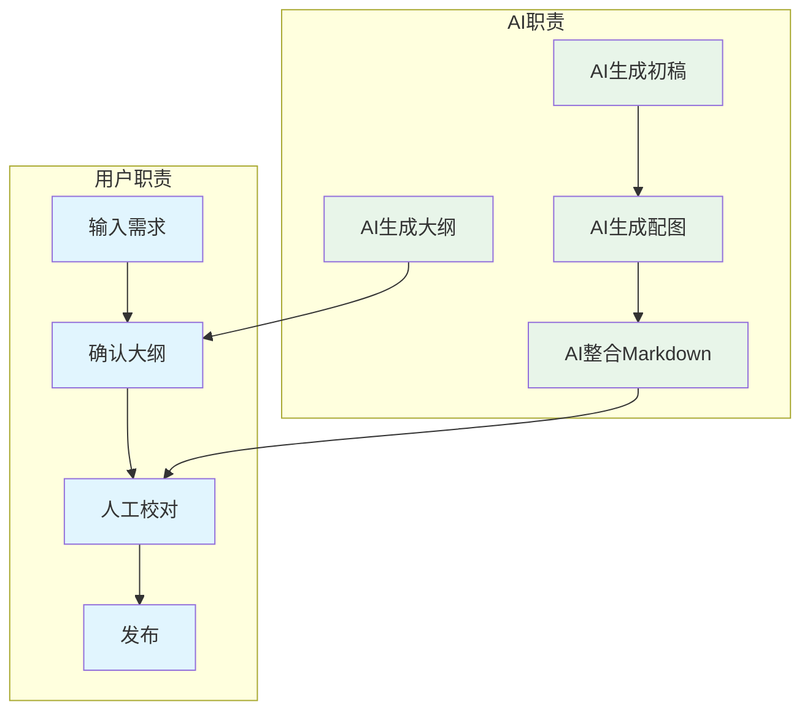
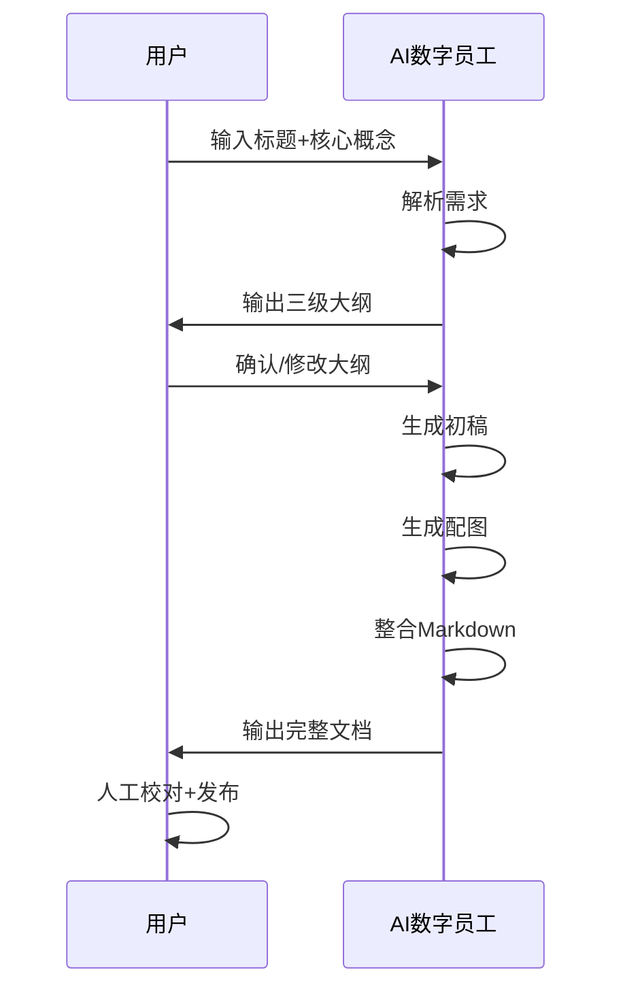
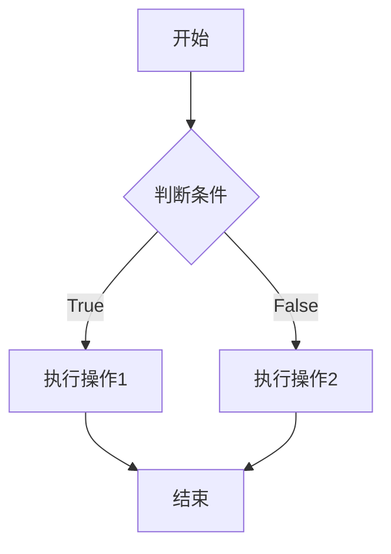

# 技术博客撰写SOP

## 概述

本文档定义技术博客撰写的标准操作流程，采用「AI数字员工 + 人工校对」模式，确保内容专业易懂、图文并茂。

---

## 一、流程概览



---

## 二、人机职责边界

| 环节 | AI数字员工 | 人工(用户) | 说明 |
|------|:----------:|:----------:|------|
| 需求理解 | ❌ | ✅ | 输入标题+核心概念 |
| 大纲生成 | ✅ | ❌ | AI根据需求生成 |
| 大纲确认 | ❌ | ✅ | 人工审核/修改确认 |
| 初稿撰写 | ✅ | ❌ | AI按大纲生成完整内容 |
| 配图生成 | ✅ | ❌ | AI生成流程图/架构图 |
| 内容校对 | ✅(可选) | ✅ | 人工最终校对 |
| 发布 | ❌ | ✅ | 人工复制发布 |

---

## 三、驱动数字员工的方法

### 3.1 启动指令模板

```
请帮我撰写一篇技术博客：

- 标题：[标题]
- 核心概念：[核心知识点]
- 目标受众：[如：初级开发者]
- 特殊要求：[如：需要包含Python代码示例]
```

### 3.2 执行流程



---

## 四、详细操作流程

### 4.1 第一步：输入需求

**用户操作：**
1. 明确博客标题
2. 提炼核心概念（1-3个关键点）
3. 确定目标受众
4. 告知特殊要求（如代码语言、案例偏好）

**输入示例：**
```
标题：Python异步编程完全指南
核心概念：asyncio、async/await、并发模型
目标受众：中级Python开发者
特殊要求：包含真实项目案例
```

### 4.2 第二步：生成大纲

**AI操作：**
1. 分析标题和核心概念
2. 搜索相关技术资料
3. 生成三级结构大纲
4. 输出Markdown格式

**输出格式：**
```markdown
# [标题]

## 一、简介
### 1.1 背景
### 1.2 目标

## 二、核心概念
### 2.1 概念一
### 2.2 概念二

## 三、实战案例
### 3.1 案例一
### 3.2 案例二

## 四、总结
```

### 4.3 第三步：确认大纲

**用户操作：**
1. 审阅AI输出的大纲
2. 确认结构合理后回复"确认"
3. 如需修改，提出具体调整意见

### 4.4 第四步：生成初稿

**AI操作：**
1. 按大纲逐章节生成内容
2. 插入代码块（带语法高亮）
3. 添加要点提示（加粗/列表）
4. 保持专业、易懂、简洁

**内容质量标准：**
- 技术准确：概念定义清晰、代码可运行
- 逻辑清晰：层层递进、案例丰富
- 表述易懂：避免过度术语化、适当解释

### 4.5 第五步：生成配图

**AI操作：**
1. 分析内容结构
2. 生成Mermaid流程图
3. 输出架构图/时序图/对比图

**配图要求：**
- 每300字至少1张图
- 必须包含至少1张Mermaid流程图
- 代码类内容添加代码截图说明

**Mermaid示例：**


### 4.6 第六步：整合输出

**AI操作：**
1. 合并初稿和配图
2. 检查Markdown格式
3. 输出完整文档

### 4.7 第七步：人工校对

**用户操作：**
1. 检查技术准确性
2. 核对代码可运行性
3. 调整表述流畅度
4. 确认配图清晰

### 4.8 第八步：发布

**用户操作：**
1. 复制内容到目标平台
2. 添加封面图
3. 设置标签/分类
4. 发布

---

## 五、质量标准

### 5.1 专业性
- 技术概念定义准确
- 代码示例完整可运行
- 术语使用规范统一

### 5.2 可读性
- 段落简洁（每段不超过3行）
- 关键点加粗突出
- 案例丰富、贴近实战

### 5.3 图文并茂
- 每300字至少1张图
- 必须包含Mermaid流程图
- 架构图/对比图/时序图适当使用

---

## 六、版本记录

| 版本 | 日期 | 说明 |
|------|------|------|
| v1.0 | 2025-03-30 | 初始版本 |
