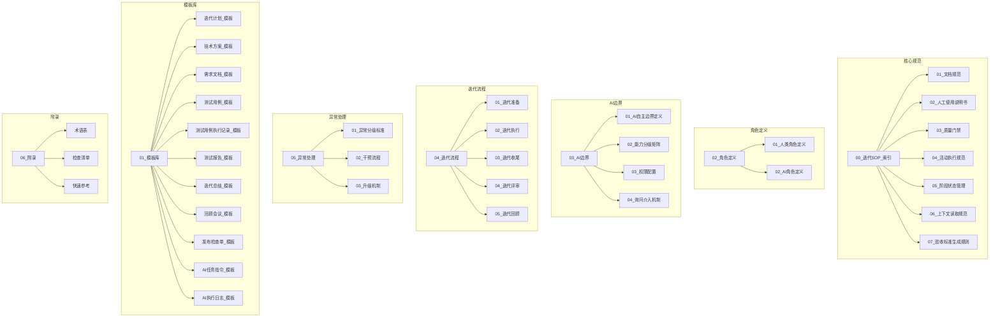

# 迭代SOP索引

> 本文档是整个迭代SOP体系的入口，提供快速导航和文档交叉引用。

## 文档体系概览

## 快速导航

### 新手入门

> 首次使用本SOP，请按以下顺序阅读：

| 顺序 | 文档 | 说明 |
|------|------|------|
| 1 | [02_人工使用说明书](./02_人工使用说明书.md) | 首先阅读，掌握人机协作方法 |
| 2 | [01_文档规范](./01_文档规范.md) | 了解文档管理规则 |
| 3 | [04_活动执行规范](./04_活动执行规范.md) | 了解标准活动执行流程 |
| 4 | [02_角色定义/01_人类角色定义](../02_角色定义/01_人类角色定义.md) | 了解人类角色职责 |
| 5 | [02_角色定义/02_AI角色定义](../02_角色定义/02_AI角色定义.md) | 了解AI角色能力 |

### 日常使用

| 场景 | 访问文档 |
|------|----------|
| 启动迭代 | [01_迭代准备](../04_迭代流程/01_迭代准备.md) + [迭代计划_模板](../01_模板库/迭代计划_模板.md) |
| 执行迭代 | [02_迭代执行](../04_迭代流程/02_迭代执行.md) |
| 迭代收尾 | [03_迭代收尾](../04_迭代流程/03_迭代收尾.md) + [发布检查单_模板](../01_模板库/发布检查单_模板.md) |
| 迭代评审 | [04_迭代评审](../04_迭代流程/04_迭代评审.md) + [迭代总结_模板](../01_模板库/迭代总结_模板.md) |
| 迭代回顾 | [05_迭代回顾](../04_迭代流程/05_迭代回顾.md) + [回顾会议_模板](../01_模板库/回顾会议_模板.md) |

### AI协作

| 场景 | 访问文档 |
|------|----------|
| 了解AI能力 | [02_AI角色定义](../02_角色定义/02_AI角色定义.md) |
| 了解AI边界 | [01_AI自主边界定义](../03_AI边界/01_AI自主边界定义.md) |
| 查看能力分级 | [02_能力分级矩阵](../03_AI边界/02_能力分级矩阵.md) |
| 配置权限 | [03_权限配置](../03_AI边界/03_权限配置.md) |
| 下达AI任务 | [AI任务指令_模板](../01_模板库/AI任务指令_模板.md) |
| AI主动询问 | [04_询问介入机制](../03_AI边界/04_询问介入机制.md) |
| 活动执行规范 | [04_活动执行规范](./04_活动执行规范.md) |
| 阶段状态管理 | [05_阶段状态管理](./05_阶段状态管理.md) |
| 上下文读取规范 | [06_上下文读取规范](./06_上下文读取规范.md) |
| 验收标准生成规则 | [07_验收标准生成规则](./07_验收标准生成规则.md) |

### 异常处理

| 场景 | 访问文档 |
|------|----------|
| 异常分级标准 | [01_异常分级标准](../05_异常处理/01_异常分级标准.md) |
| 干预操作 | [02_干预流程](../05_异常处理/02_干预流程.md) |
| 升级机制 | [03_升级机制](../05_异常处理/03_升级机制.md) |

### 质量保障

| 场景 | 访问文档 |
|------|----------|
| 质量标准 | [03_质量门禁](./03_质量门禁.md) |
| 活动执行规范 | [04_活动执行规范](./04_活动执行规范.md) |
| 阶段状态管理 | [05_阶段状态管理](./05_阶段状态管理.md) |
| 上下文读取规范 | [06_上下文读取规范](./06_上下文读取规范.md) |
| 验收标准生成规则 | [07_验收标准生成规则](./07_验收标准生成规则.md) |
| 检查清单 | [检查清单](../06_附录/检查清单.md) |
| 术语解释 | [术语表](../06_附录/术语表.md) |
| 快速参考 | [快速参考](../06_附录/快速参考.md) |
| 一页指引 | [快速指引](../06_附录/快速指引.md) |

### 迭代文档存档

> 每轮迭代的完整文档存档，按迭代分类存放

| 迭代 | 文档目录 | 状态 | 测试报告 |
|------|----------|------|----------|
| Sprint-01 | [07_迭代文档/Sprint-01/](../07_迭代文档/Sprint-01/) | 进行中 | - |
| - | - | - | - |

---

## 文档版本

| 版本 | 日期 | 变更说明 |
|------|------|----------|
| 1.0 | 2026-01-01 | 初始版本 |
| 2.0 | 2026-03-31 | 新增活动执行规范、询问介入机制、阶段状态管理；优化迭代流程文档 |
| 3.0 | 2026-03-31 | 优化AI任务指令模板（区分人类填写区和AI自动读取区）；新增上下文读取规范、验收标准生成规则 |

## 维护说明

- 本索引文档由SOP管理员维护
- 各子文档的更新需同步更新索引链接
- 重大变更需经过SOP管理委员会审批
