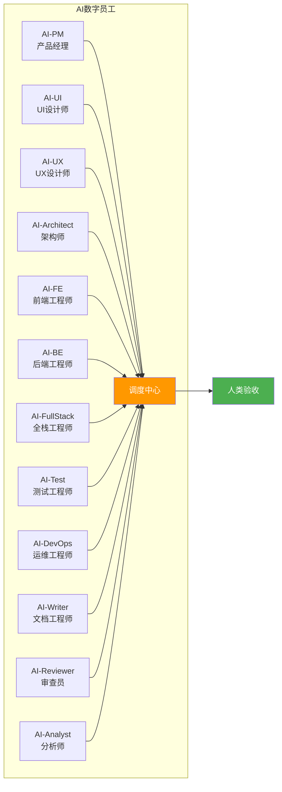
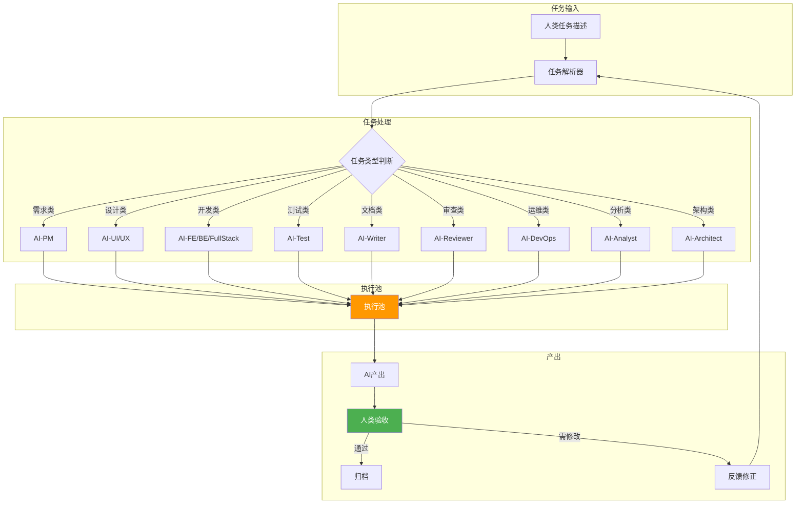
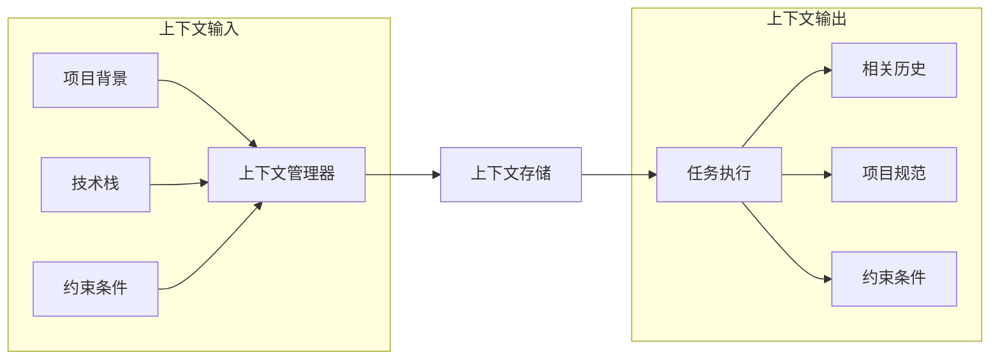
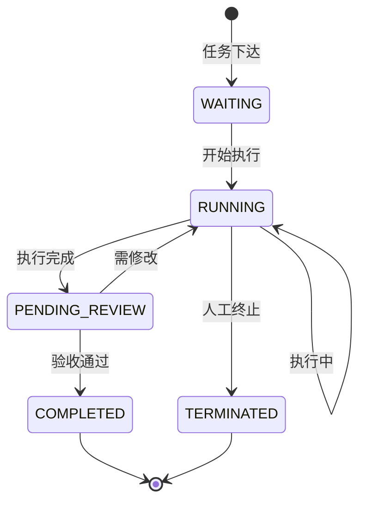
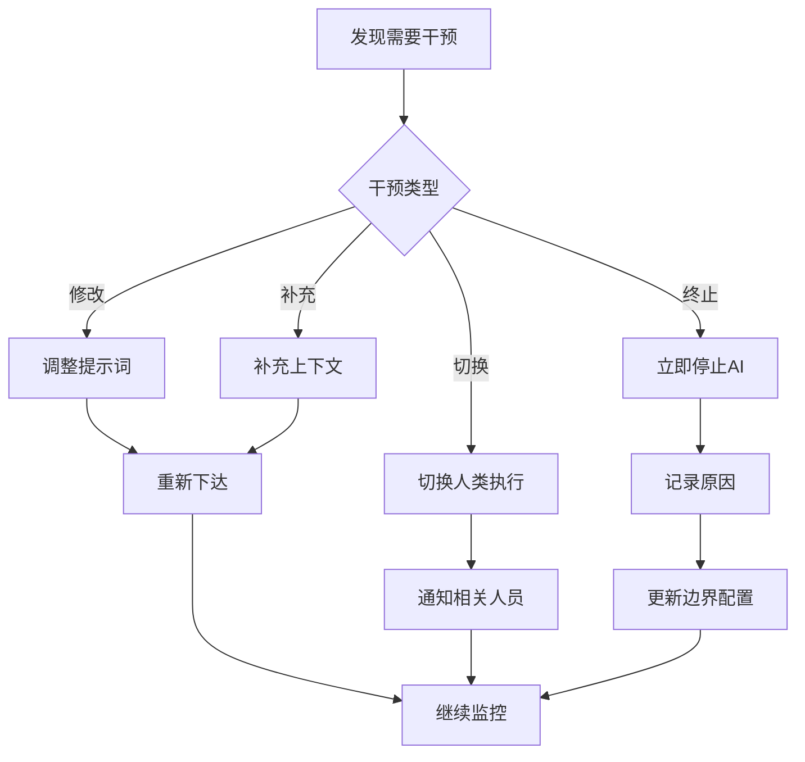
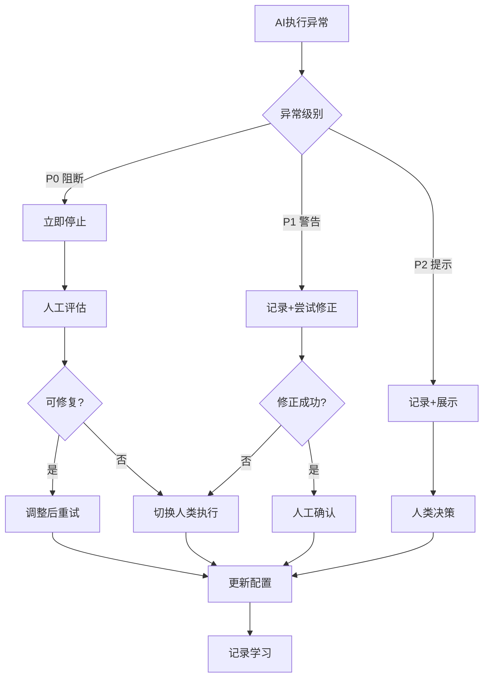
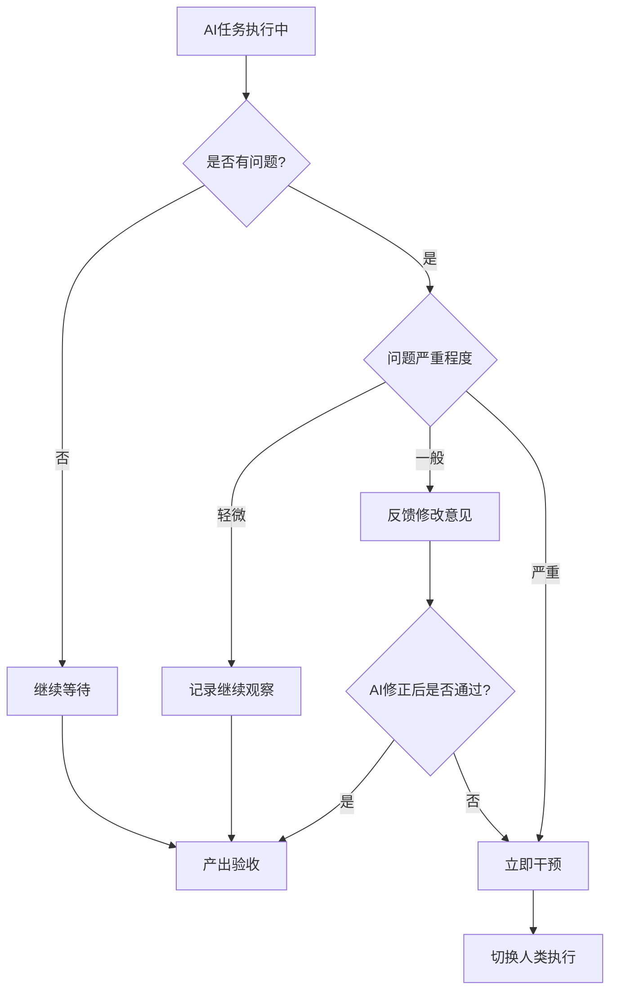

# 人工使用说明书

> 本说明书指导人类如何驱动AI数字员工完成迭代任务。

## 1. 数字员工团队概览

### 1.1 团队成员一览表



### 1.2 能力矩阵

| AI角色 | 核心能力 | 适用场景 | 限制边界 |
|--------|----------|----------|----------|
| **AI-PM** | 需求分析、优先级排序、验收标准制定 | 需求梳理、用户故事编写 | 业务决策需人类确认 |
| **AI-UI** | 界面设计、视觉规范、切图标注 | 界面设计、品牌规范 | 创意方向需人类确认 |
| **AI-UX** | 交互设计、用户体验分析、信息架构 | 交互优化、用户体验评估 | 战略决策需人类确认 |
| **AI-Architect** | 技术架构设计、技术方案评审、性能规划 | 架构设计、技术选型 | 业务约束需人类确认 |
| **AI-FE** | 前端代码开发、组件开发、样式实现 | 页面开发、组件开发 | 复杂交互需人类协助 |
| **AI-BE** | 后端API开发、业务逻辑、数据库设计 | API开发、业务逻辑实现 | 高并发设计需人类审核 |
| **AI-FullStack** | 前后端全栈开发 | 简单功能、CRUD类任务 | 复杂业务需拆分 |
| **AI-Test** | 测试用例编写、测试执行、缺陷定位 | 用例生成、自动化测试 | 复杂场景需人类补充 |
| **AI-DevOps** | CI/CD配置、环境部署、监控告警 | 自动化部署、配置管理 | 基础设施变更需审批 |
| **AI-Writer** | 技术文档、API文档、用户手册 | 文档生成、会议纪要 | 核心技术文档需审核 |
| **AI-Reviewer** | 代码审查、安全扫描、质量评估 | 代码审查、安全检测 | 架构决策需人类确认 |
| **AI-Analyst** | 数据分析、趋势预测、风险识别 | 数据分析、风险预警 | 业务解读需人类确认 |

## 2. AI数字员工调度中心

### 2.1 调度中心功能



### 2.2 任务流转机制

| 阶段 | 状态 | 说明 |
|------|------|------|
| 等待中 | WAITING | 任务已下达，等待执行 |
| 执行中 | RUNNING | AI正在处理 |
| 待验收 | PENDING_REVIEW | 产出等待人类验收 |
| 已完成 | COMPLETED | 人类验收通过 |
| 已终止 | TERMINATED | 任务被终止 |

### 2.3 状态监控

- **实时状态面板**：查看所有AI任务当前状态
- **执行日志**：记录每个AI任务的输入、输出、耗时
- **异常告警**：AI执行异常时自动通知

## 3. 任务下达方法

### 3.1 任务指令格式

```markdown
# AI任务指令

## 任务基础信息
- **任务编号**：[自动生成]
- **任务类型**：[代码生成/代码审查/测试生成/文档生成/...]
- **优先级**：[P0/P1/P2]
- **截止时间**：[YYYY-MM-DD HH:MM]

## 任务描述
[详细描述要做什么，包括业务背景、目标等]

## 上下文信息
- **涉及模块**：[模块名称]
- **技术栈**：[技术栈版本]
- **相关文件**：[文件路径]
- **约束条件**：[具体限制]

## 验收标准
1. [具体可验证的标准]
2. [具体可验证的标准]
3. [具体可验证的标准]

## 附件
- [相关文档链接]
- [参考代码链接]
```

### 3.2 优先级定义

| 优先级 | 定义 | 处理时限 |
|--------|------|----------|
| **P0** | 阻断问题，必须立即处理 | 2小时内 |
| **P1** | 高优先级，迭代内完成 | 24小时内 |
| **P2** | 常规任务 | 迭代周期内 |

### 3.3 上下文管理



### 3.4 人机对话示例

#### 示例1：AI-PM 需求分析任务

**人类下达任务**：
```markdown
# 任务指令

## 任务类型：需求分析
## 任务描述：
为"用户登录功能"进行需求分析，包括：
1. 梳理登录方式（手机号、邮箱、第三方）
2. 确定注册流程
3. 设计忘记密码流程

## 上下文信息：
- 目标用户：普通消费者
- 已有系统：无（全新项目）
- 安全要求：需符合GDPR规范

## 验收标准：
1. 输出完整的用户故事列表
2. 包含清晰的验收标准
3. 识别出需要UI设计的页面清单
```

**AI响应示例**：
```markdown
# 需求分析结果

## 用户故事清单

### US001-手机号登录
作为用户，我可以通过手机号和验证码登录系统
**验收标准：**
- [ ] 支持中国大陆手机号
- [ ] 验证码有效期5分钟
- [ ] 验证码错误3次后锁定

### US002-第三方登录
作为用户，我可以通过微信登录系统
**验收标准：**
- [ ] 支持微信OAuth2.0
- [ ] 首次登录自动创建账号
- [ ] 需绑定手机号

...

## UI设计需求页面清单
1. 登录页（手机号/邮箱/微信）
2. 注册页
3. 忘记密码页
4. 绑定手机号页
```

**人类验收**：
- 确认业务逻辑正确性
- 补充遗漏的边界场景
- 批准后进入设计阶段


#### 示例2：AI-Architect 架构设计任务

**人类下达任务**：
```markdown
# 任务指令

## 任务类型：架构设计
## 任务描述：
为"电商订单系统"设计技术架构

## 上下文信息：
- 预估日订单量：10万单
- 峰值：1万单/小时
- 现有技术栈：Java Spring Cloud, MySQL, Redis
- 团队规模：5人

## 验收标准：
1. 给出系统架构图
2. 说明核心模块划分
3. 给出数据库设计建议
4. 说明高可用方案
```

**AI响应示例**：
```markdown
# 架构设计方案

## 系统架构图
[自动生成架构图]

## 核心模块划分
- 订单服务（Order Service）
- 支付服务（Payment Service）
- 库存服务（Inventory Service）
- 物流服务（Logistics Service）

## 数据库设计
### 订单表（orders）
| 字段 | 类型 | 说明 |
|------|------|------|
| id | BIGINT | 主键 |
| user_id | BIGINT | 用户ID |
| total_amount | DECIMAL | 订单金额 |
| status | TINYINT | 订单状态 |
| created_at | DATETIME | 创建时间 |

## 高可用方案
1. 订单服务集群部署
2. MySQL主从复制
3. Redis缓存热点数据
4. 消息队列异步处理
```

**人类验收**：
- 审核技术可行性
- 确认成本预算
- 批准后进入开发阶段


#### 示例3：AI-FE 前端开发任务

**人类下达任务**：
```markdown
# 任务指令

## 任务类型：前端代码开发
## 任务描述：
开发"用户登录页面"

## 上下文信息：
- 涉及模块：用户模块
- 技术栈：Vue 3 + Element Plus
- UI设计稿：[链接]
- 登录API接口：[链接]

## 约束条件：
- 需支持响应式布局
- 验证码倒计时60秒
- 错误提示需友好

## 验收标准：
1. 页面正常渲染，无控制台错误
2. 登录功能正常，调用API成功
3. 表单验证通过
4. 响应式适配手机端
```

**AI响应示例**：
```vue
<template>
  <div class="login-container">
    <el-form ref="loginForm" :model="loginForm" :rules="rules">
      <el-form-item prop="phone">
        <el-input v-model="loginForm.phone" placeholder="请输入手机号" />
      </el-form-item>
      <el-form-item prop="code">
        <el-input v-model="loginForm.code" placeholder="请输入验证码">
          <template #append>
            <el-button @click="sendCode" :disabled="countdown > 0">
              {{ countdown > 0 ? `${countdown}s` : '获取验证码' }}
            </el-button>
          </template>
        </el-input>
      </el-form-item>
      <el-button type="primary" @click="handleLogin" :loading="loading">
        登录
      </el-button>
    </el-form>
  </div>
</template>

<script setup>
import { ref, reactive } from 'vue'
import { ElMessage } from 'element-plus'
import { login, sendSmsCode } from '@/api/user'

const loginForm = reactive({ phone: '', code: '' })
const loading = ref(false)
const countdown = ref(0)

const rules = {
  phone: [{ required: true, message: '请输入手机号', trigger: 'blur' }],
  code: [{ required: true, message: '请输入验证码', trigger: 'blur' }]
}

const sendCode = async () => {
  if (!/^1[3-9]\d{9}$/.test(loginForm.phone)) {
    ElMessage.error('请输入正确的手机号')
    return
  }
  countdown.value = 60
  const timer = setInterval(() => {
    countdown.value--
    if (countdown.value === 0) clearInterval(timer)
  }, 1000)
  await sendSmsCode(loginForm.phone)
  ElMessage.success('验证码已发送')
}

const handleLogin = async () => {
  loading.value = true
  try {
    await login(loginForm)
    ElMessage.success('登录成功')
  } catch (error) {
    ElMessage.error(error.message || '登录失败')
  } finally {
    loading.value = false
  }
}
</script>
```

**人类验收**：
- 代码审查通过
- 功能测试通过
- 合规检查通过


#### 示例4：AI-BE 后端开发任务

**人类下达任务**：
```markdown
# 任务指令

## 任务类型：后端API开发
## 任务描述：
开发"用户登录接口"

## 上下文信息：
- 涉及模块：用户模块
- 技术栈：Java Spring Boot 3.0
- 数据库：MySQL 8.0
- 缓存：Redis

## 接口规范：
- URL: POST /api/v1/user/login
- 请求体：{ phone: string, code: string }
- 响应体：{ token: string, userId: long }

## 约束条件：
- 验证码验证逻辑需独立
- Token使用JWT
- 需记录登录日志

## 验收标准：
1. 接口返回正确
2. 验证码校验通过
3. JWT Token生成正确
4. 单元测试通过
```

**AI响应示例**：
```java
@RestController
@RequestMapping("/api/v1/user")
public class LoginController {

    @Autowired
    private LoginService loginService;
    
    @PostMapping("/login")
    public ResponseEntity<LoginResponse> login(@RequestBody @Valid LoginRequest request) {
        String token = loginService.login(request.getPhone(), request.getCode());
        return ResponseEntity.ok(new LoginResponse(token, loginService.getUserId()));
    }
}

@Service
public class LoginService {
    
    @Autowired
    private RedisTemplate<String, String> redisTemplate;
    
    @Autowired
    private JwtUtil jwtUtil;
    
    @Autowired
    private LoginLogMapper loginLogMapper;
    
    public String login(String phone, String code) {
        // 验证码校验
        String cachedCode = redisTemplate.opsForValue().get("login:code:" + phone);
        if (!code.equals(cachedCode)) {
            throw new BusinessException("验证码错误");
        }
        
        // 获取或创建用户
        User user = userMapper.findByPhone(phone);
        if (user == null) {
            user = createUser(phone);
        }
        
        // 生成Token
        String token = jwtUtil.generateToken(user.getId());
        
        // 记录登录日志
        loginLogMapper.insert(new LoginLog(user.getId(), new Date()));
        
        return token;
    }
}
```

**人类验收**：
- 代码审查通过
- 接口测试通过
- 安全检查通过

#### 示例5：AI-Test 测试用例生成任务

**人类下达任务**：
```markdown
# 任务指令

## 任务类型：测试用例生成
## 任务描述：
为"用户登录功能"生成测试用例

## 上下文信息：
- 功能点：手机号登录、验证码登录、错误处理
- 测试类型：功能测试

## 验收标准：
1. 覆盖正常流程
2. 覆盖异常流程
3. 边界条件覆盖
4. 用例格式规范
```

**AI响应示例**：
```markdown
# 测试用例

## TC001-手机号登录成功
**前置条件**：用户已注册，手机号正确，验证码正确
**测试步骤**：
1. 输入正确手机号
2. 获取验证码
3. 输入正确验证码
4. 点击登录按钮
**预期结果**：登录成功，跳转首页

## TC002-手机号格式错误
**前置条件**：无
**测试步骤**：
1. 输入错误格式手机号（如：12345678901）
2. 点击获取验证码
**预期结果**：提示"手机号格式不正确"

## TC003-验证码错误
**前置条件**：用户已注册
**测试步骤**：
1. 输入正确手机号
2. 输入错误验证码（如：000000）
3. 点击登录
**预期结果**：提示"验证码错误"，登录失败
...（共生成15条用例）
```

**人类验收**：
- 确认用例覆盖度
- 补充遗漏场景
- 批准后执行测试


#### 示例6：AI-Writer 技术文档生成任务

**人类下达任务**：
```markdown
# 任务指令

## 任务类型：技术文档生成
## 任务描述：
生成"用户模块API文档"

## 上下文信息：
- API数量：5个
- 目标读者：前端开发人员

## 验收标准：
1. 包含所有API接口说明
2. 请求/响应示例完整
3. 错误码说明完整
```

**AI响应示例**：
```markdown
# 用户模块API文档

## 1. 登录接口

### 1.1 接口信息
- **URL**: POST /api/v1/user/login
- **Content-Type**: application/json

### 1.2 请求参数
| 参数名 | 类型 | 必填 | 说明 |
|--------|------|------|------|
| phone | string | 是 | 手机号 |
| code | string | 是 | 验证码 |

### 1.3 响应示例
```json
{
  "code": 0,
  "message": "success",
  "data": {
    "token": "eyJhbGciOiJIUzI1NiIsInR5cCI6IkpXVCJ9...",
    "userId": 123456
  }
}
\```

### 1.4 错误码
| 错误码 | 说明 |
|--------|------|
| 1001 | 手机号格式错误 |
| 1002 | 验证码错误 |
| 1003 | 验证码已过期 |
```

**人类验收**：
- 确认文档准确性
- 确认格式规范
- 批准后归档


#### 示例7：AI-Reviewer 代码审查任务

**人类下达任务**：
```markdown
# 任务指令

## 任务类型：代码审查
## 任务描述：
审查"用户登录模块"代码

## 上下文信息：
- PR链接：[链接]
- 代码范围：LoginController.java, LoginService.java

## 审查重点：
1. 安全性
2. 性能
3. 代码规范

## 验收标准：
1. 识别所有潜在问题
2. 给出修复建议
3. 标记严重程度
```

**AI响应示例**：
```markdown
# 代码审查报告

## 审查范围
- LoginController.java
- LoginService.java

## 问题清单

### 问题1 [严重]
**位置**：LoginService.java:45
**问题**：验证码未设置过期时间
**建议**：添加 redisTemplate.expire("login:code:" + phone, 5, TimeUnit.MINUTES);

### 问题2 [中等]
**位置**：LoginController.java:28
**问题**：异常未记录日志
**建议**：添加 logger.error("Login failed", e);

### 问题3 [建议]
**位置**：LoginService.java
**问题**：建议添加接口限流
**建议**：考虑使用Guava RateLimiter

## 审查结论
- [ ] 可以合并
- [x] 需要修改后合并
- [ ] 暂不合并
```

**人类验收**：
- 确认问题准确性
- 确认修复建议
- 批准合并或要求修改


## 4. 过程监控方法

### 4.1 进度追踪

| 监控方式 | 监控内容 | 频率 |
|----------|----------|------|
| 任务面板 | 任务状态、进度百分比 | 实时 |
| 执行日志 | AI输入输出详情 | 实时 |
| 统计报表 | 任务完成率、平均耗时 | 每日 |

### 4.2 状态查看



### 4.3 日志分析

- **执行日志**：记录AI的输入、输出、执行时间
- **错误日志**：记录AI执行过程中的异常信息
- **操作日志**：记录人类对AI任务的干预操作

## 5. 产出验收方法

### 5.1 各角色产出验收标准

| AI角色 | 产出类型 | 验收方式 | 验收标准 |
|--------|----------|----------|----------|
| AI-PM | 需求文档 | 业务确认 | 业务逻辑正确、完整 |
| AI-UI | 设计稿 | 视觉确认 | 符合设计规范 |
| AI-Architect | 架构方案 | 技术评审 | 技术可行、成本可控 |
| AI-FE/BE | 代码 | 代码审查 | 编译通过、符合规范 |
| AI-Test | 测试用例 | 评审确认 | 覆盖度达标 |
| AI-Writer | 文档 | 内容审核 | 准确完整 |
| AI-Reviewer | 审查报告 | 人工复核 | 建议合理 |

### 5.2 审批节点

| 节点 | 审批人 | 时效要求 |
|------|--------|----------|
| 需求确认 | PM | 24小时内 |
| 技术方案 | 技术负责人 | 24小时内 |
| 代码合并 | 高级开发 | 实时 |
| 测试报告 | QA负责人 | 迭代内 |
| 文档归档 | 相关负责人 | 迭代内 |

### 5.3 反馈机制

- **通过**：产出合格，进入下一环节
- **修改**：产出需修改，明确修改意见后退回AI
- **终止**：产出严重偏离，终止任务转人类执行

## 6. 干预与应急

### 6.1 干预触发条件

| 条件 | 触发动作 |
|------|----------|
| AI连续3次输出被拒绝 | 暂停AI执行 |
| AI执行超时 | 终止执行 |
| AI输出包含敏感信息 | 立即停止 |
| 人类发现明显错误 | 人工干预 |

### 6.2 干预操作指南



### 6.3 降级处理流程



## 7. 快速参考

### 7.1 常用操作清单

| 操作 | 命令/动作 | 说明 |
|------|-----------|------|
| 下达任务 | 使用AI任务指令模板 | 标准化输入 |
| 查看状态 | 打开任务面板 | 实时监控 |
| 干预执行 | 点击"终止"/"修改" | 立即生效 |
| 验收产出 | 点击"通过"/"修改" | 推进流程 |

### 7.2 决策树



### 7.3 紧急联系人

| 角色 | 职责 | 响应时间 |
|------|------|----------|
| 技术负责人 | 技术决策 | 30分钟内 |
| 产品经理 | 业务决策 | 1小时内 |
| 安全负责人 | 安全事件 | 15分钟内 |
