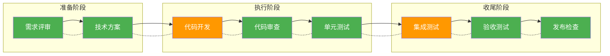
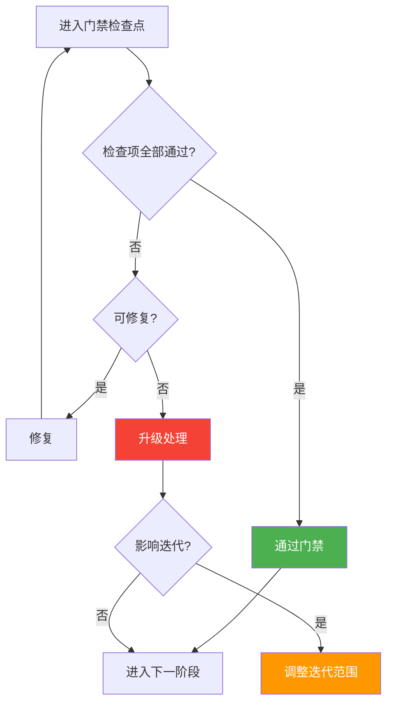

# 质量门禁

> 本文档定义迭代过程中的质量检查标准和门禁规则。

## 1. 质量门禁体系概览

## 2. 各阶段质量门禁

### 2.1 迭代准备阶段

| 检查点 | 检查项 | 标准 | 责任人 | 状态 |
|--------|--------|------|--------|------|
| 需求评审 | 需求完整性 | 100%覆盖用户故事 | PM | ⬜ |
| 需求评审 | 验收标准 | 每个需求有明确验收标准 | PM | ⬜ |
| 技术方案 | 技术可行性 | 通过技术评审 | Architect | ⬜ |
| 技术方案 | 风险识别 | 识别所有已知风险 | DEV | ⬜ |
| 任务估算 | 估算准确性 | 偏差≤30% | DEV | ⬜ |

### 2.2 迭代执行阶段

| 检查点 | 检查项 | 标准 | 责任人 | 状态 |
|--------|--------|------|--------|------|
| 代码开发 | 代码规范 | 通过Lint检查 | DEV | ⬜ |
| 代码开发 | 单元测试 | 覆盖率≥70% | DEV | ⬜ |
| 代码审查 | 审查通过 | 无阻断问题 | Reviewer | ⬜ |
| 代码合并 | CI通过 | 100%通过 | DEV | ⬜ |
| 测试执行 | 测试通过率 | 100% | QA | ⬜ |

### 2.3 迭代收尾阶段

| 检查点 | 检查项 | 标准 | 责任人 | 状态 |
|--------|--------|------|--------|------|
| 集成测试 | 通过率 | 100% | QA | ⬜ |
| 验收测试 | 阻塞缺陷 | 0个 | PM | ⬜ |
| 安全扫描 | 高危漏洞 | 0个 | Sec | ⬜ |
| 发布检查 | 检查项 | 100%通过 | DEV | ⬜ |
| 回归测试 | 阻断缺陷 | 0个 | QA | ⬜ |

## 3. 质量指标

### 3.1 代码质量指标

| 指标 | 目标值 | 告警阈值 |
|------|--------|----------|
| 代码规范通过率 | 100% | <95% |
| 单元测试覆盖率 | ≥70% | <60% |
| 代码重复率 | <5% | >8% |
| 圈复杂度 | <10 | >15 |
| 圈复杂度 | >80% | <60% |

### 3.2 测试质量指标

| 指标 | 目标值 | 告警阈值 |
|------|--------|----------|
| 测试用例通过率 | 100% | <95% |
| 缺陷修复率 | 100% | <90% |
| 回归测试覆盖 | 100% | <90% |
| API测试覆盖 | 100% | <80% |

### 3.3 交付质量指标

| 指标 | 目标值 | 告警阈值 |
|------|--------|----------|
| 按时交付率 | ≥90% | <80% |
| 发布成功率 | 100% | <95% |
| 线上缺陷数 | 0个 | >3个 |
| 用户满意度 | ≥4.5 | <4.0 |

## 4. AI执行质量标准

### 4.1 AI代码生成质量

| 检查项 | 标准 | 检测方式 |
|--------|------|----------|
| 编译通过 | 100% | CI自动化 |
| 单元测试通过 | 100% | CI自动化 |
| 代码规范 | 100% | Lint检查 |
| 安全扫描 | 无高危 | 安全扫描 |

### 4.2 AI文档生成质量

| 检查项 | 标准 | 检测方式 |
|--------|------|----------|
| 格式规范 | 符合模板 | 格式检查 |
| 内容准确 | ≥95% | 抽检确认 |
| 完整性 | 100% | 自动检查 |
| 术语统一 | 100% | 术语库检查 |

### 4.3 AI测试生成质量

| 检查项 | 标准 | 检测方式 |
|--------|------|----------|
| 用例格式 | 符合模板 | 格式检查 |
| 覆盖度 | ≥80% | 覆盖率统计 |
| 可执行性 | 100% | 执行验证 |

## 5. 门禁执行流程

### 5.1 门禁检查流程

### 5.2 门禁异常处理

| 异常类型 | 处理方式 | 审批人 |
|----------|----------|--------|
| 门禁检查失败 | 修复后重新检查 | 责任人 |
| 门禁豁免申请 | 评估后决定 | 技术负责人 |
| 门禁失败升级 | 调整迭代计划 | PM |

## 6. 质量报告

### 6.1 迭代质量报告

每个迭代结束需生成质量报告，包含：

| 内容 | 说明 |
|------|------|
| 质量指标达成 | 各指标实际值vs目标值 |
| 缺陷统计 | 数量、级别、趋势 |
| 代码质量 | 覆盖率、复杂度等 |
| AI执行质量 | AI产出合格率 |
| 改进建议 | 下迭代改进计划 |

### 6.2 质量趋势分析

| 周期 | 分析内容 |
|------|----------|
| 每周 | 代码质量趋势 |
| 每迭代 | 测试覆盖趋势 |
| 每月 | 缺陷密度趋势 |
| 每季度 | 整体质量评估 |

## 7. 质量检查清单

### 7.1 发布前检查

- [ ] 所有测试用例通过
- [ ] 无阻断级缺陷
- [ ] 代码审查通过
- [ ] 安全扫描通过
- [ ] 性能测试通过（如适用）
- [ ] 文档已更新
- [ ] 回滚方案已准备
- [ ] 监控告警已配置

### 7.2 上线后检查

- [ ] 核心功能验证
- [ ] 关键指标监控
- [ ] 错误日志检查
- [ ] 用户反馈收集
- [ ] 性能指标确认
