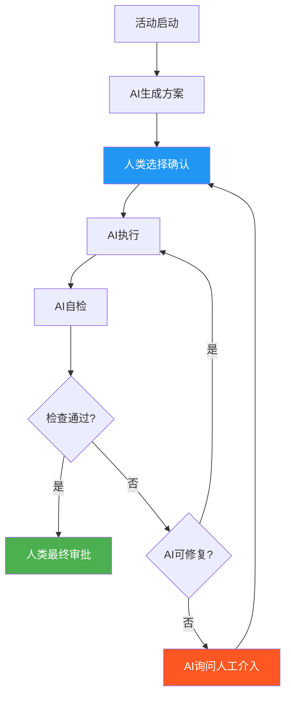
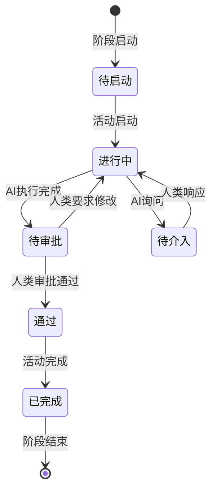

# 活动执行规范

> 文档标识：SOP-ACT-001
> 版本：1.0
> 更新日期：2026-03-31
> 维护人：SOP管理员
> 状态：已发布

> 本规范定义迭代中每个活动的标准执行流程，明确人机分工、审批节点和质量标准。
> 适用于所有迭代版本，不与特定版本绑定。

---

## 1. 活动执行模型

### 1.1 标准活动流程



### 1.2 流程说明

| 步骤 | 执行者 | 产出 | 审批节点 |
|------|--------|------|----------|
| 活动启动 | 人类 | 活动目标、约束 | - |
| AI生成方案 | AI | 2-3个可选方案（含优劣势） | - |
| 人类选择 | 人类 | 决策记录 | 方案选择确认 |
| AI执行 | AI | 执行产出 | - |
| AI自检 | AI | 自检报告 | - |
| 人类审批 | 人类 | 审批记录 | 最终确认 |

### 1.3 人类主持环节

以下活动为人类主持，AI辅助但不生成方案：

| 活动 | 人类角色 | AI辅助内容 |
|------|----------|------------|
| 迭代计划会议 | Scrum Master | 生成会议议程、记录 |
| 每日站会 | Scrum Master | 汇总进度、识别阻碍 |
| 迭代评审 | 产品经理 | 生成演示材料 |
| 迭代回顾 | Scrum Master | 收集数据、分析趋势 |

---

## 2. 活动分类

### 2.1 方案生成类活动

| 活动类型 | 示例 | AI角色 | 人类角色 |
|----------|------|--------|----------|
| 需求分析 | 用户故事编写 | AI-PM | 审核确认 |
| 技术设计 | 架构设计、API设计 | AI-Architect | 评审确认 |
| 数据库设计 | 表结构设计 | AI-BE | 审批确认 |
| 测试设计 | 测试用例编写 | AI-Test | 用例评审 |

**执行流程**：
```
1. 人类下达活动任务（包含目标、约束）
2. AI生成方案初稿
3. 人类选择确认方案
4. AI执行细化
5. AI自检
6. 人类最终审批
```

### 2.2 代码实现类活动

| 活动类型 | 示例 | AI角色 | 人类角色 |
|----------|------|--------|----------|
| 后端开发 | API开发、业务逻辑 | AI-BE | 代码审查 |
| 前端开发 | 页面开发、组件 | AI-FE | 代码审查 |
| 单元测试 | 单元测试编写 | AI-Test | 测试覆盖确认 |
| 代码审查 | 代码审查 | AI-Reviewer | 人工复核 |

**执行流程**：
```
1. 人类下达任务（包含技术方案、约束）
2. AI生成代码/测试
3. AI自检（规范检查、编译检查）
4. 人类审批（代码审查）
5. 如有问题，返回AI修复
```

### 2.3 文档输出类活动

| 活动类型 | 示例 | AI角色 | 人类角色 |
|----------|------|--------|----------|
| 技术文档 | 接口文档、设计文档 | AI-Writer | 准确性审核 |
| 会议纪要 | 评审纪要、回顾纪要 | AI-Writer | 完整性确认 |
| 测试报告 | 测试执行报告 | AI-Test | 数据准确性确认 |

**执行流程**：
```
1. 人类下达任务（包含输入材料）
2. AI生成文档初稿
3. 人类审批
4. AI修正并归档
```

---

## 3. 方案生成规范

### 3.1 方案模板

AI生成方案时，应包含以下内容：

```markdown
## 方案名称：[名称]

### 方案概述
[简要描述方案内容]

### 适用场景
- 场景1
- 场景2

### 技术实现
[技术实现细节]

### 优点
- 优点1
- 优点2

### 缺点/风险
- 缺点1
- 缺点2

### 资源需求
- 人力：
- 时间：
- 技术：

### 推荐程度
[强推荐/推荐/可选]
```

### 3.2 方案数量要求

| 场景 | 方案数量 | 说明 |
|------|----------|------|
| 常规任务 | 2-3个 | 提供选择空间 |
| 简单任务 | 1-2个 | 已有成熟方案 |
| 复杂任务 | 3个以上 | 需充分论证 |

### 3.3 方案选择记录

人类选择方案后，应记录：

```markdown
## 方案选择记录

### 活动时间：[名称]
### 选择时间：[时间]

#### 候选方案
| 方案 | AI推荐 | 人类选择 |
|------|--------|----------|
| 方案A | 强推荐 | - |
| 方案B | 推荐 | ✅ |
| 方案C | 可选 | - |

#### 选择理由
[人类填写选择理由]

#### 风险确认
[如选择的方案有风险，需确认已知晓]
```

---

## 4. AI自检规范

### 4.1 自检内容

| 检查类型 | 检查项 | 工具 |
|----------|--------|------|
| 语法检查 | 代码编译通过 | IDE/编译器 |
| 规范检查 | 符合代码规范 | Lint工具 |
| 单元测试 | 测试用例通过 | 测试框架 |
| 静态分析 | 无高危警告 | 静态分析工具 |
| 安全检查 | 无明显安全漏洞 | 安全扫描工具 |
| 改动记录 | 改动记录完整性（所有改动已记录） | 人工检查 |

### 4.2 自检报告模板

```markdown
## AI自检报告

### 活动名称：[名称]
### 执行时间：[时间]

#### 检查结果
| 检查项 | 状态 | 说明 |
|--------|------|------|
| 语法检查 | ✅通过/❌失败 | |
| 规范检查 | ✅通过/❌失败 | |
| 单元测试 | ✅通过/❌失败 | |
| 静态分析 | ✅通过/❌失败 | |
| 安全检查 | ✅通过/❌失败 | |

#### 问题清单（如有）
| 问题 | 级别 | 处理方式 |
|------|------|----------|
| | | |

#### 总体结论
[通过/需修复/需人工介入]
```

---

## 5. 审批节点规范

### 5.1 审批类型

| 审批类型 | 时机 | 审批人 | 审批内容 |
|----------|------|--------|----------|
| 方案选择审批 | 人类选择方案后 | 任务下达人 | 方案合理性 |
| 执行结果审批 | AI自检通过后 | 技术负责人 | 产出质量 |
| 最终审批 | 所有检查通过后 | 任务下达人 | 整体验收 |

### 5.2 审批标准

```markdown
## 审批检查清单

### 方案选择审批
- [ ] 方案是否清晰可理解
- [ ] 优劣势分析是否准确
- [ ] 选择理由是否合理
- [ ] 风险是否已知晓

### 执行结果审批
- [ ] 产出是否符合方案要求
- [ ] AI自检是否全部通过
- [ ] 是否有遗留问题
- [ ] 文档是否完整

### 最终审批
- [ ] 功能是否满足活动目标
- [ ] 质量是否达标
- [ ] 是否可以进入下一活动
```

### 5.3 审批记录

```markdown
## 审批记录

### 审批节点：[类型]
### 审批人：[姓名]
### 审批时间：[时间]

#### 审批结果
- [ ] 通过
- [ ] 需修改
- [ ] 拒绝

#### 审批意见
[详细意见]

#### 后续行动
[如需修改，具体要求]
```

---

## 6. 询问介入规范

### 6.1 AI可主动询问的场景

| 场景 | AI动作 | 人类响应 |
|------|--------|----------|
| 遇到未知错误 | 暂停，描述问题及可能原因 | 提供解决方向 |
| 执行结果异常 | 报告异常，提供选项 | 选择继续/终止/调整 |
| 需要业务决策 | 提供选项及影响分析 | 做出决策 |
| 等待超时 | 报告进度，请求指示 | 确认是否继续 |
| 约束不明确 | 请求明确约束条件 | 补充约束 |

### 6.2 询问模板

```markdown
## AI询问记录

### 询问时间：[时间]
### 活动名称：[名称]

#### 问题描述
[AI描述遇到的问题]

#### 可能原因
- 原因1
- 原因2

#### 建议选项
| 选项 | 说明 | 影响 |
|------|------|------|
| 选项A | 建议方案 | 影响1 |
| 选项B | 备选方案 | 影响2 |

#### 等待时间
[AI可等待的时间，超时后如何处理]
```

---

## 7. 活动产出归档

### 7.1 产出清单

| 产出类型 | 格式 | 归档位置 |
|----------|------|----------|
| 方案文档 | Markdown | 07_迭代文档/Sprint-XX/02_技术/ |
| 代码产出 | 源代码 | 代码仓库 |
| 自检报告 | Markdown | 07_迭代文档/Sprint-XX/03_开发/ |
| 审批记录 | Markdown | 07_迭代文档/Sprint-XX/03_开发/ |
| 询问记录 | Markdown | 07_迭代文档/Sprint-XX/03_开发/ |

### 7.2 命名规范

```
产出命名格式：
[迭代编号]_[阶段]_[活动]_[类型]_[序号].[格式]

示例：
Sprint-01_迭代执行_用户注册API_方案_v1.md
Sprint-01_迭代执行_用户注册API_代码_v1.java
Sprint-01_迭代执行_用户注册API_自检报告.md
Sprint-01_迭代执行_用户注册API_审批记录.md
```

---

## 8. 质量标准

### 8.1 活动执行质量

| 标准 | 要求 | 检查方式 |
|------|------|----------|
| 方案完整性 | 每个方案包含优缺点分析 | AI自检 |
| 方案多样性 | 提供2-3个可选方案 | 人类检查 |
| 选择记录完整 | 记录选择理由 | 审批检查 |
| 自检执行率 | 100%自检 | 系统检查 |
| 审批及时性 | 24小时内完成审批 | 时间跟踪 |

### 8.2 活动衔接质量

| 标准 | 要求 | 检查方式 |
|------|------|----------|
| 前置依赖完成 | 上一活动审批通过 | 状态检查 |
| 上下文传递 | 必要的上下文信息传入 | 任务检查 |
| 状态更新 | 活动完成后状态更新 | 系统检查 |

---

## 9. 流程衔接

### 9.1 活动与阶段关系

```
迭代阶段
│
├── 迭代准备
│   ├── 活动：需求整理 → AI生成需求文档 → 人类审批
│   ├── 活动：技术方案设计 → AI生成方案 → 人类选择 → 审批
│   ├── 活动：任务拆分 → AI拆分 → 人类确认
│   └── 活动：迭代计划会议 → 人类主持
│
├── 迭代执行
│   ├── 活动：代码实现 → AI生成代码 → 自检 → 审查 → 审批
│   ├── 活动：测试执行 → AI执行测试 → 报告 → 审批
│   └── 每日站会 → 人类主持
│
├── 迭代收尾
│   ├── 活动：验收测试 → AI执行 → 报告 → 审批
│   ├── 活动：发布准备 → AI生成检查单 → 审批
│   └── 活动：迭代发布 → 人类审批
│
├── 迭代评审 → 人类主持
│
└── 迭代回顾 → 人类主持
```

### 9.2 状态流转



---

## 10. 附录

### 10.1 活动分类速查表

| 活动类别 | AI角色 | 执行模式 | 审批节点 |
|----------|--------|----------|----------|
| 需求分析 | AI-PM | 方案生成→选择→执行→自检→审批 | 方案选择+最终审批 |
| 技术设计 | AI-Architect | 方案生成→选择→执行→自检→审批 | 方案选择+最终审批 |
| 后端开发 | AI-BE | 方案确认→执行→自检→审查→审批 | 代码审查+最终审批 |
| 前端开发 | AI-FE | 方案确认→执行→自检→审查→审批 | 代码审查+最终审批 |
| 测试执行 | AI-Test | 方案确认→执行→报告→审批 | 测试报告+最终审批 |
| 文档输出 | AI-Writer | 方案确认→生成→审批 | 最终审批 |

### 10.2 审批人角色对照

| 审批节点 | 默认审批人 | 可授权角色 |
|----------|------------|------------|
| 方案选择审批 | 任务下达人 | 技术负责人、PM |
| 执行结果审批 | 技术负责人 | 开发工程师 |
| 最终审批 | 任务下达人 | PM、技术负责人 |

---

## 变更记录

| 版本 | 日期 | 变更人 | 变更说明 |
|------|------|--------|----------|
| 1.0 | 2026-03-31 | SOP管理员 | 初始版本 |
