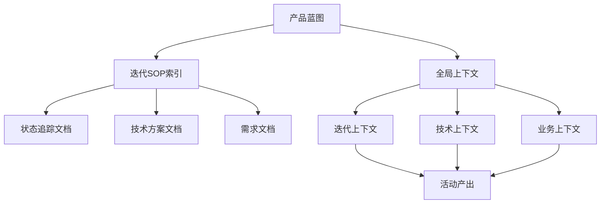
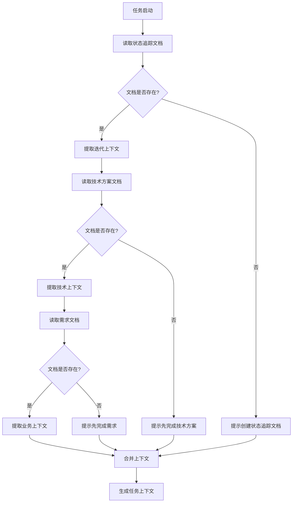

# 上下文读取规范

> 文档标识：SOP-CTX-001
> 版本：2.0
> 更新日期：2026-04-01
> 维护人：SOP管理员
> 状态：已发布

> 本文档定义AI数字员工如何从各类文档中读取上下文信息。
> AI必须按照本规范读取上下文，不得要求人类重复提供已在文档中定义的内容。

---

## 1. 上下文文档体系

### 1.1 文档层级



### 1.2 文档清单

| 文档 | 位置 | 用途 | 读取优先级 |
|------|------|------|------------|
| 产品蓝图 | 产品蓝图/*.md | 全局约束、技术选型、版本规划 | **P0（最高）** |
| 状态追踪文档 | 07_迭代文档/Sprint-XX/状态追踪.md | 迭代/阶段/活动状态 | P0 |
| 技术方案文档 | 07_迭代文档/Sprint-XX/02_技术/*.md | 技术栈、API设计、数据库设计 | P1 |
| 需求文档 | 07_迭代文档/Sprint-XX/01_需求/*.md | 业务约束、用户故事 | P2 |
| 活动产出文档 | 07_迭代文档/Sprint-XX/03_开发/*.md | 历史产出参考 | P3 |

> **优先级规则**：产品蓝图为最高优先级，AI在任何技术方案生成前必须读取。

---

## 1.5 产品蓝图读取（必读）

### 1.5.1 文档位置

```
产品蓝图/*.md
```

### 1.5.2 读取内容

| 字段 | 说明 |
|------|------|
| 总体目标 | 产品愿景与核心价值 |
| 技术栈总览 | 完整技术选型清单 |
| 项目命名规范 | 各模块/服务命名规则 |
| 版本演进总览 | 版本阶段划分 |
| 约束与边界 | 技术约束、禁止事项 |

### 1.5.3 约束规则

> **AI必须遵循的规则**：

- 产品蓝图是全局上下文，P0级读取对象
- 任何技术方案生成前，**必须**读取产品蓝图
- 技术选型必须与蓝图100%一致
- 如有偏离蓝图的技术选型，需在技术方案中说明理由并获得批准
- 版本规划必须遵循蓝图的阶段划分
- **任何数据库设计生成前，必须读取产品蓝图中数据库类型和版本**
- 数据库设计必须使用目标数据库的原生数据类型（DDL语句）

### 1.5.4 产品蓝图数据库信息读取

| 字段 | 路径 | 说明 |
|------|------|------|
| 数据库类型 | 技术栈总览 → 数据库 | 如：PostgreSQL |
| 数据库版本 | 技术栈总览 → 数据库版本 | 如：15 |
| 向量能力 | 技术栈总览 → 向量数据库 | 如：pgvector |

> **数据库设计检查点**：AI在生成数据库设计时，必须在技术方案中输出目标数据库类型、版本、DDL语句

### 1.5.4 一致性检查输出格式

AI在生成技术方案时，必须输出以下内容：

```markdown
## 与产品蓝图一致性

| 蓝图指定技术 | 本方案采用 | 一致性 |
|--------------|------------|--------|
| [技术1] | [采用的技术] | ✅ |
| [技术2] | [采用的技术] | ✅ |
| 数据库类型 | PostgreSQL | ✅ |
| 数据库版本 | 15 | ✅ |

**数据库一致性检查**：
- 数据库类型和版本与蓝图保持一致
- DDL语句使用目标数据库原生语法
- 数据类型映射正确（如PostgreSQL用BIGSERIAL，MySQL用BIGINT AUTO_INCREMENT）

如有偏离：
- 偏离项：[技术]
- 理由：[说明]
```

---

## 2. 状态追踪文档读取

### 2.1 文档位置

```
docs/迭代SOP/07_迭代文档/Sprint-XX/状态追踪.md
```

### 2.2 读取内容

| 字段 | 路径 | 说明 |
|------|------|------|
| 迭代编号 | ## 迭代概览 → 迭代编号 | Sprint-XX |
| 迭代目标 | ## 迭代概览 → 迭代目标 | 迭代目标描述 |
| 迭代周期 | ## 迭代概览 → 迭代周期 | 开始日期~结束日期 |
| 当前阶段 | ## 迭代概览 → 当前阶段 | 当前阶段名称 |
| 整体进度 | ## 迭代概览 → 整体进度 | 百分比 |

### 2.3 阶段上下文

| 字段 | 路径 | 说明 |
|------|------|------|
| 阶段状态 | ## 阶段进度 → [阶段名] → 状态 | 待启动/进行中/已完成 |
| 阶段进度 | ## 阶段进度 → [阶段名] → 完成度 | 百分比 |
| 活动列表 | ## 阶段进度 → [阶段名] → 活动 | 活动状态列表 |

### 2.4 任务上下文

| 字段 | 路径 | 说明 |
|------|------|------|
| 待执行任务 | ## 任务列表 → 待执行任务 | 任务列表 |
| 进行中任务 | ## 任务列表 → 进行中任务 | 任务列表+进度 |
| 已完成任务 | ## 任务列表 → 已完成任务 | 任务列表+完成时间 |

---

## 3. 技术方案文档读取

### 3.1 文档位置

```
docs/迭代SOP/07_迭代文档/Sprint-XX/02_技术/技术方案_TP-XXX.md
```

### 3.2 读取内容

#### 技术栈

| 字段 | 路径 | 说明 |
|------|------|------|
| Java版本 | ## 技术架构 → 技术栈 → Java | 17 |
| Spring Boot版本 | ## 技术架构 → 技术栈 → Spring Boot | 3.x |
| 前端框架 | ## 技术架构 → 技术栈 → 前端 | uni-app |
| 数据库 | ## 技术架构 → 技术栈 → 数据库 | PostgreSQL 15 |
| 缓存 | ## 技术架构 → 技术栈 → 缓存 | Redis 7 |
| 注册中心 | ## 技术架构 → 技术栈 → 注册中心 | Nacos 2.x |

#### 模块划分

| 字段 | 路径 | 说明 |
|------|------|------|
| 项目结构 | ## 模块划分 | 模块列表 |
| 模块职责 | ## 模块划分 → 模块 | 各模块职责说明 |

#### API设计

| 字段 | 路径 | 说明 |
|------|------|------|
| API接口清单 | ## 接口设计 → API列表 | 接口路径、方法、说明 |
| 接口详情 | ## 接口设计 → 接口详情 | 请求参数、响应示例 |

#### 数据库设计

| 字段 | 路径 | 说明 |
|------|------|------|
| 表结构 | ## 数据库设计 → 表结构 | 各表字段 |
| 索引 | ## 数据库设计 → 索引 | 索引定义 |

### 3.3 约束条件读取

| 字段 | 路径 | 说明 |
|------|------|------|
| 技术约束 | ## 技术约束 | 技术限制列表 |
| 业务约束 | ## 业务约束 | 业务规则列表 |
| 禁止事项 | ## 禁止事项 | 禁止行为列表 |

---

## 4. 需求文档读取

### 4.1 文档位置

```
docs/迭代SOP/07_迭代文档/Sprint-XX/01_需求/需求文档_REQ-XXX.md
```

### 4.2 读取内容

| 字段 | 路径 | 说明 |
|------|------|------|
| 用户故事 | ## 用户故事 | 用户故事列表 |
| 验收标准 | ## 验收标准 | 各功能验收标准 |
| 功能清单 | ## 功能列表 | 功能列表 |
| 页面清单 | ## 页面清单 | 页面列表 |

---

## 5. 读取操作流程

### 5.1 标准读取流程



### 5.2 优先级规则

| 优先级 | 规则 | 说明 |
|--------|------|------|
| P0 | 必须读取 | 状态追踪文档（迭代状态） |
| P1 | 必须读取 | 技术方案文档（技术信息） |
| P2 | 必须读取 | 需求文档（业务信息） |
| P3 | 参考读取 | 历史产出（上下文连续性） |

### 5.3 冲突处理

| 冲突类型 | 处理规则 |
|----------|----------|
| 通用约束 vs 特有约束 | 特有约束优先 |
| 技术方案 vs 需求冲突 | 以技术方案为准 |
| 多个版本的技术方案 | 以最新版本为准 |

---

## 6. 上下文输出格式

### 6.1 AI读取后输出的上下文格式

```markdown
## AI读取的上下文

### 迭代上下文（来自状态追踪文档 Sprint-01）
| 项目 | 内容 |
|------|------|
| 迭代编号 | Sprint-01 |
| 迭代目标 | 搭建技术底座，完成用户模块与项目框架初始化 |
| 当前阶段 | 迭代执行 |
| 当前进度 | 35% |

### 技术上下文（来自技术方案 TP-001）
| 项目 | 内容 |
|------|------|
| Java版本 | 17 |
| Spring Boot | 3.x |
| 数据库 | PostgreSQL 15 |
| 注册中心 | Nacos 2.x |
| 模块结构 | parent/api/domain/infrastructure |

### 业务上下文（来自需求文档 REQ-001）
| 项目 | 内容 |
|------|------|
| 核心功能 | 用户注册、用户登录、JWT鉴权 |
| 约束 | 密码BCrypt加密、验证码6位 |

### 约束合并
- 通用约束：密码BCrypt加密、RESTful API设计
- 特有约束：[人类填写内容]
- 最终约束：合并后的完整约束列表
```

---

## 7. 异常处理

### 7.1 文档不存在

| 情况 | AI处理 |
|------|--------|
| 状态追踪文档不存在 | 提示人类创建，提供模板 |
| 技术方案文档不存在 | 提示先完成技术方案设计活动 |
| 需求文档不存在 | 提示先完成需求整理活动 |

### 7.2 字段缺失

| 情况 | AI处理 |
|------|--------|
| 迭代目标未填写 | 使用默认值"完成迭代目标"并提示 |
| 技术栈未定义 | 提示补充技术栈信息 |
| 约束未定义 | 使用通用约束，不添加特定约束 |

### 7.3 版本冲突

| 情况 | AI处理 |
|------|--------|
| 多个技术方案版本 | 使用最新版本，标注版本号 |
| 需求文档版本冲突 | 使用最新审批通过版本 |

---

## 8. 质量检查

### 8.1 读取完整性检查

- [ ] 迭代编号已读取
- [ ] 迭代目标已读取
- [ ] 当前阶段已读取
- [ ] 技术栈已读取
- [ ] 约束条件已读取

### 8.2 读取准确性检查

- [ ] 字段内容与文档一致
- [ ] 无过期信息
- [ ] 无冲突信息

---

## 附录

### 附录A：状态追踪文档模板

```markdown
# Sprint-[编号] 状态追踪

> 维护人：AI助手
> 最后更新：[时间]

## 迭代概览

| 项目 | 内容 |
|------|------|
| 迭代编号 | Sprint-01 |
| 迭代目标 | [目标描述] |
| 迭代周期 | YYYY-MM-DD ~ YYYY-MM-DD |
| 当前阶段 | 迭代执行 |
| 整体进度 | XX% |

## 阶段进度

### 迭代准备
- 状态：已完成
- 完成度：100%

### 迭代执行
- 状态：进行中
- 完成度：XX%

## 任务列表

### 待执行任务
| 任务ID | 活动名称 | 前置依赖 |
|--------|----------|----------|
| AI-TASK-XXX | [名称] | [依赖] |

### 进行中任务
| 任务ID | 活动名称 | 状态 | 进度 |
|--------|----------|------|------|
| AI-TASK-XXX | [名称] | 进行中 | XX% |

### 已完成任务
| 任务ID | 活动名称 | 完成时间 |
|--------|----------|----------|
| AI-TASK-XXX | [名称] | YYYY-MM-DD |
```

### 附录B：技术方案文档关键路径

```
## 技术架构
### 技术栈
| 组件 | 技术 | 版本 |
|------|------|------|

## 模块划分
| 模块 | 职责 |

## 接口设计
### API列表
| 接口路径 | 方法 | 说明 |

## 数据库设计
### 表结构
#### [表名]
| 字段名 | 类型 | 说明 |
|--------|------|------|

## 约束条件
### 技术约束
- [约束]

### 业务约束
- [约束]

### 禁止事项
- [禁止]
```

---

## 变更记录

| 版本 | 日期 | 变更人 | 变更说明 |
|------|------|--------|----------|
| 1.0 | 2026-03-31 | SOP管理员 | 初始版本 |
| 2.0 | 2026-04-01 | SOP管理员 | 新增产品蓝图作为全局上下文（P0级）；新增产品蓝图读取规范和一致性检查要求 |
