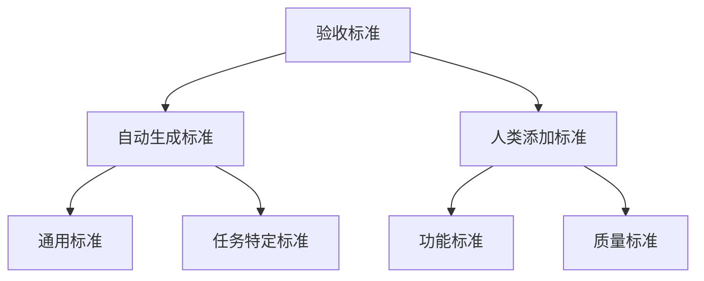
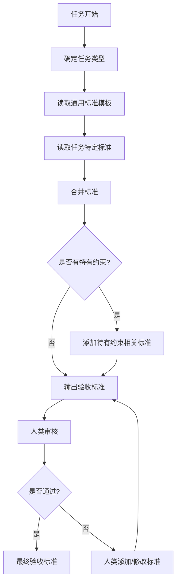

# 验收标准生成规则

> 文档标识：SOP-ACR-001
> 版本：2.0
> 更新日期：2026-04-01
> 维护人：SOP管理员
> 状态：已发布

> 本文档定义AI数字员工根据任务类型自动生成验收标准的规则。
> 验收标准是任务完成的质量门槛，AI必须按照本规则生成，人类可在此基础上添加特定标准。

---

## 1. 验收标准体系

### 1.1 标准层级



### 1.2 生成优先级

| 优先级 | 类型 | 说明 |
|--------|------|------|
| P0 | 自动生成标准 | AI必须生成，不可省略 |
| P1 | 任务特定标准 | 根据任务类型自动生成 |
| P2 | 人类添加标准 | 人类可额外添加 |

---

## 2. 任务类型与验收标准

### 2.1 代码生成类任务

#### 适用任务类型
- 后端代码生成（AI-BE）
- 前端代码生成（AI-FE）
- 单元测试生成（AI-Test）

#### 自动生成标准

| 序号 | 验收标准 | 验证方式 | 优先级 |
|------|----------|----------|--------|
| 1 | 编译通过 | `mvn compile` / `npm run build` | P0 |
| 2 | 单元测试通过（覆盖率≥70%） | `mvn test` / `npm run test` | P0 |
| 3 | 符合代码规范（静态检查无高危） | 静态分析工具 | P0 |
| 4 | 无编译警告 | 编译器输出 | P1 |
| 5 | 代码可正常运行 | 简单功能验证 | P1 |

#### 后端代码特定标准

| 序号 | 验收标准 | 验证方式 | 优先级 |
|------|----------|----------|--------|
| 1 | RESTful API返回格式正确 | 接口测试 | P1 |
| 2 | 异常处理完善 | 异常场景测试 | P1 |
| 3 | 日志记录完整 | 代码审查 | P2 |

#### 前端代码特定标准

| 序号 | 验收标准 | 验证方式 | 优先级 |
|------|----------|----------|--------|
| 1 | 页面可正常渲染 | 浏览器检查 | P1 |
| 2 | 交互响应正常 | 用户操作测试 | P1 |
| 3 | 无控制台错误 | 浏览器控制台 | P1 |

---

### 2.2 代码审查类任务

#### 适用任务类型
- 代码审查（AI-Reviewer）
- 安全扫描（AI-Reviewer）

#### 自动生成标准

| 序号 | 验收标准 | 验证方式 | 优先级 |
|------|----------|----------|--------|
| 1 | 代码扫描完成率100% | 扫描工具输出 | P0 |
| 2 | 无高危安全问题 | 安全扫描报告 | P0 |
| 3 | 无阻断级别Bug | Bug列表 | P0 |
| 4 | 提供优化建议 | 审查报告 | P1 |
| 5 | 代码规范问题≤5个 | 规范检查报告 | P1 |

---

### 2.3 测试执行类任务

#### 适用任务类型
- 功能测试（AI-Test）
- 回归测试（AI-Test）
- 集成测试（AI-Test）

#### 自动生成标准

| 序号 | 验收标准 | 验证方式 | 优先级 |
|------|----------|----------|--------|
| 1 | 测试用例执行率100% | 测试执行报告 | P0 |
| 2 | 阻断缺陷（P0）数量=0 | 缺陷报告 | P0 |
| 3 | 严重缺陷（P1）数量=0 | 缺陷报告 | P0 |
| 4 | 一般缺陷（P2）数量≤3 | 缺陷报告 | P1 |
| 5 | 生成完整测试报告 | 报告文档 | P0 |

#### 测试覆盖标准

| 指标 | 目标 | 优先级 |
|------|------|--------|
| 功能覆盖率 | ≥95% | P0 |
| 代码覆盖率 | ≥70% | P1 |
| 边界覆盖率 | ≥80% | P1 |

---

### 2.4 需求分析类任务

#### 适用任务类型
- 需求整理（AI-PM）
- 用户故事编写（AI-PM）
- 验收标准编写（AI-PM）

#### 自动生成标准

| 序号 | 验收标准 | 验证方式 | 优先级 |
|------|----------|----------|--------|
| 1 | 用户故事完整性≥95% | 人工检查 | P0 |
| 2 | 每个用户故事有明确验收标准 | 人工检查 | P0 |
| 3 | 覆盖所有业务场景 | 场景清单对比 | P0 |
| 4 | 无逻辑矛盾 | 人工审查 | P1 |
| 5 | 需求可测试 | 评审 | P1 |

#### 用户故事标准

| 字段 | 要求 | 优先级 |
|------|------|--------|
| 故事描述 | 包含"作为...我希望..."格式 | P0 |
| 验收标准 | 明确可验证 | P0 |
| 优先级 | P0/P1/P2标注 | P1 |
| 故事点 | 估算值 | P2 |

---

### 2.5 技术方案类任务

#### 适用任务类型
- 技术方案设计（AI-Architect）
- 架构设计（AI-Architect）
- 数据库设计（AI-Architect）

#### 自动生成标准

| 序号 | 验收标准 | 验证方式 | 优先级 |
|------|----------|----------|--------|
| 1 | 架构设计合理且可扩展 | 技术评审 | P0 |
| 2 | 技术风险识别完整 | 风险清单 | P0 |
| 3 | 方案可执行 | 技术评审 | P0 |
| 4 | 技术选型有明确理由 | 评审 | P1 |
| 5 | 包含性能考虑 | 评审 | P1 |

#### 架构设计标准

| 检查项 | 要求 | 优先级 |
|--------|------|--------|
| 模块划分 | 清晰合理，职责单一 | P0 |
| 接口设计 | RESTful规范 | P1 |
| 数据模型 | 满足业务需求 | P0 |
| 扩展性 | 支持未来扩展 | P1 |

#### 产品蓝图一致性检查（P0）

> 技术方案生成时必须通过

| 序号 | 验收标准 | 验证方式 | 优先级 |
|------|----------|----------|--------|
| 1 | 技术选型与产品蓝图100%一致 | 对照蓝图技术栈检查 | P0 |
| 2 | 不存在偏离蓝图的技术自由发挥 | 检查技术方案与蓝图差异 | P0 |
| 3 | 版本规划遵循蓝图阶段划分 | 检查版本目标与蓝图一致 | P1 |
| 4 | 技术选型一致性说明完整 | 检查一致性输出格式 | P0 |

#### 数据库设计专项标准

> 数据库设计必须与目标数据库兼容

| 序号 | 验收标准 | 验证方式 | 优先级 |
|------|----------|----------|--------|
| 1 | 数据类型与目标数据库100%兼容 | 对照数据库类型文档检查 | P0 |
| 2 | 不使用目标数据库不支持的数据类型 | 数据库文档对照 | P0 |
| 3 | 主键类型选择合理（如自增用serial/bigserial） | 技术评审 | P1 |
| 4 | 时间类型选择正确（timestamp vs timestamptz） | 技术评审 | P1 |
| 5 | 字符串类型选择合理（text vs varchar） | 技术评审 | P1 |
| 6 | 必须输出目标数据库类型和版本 | 检查文档完整性 | P0 |
| 7 | 必须包含该数据库的DDL建表语句 | 代码审查 | P0 |
| 8 | 数据类型使用目标数据库原生类型 | 类型对照 | P0 |

---

### 2.6 文档生成类任务

#### 适用任务类型
- 技术文档（AI-Writer）
- API文档（AI-Writer）
- 会议纪要（AI-Writer）

#### 自动生成标准

| 序号 | 验收标准 | 验证方式 | 优先级 |
|------|----------|----------|--------|
| 1 | 内容完整 | 人工检查 | P0 |
| 2 | 格式规范统一 | 格式检查 | P0 |
| 3 | 图表清晰准确 | 人工审查 | P1 |
| 4 | 无明显错误 | 人工审查 | P0 |
| 5 | 易于阅读理解 | 人工审查 | P1 |

#### API文档特定标准

| 序号 | 验收标准 | 验证方式 | 优先级 |
|------|----------|----------|--------|
| 1 | 所有接口有文档说明 | 人工检查 | P0 |
| 2 | 请求参数说明完整 | 参数对照 | P0 |
| 3 | 响应示例正确 | 格式验证 | P0 |
| 4 | 错误码说明完整 | 错误码表 | P1 |

---

## 3. 验收标准生成流程

### 3.1 生成流程



### 3.2 标准格式

```markdown
## 验收标准

### 自动生成标准

| 序号 | 验收标准 | 验证方式 | 优先级 |
|------|----------|----------|--------|
| 1 | 编译通过 | mvn compile | P0 |
| 2 | 单元测试通过 | mvn test | P0 |
| ... | ... | ... | ... |

### 人类添加标准

| 序号 | 验收标准 | 验证方式 | 优先级 |
|------|----------|----------|--------|
| 1 | [人类添加内容] | [验证方式] | P2 |
```

---

## 4. 验证方式说明

### 4.1 验证方式分类

| 验证方式 | 说明 | 适用标准 |
|----------|------|----------|
| 命令执行 | 运行构建/测试命令 | 编译、测试 |
| 接口测试 | 调用API验证功能 | API正确性 |
| 人工检查 | 人工审查 | 文档完整性 |
| 静态分析 | 自动化分析工具 | 代码规范 |
| 浏览器检查 | 前端渲染检查 | 页面显示 |

### 4.2 验证命令参考

| 类型 | 命令 | 说明 |
|------|------|------|
| Java编译 | `mvn compile` | 编译Java代码 |
| Java测试 | `mvn test` | 运行单元测试 |
| 前端构建 | `npm run build` | 构建前端 |
| 前端测试 | `npm run test` | 运行测试 |
| 静态分析 | `mvn pmd:pmd` | 代码分析 |
| 安全扫描 | `mvn dependency:analyze` | 依赖分析 |

---

## 5. 优先级规则

### 5.1 优先级定义

| 优先级 | 含义 | 必须满足 |
|--------|------|----------|
| P0 | 必须满足 | 是（发布前） |
| P1 | 重要 | 是（发布前） |
| P2 | 建议 | 否（下迭代） |

### 5.2 优先级调整

| 场景 | 调整规则 |
|------|----------|
| P0不通过 | 任务不通过，需修复 |
| P1不通过 | 任务延期，需在下迭代修复 |
| P2不通过 | 记录但不阻塞发布 |

---

## 6. 质量检查

### 6.1 生成完整性检查

- [ ] 自动生成标准完整
- [ ] 验证方式已指定
- [ ] 优先级已标注
- [ ] 人类添加标准区域存在

### 6.2 生成准确性检查

- [ ] 标准与任务类型匹配
- [ ] 验证方式可执行
- [ ] 优先级合理

---

## 附录

### 附录A：验证命令速查表

| 技术栈 | 编译 | 测试 | 分析 | 安全 |
|--------|------|------|------|------|
| Java | mvn compile | mvn test | mvn pmd:pmd | mvn dependency:analyze |
| Node.js | npm run build | npm run test | npm run lint | npm audit |
| Python | python -m compile | pytest | pylint | safety check |

### 附录B：覆盖率要求

| 类型 | 覆盖率要求 |
|------|------------|
| 单元测试覆盖率 | ≥70% |
| 功能测试覆盖率 | ≥95% |
| 边界测试覆盖率 | ≥80% |

---

## 变更记录

| 版本 | 日期 | 变更人 | 变更说明 |
|------|------|--------|----------|
| 1.0 | 2026-03-31 | SOP管理员 | 初始版本 |
| 2.0 | 2026-04-01 | SOP管理员 | 新增技术方案类产品蓝图一致性检查（P0）；新增数据库设计专项标准；强化技术选型一致性要求 |
