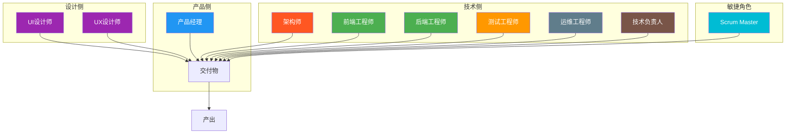

# 人类角色定义

> 本文档定义迭代过程中的人类角色及其职责边界。

## 1. 角色总览

## 2. 产品侧角色

### 2.1 产品经理（PM）

| 属性 | 内容 |
|------|------|
| **核心职责** | 业务价值定义、需求管理、优先级排序、验收标准制定 |
| **主要产出** | PRD、需求文档、验收标准、业务反馈 |
| **汇报对象** | 业务方/管理层 |
| **协作角色** | 开发、设计、测试、业务方 |

**职责清单**：
- 梳理和定义业务需求
- 编写需求文档和用户故事
- 制定需求优先级
- 明确验收标准
- 主持需求评审会议
- 确认UI/UX设计方案
- 验收功能实现
- 收集和反馈业务需求

**决策边界**：
- ✅ 需求优先级
- ✅ 验收标准
- ✅ 业务功能范围
- ❌ 技术实现方案
- ❌ 代码架构

### 2.2 业务方

| 属性 | 内容 |
|------|------|
| **核心职责** | 业务需求提出、业务价值确认 |
| **主要产出** | 业务需求、业务反馈 |
| **协作角色** | 产品经理 |

## 3. 设计侧角色

### 3.1 UI设计师

| 属性 | 内容 |
|------|------|
| **核心职责** | 界面视觉设计、设计规范制定、设计验收 |
| **主要产出** | 设计稿、设计规范、切图标注 |
| **协作角色** | 产品经理、前端工程师、UX设计师 |

**职责清单**：
- 根据需求完成界面设计
- 制定和维护设计规范
- 提供切图和标注
- 参与设计评审
- 验收前端还原度

**决策边界**：
- ✅ 视觉风格
- ✅ 配色方案
- ✅ 布局规范
- ❌ 业务逻辑

### 3.2 UX设计师

| 属性 | 内容 |
|------|------|
| **核心职责** | 交互设计、用户体验优化、信息架构 |
| **主要产出** | 交互原型、用户体验报告、信息架构 |
| **协作角色** | 产品经理、UI设计师 |

**职责清单**：
- 设计交互流程和原型
- 优化用户体验
- 进行可用性测试
- 设计信息架构
- 分析用户行为数据

## 4. 技术侧角色

### 4.1 架构师

| 属性 | 内容 |
|------|------|
| **核心职责** | 技术架构设计、技术方案评审、技术风险识别 |
| **主要产出** | 架构设计文档、技术方案、技术评审报告 |
| **协作角色** | 技术负责人、后端工程师 |

**职责清单**：
- 设计系统架构方案
- 评审技术实现方案
- 识别技术风险
- 制定技术标准
- 评估技术选型
- 指导关键技术实现

**决策边界**：
- ✅ 技术架构
- ✅ 技术选型
- ✅ 技术规范
- ❌ 业务功能范围

### 4.2 前端工程师

| 属性 | 内容 |
|------|------|
| **核心职责** | 前端开发、组件开发、性能优化 |
| **主要产出** | 前端代码、组件库、技术文档 |
| **协作角色** | UI设计师、后端工程师、测试工程师 |

**职责清单**：
- 根据设计稿实现前端页面
- 开发和维护组件库
- 优化前端性能
- 编写前端技术文档
- 参与代码审查
- 配合测试工作

**决策边界**：
- ✅ 前端实现方案
- ✅ 代码规范（前端）
- ❌ 后端业务逻辑

### 4.3 后端工程师

| 属性 | 内容 |
|------|------|
| **核心职责** | 后端API开发、业务逻辑实现、数据库设计 |
| **主要产出** | 后端代码、API文档、数据库脚本 |
| **协作角色** | 架构师、前端工程师、测试工程师 |

**职责清单**：
- 实现后端业务逻辑
- 设计和实现API接口
- 设计和实现数据库
- 编写技术文档
- 参与代码审查
- 配合测试工作

**决策边界**：
- ✅ 后端实现方案
- ✅ 代码规范（后端）
- ❌ 界面设计

### 4.4 测试工程师

| 属性 | 内容 |
|------|------|
| **核心职责** | 测试策略制定、测试用例编写、缺陷管理 |
| **主要产出** | 测试用例、测试报告、缺陷报告 |
| **协作角色** | 产品经理、开发工程师 |

**职责清单**：
- 编写测试用例
- 执行功能测试
- 跟踪和验证缺陷
- 编写测试报告
- 进行回归测试
- 评估测试覆盖率

**决策边界**：
- ✅ 测试策略
- ✅ 测试用例
- ✅ 缺陷级别判定

### 4.5 运维工程师

| 属性 | 内容 |
|------|------|
| **核心职责** | 环境部署、CI/CD维护、监控告警 |
| **主要产出** | 部署配置、监控方案、运维手册 |
| **协作角色** | 开发工程师 |

**职责清单**：
- 维护CI/CD流水线
- 管理系统环境
- 配置监控告警
- 处理线上问题
- 制定备份策略
- 保障系统安全

## 5. 敏捷管理角色

### 5.1 技术负责人

| 属性 | 内容 |
|------|------|
| **核心职责** | 技术决策、代码审查批准、发布审批、技术风险评估 |
| **主要产出** | 技术决策记录、代码合并批准、发布批准 |
| **协作角色** | 架构师、开发工程师、测试工程师 |

**职责清单**：
- 审批技术方案和技术选型
- 批准代码合并请求
- 审批发布申请
- 评估技术风险
- 协调跨团队技术问题
- 制定技术规范

**决策边界**：
- ✅ 技术决策
- ✅ 代码合并审批
- ✅ 发布审批
- ✅ 技术规范制定
- ❌ 业务功能范围
- ❌ 产品优先级

### 5.2 Scrum Master（SM）

| 属性 | 内容 |
|------|------|
| **核心职责** | 迭代过程管理、团队协调、障碍移除 |
| **主要产出** | 迭代计划、迭代总结、改进措施 |
| **协作角色** | PM、全体团队成员 |

**职责清单**：
- 主持迭代计划会议
- 主持每日站会
- 协调团队内部问题
- 移除团队障碍
- 跟踪迭代进度
- 主持迭代回顾会议
- 协调与其他团队的协作

**决策边界**：
- ✅ 迭代过程管理
- ✅ 会议组织
- ✅ 进度跟踪
- ❌ 业务决策
- ❌ 技术决策
- ❌ 产品决策

### 5.3 兼任说明

> 技术负责人和Scrum Master可由开发工程师兼任，但需确保职责不冲突。

## 6. 小团队角色兼任规则

> 在5人以下小团队中，角色可由同一人员兼任，但需确保职责不冲突。

### 6.1 兼任方案

| 方案 | 角色组合 | 适用场景 |
|------|----------|----------|
| 方案1 | PM + UI设计师 | 无专职设计师 |
| 方案2 | 后端 + 运维 | 简单系统 |
| 方案3 | 前端 + 后端 + 架构师 | 全栈开发 |
| 方案4 | 开发 + 测试 | 无专职QA |

### 6.2 兼任限制

| 限制项 | 说明 |
|--------|------|
| 核心验证环节 | 不可兼任，需独立角色 |
| 审批环节 | 不可兼任，需独立审批 |
| 利益冲突 | 产出者和验收者不可为同一人 |
