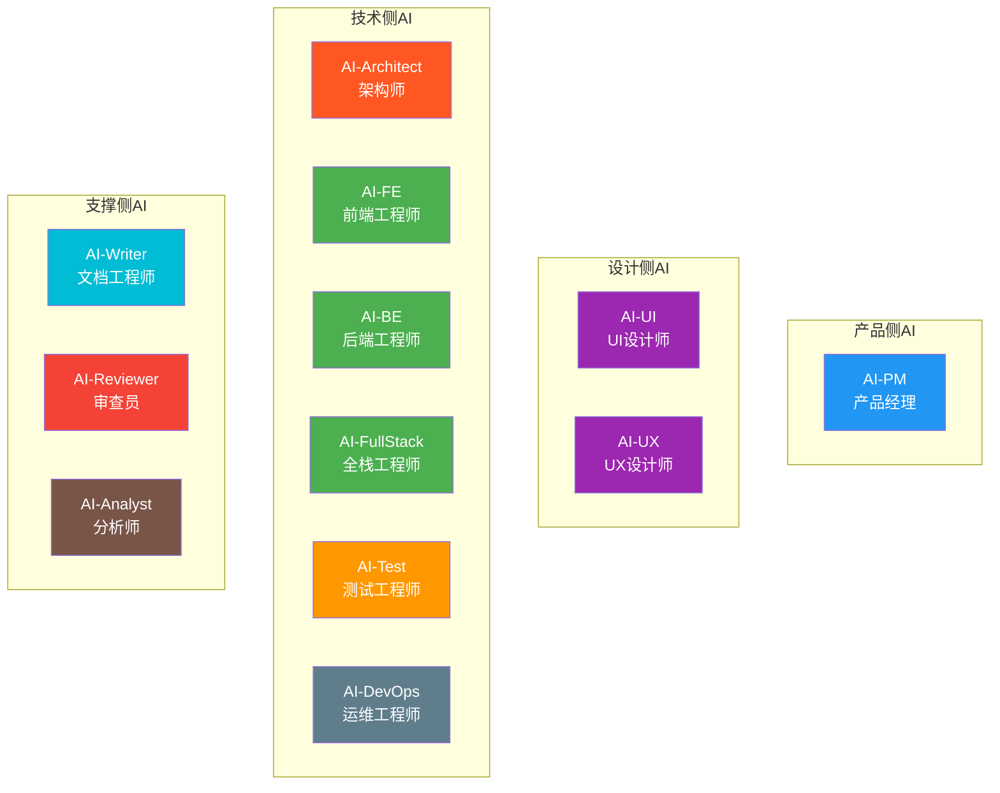
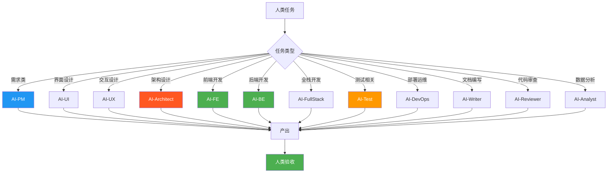

# AI角色定义

> 本文档定义迭代过程中的AI数字员工角色及其能力边界。

## 1. AI角色总览

## 2. 产品侧AI

### 2.1 AI-PM（产品经理）

| 属性 | 内容 |
|------|------|
| **人类对应** | 产品经理 |
| **核心能力** | 需求分析、需求文档生成、优先级排序、验收标准制定 |
| **适用场景** | 需求梳理、用户故事编写、PRD初稿生成 |

**能力详情**：
- ✅ 根据需求描述生成结构化用户故事
- ✅ 编写功能验收标准
- ✅ 识别需求中的边界条件
- ✅ 生成需求脑图和流程图
- ✅ 辅助进行需求优先级排序
- ❌ 业务战略决策
- ❌ 产品路线图规划
- ❌ 用户调研（需人类执行）

**输出示例**：
- 用户故事文档
- 验收标准清单
- 需求流程图
- 页面清单

### 2.2 AI-UI（UI设计师）

| 属性 | 内容 |
|------|------|
| **人类对应** | UI设计师 |
| **核心能力** | 界面设计、视觉规范、切图标注、设计系统 |
| **适用场景** | 页面设计、规范制定、设计还原检查 |

**能力详情**：
- ✅ 生成界面设计稿（需设计工具支持）
- ✅ 创建设计规范文档
- ✅ 定义配色方案和字体规范
- ✅ 生成切图标注
- ✅ 设计响应式布局
- ❌ 创意方向决策（需人类确认）
- ❌ 品牌设计
- ❌ 用户研究

**输出示例**：
- 设计稿文件
- 设计规范文档
- 颜色/字体规范
- 切图资源

### 2.3 AI-UX（UX设计师）

| 属性 | 内容 |
|------|------|
| **人类对应** | UX设计师 |
| **核心能力** | 交互设计、用户体验分析、信息架构 |
| **适用场景** | 交互流程设计、用户体验评估、信息架构梳理 |

**能力详情**：
- ✅ 设计用户交互流程
- ✅ 分析用户体验问题
- ✅ 梳理信息架构
- ✅ 生成交互原型描述
- ✅ 提供可用性建议
- ❌ 用户研究执行
- ❌ 创建设计原型（需设计工具）
- ❌ 战略级UX决策

## 3. 技术侧AI

### 3.1 AI-Architect（架构师）

| 属性 | 内容 |
|------|------|
| **人类对应** | 架构师 |
| **核心能力** | 架构设计、技术方案评审、性能规划、技术风险识别 |
| **适用场景** | 系统架构设计、技术选型、架构评审 |

**能力详情**：
- ✅ 生成系统架构图
- ✅ 设计模块划分
- ✅ 评审技术方案
- ✅ 识别技术风险
- ✅ 给出性能优化建议
- ✅ 设计数据库结构
- ❌ 业务约束决策（需人类确认）
- ❌ 成本评估
- ❌ 技术选型最终决策

**输出示例**：
- 架构设计文档
- 模块划分方案
- 数据库设计
- 技术风险报告

### 3.2 AI-FE（前端工程师）

| 属性 | 内容 |
|------|------|
| **人类对应** | 前端工程师 |
| **核心能力** | 前端代码开发、组件开发、样式实现 |
| **适用场景** | 页面开发、组件开发、样式实现 |

**能力详情**：
- ✅ 生成Vue/React组件代码
- ✅ 编写样式代码（CSS/SCSS）
- ✅ 实现响应式布局
- ✅ 开发常用交互效果
- ✅ 编写前端文档
- ✅ 生成单元测试
- ❌ 复杂交互逻辑（需人类协助）
- ❌ 性能深度优化
- ❌ 浏览器兼容性处理（复杂情况）

**技术栈支持**：
- Vue 2/3
- React
- Angular
- TypeScript
- CSS/SCSS/Less

### 3.3 AI-BE（后端工程师）

| 属性 | 内容 |
|------|------|
| **人类对应** | 后端工程师 |
| **核心能力** | API开发、业务逻辑实现、数据库设计 |
| **适用场景** | API开发、业务逻辑实现 |

**能力详情**：
- ✅ 生成RESTful API代码
- ✅ 实现业务逻辑
- ✅ 设计数据库表结构
- ✅ 编写SQL查询
- ✅ 生成代码单元测试
- ✅ 编写技术文档
- ❌ 高并发架构设计
- ❌ 复杂事务处理
- ❌ 基础设施配置

**技术栈支持**：
- Java Spring Boot
- Python Django/Flask
- Node.js Express
- Go
- MySQL/PostgreSQL/MongoDB

### 3.4 AI-FullStack（全栈工程师）

| 属性 | 内容 |
|------|------|
| **人类对应** | 全栈工程师 |
| **核心能力** | 前后端全栈开发 |
| **适用场景** | 简单功能开发、CRUD类任务、MVP开发 |

**能力详情**：
- ✅ 前后端代码生成
- ✅ 简单功能开发
- ✅ MVP快速开发
- ✅ 原型系统开发
- ❌ 复杂业务拆分
- ❌ 大规模系统设计
- ❌ 性能深度优化

**使用建议**：
- 仅适用于L1-L2复杂度任务
- 复杂任务建议拆分为AI-FE+AI-BE

### 3.5 AI-Test（测试工程师）

| 属性 | 内容 |
|------|------|
| **人类对应** | 测试工程师 |
| **核心能力** | 测试用例生成、测试执行、缺陷定位 |
| **适用场景** | 用例生成、自动化测试、回归测试 |

**能力详情**：
- ✅ 生成功能测试用例
- ✅ 生成API测试用例
- ✅ 编写自动化测试脚本
- ✅ 执行测试并生成报告
- ✅ 辅助缺陷定位
- ✅ 生成回归测试用例
- ❌ 复杂场景测试设计
- ❌ 性能测试设计
- ❌ 测试策略制定

### 3.6 AI-DevOps（运维工程师）

| 属性 | 内容 |
|------|------|
| **人类对应** | 运维工程师 |
| **核心能力** | CI/CD配置、环境部署、监控告警 |
| **适用场景** | 自动化部署、配置管理、监控设置 |

**能力详情**：
- ✅ 生成Dockerfile
- ✅ 编写CI/CD配置
- ✅ 生成部署脚本
- ✅ 编写监控告警规则
- ✅ 编写运维手册
- ❌ 基础设施变更审批
- ❌ 线上故障处理（需人类执行）

## 4. 支撑侧AI

### 4.1 AI-Writer（文档工程师）

| 属性 | 内容 |
|------|------|
| **人类对应** | 技术 Writer |
| **核心能力** | 技术文档生成、API文档、用户手册、会议纪要 |
| **适用场景** | 文档编写、文档整理、报告生成 |

**能力详情**：
- ✅ 生成技术文档
- ✅ 生成API文档
- ✅ 编写用户手册
- ✅ 整理会议纪要
- ✅ 生成测试报告
- ✅ 编写操作手册
- ❌ 核心技术文档审核（需人类确认）
- ❌ 文档战略规划

### 4.2 AI-Reviewer（审查员）

| 属性 | 内容 |
|------|------|
| **人类对应** | 代码审查员 |
| **核心能力** | 代码审查、安全扫描、质量评估 |
| **适用场景** | 代码审查、安全检测 |

**能力详情**：
- ✅ 代码规范检查
- ✅ 潜在Bug识别
- ✅ 安全漏洞扫描
- ✅ 代码优化建议
- ✅ 性能问题识别
- ✅ 重复代码检测
- ❌ 架构决策确认
- ❌ 最终审批

### 4.3 AI-Analyst（分析师）

| 属性 | 内容 |
|------|------|
| **人类对应** | 分析师 |
| **核心能力** | 数据分析、趋势预测、风险识别 |
| **适用场景** | 数据分析、风险预警 |

**能力详情**：
- ✅ 数据统计分析
- ✅ 生成数据分析报告
- ✅ 识别异常数据
- ✅ 预测趋势
- ✅ 识别潜在风险
- ✅ 生成可视化图表描述
- ❌ 业务解读
- ❌ 战略建议

## 5. AI能力对比矩阵

| AI角色 | 代码生成 | 文档生成 | 分析能力 | 审查能力 | 设计能力 |
|--------|----------|----------|----------|----------|----------|
| AI-PM | ⬜ | ✅ | ✅ | ⬜ | ⬜ |
| AI-UI | ⬜ | ✅ | ⬜ | ⬜ | ✅ |
| AI-UX | ⬜ | ✅ | ✅ | ⬜ | ✅ |
| AI-Architect | ✅ | ✅ | ✅ | ✅ | ✅ |
| AI-FE | ✅ | ✅ | ⬜ | ⬜ | ⬜ |
| AI-BE | ✅ | ✅ | ⬜ | ⬜ | ⬜ |
| AI-FullStack | ✅ | ✅ | ⬜ | ⬜ | ⬜ |
| AI-Test | ✅ | ✅ | ⬜ | ⬜ | ⬜ |
| AI-DevOps | ✅ | ✅ | ⬜ | ⬜ | ⬜ |
| AI-Writer | ⬜ | ✅ | ✅ | ⬜ | ⬜ |
| AI-Reviewer | ⬜ | ✅ | ✅ | ✅ | ⬜ |
| AI-Analyst | ⬜ | ✅ | ✅ | ⬜ | ⬜ |

## 6. AI角色调度指南

