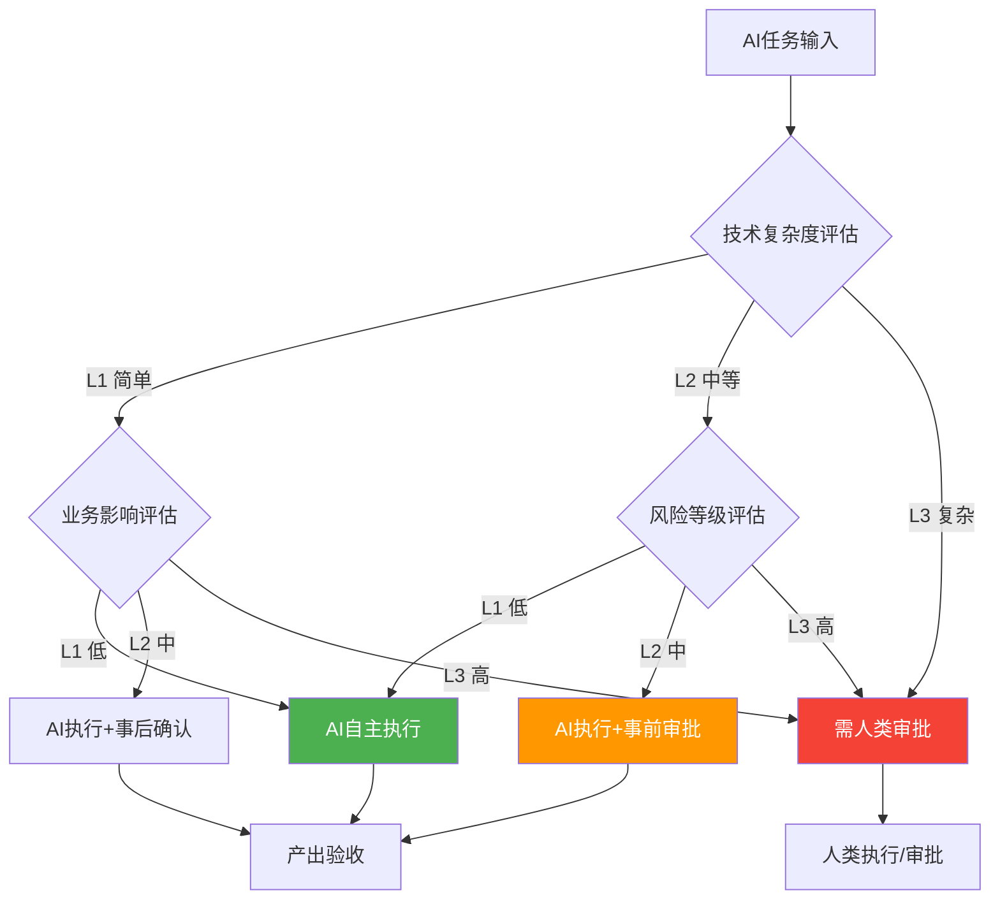
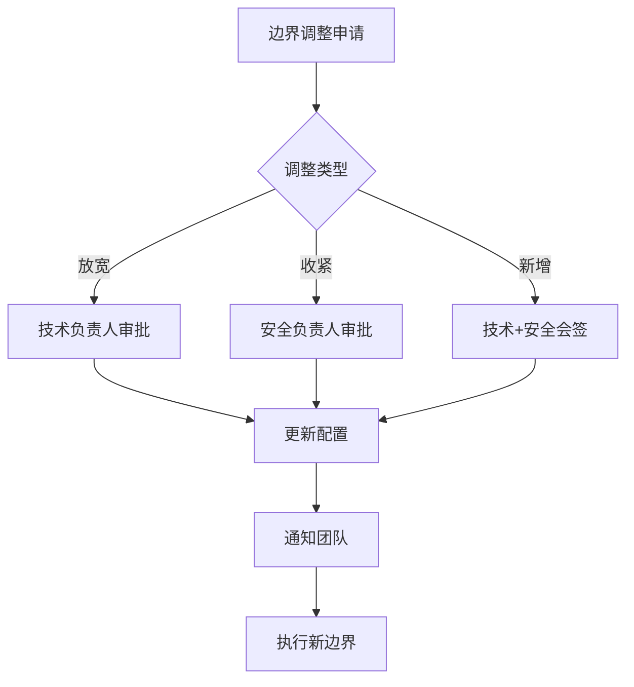

# AI自主边界定义

> 本文档定义AI数字员工的自主执行边界，明确哪些任务AI可以自主完成，哪些需要人类审批。

## 1. 边界定义原则

### 1.1 边界决策模型



### 1.2 边界判断公式

```
AI自主边界 = f(技术复杂度, 业务影响, 风险等级)

判断逻辑：
├── 技术复杂度 ≤ L2 且 业务影响 = L1-L2 → AI可自主执行
├── 技术复杂度 = L3 或 业务影响 = L3 → 需人类审批
└── 风险等级 = L3 → 禁止AI自主执行
```

## 2. 技术复杂度维度

### 2.1 复杂度评估指标

| 指标 | L1（简单） | L2（中等） | L3（复杂） |
|------|------------|------------|------------|
| **代码行数** | ≤100行 | 100-500行 | >500行 |
| **涉及模块数** | 1个 | 2-3个 | >3个 |
| **技术栈深度** | 单一技术 | 2种技术 | >2种技术 |
| **依赖复杂度** | 无外部依赖 | 简单依赖 | 复杂依赖 |
| **算法复杂度** | O(1)/O(n) | O(n²) | O(n³)及以上 |

### 2.2 任务复杂度示例

| 任务类型 | 复杂度 | 说明 |
|----------|--------|------|
| 简单CRUD | L1 | 单表增删改查 |
| 列表页面 | L1 | 简单展示+分页 |
| 表单提交 | L1 | 常规表单处理 |
| 业务计算 | L2 | 涉及多字段计算 |
| 报表功能 | L2 | 聚合查询 |
| 订单流程 | L2 | 状态机处理 |
| 支付集成 | L3 | 外部系统集成 |
| 分布式事务 | L3 | 多系统协调 |
| 实时通信 | L3 | WebSocket/长连接 |
| AI/ML集成 | L3 | 机器学习模型 |

## 3. 业务影响维度

### 3.1 业务影响评估指标

| 指标 | L1（低） | L2（中等） | L3（高） |
|------|----------|------------|----------|
| **用户范围** | 内部工具 | 部分用户 | 全量用户 |
| **数据敏感度** | 非敏感 | 内部数据 | 敏感/机密 |
| **功能重要性** | 辅助功能 | 重要功能 | 核心功能 |
| **业务可逆性** | 完全可逆 | 部分可逆 | 不可逆 |
| **影响时长** | 临时 | 短期 | 长期 |

### 3.2 业务影响示例

| 场景 | 影响级别 | 说明 |
|------|----------|------|
| 内部工具 | L1 | 仅内部使用 |
| 个人设置 | L1-L2 | 用户个人数据 |
| 社区功能 | L2 | 部分用户使用 |
| 核心交易 | L3 | 涉及金钱/重要数据 |
| 账户安全 | L3 | 涉及密码/认证 |
| 支付功能 | L3 | 涉及资金 |

## 4. 风险等级维度

### 4.1 风险评估指标

| 指标 | L1（低） | L2（中等） | L3（高） |
|------|----------|------------|----------|
| **可逆性** | 可快速回滚 | 需计划回滚 | 难以回滚 |
| **影响范围** | 单点影响 | 局部影响 | 全局影响 |
| **恢复难度** | 自动恢复 | 手动恢复 | 难以恢复 |
| **安全风险** | 无安全影响 | 轻度安全影响 | 严重安全影响 |
| **合规风险** | 无合规风险 | 轻度合规风险 | 严重合规风险 |

### 4.2 风险示例

| 场景 | 风险级别 | 说明 |
|------|----------|------|
| 样式调整 | L1 | 轻松回滚 |
| 文案修改 | L1 | 轻松回滚 |
| 功能新增 | L2 | 需回归测试 |
| 逻辑变更 | L2 | 需全面测试 |
| 数据迁移 | L3 | 不可逆操作 |
| 权限变更 | L3 | 安全敏感 |

## 5. 各环节AI自主边界

### 5.1 需求分析阶段

| 任务 | AI可执行 | 边界条件 | 人类审批点 |
|------|----------|----------|------------|
| 需求梳理 | ✅ | 非核心需求 | 业务价值判断 |
| 需求文档生成 | ✅ | 简单需求 | 完整性和准确性 |
| 验收标准编写 | ✅ | 常规功能 | 业务逻辑验证 |
| 优先级排序 | ⚠️ | 辅助建议 | 最终排序确认 |

### 5.2 技术设计阶段

| 任务 | AI可执行 | 边界条件 | 人类审批点 |
|------|----------|----------|------------|
| 技术方案生成 | ✅ | L1技术复杂度 | 技术可行性 |
| API设计 | ✅ | 标准RESTful | 接口规范性 |
| 数据库设计 | ✅ | 无敏感数据 | 数据模型合理性 |
| 技术风险识别 | ✅ | 仅识别 | 风险评估 |

### 5.3 开发实现阶段

| 任务 | AI可执行 | 边界条件 | 人类审批点 |
|------|----------|----------|------------|
| 代码生成 | ✅ | L1-L2复杂度 | 代码审查 |
| 代码重构 | ✅ | L1-L2 | 回归测试 |
| 单元测试生成 | ✅ | L1-L2 | 测试覆盖评估 |
| Bug修复 | ✅ | L1 | 修复验证 |

### 5.4 测试执行阶段

| 任务 | AI可执行 | 边界条件 | 人类审批点 |
|------|----------|----------|------------|
| 测试用例生成 | ✅ | L1-L2 | 覆盖度评估 |
| 自动化测试 | ✅ | 全级别 | 执行结果确认 |
| 缺陷定位 | ✅ | L1-L2 | 根因确认 |
| 回归测试 | ✅ | 全级别 | 结果确认 |

### 5.5 文档输出阶段

| 任务 | AI可执行 | 边界条件 | 人类审批点 |
|------|----------|----------|------------|
| 技术文档 | ✅ | 全级别 | 准确性审核 |
| API文档 | ✅ | 标准接口 | 规范性审核 |
| 会议纪要 | ✅ | 常规会议 | 完整性确认 |
| 测试报告 | ✅ | 全级别 | 数据准确性 |

## 6. 边界配置规则

### 6.1 AI权限对照表

| 级别组合 | AI权限 | 需要审批 | 示例 |
|----------|--------|----------|------|
| L1+L1+L1 | 完全自主 | 否 | 内部工具的简单功能 |
| L1+L1+L2 | 自主执行 | 事后确认 | 一般用户功能的常规开发 |
| L1+L2+L1 | 自主执行 | 事后确认 | 重要功能的技术实现 |
| L2+L1+L2 | 辅助为主 | 事前审批 | 非核心功能的开发 |
| L2+L2+L1 | 辅助为主 | 事前审批 | 重要功能的技术实现 |
| L2+L2+L2 | 禁止自主 | 全程审批 | 核心功能的开发 |
| L3任意组合 | 禁止AI | 人类执行 | 涉及敏感数据的核心功能 |

### 6.2 边界配置清单

```markdown
## AI自主边界配置

### 可自主执行的任务
- [ ] 简单CRUD功能开发（L1）
- [ ] 页面样式调整（L1）
- [ ] 文档生成（L1-L2）
- [ ] 测试用例生成（L1-L2）
- [ ] 代码审查（L1-L2）

### 需审批后执行的任务
- [ ] 复杂业务逻辑开发（L2）
- [ ] 外部系统集成（L2）
- [ ] 数据库结构变更（L2）
- [ ] 安全相关功能（L2+）

### 禁止AI自主执行的任务
- [ ] 核心交易功能（L3）
- [ ] 支付功能（L3）
- [ ] 权限控制（L3）
- [ ] 数据迁移（L3）
- [ ] 敏感数据处理（L3）
```

## 7. 边界动态调整

### 7.1 调整触发条件

| 条件类型 | 触发动作 |
|----------|----------|
| AI连续3次被拒绝 | 边界自动收紧 |
| 任务复杂度评估错误 | 边界重新评估 |
| 新技术引入 | 边界重新定义 |
| 安全事件 | 边界临时收紧 |

### 7.2 调整审批流程


