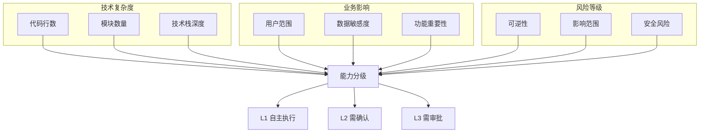

# 能力分级矩阵

> 本文档定义AI数字员工的能力分级体系，为边界判断提供量化依据。

## 1. 分级维度概览



## 2. 技术复杂度分级

### 2.1 代码行数分级

| 级别 | 代码行数 | 说明 |
|------|----------|------|
| L1 | ≤100行 | 单一函数或简单组件 |
| L2 | 100-500行 | 多个函数或复杂组件 |
| L3 | >500行 | 大型模块或系统级 |

### 2.2 模块数量分级

| 级别 | 模块数 | 说明 |
|------|--------|------|
| L1 | 1个 | 单一模块 |
| L2 | 2-3个 | 少量模块交互 |
| L3 | >3个 | 多模块复杂交互 |

### 2.3 技术栈深度分级

| 级别 | 技术复杂度 | 示例 |
|------|------------|------|
| L1 | 单一技术 | 仅使用Vue |
| L2 | 2种技术 | Vue + Node.js |
| L3 | >2种技术 | Vue + Node.js + Python |

## 3. 业务影响分级

### 3.1 用户范围分级

| 级别 | 用户范围 | 说明 |
|------|----------|------|
| L1 | 内部用户 | 仅公司内部使用 |
| L2 | 部分用户 | 注册用户子集 |
| L3 | 全量用户 | 所有用户 |

### 3.2 数据敏感度分级

| 级别 | 数据类型 | 示例 |
|------|----------|------|
| L1 | 非敏感 | 浏览记录、配置 |
| L2 | 内部敏感 | 个人信息、订单 |
| L3 | 高度敏感 | 支付信息、密码 |

### 3.3 功能重要性分级

| 级别 | 功能类型 | 示例 |
|------|----------|------|
| L1 | 辅助功能 | 引导、提示 |
| L2 | 重要功能 | 核心业务流程 |
| L3 | 核心功能 | 交易、账户 |

## 4. 风险等级分级

### 4.1 可逆性分级

| 级别 | 可逆程度 | 恢复难度 |
|------|----------|----------|
| L1 | 完全可逆 | 自动/即时 |
| L2 | 部分可逆 | 手动/短时 |
| L3 | 不可逆 | 难以恢复 |

### 4.2 影响范围分级

| 级别 | 影响范围 | 说明 |
|------|----------|------|
| L1 | 单点 | 仅影响单个用户 |
| L2 | 局部 | 影响部分用户 |
| L3 | 全局 | 影响所有用户 |

### 4.3 安全风险分级

| 级别 | 安全影响 | 示例 |
|------|----------|------|
| L1 | 无安全影响 | 样式调整 |
| L2 | 轻度安全影响 | XSS风险 |
| L3 | 严重安全影响 | 数据泄露 |

## 5. AI角色能力分级

### 5.1 AI-PM 能力分级

| 能力项 | 能力级别 | 说明 |
|--------|----------|------|
| 需求梳理 | L2 | 生成结构化需求 |
| 用户故事编写 | L1 | 标准用户故事模板 |
| 验收标准制定 | L2 | 常规验收标准 |
| 优先级排序 | L2 | 辅助建议 |

### 5.2 AI-Architect 能力分级

| 能力项 | 能力级别 | 说明 |
|--------|----------|------|
| 架构图生成 | L1 | 标准架构模式 |
| 模块划分 | L2 | 常规模块划分 |
| 数据库设计 | L2 | 标准数据库设计 |
| 技术评审 | L2 | 辅助评审建议 |

### 5.3 AI-FE 能力分级

| 能力项 | 能力级别 | 说明 |
|--------|----------|------|
| 组件开发 | L1-L2 | 简单-中等复杂度 |
| 页面开发 | L1-L2 | 常规页面 |
| 样式实现 | L1 | CSS/SCSS |
| 响应式适配 | L1-L2 | 标准响应式 |

### 5.4 AI-BE 能力分级

| 能力项 | 能力级别 | 说明 |
|--------|----------|------|
| API开发 | L1-L2 | 常规RESTful |
| 业务逻辑 | L2 | 中等复杂度 |
| 数据库操作 | L1-L2 | CRUD+查询 |
| 缓存使用 | L2 | 标准缓存设计 |

### 5.5 AI-Test 能力分级

| 能力项 | 能力级别 | 说明 |
|--------|----------|------|
| 用例生成 | L1-L2 | 功能测试用例 |
| API测试 | L1 | HTTP接口测试 |
| 单元测试 | L1-L2 | 代码级测试 |
| 缺陷定位 | L1 | 简单缺陷分析 |

### 5.6 AI-Writer 能力分级

| 能力项 | 能力级别 | 说明 |
|--------|----------|------|
| 技术文档 | L1-L2 | 标准技术文档 |
| API文档 | L1 | OpenAPI规范 |
| 会议纪要 | L1 | 常规会议 |
| 测试报告 | L1-L2 | 标准报告模板 |

### 5.7 AI-Reviewer 能力分级

| 能力项 | 能力级别 | 说明 |
|--------|----------|------|
| 代码规范 | L1 | Lint规则检查 |
| 安全扫描 | L1-L2 | 常见漏洞检测 |
| 性能分析 | L1 | 简单性能问题 |
| Bug识别 | L1-L2 | 常见Bug模式 |

## 6. 综合分级判定表

### 6.1 任务-能力匹配表

| 任务类型 | 最低能力要求 | 适用AI角色 |
|----------|--------------|------------|
| 简单CRUD | L1 | AI-FE, AI-BE, AI-FullStack |
| 复杂业务 | L2 | AI-BE, AI-FullStack |
| 架构设计 | L2 | AI-Architect |
| 用例生成 | L1-L2 | AI-Test |
| 文档编写 | L1-L2 | AI-Writer |
| 代码审查 | L1-L2 | AI-Reviewer |

### 6.2 边界触发表

| 技术复杂度 | 业务影响 | 风险等级 | AI权限 |
|------------|----------|----------|--------|
| L1 | L1 | L1 | 完全自主 |
| L1 | L1 | L2 | 自主+确认 |
| L1 | L2 | L1 | 自主+确认 |
| L2 | L1 | L1 | 自主+确认 |
| L2 | L2 | L2 | 需审批 |
| L3 | - | - | 禁止 |
| - | L3 | - | 禁止 |
| - | - | L3 | 禁止 |

## 7. 分级评估工具

### 7.1 快速评估清单

```markdown
## 任务分级快速评估

### 技术复杂度评估
- [ ] 代码量 ≤100行? → L1
- [ ] 代码量 100-500行? → L2  
- [ ] 代码量 >500行? → L3
- [ ] 涉及模块 ≤1个? → L1
- [ ] 涉及模块 2-3个? → L2
- [ ] 涉及模块 >3个? → L3

### 业务影响评估
- [ ] 仅内部用户? → L1
- [ ] 部分注册用户? → L2
- [ ] 全量用户? → L3
- [ ] 非敏感数据? → L1
- [ ] 个人信息? → L2
- [ ] 支付/密码? → L3

### 风险等级评估
- [ ] 可快速回滚? → L1
- [ ] 需手动回滚? → L2
- [ ] 难以回滚? → L3
- [ ] 无安全风险? → L1
- [ ] 轻度安全风险? → L2
- [ ] 严重安全风险? → L3
```

### 7.2 自动化评估

> 建议：开发自动化评估工具，输入任务描述自动输出分级结果

**评估输入**：
- 任务描述
- 技术栈信息
- 涉及数据敏感度
- 预期影响范围

**评估输出**：
- 技术复杂度分级
- 业务影响分级
- 风险等级分级
- 建议AI权限
