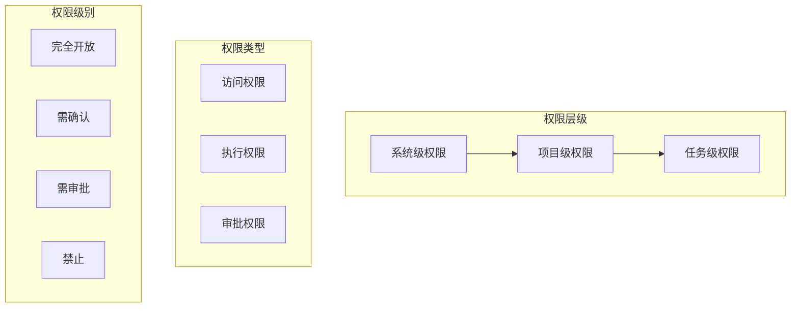
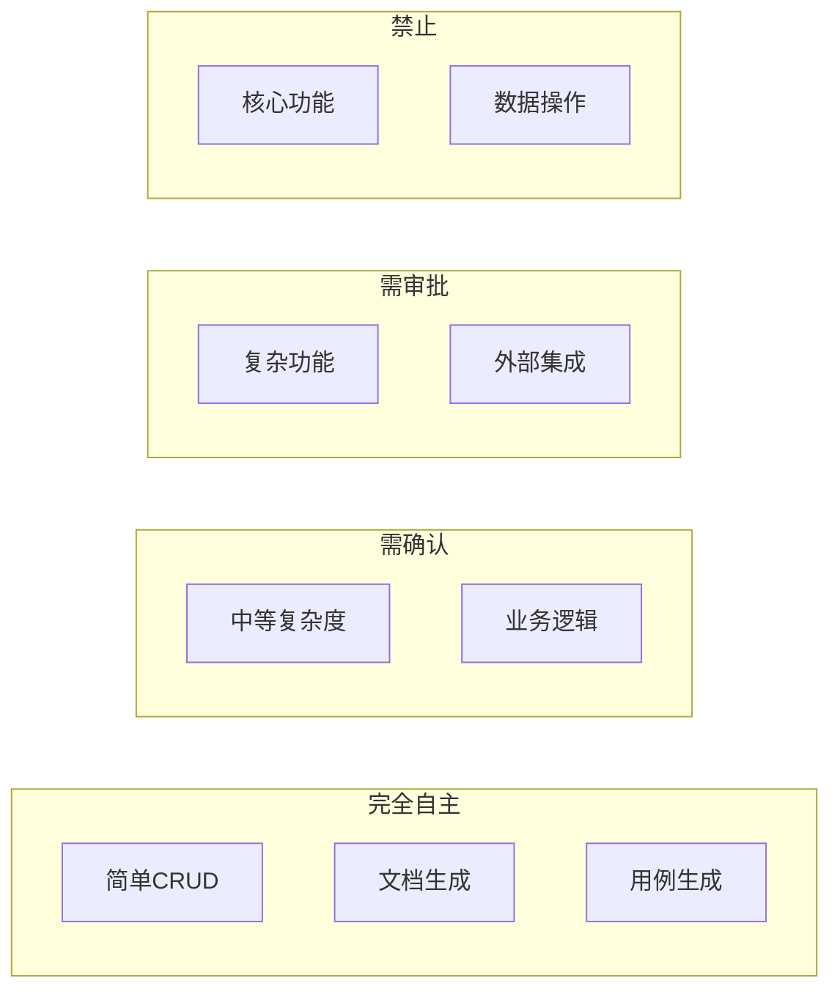
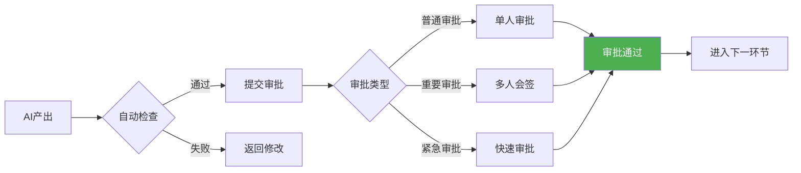
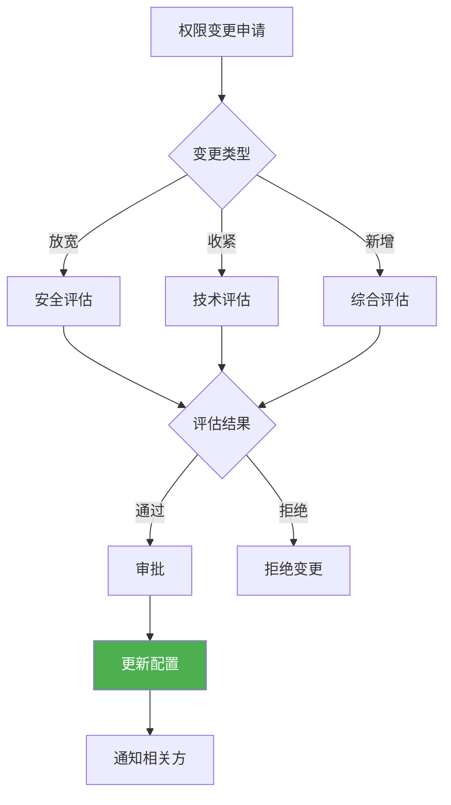

# 权限配置

> 本文档定义AI数字员工的权限配置规则，包括访问权限、执行权限、审批权限。

## 1. 权限体系概览



## 2. 访问权限配置

### 2.1 系统级访问权限

| AI角色 | 代码仓库 | 文档库 | 设计稿 | 监控系统 |
|--------|----------|--------|--------|----------|
| AI-PM | 只读 | 读写 | 只读 | 只读 |
| AI-UI | 只读 | 只读 | 读写 | - |
| AI-UX | 只读 | 只读 | 读写 | - |
| AI-Architect | 只读 | 读写 | 只读 | 只读 |
| AI-FE | 读写 | 读写 | 只读 | 只读 |
| AI-BE | 读写 | 读写 | - | 只读 |
| AI-FullStack | 读写 | 读写 | 只读 | 只读 |
| AI-Test | 只读 | 读写 | - | 只读 |
| AI-DevOps | 读写 | 读写 | - | 读写 |
| AI-Writer | 只读 | 读写 | 只读 | 只读 |
| AI-Reviewer | 只读 | 只读 | - | - |
| AI-Analyst | 只读 | 只读 | - | 只读 |

### 2.2 项目级访问权限

```markdown
## 项目访问权限配置

### 访问控制矩阵
| 资源类型 | AI-PM | AI-FE | AI-BE | AI-Test | AI-Writer |
|----------|-------|-------|-------|---------|-----------|
| 需求文档 | 读写 | 只读 | 只读 | 只读 | 只读 |
| 技术方案 | 只读 | 只读 | 读写 | 只读 | 只读 |
| 代码文件 | - | 读写 | 读写 | 只读 | - |
| 测试用例 | - | 只读 | 只读 | 读写 | 只读 |
| 部署配置 | - | - | 只读 | - | - |
```

## 3. 执行权限配置

### 3.1 代码执行权限

| 操作 | 权限要求 | 审批人 |
|------|----------|--------|
| 创建分支 | 自动 | - |
| 提交代码 | 自动 | - |
| 创建PR | 自动 | - |
| 合并代码 | 需审批 | 技术负责人 |
| 回滚代码 | 需审批 | 技术负责人 |
| 删除分支 | 需审批 | 技术负责人 |

### 3.2 部署执行权限

| 操作 | 权限要求 | 审批人 |
|------|----------|--------|
| 开发环境部署 | 自动 | - |
| 测试环境部署 | 需确认 | 测试负责人 |
| 预发布环境 | 需审批 | 技术负责人 |
| 生产环境 | 禁止 | 禁止AI执行 |

### 3.3 数据操作权限

| 操作 | 权限要求 | 审批人 |
|------|----------|--------|
| 查询数据 | 自动（受限） | - |
| 导出数据 | 需审批 | 数据负责人 |
| 修改数据 | 禁止 | 禁止AI执行 |
| 删除数据 | 禁止 | 禁止AI执行 |

## 4. 任务执行权限

### 4.1 任务类型权限



### 4.2 权限配置清单

```markdown
## 任务执行权限配置

### 完全自主执行
- [ ] 简单页面开发
- [ ] 样式调整
- [ ] 文档生成
- [ ] 测试用例生成
- [ ] 代码审查

### 需确认后执行
- [ ] 业务逻辑开发
- [ ] API开发
- [ ] 组件开发
- [ ] 测试执行

### 需审批后执行
- [ ] 数据库变更
- [ ] 外部系统集成
- [ ] 安全相关功能
- [ ] 权限相关功能

### 禁止AI执行
- [ ] 生产环境部署
- [ ] 数据删除
- [ ] 权限变更
- [ ] 核心交易逻辑
```

## 5. 审批权限配置

### 5.1 审批节点定义

| 节点 | 审批内容 | 审批人 | 时效 |
|------|----------|--------|------|
| 需求确认 | 需求文档完整性 | PM | 24h |
| 技术方案 | 技术可行性 | Architect | 24h |
| 代码合并 | 代码审查通过 | 高级开发 | 实时 |
| 测试报告 | 测试覆盖度 | QA负责人 | 24h |
| 发布审批 | 发布准备完成 | 技术负责人 | 4h |

### 5.2 审批流程配置



## 6. 异常权限配置

### 6.1 异常时的权限变化

| 异常级别 | 权限变化 | 恢复条件 |
|----------|----------|----------|
| P0阻断 | 暂停执行权限 | 问题修复后人工确认 |
| P1警告 | 降低执行权限 | 确认无问题后恢复 |
| P2提示 | 权限不变 | - |

### 6.2 临时权限配置

| 场景 | 临时权限 | 时效 | 审批人 |
|------|----------|------|--------|
| 紧急修复 | 扩大执行范围 | 24h | 技术负责人 |
| 数据导出 | 导出权限 | 4h | 数据负责人 |
| 环境部署 | 部署权限 | 4h | 运维负责人 |

## 7. 权限审计

### 7.1 审计日志

| 日志类型 | 记录内容 | 保存周期 |
|----------|----------|----------|
| 访问日志 | 访问的资源、操作 | 90天 |
| 执行日志 | 执行的命令、操作 | 90天 |
| 审批日志 | 审批操作、结果 | 1年 |
| 异常日志 | 异常详情、处理 | 1年 |

### 7.2 审计检查

| 检查项 | 频率 | 责任人 |
|--------|------|--------|
| 权限使用异常 | 每日 | 安全负责人 |
| 权限配置合规 | 每周 | 技术负责人 |
| 权限变更审计 | 每月 | 审计负责人 |

## 8. 权限配置更新

### 8.1 更新流程



### 8.2 紧急变更

| 场景 | 变更方式 | 事后报备 |
|------|----------|----------|
| 安全事件 | 立即收紧 | 24小时内 |
| 系统故障 | 临时放宽 | 48小时内 |
