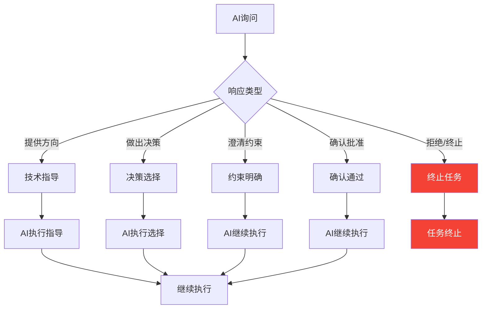
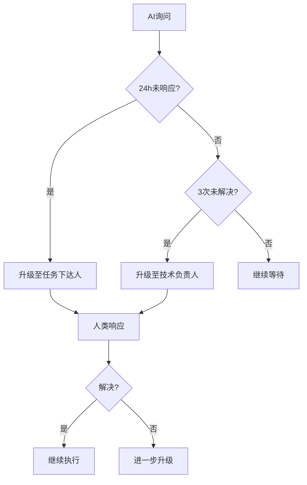

# 询问介入机制

> 文档标识：SOP-AI-004
> 版本：1.0
> 更新日期：2026-03-31
> 维护人：SOP管理员
> 状态：已发布

> 本文档定义AI数字员工在执行过程中主动询问人类的场景、触发条件和响应规范。
> 确保AI在遇到问题时能够及时获取人类指导，避免执行偏差。

---

## 1. 询问机制概述

### 1.1 询问目的

| 目的 | 说明 |
|------|------|
| 获取指导 | 遇到未知问题需要人类提供解决方向 |
| 确认决策 | 需要业务决策时人类做选择 |
| 澄清约束 | 约束不明确时请求明确 |
| 报告异常 | 执行异常时报告并请求指示 |

### 1.2 询问原则

```
询问原则：
├── 必要才问：仅在AI无法自主判断时询问
├── 完整描述：提供足够信息供人类决策
├── 提供选项：给出建议选项及影响分析
└── 明确等待：说明等待时间和超时处理
```

---

## 2. 询问触发场景

### 2.1 技术问题类

| 场景 | 触发条件 | AI动作 | 人类响应 |
|------|----------|--------|----------|
| 未知错误 | 遇到无法识别的错误 | 描述错误、提供可能原因 | 提供解决方向 |
| 编译失败 | 代码编译失败且AI无法修复 | 报告错误、尝试修复 | 确认修复方向 |
| 依赖缺失 | 缺少必要依赖 | 报告缺失、建议方案 | 批准获取方式 |
| 环境问题 | 环境配置问题 | 描述问题、提供方案 | 确认解决方案 |
| 知识边界 | 涉及AI不了解的技术 | 声明边界、请求指导 | 提供技术资料 |

### 2.2 业务决策类

| 场景 | 触发条件 | AI动作 | 人类响应 |
|------|----------|--------|----------|
| 需求不明确 | 任务描述有歧义 | 列出歧义点、请求澄清 | 明确需求 |
| 边界情况 | 需要定义边界行为 | 描述场景、提供选项 | 做出决策 |
| 优先级冲突 | 多个需求冲突 | 分析冲突、建议优先级 | 确定优先级 |
| 业务规则 | 需要业务规则确认 | 描述场景、请求规则 | 提供规则 |
| 设计选择 | 多方案各有优劣 | 分析比较、给出建议 | 做出选择 |

### 2.3 执行异常类

| 场景 | 触发条件 | AI动作 | 人类响应 |
|------|----------|--------|----------|
| 执行结果异常 | 产出与预期不符 | 报告差异、分析原因 | 决定处理方式 |
| 超时未完成 | 任务执行超时 | 报告进度、请求指示 | 决定继续/终止 |
| 外部依赖失败 | 外部服务调用失败 | 报告失败、建议方案 | 决定处理方式 |
| 资源不足 | 资源不足无法执行 | 报告情况、请求支持 | 提供资源 |
| 权限不足 | 缺少必要权限 | 报告缺失、请求授权 | 授权或提供替代 |

### 2.4 确认类

| 场景 | 触发条件 | AI动作 | 人类响应 |
|------|----------|--------|----------|
| 方案确认 | 生成方案后 | 展示方案、请求确认 | 批准/要求修改 |
| 风险确认 | 识别到潜在风险 | 描述风险、请求确认 | 确认已知晓 |
| 变更确认 | 执行中遇到变更 | 描述变更、请求确认 | 批准/拒绝变更 |
| 完成确认 | 任务完成时 | 报告完成、请求确认 | 确认完成 |

---

## 3. 询问格式规范

### 3.1 询问模板

```markdown
## AI询问记录

### 询问编号：AI-QUERY-[序号]
### 活动时间：[名称]
### 询问时间：[时间]

---

#### 场景类型
[技术问题类/业务决策类/执行异常类/确认类]

#### 问题描述
[详细描述遇到的问题]

#### 已尝试的解决方式
- 方式1：[结果]
- 方式2：[结果]

#### 可能原因分析
- 原因1：可能性分析
- 原因2：可能性分析

#### 建议选项
| 选项 | 说明 | 优点 | 缺点 | 影响范围 |
|------|------|------|------|----------|
| A | 建议方案 | 优点1 | 缺点1 | 影响1 |
| B | 备选方案 | 优点2 | 缺点2 | 影响2 |
| C | 保守方案 | 优点3 | 缺点3 | 影响3 |

#### AI倾向
[如AI有倾向，建议说明]

#### 上下文信息
- 当前阶段：[阶段]
- 当前活动：[活动]
- 前置任务状态：[状态]
- 已完成产出：[产出]

#### 等待信息
- 等待时间：X小时
- 超时处理：[超时后AI的动作]
- 紧急联系人：[如需紧急处理]

---
### 人类响应区

#### 响应类型
- [ ] 提供解决方向（针对技术问题）
- [ ] 做出决策选择（针对业务决策）
- [ ] 澄清约束条件（针对不明确）
- [ ] 确认/批准（针对确认类）
- [ ] 其他：[描述]

#### 响应内容
[人类填写具体响应]

#### 后续行动指示
[人类填写需要AI执行的后续动作]

#### 响应人
[姓名]

#### 响应时间
[时间]
```

### 3.2 快速响应模板

对于紧急情况，可使用简化模板：

```markdown
## AI快速询问

### 问题：[简要描述]
### 原因：[可能原因]
### 建议：[建议选项]

### 人类响应
- [ ] 选项A
- [ ] 选项B
- [ ] 选项C
- [ ] 其他：[描述]
```

---

## 4. 响应规范

### 4.1 人类响应要求

| 要求 | 说明 |
|------|------|
| 及时响应 | 24小时内响应，紧急情况及时响应 |
| 明确指示 | 提供具体可执行的指示 |
| 完整说明 | 说明决策理由，便于AI学习 |
| 记录归档 | 重要决策需记录归档 |

### 4.2 响应分类处理



---

## 5. 询问管理

### 5.1 询问记录

| 字段 | 说明 |
|------|------|
| 询问编号 | 唯一标识 |
| 活动名称 | 所属活动 |
| 场景类型 | 问题分类 |
| 触发时间 | 触发时间 |
| 响应时间 | 人类响应时间 |
| 处理时长 | 从询问到响应的时间 |
| 处理结果 | 解决/未解决/升级 |

### 5.2 统计指标

| 指标 | 计算方式 | 目标 |
|------|----------|------|
| 询问数量 | 每周询问次数 | 监控趋势 |
| 平均响应时间 | 响应总时长/响应次数 | <24h |
| 解决率 | 已解决/总询问数 | >90% |
| 升级率 | 升级数量/总询问数 | <10% |

### 5.3 询问趋势分析

```markdown
## 每周询问统计

| 周次 | 询问数量 | 技术问题 | 业务决策 | 执行异常 | 确认类 |
|------|----------|----------|----------|----------|--------|
| W1  |          |          |          |          |        |
| W2  |          |          |          |          |        |

### 趋势分析
- [ ] 技术问题增多 → 需增强AI技术能力
- [ ] 业务决策增多 → 需明确业务规范
- [ ] 执行异常增多 → 需优化执行流程
- [ ] 确认类增多 → 需简化审批流程
```

---

## 6. 升级机制

### 6.1 升级触发条件

| 条件 | 升级处理 |
|------|----------|
| 24小时未响应 | 升级至任务下达人 |
| 3次相同问题未解决 | 升级至技术负责人 |
| 涉及安全/合规问题 | 升级至安全负责人 |
| 需业务战略决策 | 升级至产品经理 |

### 6.2 升级流程



---

## 7. 与活动执行规范的衔接

### 7.1 询问在活动中的位置

```
标准活动流程中，询问发生在：
├── 活动启动后：约束不明确时
├── AI生成方案后：需确认时
├── AI执行过程中：遇到问题时
├── AI自检后：检查不通过时
└── 人类审批前：需确认时
```

### 7.2 询问与审批的关系

| 场景 | 询问还是审批 | 处理方式 |
|------|--------------|----------|
| 执行中遇到问题 | 询问 | 人类响应后继续 |
| 自检不通过 | 询问/修复循环 | AI修复或询问 |
| 审批不通过 | 审批 | 人类要求修改 |

---

## 8. 质量检查清单

### 8.1 询问质量检查

- [ ] 问题描述清晰完整
- [ ] 已尝试的解决方式已说明
- [ ] 提供2-3个可选方案
- [ ] 各方案优缺点分析准确
- [ ] 上下文信息完整
- [ ] 等待时间明确

### 8.2 响应质量检查

- [ ] 响应及时（24h内）
- [ ] 指示明确可执行
- [ ] 决策理由已说明
- [ ] 后续行动已指定

---

## 9. 附录

### 9.1 快速响应关键词

| 人类输入 | 含义 |
|----------|------|
| 继续 | 批准当前方案/动作继续执行 |
| 按方案A | 选择方案A执行 |
| 终止 | 停止当前任务 |
| 稍后 | 暂时搁置，等待进一步指示 |
| 已知晓 | 确认风险，继续执行 |
| 不明确 | 需要更多说明 |

### 9.2 紧急响应通道

| 紧急程度 | 响应时限 | 升级路径 |
|----------|----------|----------|
| P0-紧急 | 1小时 | 直接联系技术负责人 |
| P1-高 | 4小时 | 任务下达人 |
| P2-中 | 24小时 | 常规响应 |
| P3-低 | 72小时 | 常规响应 |

---

## 变更记录

| 版本 | 日期 | 变更人 | 变更说明 |
|------|------|--------|----------|
| 1.0 | 2026-03-31 | SOP管理员 | 初始版本 |
