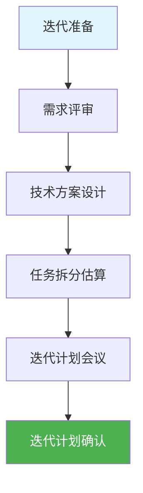
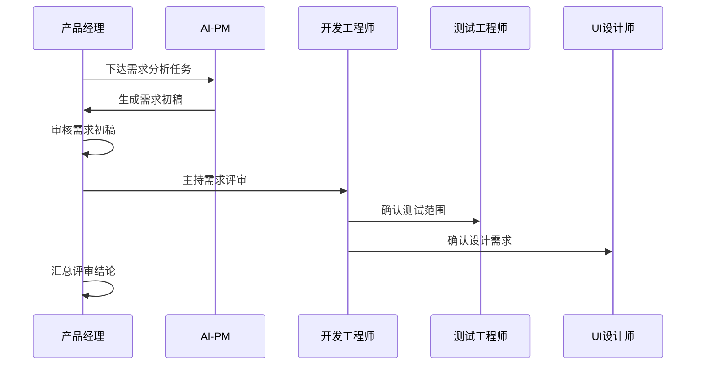
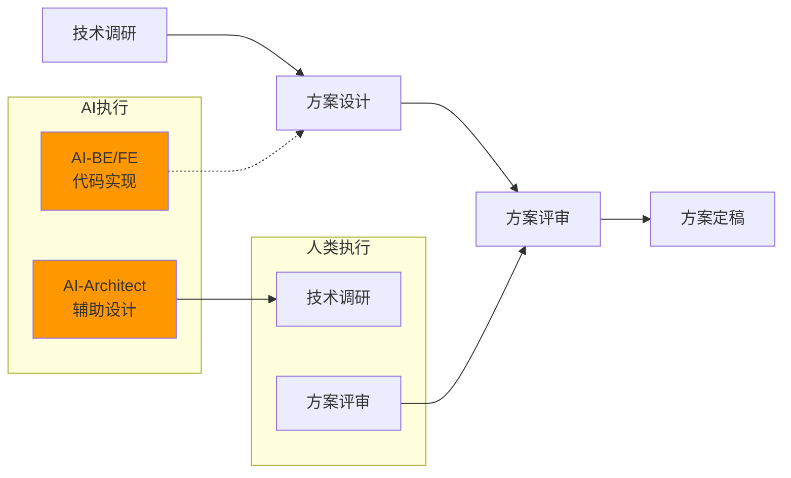
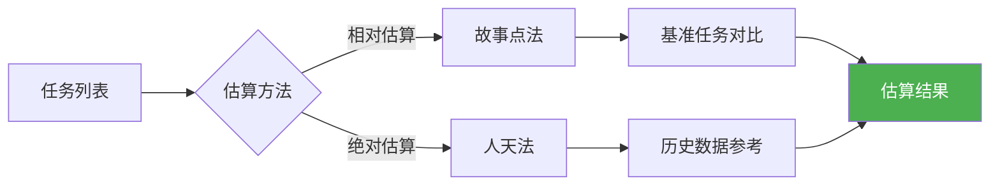

# 迭代准备

> 本文档定义迭代准备阶段的工作内容、人机协作方式、质量标准。

## 1. 迭代准备阶段概览

## 2. 活动清单

| 序号 | 活动 | 角色 | 时长 | 产出 |
|------|------|------|------|------|
| 1 | 需求评审会议 | PM主持、全员参与 | 2-4h | 需求澄清记录 |
| 2 | 技术方案设计 | DEV主导 | 4-8h | 技术方案文档 |
| 3 | 任务拆分 | DEV/QA参与 | 2-4h | Sprint Backlog |
| 4 | 迭代计划会议 | SM主持 | 1-2h | 迭代承诺 |
| 5 | 计划确认审批 | PM/技术负责人 | 0.5h | 审批记录 |

## 3. 需求评审

### 3.1 评审流程

### 3.2 评审内容

| 评审项 | 评审要点 | 责任人 |
|--------|----------|--------|
| 需求完整性 | 用户故事覆盖度 | PM |
| 验收标准 | 明确可验证 | PM |
| 技术可行性 | 实现方案可行 | DEV |
| 测试可行性 | 可测试性评估 | QA |
| 设计可行性 | UI可实现性 | UI |

### 3.3 人机协作

| 任务 | AI执行 | 人类执行 | 审批节点 |
|------|--------|----------|----------|
| 需求整理 | AI-PM生成初稿 | 人类审核 | 需求确认 |
| 需求评审 | AI辅助记录 | 人类主持 | 评审通过 |

## 4. 技术方案设计

### 4.1 设计流程

### 4.2 技术方案内容

| 内容 | 说明 | 产出 |
|------|------|------|
| 技术架构 | 系统架构、模块划分 | 架构图 |
| 接口设计 | API定义、数据契约 | API文档 |
| 数据库设计 | 表结构、索引 | ER图 |
| 技术风险 | 风险识别、应对 | 风险清单 |

### 4.3 人机协作

| 任务 | AI执行 | 人类执行 | 审批节点 |
|------|--------|----------|----------|
| 技术方案生成 | AI-Architect生成初稿 | 人类审核 | 技术评审 |
| API设计 | AI-BE辅助设计 | 人类确认 | 方案定稿 |
| 数据库设计 | AI-BE辅助设计 | 人类确认 | 方案定稿 |

## 5. 任务拆分估算

### 5.1 拆分原则

| 原则 | 说明 |
|------|------|
| 可验证 | 每个任务可独立验证完成 |
| 时间盒 | 单个任务不超过2人天 |
| 完整 | 包含设计、开发、测试任务 |
| 清晰 | 任务描述清晰无歧义 |

### 5.2 估算方法

### 5.3 人机协作

| 任务 | AI执行 | 人类执行 | 审批节点 |
|------|--------|----------|----------|
| 任务拆分 | AI辅助拆分 | 人类确认 | - |
| 工作估算 | AI辅助估算 | 人类确认 | 估算确认 |
| 优先级排序 | AI辅助建议 | 人类确认 | 优先级确认 |

## 6. 迭代计划会议

### 6.1 会议议程

| 时间 | 内容 | 主持 |
|------|------|------|
| 10min | 迭代目标回顾 | PM |
| 20min | 待办列表讲解 | PM |
| 30min | 任务认领讨论 | 全体 |
| 10min | 风险识别 | 全体 |
| 10min | 迭代承诺 | 全体 |

### 6.2 会议产出

- 迭代目标确认
- Sprint Backlog确认
- 迭代燃尽图基线
- 风险清单

## 7. 质量标准

### 7.1 准入标准

| 检查项 | 标准 | 状态 |
|--------|------|------|
| 需求评审 | 100%用户故事评审通过 | ⬜ |
| 验收标准 | 每个需求有明确验收标准 | ⬜ |
| 技术方案 | 通过技术评审 | ⬜ |
| 任务估算 | 偏差≤30% | ⬜ |
| 迭代计划 | 全员确认 | ⬜ |

### 7.2 产出清单

| 产出 | 责任人 | 格式 |
|------|--------|------|
| 需求评审记录 | PM | Markdown |
| 技术方案文档 | DEV | Markdown |
| Sprint Backlog | DEV | Markdown/工具 |
| 迭代计划 | SM | Markdown |
