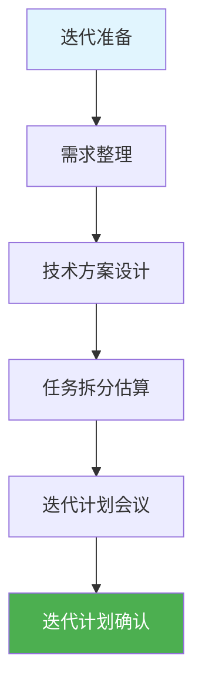
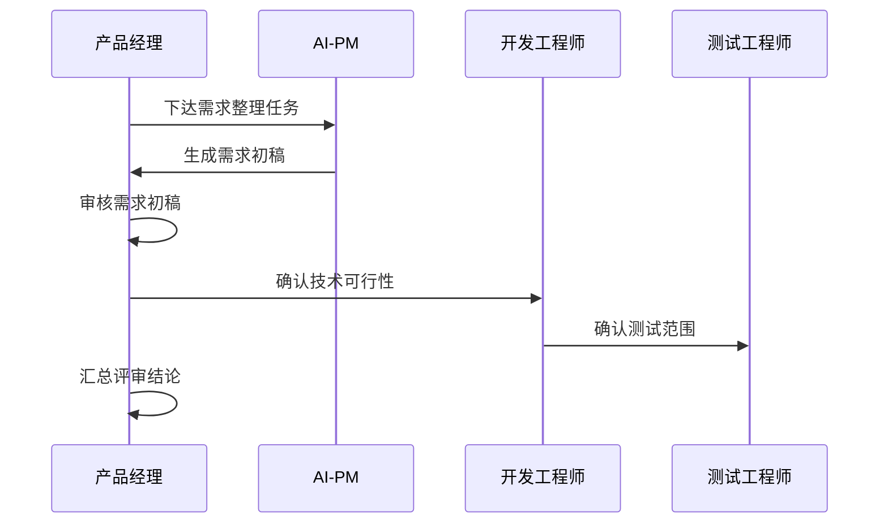
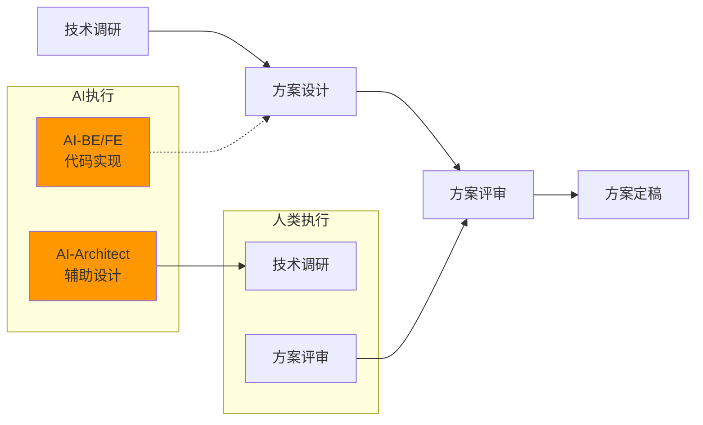
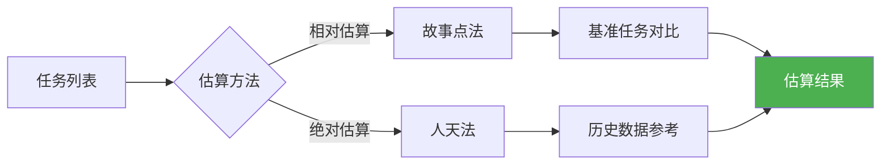

# 迭代准备

> 本文档定义迭代准备阶段的工作内容、活动流程、人机协作方式、质量标准。
> 本阶段以人类主持为主，AI辅助生成方案和文档，人类审批后进入下一阶段。
> 详细活动执行规范见 [04_活动执行规范](../00_规范/04_活动执行规范.md)

## 1. 迭代准备阶段概览

## 2. 活动清单

| 序号 | 活动 | 人类/AI分工 | 时长 | 产出 |
|------|------|-------------|------|------|
| 1 | 需求整理 | AI生成需求文档 → 人类审批确认 | 2-4h | 需求文档 |
| 2 | 技术方案设计 | AI生成技术方案 → 人类选择方案 → 审批 | 4-8h | 技术方案文档 |
| 3 | 任务拆分 | AI辅助拆分 → 人类确认优先级 | 2-4h | Sprint Backlog |
| 4 | 迭代计划会议 | 人类主持 → AI辅助记录 | 1-2h | 迭代承诺 |
| 5 | 计划确认审批 | 人类审批 → 确认进入下一阶段 | 0.5h | 审批记录 |

> 详细活动执行流程见 [04_活动执行规范](../00_规范/04_活动执行规范.md)

## 3. 活动详情

### 3.1 需求整理（方案生成类活动）

> 执行模式：AI生成方案 → 人类选择 → 审批

**人类启动条件**：
- 已明确本迭代的业务目标
- 已收集相关需求材料

**AI职责**：
- 解析需求，生成结构化用户故事
- 编写验收标准
- 生成页面/功能清单

**人类职责**：
- 确认需求完整性
- 审批需求文档

**产出**：
- 需求文档（REQ-XXX）
- 用户故事清单
- 验收标准

### 3.2 技术方案设计（方案生成类活动）

> 执行模式：AI生成方案 → 人类选择 → 审批

**人类启动条件**：
- 需求文档已审批
- 已知晓技术约束

**AI职责**：
- 生成系统架构设计
- 设计模块划分
- 设计API接口
- 设计数据库结构
- 识别技术风险

**人类职责**：
- 选择技术方案
- 审批技术方案

**产出**：
- 技术方案文档（TP-XXX）
- API设计文档
- 数据库设计文档

### 3.3 任务拆分（文档输出类活动）

> 执行模式：AI拆分 → 人类确认

**人类启动条件**：
- 技术方案已审批
- 已知晓可用的团队资源

**AI职责**：
- 根据技术方案拆分任务
- 估算任务工作量
- 识别任务依赖关系

**人类职责**：
- 确认任务拆分合理性
- 确认任务优先级

**产出**：
- Sprint Backlog
- 任务依赖图

### 3.4 迭代计划会议（人类主持活动）

> 执行模式：人类主持，AI辅助

**人类职责**：
- 主持会议
- 讲解迭代目标
- 协调任务认领
- 收集风险

**AI辅助**：
- 生成会议议程
- 记录会议要点
- 生成会议纪要

**产出**：
- 迭代承诺
- 会议纪要

### 3.5 计划确认审批（人类审批节点）

> 执行模式：人类审批

**审批内容**：
- 迭代目标明确性
- 任务完整性
- 资源充足性
- 风险可控性

**产出**：
- 审批记录
- 进入迭代执行的许可

## 4. 需求评审

### 4.1 评审流程

> 需求评审已整合到"需求整理"活动中，见3.1节。

### 4.2 评审内容

| 评审项 | 评审要点 | 责任人 |
|--------|----------|--------|
| 需求完整性 | 用户故事覆盖度 | PM |
| 验收标准 | 明确可验证 | PM |
| 技术可行性 | 实现方案可行 | DEV |
| 测试可行性 | 可测试性评估 | QA |

### 4.3 人机协作

| 任务 | AI执行 | 人类执行 | 审批节点 |
|------|--------|----------|----------|
| 需求整理 | AI-PM生成初稿 | 人类审核 | 需求确认 |

## 5. 技术方案设计

### 5.1 设计流程

> 技术方案设计已整合到3.2节活动中，详细执行规范见活动执行规范。

### 5.2 技术方案内容

| 内容 | 说明 | 产出 |
|------|------|------|
| 技术架构 | 系统架构、模块划分 | 架构图 |
| 接口设计 | API定义、数据契约 | API文档 |
| 数据库设计 | 表结构、索引 | ER图 |
| 技术风险 | 风险识别、应对 | 风险清单 |

### 5.3 人机协作

| 任务 | AI执行 | 人类执行 | 审批节点 |
|------|--------|----------|----------|
| 技术方案生成 | AI-Architect生成初稿 | 人类审核 | 技术评审 |
| API设计 | AI-BE辅助设计 | 人类确认 | 方案定稿 |
| 数据库设计 | AI-BE辅助设计 | 人类确认 | 方案定稿 |

## 6. 任务拆分估算

### 6.1 拆分原则

| 原则 | 说明 |
|------|------|
| 可验证 | 每个任务可独立验证完成 |
| 时间盒 | 单个任务不超过2人天 |
| 完整 | 包含设计、开发、测试任务 |
| 清晰 | 任务描述清晰无歧义 |

### 6.2 估算方法

### 6.3 人机协作

| 任务 | AI执行 | 人类执行 | 审批节点 |
|------|--------|----------|----------|
| 任务拆分 | AI辅助拆分 | 人类确认 | - |
| 工作估算 | AI辅助估算 | 人类确认 | 估算确认 |
| 优先级排序 | AI辅助建议 | 人类确认 | 优先级确认 |

## 7. 迭代计划会议

### 7.1 会议议程

| 时间 | 内容 | 主持 |
|------|------|------|
| 10min | 迭代目标回顾 | PM |
| 20min | 待办列表讲解 | PM |
| 30min | 任务认领讨论 | 全体 |
| 10min | 风险识别 | 全体 |
| 10min | 迭代承诺 | 全体 |

### 7.2 会议产出

- 迭代目标确认
- Sprint Backlog确认
- 迭代燃尽图基线
- 风险清单

## 8. 质量标准

### 8.1 准入标准

| 检查项 | 标准 | 状态 |
|--------|------|------|
| 需求评审 | 100%用户故事评审通过 | ⬜ |
| 验收标准 | 每个需求有明确验收标准 | ⬜ |
| 技术方案 | 通过技术评审 | ⬜ |
| 任务估算 | 偏差≤30% | ⬜ |
| 迭代计划 | 全员确认 | ⬜ |

### 8.2 产出清单

| 产出 | 责任人 | 格式 |
|------|--------|------|
| 需求文档 | AI-PM → 人类审批 | Markdown |
| 技术方案文档 | AI-Architect → 人类审批 | Markdown |
| Sprint Backlog | AI辅助拆分 → 人类确认 | Markdown/工具 |
| 迭代计划 | SM主持 | Markdown |

> 阶段状态管理见 [05_阶段状态管理](../00_规范/05_阶段状态管理.md) |
