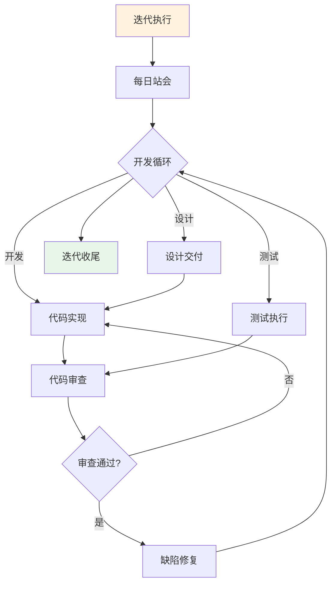

# 迭代执行

> 本文档定义迭代执行阶段的工作内容、活动流程、人机协作方式、质量标准。
> 本阶段以人类下达任务，AI执行并自检，人类审批确认为主流程。
> 详细活动执行规范见 [04_活动执行规范](../00_规范/04_活动执行规范.md)
> 询问介入机制见 [04_询问介入机制](../03_AI边界/04_询问介入机制.md)

## 1. 迭代执行阶段概览



## 2. 活动清单

| 序号 | 活动 | 人类/AI分工 | 产出 |
|------|------|-------------|------|
| 1 | 每日站会 | 人类主持，AI辅助记录 | 站会纪要 |
| 2 | 任务执行 | 人类下达任务 → AI执行 → 自检 → 审批 | 代码/文档 |
| 3 | 代码审查 | AI审查 → 人类复核 | 审查报告 |
| 4 | 测试执行 | 人类下达任务 → AI执行测试 → 报告 | 测试报告 |
| 5 | 变更控制 | 人类评估，AI辅助记录 | 变更记录 |

> 详细活动执行流程见 [04_活动执行规范](../00_规范/04_活动执行规范.md)

## 3. 活动详情

### 3.1 每日站会（人类主持活动）

> 人类主持，AI辅助

**人类职责**：
- 主持站会（15分钟内）
- 收集昨日完成、今日计划、阻碍问题
- 识别升级事项

**AI辅助**：
- 汇总任务状态
- 生成站会纪要
- 识别阻碍问题（需人类确认）

**产出**：站会纪要

### 3.2 任务执行（代码实现类活动）

> 执行模式：任务下达 → AI执行 → AI自检 → 人类审批

**人类启动条件**：
- 已明确任务目标和约束
- 已确认前置任务完成

**AI职责**：
- 解析任务要求
- 生成代码/实现功能
- 执行自检（语法、规范、测试）
- 如遇问题按询问机制处理

**人类职责**：
- 下达任务（使用AI任务指令模板）
- 审批AI产出
- 如有问题要求AI修复

**产出**：代码产出、自检报告、审批记录

### 3.3 代码审查（代码审查类活动）

> 执行模式：AI审查 → 人类复核

**AI职责**：
- 扫描代码规范
- 识别潜在Bug
- 检测安全风险
- 提供优化建议

**人类职责**：
- 复核AI审查结果
- 做出最终审批决定

**产出**：审查报告、审批记录

### 3.4 测试执行（测试执行类活动）

> 执行模式：任务下达 → AI执行 → 报告 → 审批

**人类启动条件**：
- 已明确测试范围
- 代码已就绪

**AI职责**：
- 生成测试用例
- 执行功能测试
- 生成测试报告

**人类职责**：
- 审批测试范围
- 验收测试报告

**产出**：测试用例、测试报告

### 3.5 变更控制

**触发条件**：
- 需求变更
- 技术方案变更
- 范围变更

**处理流程**：
```
变更提出 → 变更评估（人类） → 处理方式确定 → 实施变更 → 变更记录
```

## 6. 质量标准

### 6.1 每日质量检查

| 检查项 | 标准 | 责任人 |
|--------|------|--------|
| 代码提交 | 每日提交 | DEV |
| CI通过 | 100%通过 | DEV |
| 用例执行 | 每日执行 | QA |
| 缺陷跟进 | 每日更新 | DEV |

### 6.2 迭代内质量指标

| 指标 | 目标 | 告警 |
|------|------|------|
| 代码规范通过 | 100% | <95% |
| 测试覆盖率 | ≥70% | <60% |
| 缺陷修复率 | 100% | <90% |
| 代码审查通过 | 100% | <95% |

> 阶段状态管理见 [05_阶段状态管理](../00_规范/05_阶段状态管理.md)
