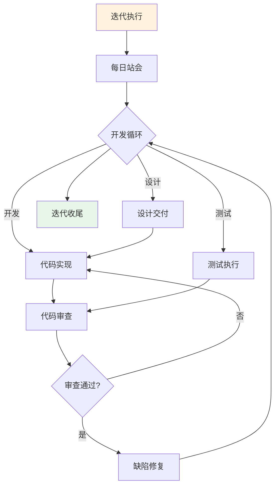
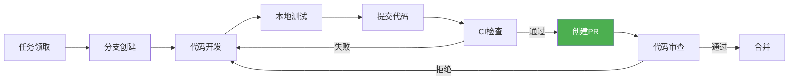
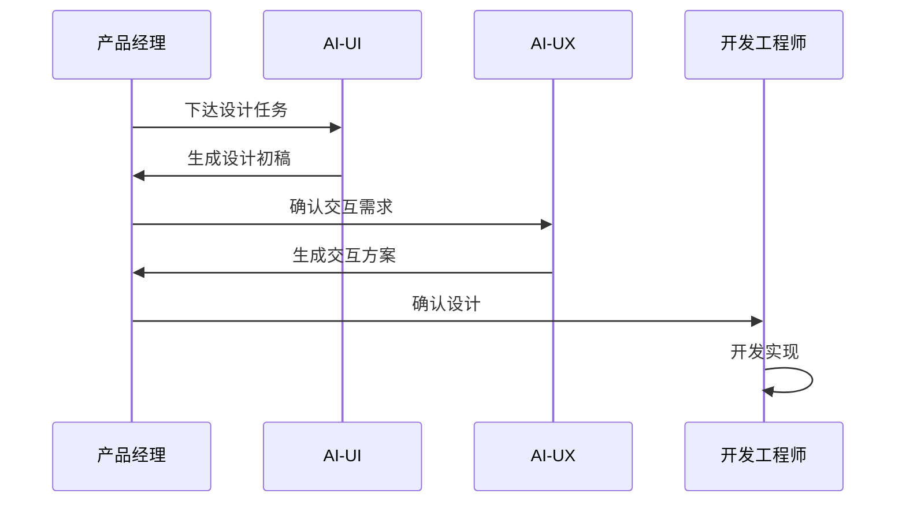
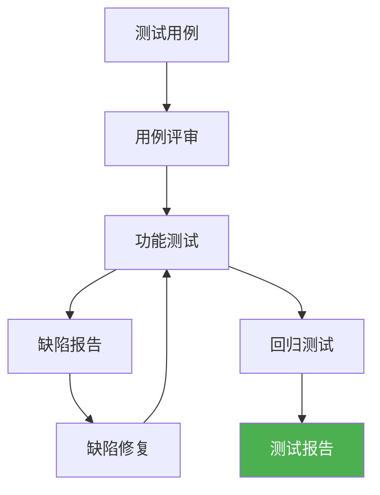
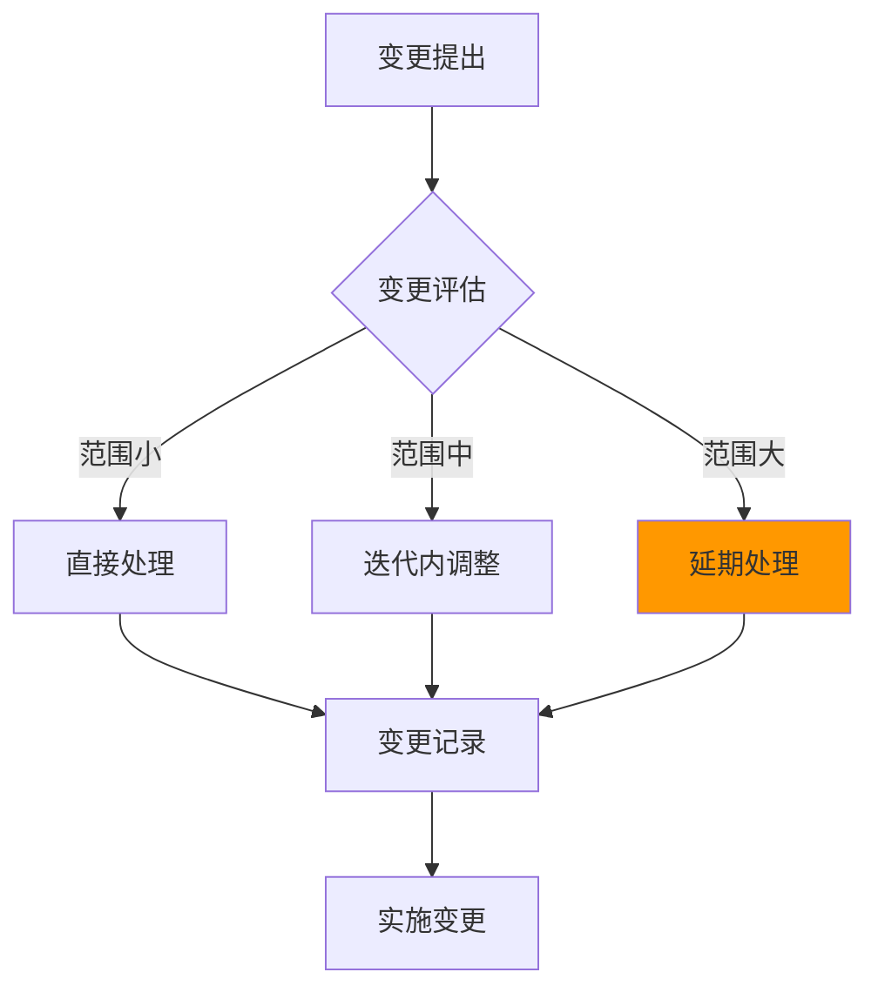

# 迭代执行

> 本文档定义迭代执行阶段的工作内容、人机协作方式、质量标准。

## 1. 迭代执行阶段概览



## 2. 每日站会

### 2.1 会议规则

| 规则 | 说明 |
|------|------|
| 时间 | 每日固定时间，时长≤15分钟 |
| 形式 | 站立式 |
| 参与 | 全员参与 |
| 发言 | 每人≤2分钟 |

### 2.2 发言模板

```markdown
## 每日站会发言

### [角色名称]
- **昨日完成**：[具体产出]
- **今日计划**：[具体任务]
- **阻碍问题**：[如有]
```

### 2.3 升级机制

| 阻碍级别 | 处理方式 |
|----------|----------|
| 小组内解决 | 站会后小组讨论 |
| 跨组协调 | 升级SM/PM协调 |
| 紧急阻断 | 立即停止迭代 |

## 3. 开发实现

### 3.1 开发流程



### 3.2 人机协作

| 任务 | AI执行 | 人类执行 | 审批节点 |
|------|--------|----------|----------|
| 代码生成 | AI-FE/AI-BE | 代码审查 | PR审查 |
| 单元测试 | AI-Test生成 | 人类确认 | CI通过 |
| 代码审查 | AI-Reviewer | 人工复核 | 审查通过 |

### 3.3 代码规范

| 规范项 | 标准 | 检测方式 |
|--------|------|----------|
| 代码规范 | 符合Lint规则 | CI自动化 |
| 单元测试 | 覆盖率≥70% | CI自动化 |
| 提交信息 | 符合规范 | Git Hook |
| 分支命名 | 符合规范 | Git Hook |

## 4. 设计交付

### 4.1 设计流程



### 4.2 人机协作

| 任务 | AI执行 | 人类执行 | 审批节点 |
|------|--------|----------|----------|
| 界面设计 | AI-UI生成初稿 | 人类确认 | 设计验收 |
| 交互设计 | AI-UX生成初稿 | 人类确认 | 设计验收 |
| 设计规范 | AI-UI维护 | 人类确认 | - |

## 5. 测试执行

### 5.1 测试流程



### 5.2 人机协作

| 任务 | AI执行 | 人类执行 | 审批节点 |
|------|--------|----------|----------|
| 用例生成 | AI-Test | 人类确认 | 用例评审 |
| 功能测试 | AI-Test执行 | 人类复核 | 测试报告 |
| 回归测试 | AI-Test | 人类确认 | 测试报告 |

### 5.3 缺陷管理

| 缺陷级别 | 定义 | 修复时限 | 发布阻塞 |
|----------|------|----------|----------|
| P0-阻断 | 功能不可用 | 当天 | 是 |
| P1-严重 | 核心功能异常 | 2天 | 是 |
| P2-一般 | 非核心异常 | 迭代内 | 否 |
| P3-轻微 | 体验问题 | 下迭代 | 否 |

## 6. 变更控制

### 6.1 变更流程



### 6.2 变更评估矩阵

| 变更影响 | 处理方式 |
|----------|----------|
| 工作量增加<20% | 开发负责人批准 |
| 工作量增加20-50% | PM批准 |
| 工作量增加>50% | 延期至下迭代 |

## 7. 质量标准

### 7.1 每日质量检查

| 检查项 | 标准 | 责任人 |
|--------|------|--------|
| 代码提交 | 每日提交 | DEV |
| CI通过 | 100%通过 | DEV |
| 用例执行 | 每日执行 | QA |
| 缺陷跟进 | 每日更新 | DEV |

### 7.2 迭代内质量指标

| 指标 | 目标 | 告警 |
|------|------|------|
| 代码规范通过 | 100% | <95% |
| 测试覆盖率 | ≥70% | <60% |
| 缺陷修复率 | 100% | <90% |
| 代码审查通过 | 100% | <95% |
