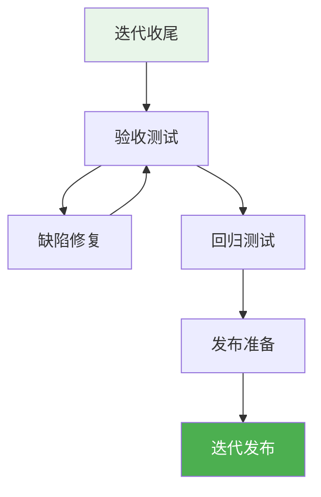
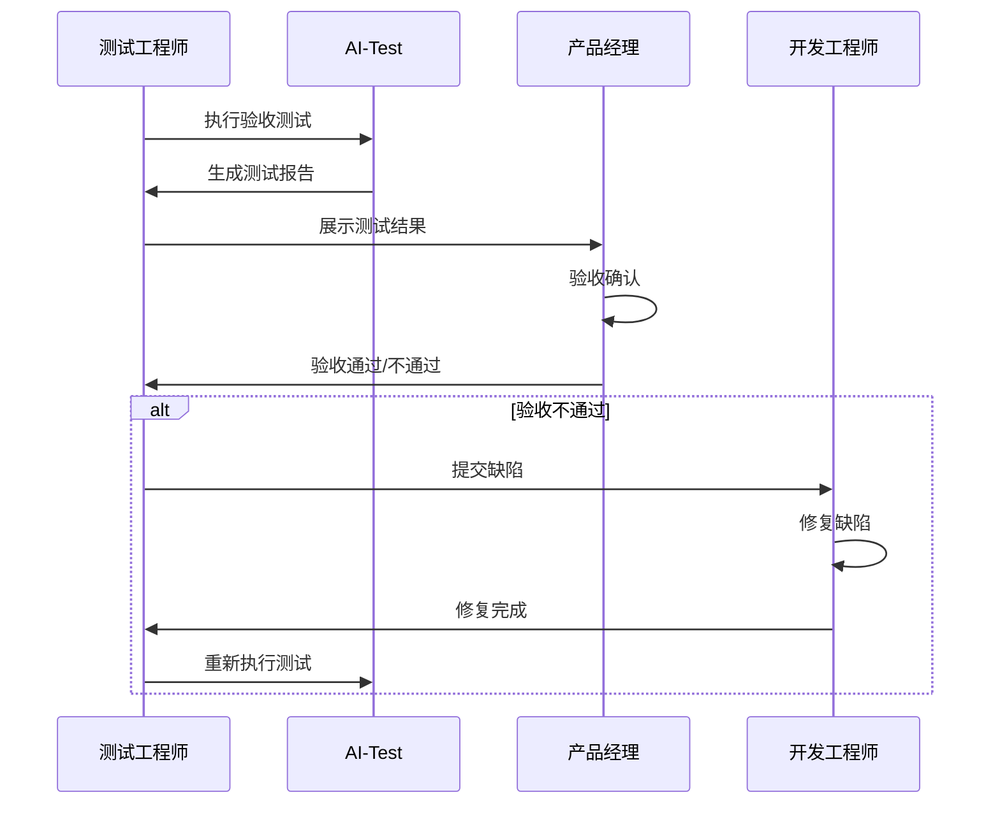
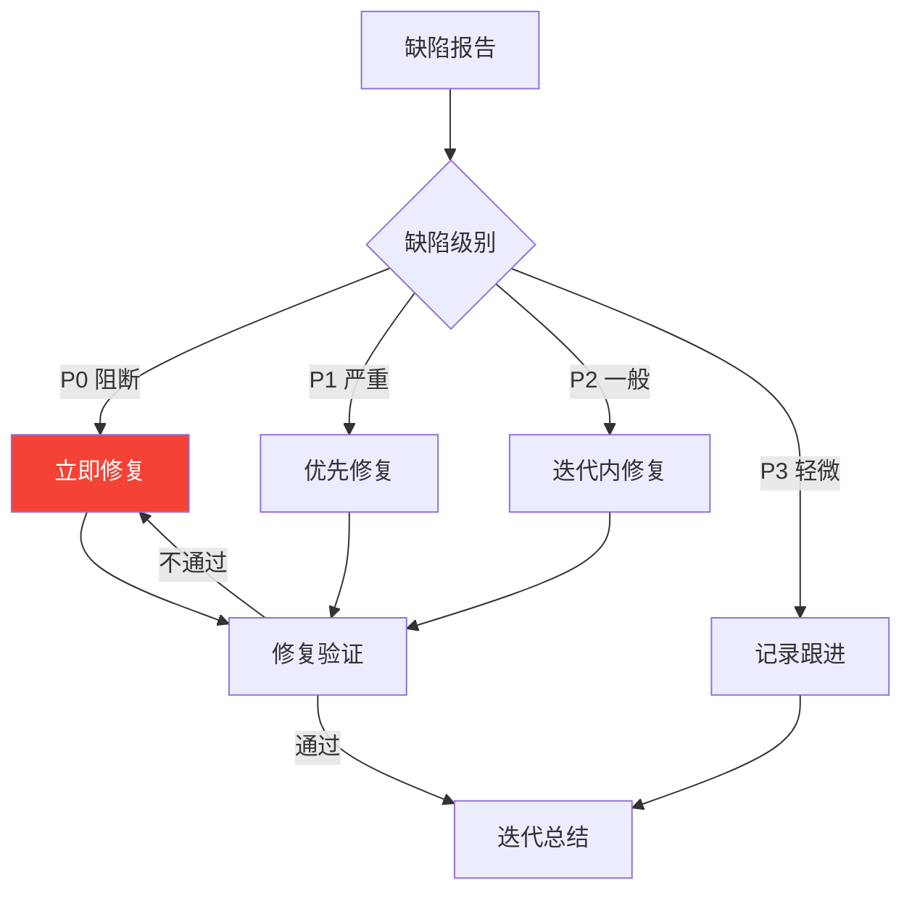
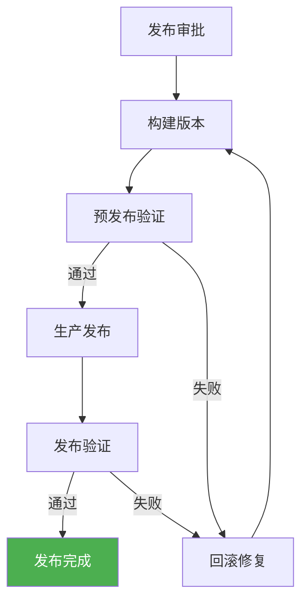

# 迭代收尾

> 本文档定义迭代收尾阶段的工作内容、人机协作方式、质量标准。

## 1. 迭代收尾阶段概览

## 2. 验收测试

### 2.1 验收流程

### 2.2 验收标准

| 验收项 | 标准 | 状态 |
|--------|------|------|
| 功能测试 | 100%通过 | ⬜ |
| 严重缺陷 | 0个 | ⬜ |
| 阻塞缺陷 | 0个 | ⬜ |
| 验收标准达成 | 100% | ⬜ |

### 2.3 人机协作

| 任务 | AI执行 | 人类执行 | 审批节点 |
|------|--------|----------|----------|
| 验收测试 | AI-Test执行 | 人类确认 | PM抽检 |
| 测试报告 | AI-Test生成 | AI自动归档+QA抽检 | 报告确认 |

## 3. 缺陷修复

### 3.1 修复流程

### 3.2 修复标准

| 缺陷级别 | 修复时限 | 验证方式 |
|----------|----------|----------|
| P0-阻断 | 当天 | 测试验证 |
| P1-严重 | 2天 | 测试验证 |
| P2-一般 | 迭代内 | 测试验证 |
| P3-轻微 | 下迭代 | 记录跟进 |

## 4. 回归测试

### 4.1 回归测试策略

| 策略 | 说明 | 适用范围 |
|------|------|----------|
| 全量回归 | 所有用例执行 | 重大变更 |
| 增量回归 | 变更相关用例 | 一般变更 |
| 自动化回归 | 自动执行 | 常规迭代 |

### 4.2 人机协作

| 任务 | AI执行 | 人类执行 | 审批节点 |
|------|--------|----------|----------|
| 回归用例选择 | AI-Test辅助 | 人类确认 | QA确认 |
| 回归测试执行 | AI-Test执行 | 人类监控 | 测试报告 |

## 5. 发布准备

### 5.1 发布检查清单

| 检查项 | 检查内容 | 状态 |
|--------|----------|------|
| 功能验证 | 核心功能测试通过 | ⬜ |
| 缺陷清零 | P0/P1缺陷已修复 | ⬜ |
| 测试覆盖 | 覆盖率达标 | ⬜ |
| 安全扫描 | 无高危漏洞 | ⬜ |
| 性能测试 | 性能达标（如有） | ⬜ |
| 文档更新 | 相关文档已更新 | ⬜ |
| 回滚方案 | 回滚方案已准备 | ⬜ |
| 监控告警 | 告警配置已确认 | ⬜ |
| 值班安排 | 值班人员已确认 | ⬜ |

### 5.2 发布审批

| 审批项 | 审批人 | 时效 |
|--------|--------|------|
| 发布申请 | 技术负责人 | 2h |
| 发布确认 | PM | 2h |
| 发布批准 | 值班负责人 | 1h |

### 5.3 人机协作

| 任务 | AI执行 | 人类执行 | 审批节点 |
|------|--------|----------|----------|
| 检查单生成 | AI-Writer生成 | 人类确认 | 检查确认 |
| 发布公告 | AI-Writer生成 | 人类审核 | 发布审批 |

## 6. 迭代发布

### 6.1 发布流程

### 6.2 发布后监控

| 监控项 | 监控时长 | 响应要求 |
|--------|----------|----------|
| 功能验证 | 发布后2h | 实时 |
| 错误日志 | 发布后24h | 每小时 |
| 性能指标 | 发布后24h | 每小时 |
| 用户反馈 | 发布后48h | 实时 |

### 6.3 发布回滚

| 触发条件 | 回滚操作 | 审批人 |
|----------|----------|--------|
| 阻断缺陷出现 | 立即回滚 | 值班负责人 |
| 严重缺陷出现 | 评估后回滚 | 技术负责人 |
| 性能严重下降 | 评估后回滚 | 技术负责人 |

## 7. 质量标准

### 7.1 发布准入标准

| 检查项 | 标准 | 责任人 |
|--------|------|--------|
| 验收测试通过 | 100% | QA |
| 缺陷清零 | P0/P1=0 | QA |
| 代码审查通过 | 100% | DEV |
| 安全扫描通过 | 无高危 | Sec |
| 发布审批通过 | 全部 | 技术负责人 |

### 7.2 迭代产出清单

| 产出 | 格式 | 归档位置 |
|------|------|----------|
| 迭代总结 | Markdown | 07_迭代文档/Sprint-XX/06_评审/ |
| 测试报告 | Markdown | 07_迭代文档/Sprint-XX/04_测试/ |
| 发布记录 | Markdown | 07_迭代文档/Sprint-XX/05_发布/ |
| 代码变更 | Git | 代码仓库 |

---

## 8. 流程衔接

### 8.1 进入迭代评审的条件

| 条件 | 说明 |
|------|------|
| 发布完成 | 代码已发布到生产环境 |
| 验收通过 | PM确认功能可用 |
| 测试完成 | 测试报告已生成 |
| 评审材料 | 演示材料已准备 |

### 8.2 衔接操作

1. 发布完成后，技术负责人确认发布状态
2. PM确认验收测试结果
3. QA整理测试报告和缺陷清单
4. DEV准备成果演示材料
5. 进入 [迭代评审](./04_迭代评审.md) 阶段
