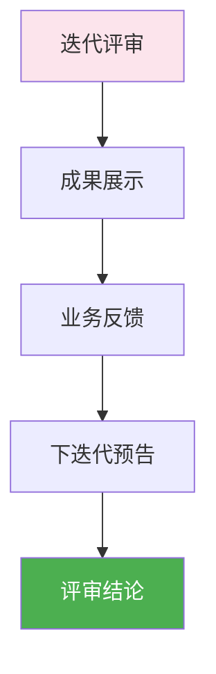

# 迭代评审

> 本文档定义迭代评审阶段的工作内容、人机协作方式、质量标准。

## 1. 迭代评审阶段概览



## 2. 评审会议

### 2.1 会议信息

| 项目 | 内容 |
|------|------|
| 时间 | 迭代结束后第一天下午 |
| 时长 | 1-2小时 |
| 地点 | 会议室/线上 |
| 主持 | 产品经理 |
| 参与 | 全员 + 业务方（如有） |

### 2.2 会议议程

| 时间 | 内容 | 主持 | 产出 |
|------|------|------|------|
| 10min | 迭代目标回顾 | PM | 目标对照 |
| 30min | 成果演示 | DEV/QA | 演示材料 |
| 20min | 业务方反馈 | 业务方 | 反馈记录 |
| 10min | 下迭代预告 | PM | 下迭代计划 |
| 10min | 评审结论 | PM | 评审记录 |

### 2.3 成果展示内容

| 展示项 | 说明 | 演示者 |
|--------|------|--------|
| 功能演示 | 新功能操作演示 | DEV/PM |
| 性能数据 | 性能测试结果 | DEV |
| 测试报告 | 测试覆盖情况 | QA |
| 用户反馈 | 用户使用反馈 | PM |

## 3. 人机协作

### 3.1 会议准备

| 任务 | AI执行 | 人类执行 | 审批节点 |
|------|--------|----------|----------|
| 演示材料 | AI生成初稿 | 人类审核 | 演示前确认 |
| 数据整理 | AI-Analyst | 人类确认 | 数据准确性 |
| 会议通知 | AI-Writer | 人类确认 | - |

### 3.2 会议记录

| 任务 | AI执行 | 人类执行 | 审批节点 |
|------|--------|----------|----------|
| 会议纪要 | AI-Writer生成 | 人类审核 | 纪要确认 |

## 4. 评审内容

### 4.1 交付物评审

| 评审项 | 评审标准 | 评审人 |
|--------|----------|--------|
| 功能完整性 | 符合需求 | PM |
| 功能正确性 | 功能正常 | PM/业务 |
| 验收标准达成 | 100%达成 | PM |
| 质量标准达成 | 符合质量要求 | QA |

### 4.2 业务价值评审

| 评审项 | 评审标准 | 评审人 |
|--------|----------|--------|
| 业务目标达成 | 达成预期 | 业务方 |
| 用户价值交付 | 产生预期价值 | 业务方 |
| 市场需求响应 | 响应及时 | 业务方 |

## 5. 评审输出

### 5.1 评审结论

| 结论 | 说明 |
|------|------|
| 通过 | 迭代完成，可进入下迭代 |
| 有条件通过 | 需完成遗留项 |
| 不通过 | 需重新迭代 |

### 5.2 评审记录

```markdown
# 迭代评审记录

## 迭代信息
- 迭代周期：2026-XX-XX ~ 2026-XX-XX
- 评审日期：2026-XX-XX

## 评审参与
- 产品经理：
- 开发工程师：
- 测试工程师：
- 设计师：
- 业务方：

## 交付物评审
| 需求 | 交付状态 | 评审结论 |
|------|----------|----------|
|      |          |          |

## 业务价值评审
- 业务目标达成情况：
- 用户反馈：

## 遗留问题
| 问题 | 级别 | 处理方式 |
|------|------|----------|
|      |      |          |

## 评审结论
- [ ] 通过
- [ ] 有条件通过
- [ ] 不通过

## 下迭代预告
- 下迭代目标：
- 预期交付：
```

## 6. 下迭代预告

### 6.1 预告内容

| 内容 | 说明 |
|------|------|
| 下迭代目标 | 业务目标和技术目标 |
| 预期交付 | 计划交付的功能 |
| 时间计划 | 迭代周期安排 |
| 资源需求 | 需要的人员和资源 |

### 6.2 预告模板

```markdown
# 下迭代预告

## 迭代目标
- 业务目标：
- 技术目标：

## 预期交付
| 功能 | 优先级 | 负责人 |
|------|--------|--------|
|      |        |        |

## 时间安排
- 迭代周期：
- 关键里程碑：

## 资源需求
- 人员需求：
- 技术需求：
```

## 7. 质量标准

### 7.1 评审准入

| 检查项 | 标准 | 状态 |
|--------|------|------|
| 成果展示 | 准备完成 | ⬜ |
| 评审材料 | 准备完成 | ⬜ |
| 参与人员 | 确认参与 | ⬜ |
| 会议室 | 预约完成 | ⬜ |

### 7.2 评审产出

| 产出 | 格式 | 归档 |
|------|------|------|
| 评审会议纪要 | Markdown | docs/04_迭代流程/ |
| 评审结论 | Markdown | docs/04_迭代流程/ |
| 下迭代预告 | Markdown | docs/04_迭代流程/ |
