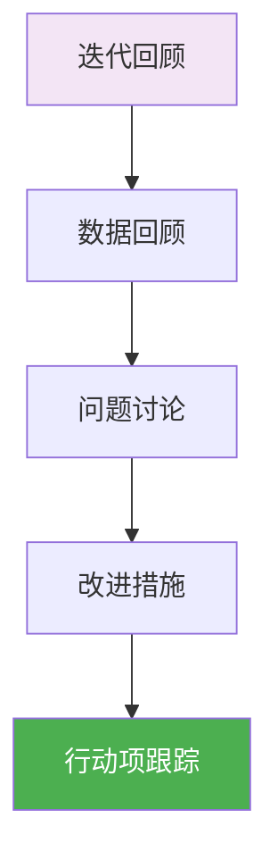
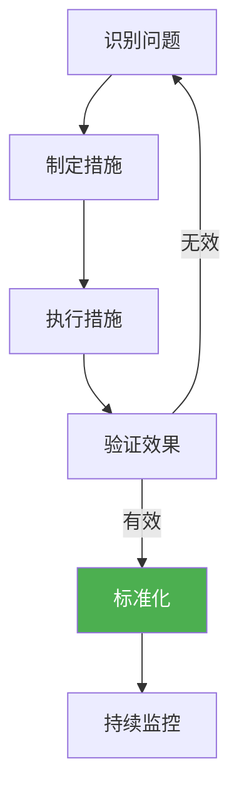

# 迭代回顾

> 本文档定义迭代回顾阶段的工作内容、人机协作方式、质量标准。

## 1. 迭代回顾阶段概览



## 2. 回顾会议

### 2.1 会议信息

| 项目 | 内容 |
|------|------|
| 时间 | 迭代评审后 |
| 时长 | 1-2小时 |
| 主持 | Scrum Master |
| 参与 | 全员 |

### 2.2 会议方法

| 方法 | 适用场景 | 说明 |
|------|----------|------|
| Start-Stop-Continue | 通用 | 开始/停止/继续 |
| 4Ls | 通用 | Good/Learned/Lacked/Longed For |
| 五个为什么 | 问题导向 | 深入分析根因 |
| 鱼骨图 | 原因分析 | 分 类查找原因 |

### 2.3 会议议程

| 时间 | 内容 | 主持 |
|------|------|------|
| 10min | 数据回顾 | SM |
| 30min | 问题发散 | 全体 |
| 20min | 归纳总结 | SM |
| 15min | 改进措施 | 全体 |
| 5min | 会议总结 | SM |

## 3. 人机协作

### 3.1 会议准备

| 任务 | AI执行 | 人类执行 | 审批节点 |
|------|--------|----------|----------|
| 数据收集 | AI-Analyst | 人类确认 | 数据准确性 |
| 趋势分析 | AI-Analyst | 人类确认 | 分析结果 |
| 会议通知 | AI-Writer | AI自动执行 | - |

### 3.2 会议记录

| 任务 | AI执行 | 人类执行 | 审批节点 |
|------|--------|----------|----------|
| 会议纪要 | AI-Writer生成 | 人类审核 | 纪要确认 |
| 行动项 | AI-Writer生成 | 人类确认 | 行动项确认 |

## 4. 回顾内容

### 4.1 数据回顾

| 数据类型 | 数据项 | 数据来源 |
|----------|--------|----------|
| 交付数据 | 故事点完成率 | 项目管理工具 |
| 质量数据 | 缺陷数量/级别 | 缺陷管理工具 |
| 效率数据 | 代码产量/审查时长 | CI/CD系统 |
| 流程数据 | 迭代周期/前置时间 | 项目管理工具 |

### 4.2 问题分类

| 类别 | 说明 | 示例 |
|------|------|------|
| 流程问题 | 流程执行问题 | 需求变更频繁 |
| 技术问题 | 技术实现问题 | 技术债务增加 |
| 协作问题 | 团队协作问题 | 沟通不充分 |
| 工具问题 | 工具使用问题 | CI配置不当 |

## 5. 改进措施

### 5.1 措施模板

```markdown
## 改进措施清单

| 序号 | 问题描述 | 改进措施 | 责任人 | 完成时间 | 状态 |
|------|----------|----------|--------|----------|------|
| 1    |          |          |        |          |      |
```

### 5.2 措施类型

| 类型 | 说明 | 示例 |
|------|------|------|
| Start | 开始做的事情 | 每日代码同步 |
| Stop | 停止做的事情 | 迭代内需求变更 |
| Continue | 继续做的事情 | 每日站会 |
| Improve | 改进做的事情 | 优化CI流程 |

## 6. 行动项跟踪

### 6.1 跟踪机制

| 跟踪项 | 跟踪方式 | 跟踪频率 |
|--------|----------|----------|
| 行动项 | 看板 | 每日站会 |
| 进度 | 周报 | 每周 |
| 结果 | 回顾会议 | 下迭代回顾 |

### 6.2 行动项状态

| 状态 | 说明 |
|------|------|
| 待处理 | 已确认待执行 |
| 进行中 | 正在执行 |
| 已完成 | 执行完成 |
| 已验证 | 改进效果确认 |
| 已取消 | 取消执行 |

## 7. 质量标准

### 7.1 回顾会议质量

| 检查项 | 标准 |
|--------|------|
| 全员参与 | 100%参与 |
| 问题数量 | 识别≥3个问题 |
| 改进措施 | 至少1项可执行措施 |
| 行动项 | 明确责任人和完成时间 |

### 7.2 回顾产出

| 产出 | 格式 | 归档 |
|------|------|------|
| 回顾会议纪要 | Markdown | 07_迭代文档/Sprint-XX/07_回顾/ |
| 行动项清单 | Markdown | 07_迭代文档/Sprint-XX/07_回顾/ |
| 趋势分析报告 | Markdown | 07_迭代文档/Sprint-XX/07_回顾/ |

## 8. 持续改进

### 8.1 改进闭环



### 8.2 改进趋势跟踪

| 周期 | 跟踪内容 |
|------|----------|
| 每周 | 行动项执行进度 |
| 每迭代 | 改进措施效果 |
| 每月 | 整体改进趋势 |
| 每季度 | 重大改进总结 |
