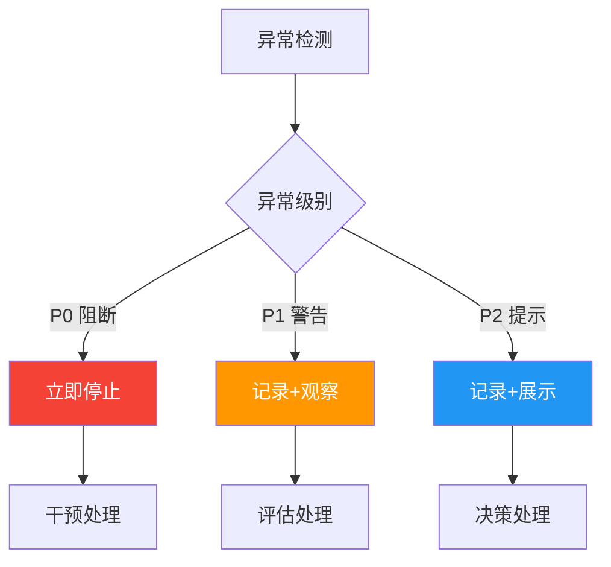
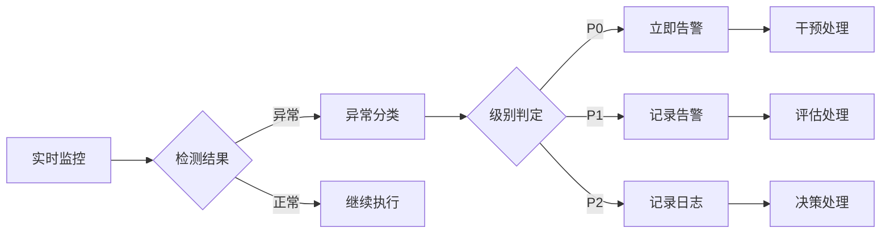

# 异常分级标准

> 本文档定义AI执行过程中的异常分级标准和判定依据。

## 1. 异常分级概览



## 2. 异常分级定义

### 2.1 P0-阻断级

| 属性 | 内容 |
|------|------|
| **定义** | 阻塞AI继续执行或产出的严重问题 |
| **特征** | 完全无法执行、输出严重错误、违反安全原则 |
| **影响** | 任务无法完成，需要人工介入 |
| **处理方式** | 立即停止，切换人类执行 |

### 2.2 P1-警告级

| 属性 | 内容 |
|------|------|
| **定义** | 需要关注但可继续执行的问题 |
| **特征** | 输出需要修正、存在潜在风险、置信度下降 |
| **影响** | 可能影响产出质量，需要关注 |
| **处理方式** | 记录+尝试修正，修正失败则升级 |

### 2.3 P2-提示级

| 属性 | 内容 |
|------|------|
| **定义** | 建议关注但不影响执行的问题 |
| **特征** | 输出可接受但有优化空间、存在改进建议 |
| **影响** | 轻微影响体验，可接受 |
| **处理方式** | 记录+展示，供人类决策 |

## 3. 异常分类

### 3.1 技术异常

| 异常类型 | 级别 | 说明 |
|----------|------|------|
| 编译失败 | P0 | AI生成代码无法编译 |
| 运行崩溃 | P0 | 执行过程崩溃 |
| 超时 | P1 | 执行时间超过阈值 |
| 资源不足 | P1 | 内存/CPU不足 |
| 依赖缺失 | P1 | 缺少依赖包 |

### 3.2 业务异常

| 异常类型 | 级别 | 说明 |
|----------|------|------|
| 需求理解错误 | P0 | 严重偏离需求 |
| 业务逻辑错误 | P0 | 业务逻辑实现错误 |
| 边界遗漏 | P1 | 未处理边界情况 |
| 规范违反 | P2 | 轻微规范问题 |

### 3.3 安全异常

| 异常类型 | 级别 | 说明 |
|----------|------|------|
| 敏感信息泄露 | P0 | 输出包含敏感信息 |
| 安全漏洞 | P0 | 生成代码存在安全漏洞 |
| 权限越界 | P0 | 尝试访问未授权资源 |
| 不当内容 | P1 | 输出包含不当内容 |

### 3.4 质量异常

| 异常类型 | 级别 | 说明 |
|----------|------|------|
| 输出为空 | P0 | 无有效输出 |
| 严重错误 | P0 | 明显的事实错误 |
| 精度不足 | P1 | 结果精度不满足要求 |
| 格式错误 | P2 | 格式不规范 |

## 4. 异常判定矩阵

### 4.1 技术异常判定

| 异常条件 | 级别 | 判定依据 |
|----------|------|----------|
| 编译错误>10个 | P0 | 编译错误数量 |
| 编译错误1-10个 | P1 | 编译错误数量 |
| 执行超时>10分钟 | P0 | 超时时间 |
| 执行超时5-10分钟 | P1 | 超时时间 |
| 执行超时<5分钟 | P2 | 超时时间 |

### 4.2 业务异常判定

| 异常条件 | 级别 | 判定依据 |
|----------|------|----------|
| 功能完全偏离 | P0 | 需求匹配度<30% |
| 功能部分偏离 | P1 | 需求匹配度30-70% |
| 功能轻微偏离 | P2 | 需求匹配度70-90% |
| 验收标准不达标 | P0 | 达标率<50% |
| 验收标准部分达标 | P1 | 达标率50-80% |

### 4.3 安全异常判定

| 异常条件 | 级别 | 判定依据 |
|----------|------|----------|
| 包含密码/密钥 | P0 | 安全关键词检测 |
| SQL注入风险 | P0 | 安全模式匹配 |
| XSS风险 | P1 | 安全模式匹配 |
| 不当内容 | P1 | 内容审核规则 |

### 4.4 质量异常判定

| 异常条件 | 级别 | 判定依据 |
|----------|------|----------|
| 无有效输出 | P0 | 输出验证 |
| 明显事实错误 | P0 | 准确性检查 |
| 置信度<50% | P1 | 置信度阈值 |
| 置信度50-70% | P2 | 置信度阈值 |

## 5. 异常检测机制

### 5.1 自动检测

| 检测方式 | 检测内容 | 触发级别 |
|----------|----------|----------|
| 编译检测 | 代码编译错误 | P0/P1 |
| 执行检测 | 运行异常 | P0/P1 |
| 安全扫描 | 安全漏洞 | P0/P1 |
| 内容审核 | 敏感内容 | P0/P1 |
| 质量检测 | 准确度检查 | P1/P2 |

### 5.2 人工检测

| 检测方式 | 检测内容 | 触发级别 |
|----------|----------|----------|
| 代码审查 | 业务逻辑 | P0/P1/P2 |
| 验收测试 | 功能正确性 | P0/P1/P2 |
| 同行评审 | 质量评估 | P1/P2 |

### 5.3 持续监控



## 6. 异常记录规范

### 6.1 记录模板

```markdown
## 异常记录

### 基本信息
- 异常编号：
- 发生时间：
- 任务类型：
- AI角色：
- 检测方式：

### 异常信息
- 异常类型：
- 异常级别：
- 异常描述：
- 异常堆栈（如有）：

### 上下文信息
- 输入内容：
- 输出内容：
- 执行环境：
- 相关配置：

### 处理记录
- 检测时间：
- 处理方式：
- 处理结果：
- 处理人：
```

### 6.2 记录存储

| 异常级别 | 存储周期 | 存储位置 |
|----------|----------|----------|
| P0 | 1年 | AI-LOG/异常记录 |
| P1 | 90天 | AI-LOG/异常记录 |
| P2 | 30天 | AI-LOG/日志 |

## 7. 异常统计

### 7.1 统计指标

| 指标 | 说明 | 统计周期 |
|------|------|----------|
| 异常数量 | 各级别异常数量 | 每日/每周 |
| 异常类型分布 | 异常类型占比 | 每周 |
| 异常处理时长 | 平均处理时间 | 每周 |
| 异常升级率 | 升级比例 | 每周 |

### 7.2 分析报告

| 报告类型 | 内容 | 频率 |
|----------|------|------|
| 周报 | 异常统计、趋势 | 每周 |
| 月报 | 深度分析、改进建议 | 每月 |
| 季报 | 全面评估、体系优化 | 每季度 |
