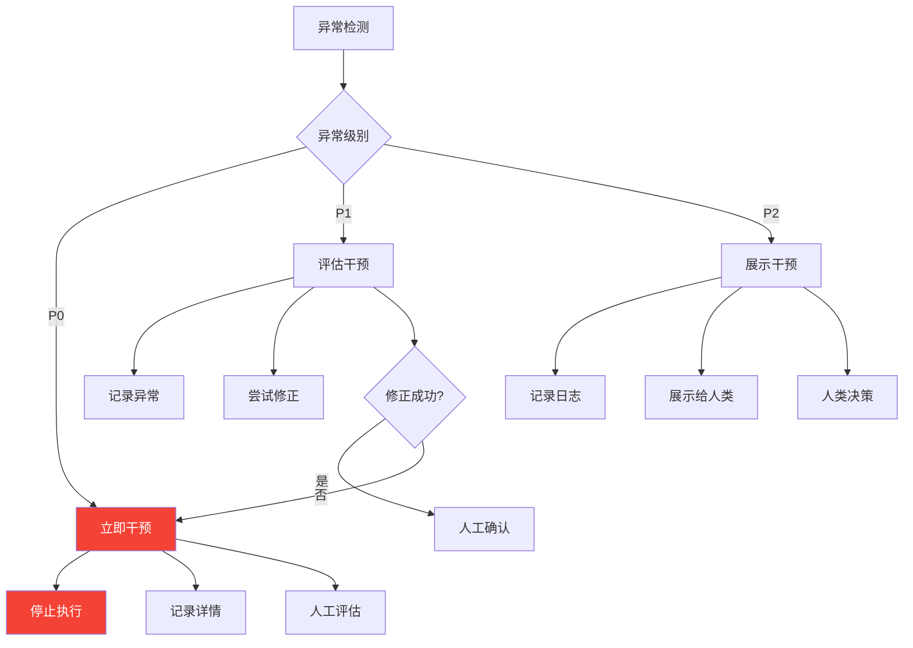
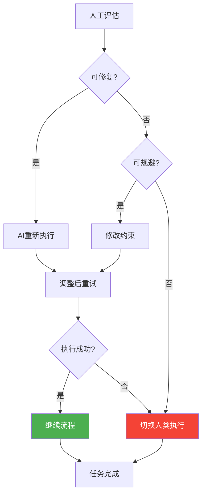

# 干预流程

> 本文档定义AI执行异常时的干预操作流程和处理规范。

## 1. 干预流程概览



## 2. 干预类型

### 2.1 终止干预

| 场景 | 说明 |
|------|------|
| 立即停止 | AI执行过程中发现P0级异常 |
| 产出作废 | AI产出存在严重问题 |
| 权限收回 | 安全风险需要立即停止 |

### 2.2 修改干预

| 场景 | 说明 |
|------|------|
| 调整提示词 | 修改任务描述引导AI修正 |
| 补充上下文 | 添加更多背景信息 |
| 约束条件 | 明确限制条件 |

### 2.3 补充干预

| 场景 | 说明 |
|------|------|
| 补充示例 | 提供更多参考示例 |
| 补充规则 | 明确规范要求 |
| 补充资源 | 提供参考文档 |

### 2.4 切换干预

| 场景 | 说明 |
|------|------|
| 切换AI角色 | 更换其他AI执行 |
| 切换人类 | 切换人类执行 |
| 任务拆分 | 拆分为更小任务 |

## 3. P0级干预流程

### 3.1 流程步骤

| 步骤 | 操作 | 说明 |
|------|------|------|
| 1 | 立即停止 | 停止AI当前执行 |
| 2 | 记录详情 | 记录异常详情到AI-LOG |
| 3 | 隔离产出 | 标记异常产出 |
| 4 | 人工评估 | 评估影响范围和风险 |
| 5 | 决策处理 | 确定处理方式 |

### 3.2 处理决策



## 4. P1级干预流程

### 4.1 流程步骤

| 步骤 | 操作 | 说明 |
|------|------|------|
| 1 | 记录异常 | 记录到AI-LOG |
| 2 | 尝试修正 | AI自动尝试修正 |
| 3 | 评估修正 | 评估修正结果 |
| 4 | 人工确认 | 人类确认是否通过 |

### 4.2 修正策略

| 修正策略 | 适用场景 |
|----------|----------|
| 重新生成 | 输出内容错误 |
| 补充信息 | 上下文不足 |
| 调整约束 | 约束条件不明确 |
| 示例引导 | 格式/风格问题 |

## 5. P2级干预流程

### 5.1 流程步骤

| 步骤 | 操作 | 说明 |
|------|------|------|
| 1 | 记录日志 | 记录到AI-LOG |
| 2 | 展示给人类 | 在产出中标注 |
| 3 | 人类决策 | 决定是否采纳 |

### 5.2 处理方式

| 人类决策 | 处理结果 |
|----------|----------|
| 采纳 | 应用优化建议 |
| 不采纳 | 忽略继续流程 |
| 改进后采纳 | 补充要求后重试 |

## 6. 干预操作指南

### 6.1 干预操作列表

| 操作 | 命令 | 说明 |
|------|------|------|
| 停止执行 | `/stop` | 立即停止AI执行 |
| 终止任务 | `/terminate` | 终止当前任务 |
| 重新执行 | `/retry` | 重新执行当前任务 |
| 调整提示 | `/revise` | 修改任务要求 |
| 补充信息 | `/append` | 补充上下文信息 |
| 切换执行 | `/switch` | 切换执行模式 |
| 人工接管 | `/human` | 切换人类执行 |

### 6.2 干预快捷操作

```markdown
## 干预快捷操作

### 常用命令
| 命令 | 快捷键 | 功能 |
|------|--------|------|
| 停止 | Ctrl+S | 立即停止 |
| 暂停 | Ctrl+P | 暂停执行 |
| 重试 | Ctrl+R | 重新执行 |
| 人工 | Ctrl+H | 切换人类 |
```

## 7. 干预记录

### 7.1 记录要求

| 干预类型 | 记录内容 |
|----------|----------|
| 终止干预 | 异常详情、终止原因、处理决策 |
| 修改干预 | 修改内容、修改原因、修改结果 |
| 补充干预 | 补充内容、补充原因、执行结果 |
| 切换干预 | 切换原因、切换目标、执行结果 |

### 7.2 记录模板

```markdown
## 干预记录

### 干预基本信息
- 干预编号：
- 干预时间：
- 干预类型：
- 干预人：
- 任务ID：

### 干预详情
- 干预前状态：
- 干预操作：
- 干预原因：

### 干预结果
- 执行结果：
- 后续动作：
- 完成时间：
```

## 8. 干预效果评估

### 8.1 评估指标

| 指标 | 说明 |
|------|------|
| 干预响应时间 | 从异常发现到干预的时间 |
| 干预成功率 | 干预后任务完成的比例 |
| 干预效率 | 干预后产出的质量 |
| 二次异常率 | 干预后再次异常的比例 |

### 8.2 评估报告

| 报告周期 | 内容 |
|----------|------|
| 每日 | 干预数量、类型分布 |
| 每周 | 干预效果分析、改进建议 |
| 每月 | 干预趋势、体系优化 |
