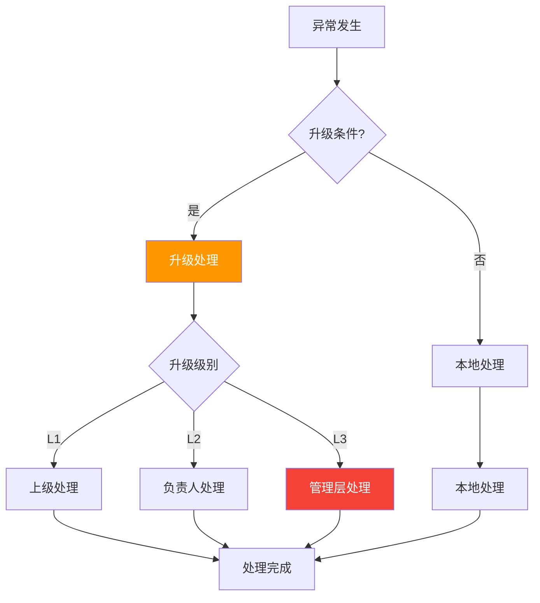
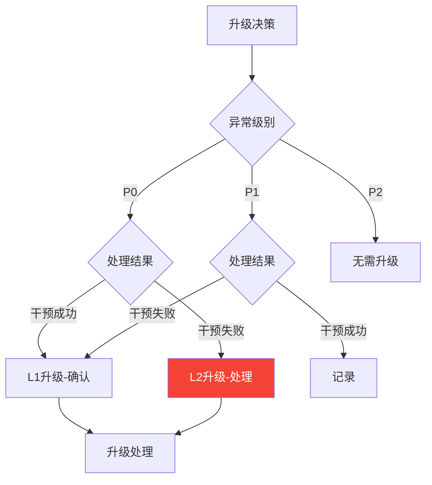
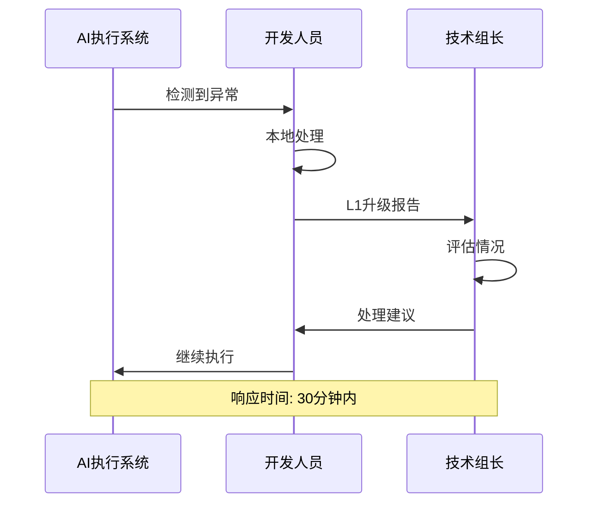
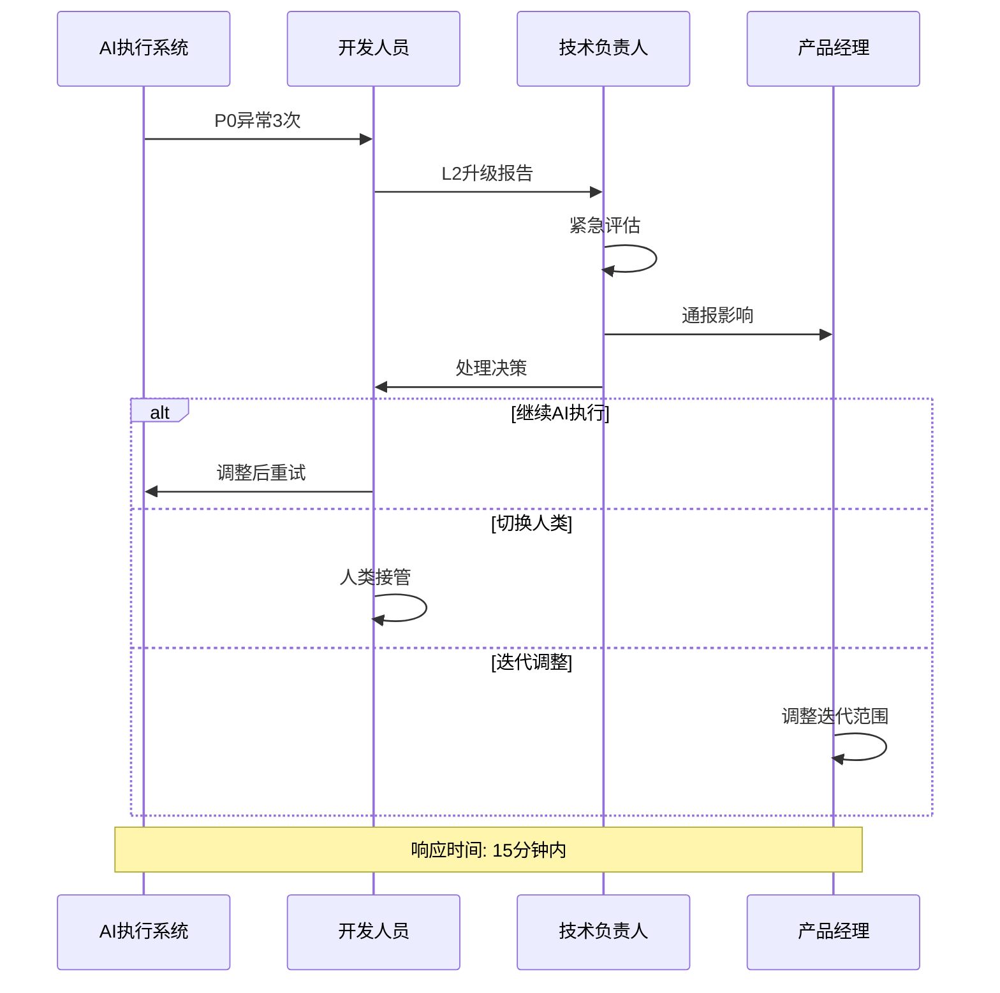
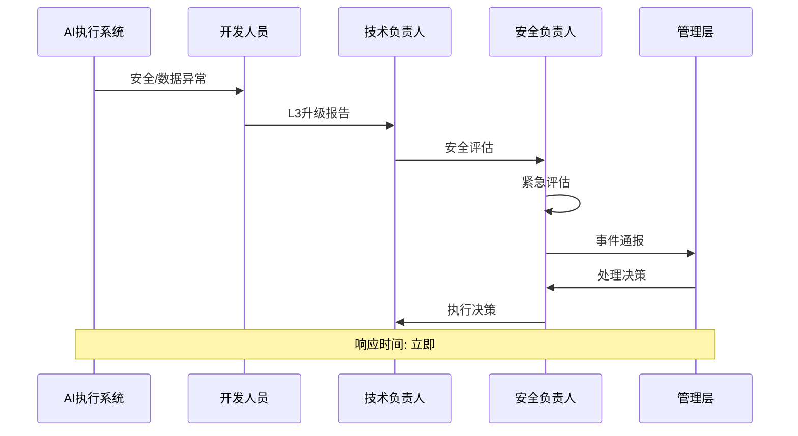

# 升级机制

> 本文档定义AI执行异常升级的条件、流程和处理规范。

## 1. 升级机制概览



## 2. 升级条件

### 2.1 自动升级

| 条件 | 升级级别 | 说明 |
|------|----------|------|
| P0异常3次 | L2 | 连续P0异常 |
| P1异常5次 | L1 | 累计P1异常 |
| 干预不成功 | L2 | 干预后仍异常 |
| 涉及安全 | L3 | 安全相关异常 |
| 涉及数据 | L3 | 数据相关异常 |

### 2.2 人工升级

| 条件 | 升级级别 | 说明 |
|------|----------|------|
| 无法判断 | L1 | 无法确定处理方式 |
| 资源不足 | L2 | 需要更多资源 |
| 影响迭代 | L2 | 影响迭代进度 |
| 影响发布 | L3 | 影响发布计划 |

### 2.3 升级决策矩阵



## 3. 升级级别

### 3.1 L1级升级

| 属性 | 内容 |
|------|------|
| **级别** | 初级升级 |
| **触发条件** | 连续异常、干预不成功 |
| **升级对象** | 组长/资深成员 |
| **响应时间** | 30分钟内 |
| **处理方式** | 评估后处理 |

### 3.2 L2级升级

| 属性 | 内容 |
|------|------|
| **级别** | 中级升级 |
| **触发条件** | 严重异常、影响迭代 |
| **升级对象** | 技术负责人/PM |
| **响应时间** | 15分钟内 |
| **处理方式** | 决策后处理 |

### 3.3 L3级升级

| 属性 | 内容 |
|------|------|
| **级别** | 高级升级 |
| **触发条件** | 安全事件、数据事件 |
| **升级对象** | 管理层/安全负责人 |
| **响应时间** | 立即 |
| **处理方式** | 紧急处理 |

## 4. 升级流程

### 4.1 L1升级流程



### 4.2 L2升级流程



### 4.3 L3升级流程



## 5. 升级处理

### 5.1 升级处理选项

| 处理方式 | 适用场景 | 审批人 |
|----------|----------|--------|
| 调整AI配置 | 参数/边界调整 | 技术负责人 |
| 切换执行模式 | AI→人类执行 | 技术负责人 |
| 调整迭代范围 | 任务延期/缩减 | PM |
| 暂停AI功能 | 严重问题 | 技术负责人 |
| 回滚操作 | 发布后问题 | 技术负责人 |

### 5.2 升级决策记录

```markdown
## 升级决策记录

### 基本信息
- 升级编号：
- 升级时间：
- 升级级别：
- 异常类型：

### 升级原因
- 异常详情：
- 升级触发条件：
- 影响评估：

### 处理决策
- 处理方式：
- 决策人：
- 审批人：
- 执行时间：

### 处理结果
- 执行结果：
- 完成时间：
- 后续跟进：
```

## 6. 升级响应

### 6.1 响应时间要求

| 升级级别 | 响应时间 | 处理时间 | 汇报时间 |
|----------|----------|----------|----------|
| L1 | 30分钟 | 2小时 | 实时 |
| L2 | 15分钟 | 1小时 | 实时 |
| L3 | 立即 | 30分钟 | 5分钟 |

### 6.2 响应检查清单

```markdown
## 升级响应检查清单

### L1级
- [ ] 确认收到升级通知
- [ ] 了解异常详情
- [ ] 评估处理方案
- [ ] 给出处理建议
- [ ] 跟进执行结果

### L2级
- [ ] 确认收到升级通知
- [ ] 立即评估影响
- [ ] 制定处理方案
- [ ] 协调相关资源
- [ ] 汇报处理进展

### L3级
- [ ] 立即响应
- [ ] 启动应急预案
- [ ] 通知相关方
- [ ] 协调全部资源
- [ ] 实时汇报进展
```

## 7. 升级后跟进

### 7.1 跟进事项

| 跟进项 | 说明 |
|--------|------|
| 处理确认 | 确认问题已解决 |
| 根因分析 | 分析异常根本原因 |
| 改进措施 | 制定预防措施 |
| 配置更新 | 更新AI配置 |
| 复盘总结 | 记录经验教训 |

### 7.2 复盘要求

| 升级级别 | 复盘要求 | 复盘时间 |
|----------|----------|----------|
| L1 | 记录归档 | 24小时内 |
| L2 | 分析总结 | 48小时内 |
| L3 | 全面复盘 | 1周内 |

## 8. 升级统计

### 8.1 统计指标

| 指标 | 说明 |
|------|------|
| 升级数量 | 各级别升级次数 |
| 升级频率 | 升级发生频率 |
| 响应及时率 | 按时响应比例 |
| 处理成功率 | 处理成功比例 |

### 8.2 分析报告

| 报告类型 | 内容 | 频率 |
|----------|------|------|
| 周报 | 升级统计、趋势 | 每周 |
| 月报 | 深度分析、改进 | 每月 |
| 季报 | 全面评估、优化 | 每季度 |
