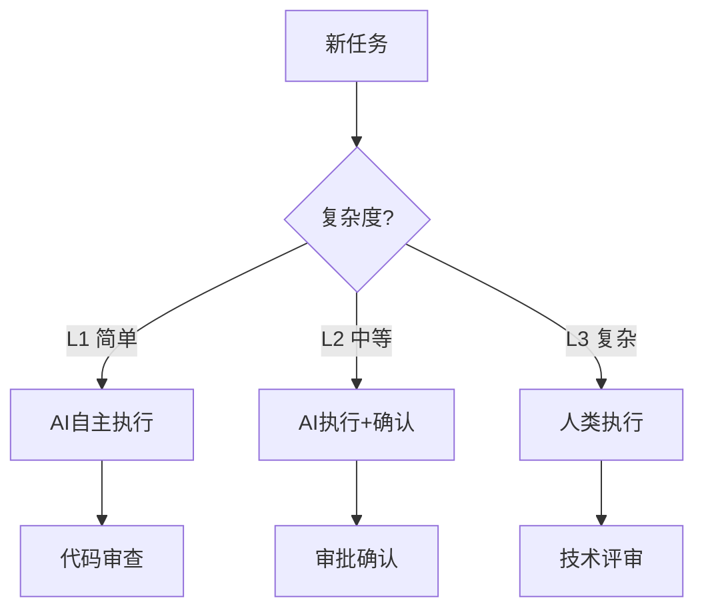
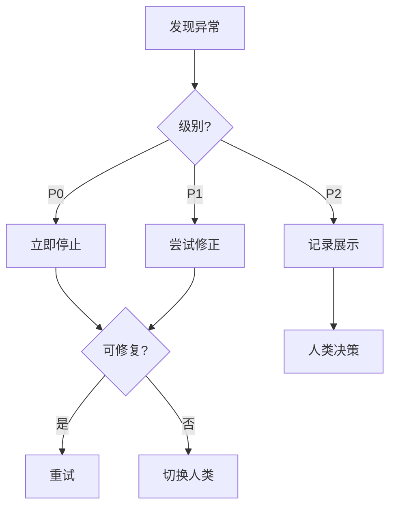

# 快速参考

> 本文档提供常用操作和决策的快速参考指南。

## 1. 常用操作速查

### 1.1 任务下达

```markdown
# 任务指令

## 任务类型：[代码生成/测试生成/文档生成]
## 任务描述：[详细描述]

## 上下文信息
- 涉及模块：
- 技术栈：

## 验收标准
1. 

## 优先级：[P0/P1/P2]
```

### 1.2 干预操作

| 操作 | 命令 | 说明 |
|------|------|------|
| 停止AI | `/stop` | 立即停止执行 |
| 重试 | `/retry` | 重新执行 |
| 修改 | `/revise` | 修改任务要求 |
| 切换人工 | `/human` | 切换人类执行 |

### 1.3 审批操作

| 审批类型 | 审批人 | 响应时间 |
|----------|--------|----------|
| 代码合并 | 高级开发 | 实时 |
| 技术方案 | 架构师 | 24h |
| 发布审批 | 技术负责人 | 2h |

## 2. 决策树

### 2.1 任务分配决策



### 2.2 异常处理决策



## 3. 联系方式

| 角色 | 职责 | 响应时间 |
|------|------|----------|
| 技术负责人 | 技术决策 | 30分钟 |
| 产品经理 | 业务决策 | 1小时 |
| 安全负责人 | 安全事件 | 15分钟 |
| 值班人员 | 线上问题 | 实时 |

## 4. 常用链接

| 资源 | 链接 |
|------|------|
| 代码仓库 | [链接] |
| 文档库 | [链接] |
| 监控系统 | [链接] |
| 任务管理 | [链接] |
| CI/CD | [链接] |

## 5. 常见问题处理

### 5.1 AI执行问题

| 问题 | 处理方式 |
|------|----------|
| AI输出错误 | 停止+修改提示词 |
| AI执行超时 | 终止+分析原因 |
| AI连续失败3次 | 升级+切换人类 |

### 5.2 迭代问题

| 问题 | 处理方式 |
|------|----------|
| 需求变更 | 评估影响+决定是否纳入 |
| 缺陷过多 | 优先修复+评估范围 |
| 进度延迟 | 调整范围+资源协调 |

### 5.3 发布问题

| 问题 | 处理方式 |
|------|----------|
| 发布失败 | 回滚+分析原因 |
| 线上缺陷 | 紧急修复+评估回滚 |
| 性能下降 | 监控+分析+优化 |
