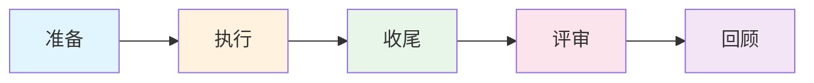
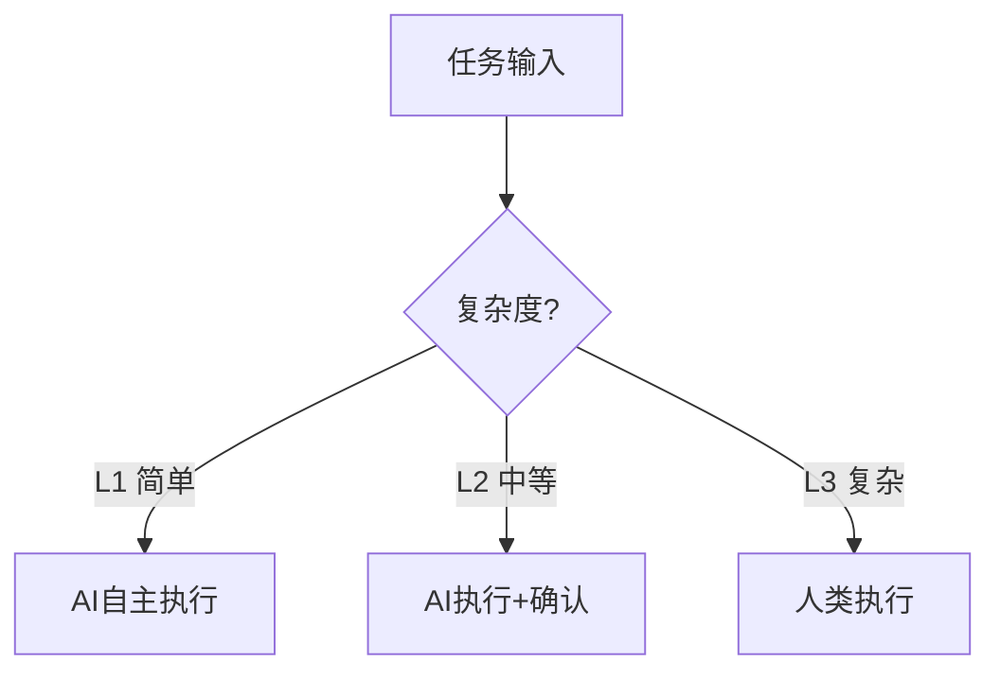

# 迭代SOP快速指引

> 本文档提供迭代SOP的核心要点，一页纸速查。

---

## 1. 五阶段流程

| 阶段 | 时长 | 关键活动 |
|------|------|----------|
| 迭代准备 | 1-2天 | 需求评审、技术方案、任务拆分、迭代计划 |
| 迭代执行 | 2周 | 每日站会、代码开发、测试执行、代码审查 |
| 迭代收尾 | 1-2天 | 验收测试、回归测试、发布准备 |
| 迭代评审 | 0.5天 | 成果展示、业务反馈、下迭代预告 |
| 迭代回顾 | 0.5天 | 数据回顾、问题讨论、改进措施 |

---

## 2. 人类角色（12人）

| 角色 | 核心职责 |
|------|----------|
| PM | 需求管理、验收标准、迭代目标 |
| UI/UX设计师 | 界面设计、交互设计 |
| 架构师 | 技术架构、技术方案评审 |
| 前端/后端工程师 | 代码开发、技术实现 |
| 测试工程师 | 测试用例、测试执行、缺陷管理 |
| 运维工程师 | 部署、CI/CD、监控 |
| 技术负责人 | 技术决策、代码合并审批、发布审批 |
| Scrum Master | 迭代过程管理、团队协调 |

---

## 3. AI角色（12个）

| AI角色 | 核心能力 | 适用场景 |
|--------|----------|----------|
| AI-PM | 需求分析、用户故事 | 需求梳理 |
| AI-UI/UX | 界面/交互设计 | 设计初稿 |
| AI-Architect | 架构设计、技术方案 | 系统设计 |
| AI-FE/BE | 代码开发 | 页面/API开发 |
| AI-Test | 测试用例、测试执行 | 测试生成/执行 |
| AI-DevOps | CI/CD、部署 | 自动化部署 |
| AI-Writer | 文档生成 | 报告、纪要 |
| AI-Reviewer | 代码审查 | 安全检查 |

---

## 4. 边界判断

| 级别 | 定义 | AI权限 |
|------|------|--------|
| L1 | ≤100行、1个模块 | 完全自主 |
| L2 | 100-500行、2-3个模块 | 需确认 |
| L3 | >500行、>3个模块 | 禁止AI |

---

## 5. 质量门禁

| 阶段 | 检查项 | 标准 |
|------|--------|------|
| 准备 | 需求评审、技术方案 | 100%覆盖、可执行 |
| 执行 | 代码规范、单元测试 | 通过Lint、≥70%覆盖 |
| 收尾 | 验收测试、缺陷清零 | 100%通过、P0/P1=0 |
| 发布 | 安全扫描、回滚方案 | 无高危漏洞 |

---

## 6. 常用链接

| 资源 | 位置 |
|------|------|
| 索引文档 | [00_迭代SOP_索引](./00_规范/00_迭代SOP_索引.md) |
| 模板库 | [01_模板库](./01_模板库/) |
| 迭代文档 | [07_迭代文档](./07_迭代文档/) |

---

## 7. 关键命令

| 操作 | 命令/动作 |
|------|-----------|
| 下达任务 | 使用AI任务指令模板 |
| 停止AI | `/stop` |
| 重试 | `/retry` |
| 切换人工 | `/human` |

---

> 完整文档请参考 [索引文档](./00_规范/00_迭代SOP_索引.md)