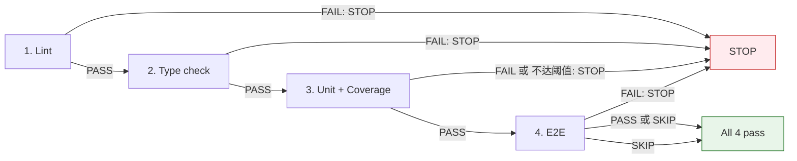
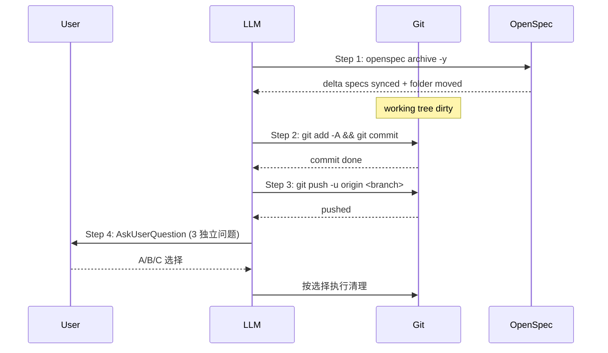

# OpenSpec 工作流（v3.0 — 流程机制）

本文档描述本仓库使用的 OpenSpec 5 阶段开发工作流的**流程机制**。**v3.0 关键变化**：项目特定值（命令、阈值、命名格式）已从本文档剥离，集中到仓库根 `AGENTS.md` "项目事实" 章节。

> **本文档 = 流程机制**（做什么、为什么、顺序如何）
> **AGENTS.md = 项目事实**（用什么命令、阈值多少、命名怎么写）
> **冲突时以 AGENTS.md 为准**。

## 目录

- [总体流程](#总体流程)
- [5 阶段职责](#5-阶段职责)
- [Pre-flight 拦载机制](#pre-flight-拦载机制)
- [Commit 粒度机制](#commit-粒度机制)
- [Verify 4 类测试机制](#verify-4-类测试机制)
- [Archive 4 步顺序](#archive-4-步顺序)
- [常见问题](#常见问题)

## 总体流程

```mermaid
flowchart LR
    N[/opsx:new<br/>创建 worktree] --> C[/opsx:continue ×5-6<br/>产出 artifact/]
    C --> A[/opsx:apply<br/>单元测试 + commit 粒度]
    A --> V[/opsx:verify<br/>4 类全面测试 + openspec]
    V --> AR[/opsx:archive<br/>archive + commit + push + 询问]

    classDef stage fill:#fff3e0,stroke:#e65100
    class N,C,A,V,AR stage
```

每个阶段必须在**前阶段产物存在**的前提下才能进入（机制级）：

| 当前阶段 | 前置产物 | 缺失时 |
|---|---|---|
| NEW | 无 | 直接执行 |
| CONTINUE | change 目录 + .openspec.yaml | 提示先 `/opsx:new` |
| APPLY | 全部 7 个 artifact | 提示先 `/opsx:continue` |
| VERIFY | `apply-summary.md` | 提示先 `/opsx:apply` |
| ARCHIVE | `verify.md`（无 FAIL 项） | 提示先 `/opsx:verify` |

## 5 阶段职责

### 阶段 1: NEW

`/opsx:new <feature-name>`

**职责**：
1. Pre-flight 检测遗留未 archive change
2. 拼名（按 AGENTS.md "命名约定" 模板）
3. 冲突检测（worktree + branch）
4. 通过 `superpowers:using-git-worktrees` 创建 worktree
5. 在 worktree 内 `openspec new` 初始化 change 目录
6. 输出后续指引

**关键约束**：
- 必须在 git 仓库中执行
- 仓库根 `.gitignore` 必须包含 `.worktrees`

**Pre-flight 拦载**：若发现遗留 change，**用 AskUserQuestion 询问**用户：
- A. 处理遗留
- B. 标记放弃（`openspec archive -y` 空壳）
- C. 继续新建（不推荐）

### 阶段 2: CONTINUE

`cd <worktree> && /opsx:continue`（×5-6 次）

**职责**：按 schema 顺序产出 artifact：
1. **brainstorm.md**
2. **proposal.md**
3. **specs/<capability>/spec.md**
4. **design.md**
5. **tasks.md**（粗粒度任务清单，每个 task ≥ 2 commit）
6. **plan.md**（微任务）

**关键约束**：
- 每次 `/opsx:continue` 产出 1 个 artifact
- 创建前必读 dependency artifacts
- **worktree 自检**：若不在 worktree 内，提示切换

### 阶段 3: APPLY

`/opsx:apply`（在 worktree 内执行）

**职责**：
1. 验证 worktree + plan.md 存在
2. 加载 `subagent-driven-development`（transitive: TDD + code-review）
3. 派 subagent 逐 task 实施，**强制 commit 粒度**
4. 产出 `apply-summary.md`

**apply 阶段**（机制）：
- ✅ 跑**单元测试**（不通过 → 不勾 task）
- ✅ 强制每个 task ≥ 2 commit（具体前缀从 AGENTS.md）
- ❌ **不跑** lint / typecheck / 覆盖率阈值 / e2e（归 verify）

### 阶段 4: VERIFY

`/opsx:verify`（在 worktree 内执行）

**职责**：跑 4 类全面测试（机制） + OpenSpec 7 项检查，产出 `verify.md`

**4 类测试**（顺序敏感）：

| # | 类 | 失败处理 |
|---|---|---|
| 1 | Lint | STOP（阻塞 archive） |
| 2 | Type check | STOP（阻塞 archive） |
| 3 | Unit + 覆盖率 | 不达阈值 → STOP（阻塞 archive） |
| 4 | E2E | 失败 → STOP；标记 SKIP → 跳过 |

**具体命令与阈值**从 `AGENTS.md "测试栈映射" / "覆盖率阈值"` 读取。

**OpenSpec 7 项**（机制级，跨项目通用）：
1. 结构校验 (`openspec validate --all --json`)
2. Task 完成度
3. delta spec 同步状态（警告）
4. design/specs 一致性（警告）
5. 实现信号（commits > 0）
6. front-door routing 泄漏（警告）
7. deferred-dogfood 等价性（条件阻塞）

### 阶段 5: ARCHIVE

`/opsx:archive`（在 worktree 内执行）

**职责**：**严格 4 步顺序**（机制级，不可颠倒）：

#### Step 1: archive
```bash
openspec archive -y
```
效果：同步 delta specs + 移动文件夹到 `archive/`

#### Step 2: commit 归档内容
```bash
git add -A
git commit -m "<按 AGENTS.md commit 规范的 archive 形式>"
```

#### Step 3: push 分支
```bash
git push -u origin "<branch-name>"
```

#### Step 4: 询问用户清理选项（必问，不擅自）
- A. 删除本地分支 → `git branch -d <name>`
- B. 清理 worktree → `git worktree remove <path>`
- C. 立即开 PR → `gh pr create --base main --head <name>`

**安全约束**：
- 用 `git branch -d` 而非 `-D`
- 任何失败都要 STOP，不擅自跳过

## Pre-flight 拦载机制

**机制级规则**：每个阶段在 Step 0 跑内联 shell 命令检测前置条件。

| 阶段 | 拦载目标 | 拦载失败时 |
|---|---|---|
| NEW | 遗留未 archive change | 询问 A/B/C |
| CONTINUE | 不在 worktree 内 | 提示切换 |
| APPLY | plan.md 缺失 / 不在 worktree / git dirty | 提示前置 |
| VERIFY | apply-summary.md 缺失 / git dirty | 提示前置 |
| ARCHIVE | verify.md 含 ❌ / git dirty | 提示前置 |

**通用命令模板**：
```bash
# 遗留 change 检测
find openspec/changes -mindepth 1 -maxdepth 1 -type d \
  -not -path 'openspec/changes/archive' 2>/dev/null

# worktree 自检
GIT_DIR=$(cd "$(git rev-parse --git-dir)" 2>/dev/null && pwd -P)
GIT_COMMON=$(cd "$(git rev-parse --git-common-dir)" 2>/dev/null && pwd -P)
[ "$GIT_DIR" != "$GIT_COMMON" ]
```

## Commit 粒度机制

**机制级规则**（由 `openspec-apply-change` SKILL 强制）：

每个 plan.md task 至少 2 个 commit：

1. **第 1 个 commit（RED）**：写失败测试，确认 RED
2. **第 2 个 commit（GREEN）**：最小实现，测试通过
3. **第 3 个 commit（可选）**：重构

**格式与具体前缀**从 `AGENTS.md "commit 规范"` 读取。

**密度对账**（机制级）：
```bash
TOTAL_TASKS=$(grep -c '^- \[' openspec/changes/<name>/tasks.md)
TOTAL_COMMITS=$(git log main..HEAD --oneline | wc -l)
[ "$TOTAL_COMMITS" -ge $((2 * TOTAL_TASKS)) ] || echo "⚠️ 粒度不足"
```

## Verify 4 类测试机制

**顺序敏感**（与具体项目无关）：



**命令获取**：从 `AGENTS.md "测试栈映射"` 查表
**阈值获取**：从 `AGENTS.md "覆盖率阈值"` 查表

## Archive 4 步顺序



**颠倒顺序后果**：
- Step 1 后跳 Step 2 → archive 移动未 commit，污染 working tree
- Step 2 后跳 Step 3 → delta specs 未 push，远端不一致
- Step 3 后跳 Step 4 → 擅自清理，不可恢复

## 常见问题

### Q: worktree 何时创建？
A: `/opsx:new` 阶段就创建。**不在 apply 阶段创建**（v1 行为，已废弃）。

### Q: change 名能不带时间戳吗？
A: **不能**。时间戳保证全局唯一 + 排序可读。具体格式见 `AGENTS.md "命名约定"`。

### Q: apply 阶段能跑 lint 吗？
A: **不能**。lint/typecheck/coverage/e2e 归 verify 阶段。apply 只跑单元测试。

### Q: commit 粒度不达标会怎样？
A: apply 阶段**警告**（允许通过），archive 阶段**阻塞**（要求补 commit）。

### Q: archive 后能恢复吗？
A: archive 是单向的。若需恢复：`git revert` archive commit + 手动从 archive 目录复制回 changes/（注意：delta specs 已合并到 main specs，不能简单 mv）。

### Q: worktree 清理能自动吗？
A: **不能**。必须 `AskUserQuestion` 让用户决定。可保留 worktree 供后续调试。

### Q: 覆盖率阈值能降低吗？
A: **不能**。不达标时回 apply 补单测，不在 verify 阶段绕过。具体阈值从 `AGENTS.md "覆盖率阈值"` 读取。

### Q: 我在 SKILL 中找不到具体命令/阈值？
A: **正确行为**。SKILL.md 是流程通用版；具体项目值都在 `AGENTS.md` "项目事实" 章节。

## 相关文档

- `AGENTS.md` — 项目根级指引 + **项目事实源**
- `openspec/config.yaml` — schema 选择与 OpenSpec 规则
- `openspec/schemas/superpowers-bridge/schema.yaml` — schema 定义
- `openspec/schemas/superpowers-bridge/README.md` — superpowers-bridge 通用文档
- `.opencode/skills/openspec-new-change/SKILL.md` — NEW 阶段 SKILL
- `.opencode/skills/openspec-continue-change/SKILL.md` — CONTINUE 阶段 SKILL
- `.opencode/skills/openspec-apply-change/SKILL.md` — APPLY 阶段 SKILL
- `.opencode/skills/openspec-verify-change/SKILL.md` — VERIFY 阶段 SKILL
- `.opencode/skills/openspec-archive-change/SKILL.md` — ARCHIVE 阶段 SKILL
