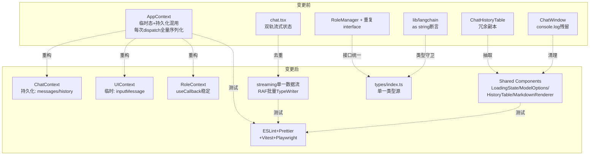
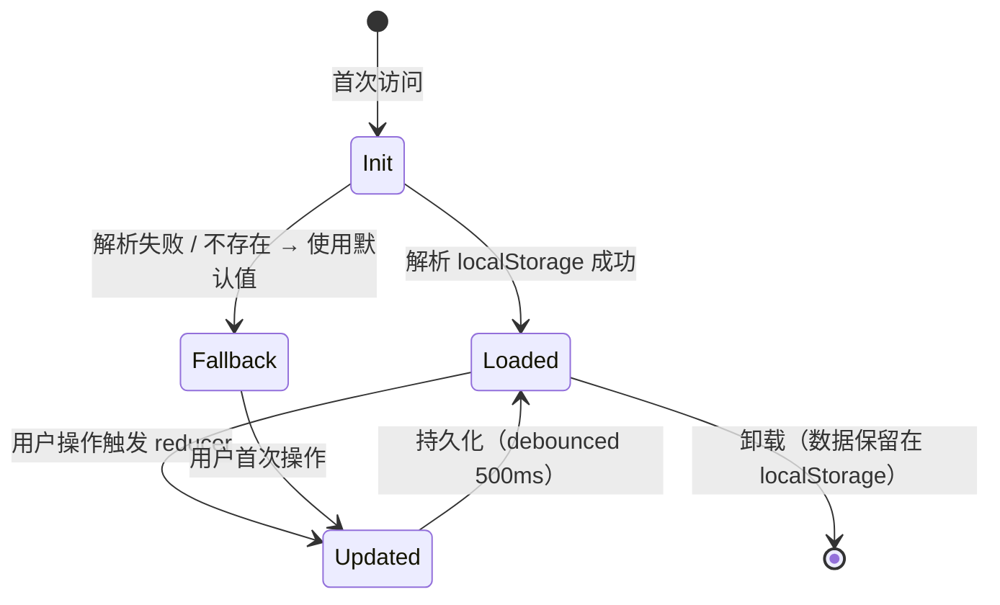
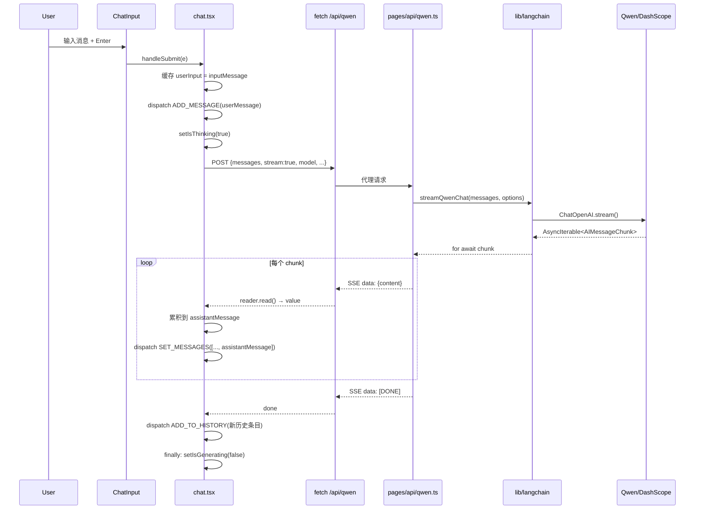
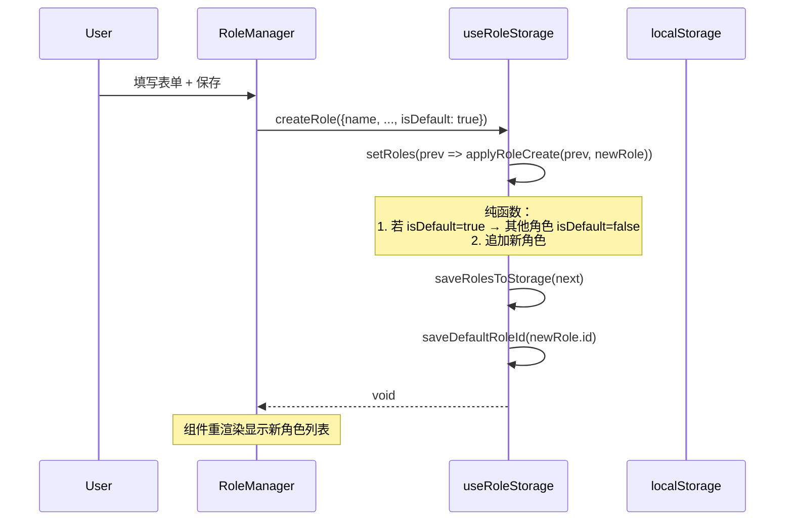
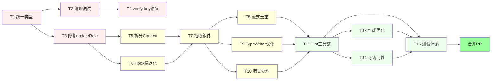

# Design: qwen-chatbot-code-quality-refactor

> 本档为 `brainstorm.md`（raw capture）与 `proposal.md`（动机 + 范围）的结构化技术设计。
> 重点在"如何实现"：架构、决策、数据流、测试、回滚。

## Architecture Overview



### 位置

本次变更位于 qwen-chatbot 项目的**前端层 + 共享基础设施层**：

- **状态层**（`contexts/`、`components/useRoleStorage.ts`、`components/useAISettings.ts`）
- **类型层**（`types/`）
- **UI 共享组件层**（`components/LoadingState`、`ModelOptions`、`HistoryTable`、`MarkdownRenderer`）
- **流式渲染层**（`pages/chat.tsx`、`components/TypeWriterEffect.tsx`）
- **后端 API 净化**（`pages/api/verify-key.ts`）
- **工具链基础设施**（`.eslintrc`、`.prettierrc`、`vitest.config.ts`、`playwright.config.ts`）

### 架构模式

- **Context 拆分模式**（Multi-Context）：替代单一全局 Context，按"持久化 / 临时态 / 领域"拆分
- **Pure Function Reducer**：角色 CRUD 抽取为 `applyRoleUpdate(prev, role)` 纯函数，保证单次 `setState` + 单次 `save`
- **Hook Reference Stability Pattern**：所有返回函数 `useCallback` 包装，引用 state 通过 setter 回调
- **Debounced Persistence**：持久化操作通过 `use-debounce` 节流，避免高频写 localStorage

### 耦合边界

| 新增耦合 | 边界 | 备注 |
|---------|------|------|
| `types/index.ts` → 所有消费方 | 类型单向依赖 | 严格单向，禁止反向 |
| `ChatContext` → `localStorage` | 通过 debounce Hook | 失败可降级为内存态 |
| `useRoleStorage` → `localStorage` | 通过 setter 回调 | 闭包不持有 state |
| `Streaming Hook` → 后端 SSE | 通过 fetch + ReadableStream | 网络错误可中断 |
| 测试 → `vi.mock` 边界 | 单元测试 mock localStorage / fetch | 不污染全局 |
| E2E → dev server | Playwright 启动 `next dev` | 独立 context，不影响用户数据 |

---

## Context

### 项目背景

qwen-chatbot 是一个 Next.js 16 + React 19 + LangChain 的通义千问聊天机器人。单人维护，Pages Router，通过 `/api/qwen` 代理调用兼容 OpenAI 格式的 DashScope。

### 当前状态

通过全面审查（22 个源文件），识别 50+ 项问题：
- 类型重复（4 处）
- 调试代码残留（1 处 `console.log`）
- 状态管理混乱（AppContext + useRoleStorage 多次 setState）
- 流式双重渲染（视觉重复）
- Hook 引用不稳定（多次 setState / useEffect 误触发）
- 零测试 + 无 ESLint
- 性能待优化（无 memo / 无虚拟列表 / Markdown 重复解析）
- 可访问性缺失（模态框无 role / 无 focus trap）

### 约束

- **产品行为 100% 不变**（用户已确认）
- **保持 Pages Router**（不迁移 App Router）
- **保持 Tailwind v3**（不升级到 v4）
- **保持 React 19**（不升级到 20）
- **保持 Next.js 16**（如需降级须另开变更）
- **API Key 用户自配**（不引入后端代理 / Cookie）

### 利益相关者

- 开发者本人（主要受益方）
- 后续接手者 / AI 协作方（间接受益）

---

## Goals / Non-Goals

### Goals

1. **类型安全**：消除重复定义，类型断言替换为类型守卫
2. **状态可预测**：Context 拆分 + 纯函数 reducer + Hook 引用稳定
3. **流式数据流单一**：消除 messages 末尾与 currentResponse 重复
4. **错误处理正确**：所有 catch 分支使用捕获到的本地变量
5. **共享 UI 抽取**：4 个共享组件消除代码重复
6. **工具链就绪**：ESLint + Prettier + Vitest + Playwright + 覆盖率门槛
7. **性能可观测**：Lighthouse ≥ 90，无明显交互卡顿
8. **可访问性达标**：模态框键盘可达，色彩对比达 WCAG AA
9. **生产净化**：无 `console.log`、HTTP 语义正确

### Non-Goals

- ❌ 引入新功能（产品需求）
- ❌ 修改产品行为（用户已配置 / 评估 / 模态框等流程）
- ❌ 迁移到 App Router
- ❌ 升级 Tailwind / React / Next.js 大版本
- ❌ 引入大型新依赖（i18n / react-hook-form / swr / zustand）
- ❌ 引入 IndexedDB（保持 localStorage）
- ❌ API Key 存储加固（已确认本期不做）
- ❌ API 路由限流（已确认本期不做）
- ❌ 后端架构调整（保持 Next API Routes）

---

## Data Model

> 涉及 localStorage schema 变更，但**保持向后兼容**。

### 实体定义

| 实体 | 存储方式 | Key | 字段 | 生命周期 |
|------|---------|-----|------|---------|
| `messages` | localStorage JSON 数组 | `appState.messages` | `{role, content, usage?}` | 应用全周期 |
| `conversationHistory` | localStorage JSON 数组 | `appState.conversationHistory` | `{id, timestamp, input, output, model, params, tokenUsage?, evaluation}` | 应用全周期 |
| `selectedRoleId` | localStorage 字符串 | `appState.selectedRoleId` | `string \| null` | 应用全周期 |
| `roles` | localStorage JSON 数组 | `qwen_chatbot_roles` | `Role[]`（含 id/name/description/systemPrompt/modelConfig/isDefault） | 应用全周期 |
| `defaultRoleId` | localStorage 字符串 | `qwen_chatbot_default_role_id` | `string \| null` | 应用全周期 |
| `apiKey` | localStorage 字符串 | `qwen_chatbot_api_key` | `string` | 应用全周期（用户主动清除为止） |

### 状态迁移



### Schema 兼容性

- 所有现有字段**保持不变**（不删字段）
- 新增字段**均为可选**（可选 + 默认值兜底）
- 读取时容错：缺失字段回退到默认

```typescript
// 容错读取模式（apply to all persisted states）
const loaded = JSON.parse(stored);
return {
  ...defaultValue,
  ...loaded,
  // 显式校验关键字段类型
  messages: Array.isArray(loaded.messages) ? loaded.messages : [],
};
```

---

## Decisions

### D1：测试工具链选型

- **选择**：Vitest + React Testing Library + Playwright
- **理由**：
  - Vitest 与 Vite 生态兼容，ESM 原生支持，速度快
  - RTL 是 React 组件测试事实标准
  - Playwright 是 Next.js 官方推荐的 E2E 方案
- **已考虑 alternative**：
  - Jest：配置繁琐、对 ESM 兼容不如 Vitest
  - Cypress：启动慢，Next 16 兼容性不及 Playwright

### D2：Context 拆分粒度

- **选择**：3 个 Context（ChatContext、UIContext、RoleContext）
- **理由**：
  - ChatContext 持有持久化 messages / history（订阅 localStorage）
  - UIContext 持有临时 UI 态（仅内存）
  - RoleContext 独立管理角色（领域隔离）
- **已考虑 alternative**：
  - 单 Context：现状，问题多
  - 5+ Context：过度拆分，跨域操作复杂
  - Zustand：违反"不引入大型新依赖"约束

### D3：流式响应去重方案

- **选择**：移除 `currentResponse` state，统一从 `messages[messages.length-1].content` 驱动 UI
- **理由**：
  - 单一数据源原则
  - 流式增量更新 = `SET_MESSAGES` 一处即可
  - TypeWriterEffect 改为订阅 `messages` 末尾（用 `useMemo` 提取）
- **已考虑 alternative**：
  - 保留 `currentResponse`，移除 messages 末尾：破坏"对话历史完整性"，历史记录会缺一条
  - 双轨同步：复杂、易失同步

### D4：TypeWriterEffect 性能优化方案

- **选择**：RAF 批量 + 词分块（CHUNK_SIZE=3 字符/帧）
- **理由**：
  - ReactMarkdown 每次解析成本高，按帧批量可减少 90% 解析次数
  - 视觉上仍感觉"逐字"，但实际是 16ms 粒度
- **已考虑 alternative**：
  - 字符级 setTimeout：性能差（已存在该问题）
  - 完全不用打字机：改变 UX（违反 D2 行为不变）

### D5：Hook 引用稳定的最小化方案

- **选择**：所有返回函数 `useCallback` 包装，state 通过 setter 回调读取
- **理由**：
  - 零依赖、零运行时开销
  - 与 React 19 行为对齐（编译器可选地自动 memo，但本项目不开编译器）
- **已考虑 alternative**：
  - 引入 `use-context-selector`：避免无关订阅，但增加依赖
  - React Compiler：依赖 Next 16 + 编译配置，可能引入新问题

### D6：覆盖率门槛与例外

- **选择**：单元 + 组件 ≥ 80%，关键纯函数（`createQwenChatModel`、`applyRoleUpdate`、`getWeatherData`）100% 覆盖
- **理由**：
  - 80% 是行业基线，避免为覆盖率而测试
  - 关键函数 100% 防止回归
  - E2E 不计入覆盖率（按行业惯例）
- **已考虑 alternative**：
  - 100% 覆盖率：成本收益不匹配
  - 不设门槛：失去测试意义

### D7：ESLint 配置策略

- **选择**：基于 `eslint-config-next`，加 `react-hooks` 规则
- **理由**：
  - 继承 Next 官方规则，零冲突
  - `react-hooks/exhaustive-deps` 强制 Hook 依赖正确
- **已考虑 alternative**：
  - 自研规则集：维护成本高
  - Airbnb / Standard：与 Next 默认规则冲突多

### D8：虚拟列表选型

- **选择**：`react-virtuoso`（仅当历史记录 > 100 条时启用）
- **理由**：
  - 自动测量、不需固定高度
  - 与 React 19 兼容
- **已考虑 alternative**：
  - `react-window`：需固定行高，不适合"可变高度历史行"
  - 不引入：100 条以内性能差异不显著

---

## Data Flow

### 流式聊天（核心路径）



### 角色创建（含默认迁移）



---

## Risks / Trade-offs

### 风险

| # | 风险 | 可能性 | 影响 | 缓解 |
|---|------|--------|------|------|
| R1 | 类型重构级联错误 | 中 | 中 | T1 后立即 `tsc --noEmit`；分批 commit；旧类型保留为 alias 过渡 |
| R2 | Context 拆分破坏现有功能 | 中 | 高 | 提供兼容层 `AppContext`；功能 1:1 复现；E2E 回归 |
| R3 | 流式去重导致数据流断裂 | 低 | 高 | 单元 + E2E 覆盖关键路径；保留单测 |
| R4 | TypeWriter RAF 性能不达标 | 中 | 中 | 备选 `requestIdleCallback`；不达标则降级为 `setTimeout(0)` |
| R5 | 引入 react-virtuoso 与现有滚动冲突 | 中 | 中 | 备选 `react-window`；不兼容则降级为简单 memo |
| R6 | Playwright 启动 dev server 超时 | 中 | 中 | CI 中使用 `pnpm build && pnpm start` 替代 `dev` |
| R7 | 覆盖率门槛 80% 在边界模块难达成 | 中 | 低 | 允许 `/* istanbul ignore next */` 注释关键豁免 |
| R8 | E2E mock API Key 测试不稳定 | 中 | 中 | 使用 `dotenv` 注入测试用 Key；或使用 MSW 拦截 |
| R9 | Pages Router + Next 16 出现长尾 bug | 低 | 高 | E2E 关键路径全绿即视为安全 |
| R10 | TDD 强制与"大重构"模式冲突 | 中 | 中 | 测试代码与生产代码同 PR；不强求每行"先测" |

### Trade-offs

| 取舍 | 选择 | 接受理由 |
|------|------|----------|
| 测试覆盖深度 vs 工作量 | 80% 门槛 | 行业基线；100% 成本不匹配 |
| PR 体积 vs 一致性 | 单 PR | 用户已选择"一气贯成" |
| 工具链 vs 学习成本 | 选 Vitest 而非 Jest | 与 Vite 生态一致，配置简单 |
| 虚拟列表 vs 复杂度 | 仅 > 100 条启用 | 当前规模下收益不显著 |
| Hook 重构 vs 行为风险 | 全量 useCallback 化 | 已通过 E2E 覆盖；解引用新引用是 React 19 最佳实践 |

---

## Testing Strategy

### 单元测试（Vitest）

**关键模块覆盖**：

| 模块 | 测试要点 |
|------|----------|
| `lib/langchain/index.ts:createQwenChatModel` | 默认值、env fallback、参数透传 |
| `lib/langchain/index.ts:callQwenChat` | usage_metadata 映射、undefined 容错 |
| `lib/langchain/tools.ts:getWeatherData` | 天气码映射、错误响应处理、API 错误捕获 |
| `lib/langchain/tools.ts:getCoordinatesByCity` | 找不到城市返回 null、API 错误捕获 |
| `components/useRoleStorage.ts:applyRoleUpdate` | 默认角色切换、取消默认、删除默认角色迁移、唯一性 |
| `components/useRoleStorage.ts:applyRoleCreate` | isDefault=true 时其他角色清空 |
| `components/useRoleStorage.ts:applyRoleDelete` | 删除默认角色自动迁移到第一个 |
| `components/useAISettings.ts:saveApiKey` | 写入 / 清除 localStorage、错误捕获 |
| `pages/api/verify-key.ts` | 401 / 429 / 200 分支 |

### 组件测试（RTL）

| 组件 | 测试要点 |
|------|----------|
| `<ChatInput>` | disabled 状态、submit 回调、value 同步 |
| `<RoleManager>` 表单 | 字段输入、modelConfig 嵌套字段、提交/取消 |
| `<HistoryTable>` | 截断显示、evaluation 输入回调、autoEvaluate 触发 |
| `<ModelConfigPanel>` | disabled 锁定、range 输入 |
| `<TypeWriterEffect>` | 文本变化重置、字符累积 |
| `<HistoryModal>` | 打开/关闭、ESC 关闭、点击外部关闭 |

### 集成测试（Vitest + jsdom）

| 场景 | 测试要点 |
|------|----------|
| AppContext 持久化 | dispatch 后 debounce 500ms 写入 localStorage |
| 流式响应处理 | mock fetch ReadableStream，验证 SET_MESSAGES 顺序 |
| 错误分支 | mock fetch reject，验证错误消息 + 历史记录正确 |

### E2E 测试（Playwright）

| # | 路径 | 关键步骤 |
|---|------|----------|
| E1 | 发送消息 | 输入 → Enter → 看到助手回复（流式） |
| E2 | 创建角色 | /roles → + 新建 → 填表 → 保存 → 列表出现 |
| E3 | 编辑角色 | /roles → 点击编辑 → 改名 → 保存 → 列表更新 |
| E4 | 删除角色 | /roles → 删除 → 确认 → 列表移除 |
| E5 | 默认角色 | /roles → 设为默认 → badge 出现 |
| E6 | 配置 API Key | /settings → 输入 → 测试连接 → 保存 |
| E7 | 查看历史 | /chat → 发送 → 查看历史 → 评价输入 |
| E8 | 切换角色锁配置 | /chat → 选角色 → ModelConfigPanel 变 disabled |
| E9 | 错误重试 | mock 网络失败 → 显示错误 → 重试成功 |
| E10 | 持久化往返 | 关闭 → 重开 → 状态恢复 |

### 边界条件

- 异常：localStorage quota exceeded、JSON.parse 错误、fetch 超时
- 并发：多个 SSE chunk 同时到达（避免 setState 竞态）
- 安全：API Key 永不写入 console.log、错误堆栈不泄漏
- 国际化：中文文本不被 `autoEvaluate` 误判为"短"

---

## Migration Plan

### 部署顺序（13 任务串行 commit）



### Commit 粒度

- 每个任务 = 1 个独立 commit（粒度细，便于 review 与 revert）
- T5 + T6 同一 PR（强相关）但独立 commit
- T11 → T13/T14 → T15 顺序执行（依赖 devDeps）

### 验收条件

| 检查项 | 工具 | 通过条件 |
|--------|------|----------|
| 类型 | `tsc --noEmit` | 0 错误 |
| 代码规范 | `pnpm run lint` | 0 警告 |
| 单元 + 组件 | `pnpm test --coverage` | ≥ 80% |
| E2E | `pnpm test:e2e` | 10 条路径全绿 |
| 生产净化 | `grep "console.log" .next/static/` | 0 匹配 |
| 性能 | `pnpm lhci autorun` | Performance ≥ 90 |
| 构建 | `pnpm build` | 成功 |

### 回滚策略

详见 `proposal.md` §回滚方案。摘要：

1. **未合并前**：删除 worktree
2. **已合并后**：`git revert <merge-sha>` → 触发 CI
3. **数据层**：本变更**不修改** localStorage schema，无需数据回滚
4. **依赖层**：新增 devDeps 可通过 `pnpm remove` 移除，不影响运行时

---

## Frontend Architecture

> 本次为纯改造，无新页面 / 新组件树。但需记录目标平台信息以供 `design-ui` 阶段使用。

### 技术栈

- **框架**：Next.js 16（Pages Router）
- **UI 库**：React 19 + 自研组件（无第三方组件库）
- **样式**：Tailwind CSS v3（utility-first）
- **图标**：react-icons（Ant Design Icons 子集）
- **Markdown**：react-markdown + remark-gfm + rehype-highlight

### 页面结构

```
/             → 重定向 → /chat
/chat         → Layout(Sidebar) + ChatWindow + ChatInput + ModelConfigPanel + RoleSelector + HistoryModal
/roles        → Layout(Sidebar) + RoleManager
/settings     → Layout(Sidebar) + API Key 表单
```

`Layout` 固定包含 `Sidebar`（左侧 256-288px），主内容区自适应。

### 组件树

```
<AppProvider>           // _app.tsx
  └─ <Layout>           // 公共布局
      ├─ <Sidebar>      // 导航
      └─ <main>         // 页面 slot
          ├─ /chat:  RoleSelector / ModelConfigPanel / ChatWindow / ChatInput / HistoryModal
          ├─ /roles: RoleManager (含编辑表单 Modal)
          └─ /settings: API Key 表单
```

### 目标平台

- **平台类型**：响应式（桌面优先 + 移动端适配）
- **画布尺寸**：桌面 ≥ 1024px / 平板 768-1023px / 移动端 < 768px
- **布局模式**：
  - 桌面：固定侧边栏 + 流式主区
  - 平板/移动：抽屉式侧边栏 + 全屏主区
- **断点策略**：Tailwind 默认（`sm: 640` / `md: 768` / `lg: 1024` / `xl: 1280`）

### 关键路径渲染策略

| 路由 | SSR | 客户端水合 | 备注 |
|------|-----|-----------|------|
| `/chat` | 否 | 是 | 依赖 localStorage |
| `/roles` | 否 | 是 | 依赖 localStorage |
| `/settings` | 是 | 是 | 无 localStorage 依赖，可 SSR |
| `/api/*` | N/A | N/A | 服务端 |

---

## UI Design Tokens

> 沿用项目现有 Tailwind 主题（无设计令牌系统），保持一致。

### 配色方案（基于现有 `globals.css` + 组件 class）

| 角色 | Tailwind 类 | 用途 |
|------|------------|------|
| 主色 | `bg-blue-600` / `text-blue-600` | 主按钮、链接、激活态 |
| 主色悬停 | `hover:bg-blue-700` | 按钮交互 |
| 主色淡背景 | `bg-blue-100` / `text-blue-800` | 默认角色 badge |
| 成功 | `bg-green-500` / `text-green-600` | 用户头像、✓ 提示 |
| 警告 | `text-yellow-600` | 警告态 |
| 错误 | `text-red-600` / `bg-red-100` | 错误提示、删除按钮 |
| 中性 | `bg-gray-50/100/200` / `text-gray-500/600/700/800` | 背景、文字层级 |
| 边框 | `border-gray-200/300` | 卡片、表单 |

### 字体

- **主字体栈**：`font-family: -apple-system, BlinkMacSystemFont, Segoe UI, Roboto, ...`（系统字体）
- **代码字体**：`font-family: 'Monaco', 'Consolas', monospace`
- **字号**：
  - H1: `text-3xl` (30px)
  - H2: `text-2xl` (24px)
  - H3: `text-lg` / `text-xl` (18-20px)
  - Body: `text-base` (16px) / `text-sm` (14px)
  - Caption: `text-xs` (12px)

### 间距

| 用途 | 类 | 值 |
|------|-----|-----|
| 页面内边距 | `p-4 sm:p-6 md:p-8` | 16/24/32px |
| 卡片内边距 | `p-4 sm:p-6` | 16/24px |
| 组件间距 | `space-y-4` / `space-y-6` | 16/24px |
| 模态框内边距 | `p-4 sm:p-6` | 16/24px |
| 表单字段间距 | `space-y-2` | 8px |

### 圆角

| 元素 | 类 | 值 |
|------|-----|-----|
| 按钮 | `rounded-lg` | 8px |
| 卡片 / 模态框 | `rounded-lg` | 8px |
| 输入框 | `rounded-lg` | 8px |
| Badge | `rounded-full` | 9999px |
| 消息气泡 | `rounded-2xl` | 16px |
| 头像 | `rounded-full` | 9999px |

### 阴影

- 卡片：`shadow-md` / `hover:shadow-md`
- 模态框：`shadow-lg`
- 按钮：`shadow-sm` / `shadow-md`

### 断点

| 断点 | 宽度 | 用途 |
|------|------|------|
| 默认 | < 640px | 移动端（手机） |
| `sm` | ≥ 640px | 大屏手机 / 小平板 |
| `md` | ≥ 768px | 平板 |
| `lg` | ≥ 1024px | 桌面端（侧边栏常驻） |
| `xl` | ≥ 1280px | 大屏 |

---

## Open Questions

无。所有关键决策已通过对话收敛（D1-D10），详见 `proposal.md` §Capabilities。

如有调整需求，应在新 OpenSpec change 中提出。
