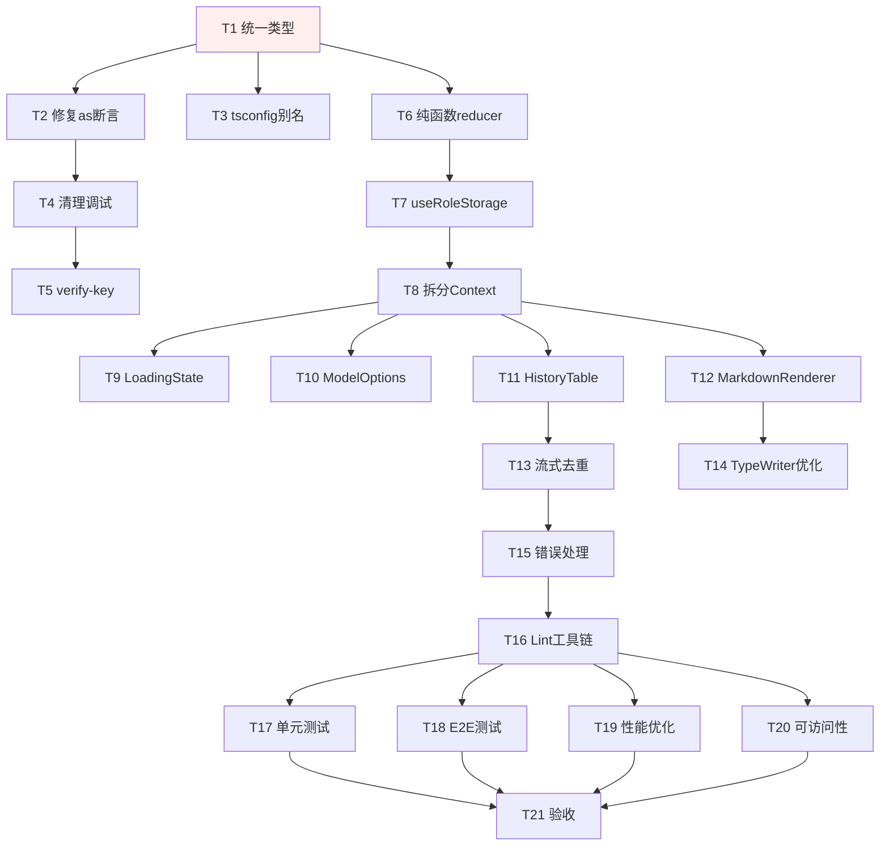

# Tasks: qwen-chatbot-code-quality-refactor

> 实施任务清单。按 P0 → P1 → P2 顺序，13 个任务组、~45 个子任务。
> Apply 阶段通过 `- [ ]` 复选框跟踪进度。

## 1. 统一类型定义（T1 → spec: type-system）

- [ ] 1.1 在 `types/index.ts` 集中声明 `Role`、`ModelConfig`、`Message`、`ConversationHistory`、`QwenChatOptions`、`TokenUsage`、`ChatResponse` 七个类型
- [ ] 1.2 删除 `components/ChatWindow.tsx`、`components/ConversationHistoryTable.tsx`、`components/ModelConfigPanel.tsx` 中的本地 `interface` 副本
- [ ] 1.3 改用 `import type { Role } from '../types'` 等 import 语法
- [ ] 1.4 `tsc --noEmit` 校验 0 错误；`grep -r "^interface" components/ lib/ types/ | awk -F: '{print $3}' | sort | uniq -c | awk '$1 > 1'` 输出为空

## 2. 修复 LangChain 强制类型断言（T1 续 → spec: type-system）

- [ ] 2.1 `lib/langchain/index.ts` 替换 6 处 `as string` 为 `String(content)` 或类型守卫
- [ ] 2.2 添加类型守卫函数 `toStringContent(content: string | MessageContentComplex[]): string`
- [ ] 2.3 `tsc --noEmit` 校验 0 错误

## 3. 修复 tsconfig 路径别名（T1 续 → spec: type-system）

- [ ] 3.1 删除 `tsconfig.json` 中 `"@/*": ["./src/*"]`（指向不存在的目录）
- [ ] 3.2 `tsc --noEmit` 校验仍为 0 错误

## 4. 清理调试代码（T2 → spec: type-system）

- [ ] 4.1 全文 `grep -rn "console.log" qwen-chatbot/` 列出所有位置
- [ ] 4.2 移除 `components/ChatWindow.tsx:32` 等纯调试 `console.log`
- [ ] 4.3 在 `lib/logger.ts` 创建统一 logger（导出 `log.debug` / `log.error`，dev/prod 分级）
- [ ] 4.4 `grep "console.log" .next/static/` 生产构建中 0 匹配

## 5. 修正 verify-key HTTP 语义（T2 续 → spec: type-system）

- [ ] 5.1 `pages/api/verify-key.ts:36` 错误时返回 `error.status === 401 ? 401 : 400` 而非 200
- [ ] 5.2 添加单元测试 `pages/api/verify-key.test.ts` 覆盖 401/429/200 分支

## 6. 抽取纯函数化角色 reducer（T3 → spec: role-state-management）

- [ ] 6.1 在 `lib/role-reducer.ts` 创建 `applyRoleCreate` / `applyRoleUpdate` / `applyRoleDelete` 三个纯函数
- [ ] 6.2 在 `lib/role-reducer.ts` 创建类型 `RoleUpdater = (prev: Role[]) => Role[]`
- [ ] 6.3 创建 `lib/role-reducer.test.ts` 覆盖所有 6 个核心场景（创建默认迁移 / 更新非默认 / 取消默认 / 删除非默认 / 删除默认迁移 / 拒绝删最后一个）
- [ ] 6.4 `pnpm test lib/role-reducer.test.ts --coverage` 100% 覆盖

## 7. 重构 useRoleStorage（T3 + T6 → spec: role-state-management）

- [ ] 7.1 `useRoleStorage.ts` 全部改用纯函数 setter 回调：`setRoles(prev => applyRoleCreate(prev, newRole))`
- [ ] 7.2 所有返回函数用 `useCallback` 包装，依赖数组为 `[]`
- [ ] 7.3 移除内联"创建默认角色" useEffect，迁移到 hook 内部
- [ ] 7.4 修复 `updateRole` 的多次 setState bug
- [ ] 7.5 创建 `useRoleStorage.test.ts` 用 `@testing-library/react` 的 `renderHook` 测试引用稳定性
- [ ] 7.6 `pnpm test useRoleStorage.test.ts` 全部通过

## 8. 拆分 AppContext（T5 → spec: chat-state-management）

- [ ] 8.1 创建 `contexts/ChatContext.tsx`（持久化 messages + conversationHistory + selectedRoleId）
- [ ] 8.2 创建 `contexts/UIContext.tsx`（临时 inputMessage，不入存储）
- [ ] 8.3 创建 `contexts/RoleContext.tsx`（包装 useRoleStorage）
- [ ] 8.4 在 `_app.tsx` 用三个 Provider 嵌套
- [ ] 8.5 安装 `use-debounce` 库
- [ ] 8.6 持久化操作改用 `useDebouncedCallback` 500ms 节流
- [ ] 8.7 添加 `beforeunload` 事件 flush
- [ ] 8.8 在 `getInitialState` 严格校验字段类型（`Array.isArray` + 显式默认值）
- [ ] 8.9 添加 `schemaVersion` 字段到持久化 state
- [ ] 8.10 保留旧 `AppContext` 为兼容层（标记 deprecated）
- [ ] 8.11 `pages/chat.tsx` 改用 `useChatContext()` / `useUIContext()` / `useRoleContext()`
- [ ] 8.12 `pages/roles.tsx` 同上
- [ ] 8.13 `pnpm test` ChatContext 集成测试通过

## 9. 抽取共享 LoadingState（T7 → spec: ui-component-library）

- [ ] 9.1 创建 `components/LoadingState.tsx` 接受 `message?: string` props
- [ ] 9.2 替换 `pages/chat.tsx:273` 的内联"加载中" div
- [ ] 9.3 替换 `pages/roles.tsx:36` 的内联"加载中" div
- [ ] 9.4 `grep "加载中" qwen-chatbot/pages/` 仅 `LoadingState.tsx` 引用

## 10. 抽取共享 ModelOptions（T7 续 → spec: ui-component-library）

- [ ] 10.1 创建 `lib/model-options.ts` 导出 `MODEL_OPTIONS` 常量
- [ ] 10.2 `ModelConfigPanel.tsx` 改用 `import { MODEL_OPTIONS }`
- [ ] 10.3 `RoleManager.tsx` 改用 `import { MODEL_OPTIONS }`
- [ ] 10.4 `grep "qwen-turbo" qwen-chatbot/components/` 仅 `lib/model-options.ts`

## 11. 抽取共享 HistoryTable（T7 续 → spec: ui-component-library）

- [ ] 11.1 创建 `components/HistoryTable.tsx` 含 `history` + `onEvaluationChange` props
- [ ] 11.2 修复 `autoEvaluate` 中文不分词 bug：用 `[...output].length` 字符数判断
- [ ] 11.3 修复 input/output 截断显示（30/60 字符 + `...`）
- [ ] 11.4 删除 `components/ConversationHistoryTable.tsx`（旧冗余副本）
- [ ] 11.5 `HistoryModal.tsx` 改用 `<HistoryTable />` 替换内联表格
- [ ] 11.6 创建 `HistoryTable.test.tsx` 覆盖截断、autoEvaluate、evaluation 输入

## 12. 抽取共享 MarkdownRenderer（T7 续 → spec: ui-component-library）

- [ ] 12.1 创建 `components/MarkdownRenderer.tsx` 接受 `children: string` + `className?: string`
- [ ] 12.2 `ChatWindow.tsx:58-63` 改用 `<MarkdownRenderer>`
- [ ] 12.3 `TypeWriterEffect.tsx:66-69` 改用 `<MarkdownRenderer>`
- [ ] 12.4 `grep "remarkGfm\|rehypeHighlight" qwen-chatbot/` 仅 `MarkdownRenderer.tsx`

## 13. 流式响应去重（T8 → spec: streaming-chat）

- [ ] 13.1 `pages/chat.tsx` 移除 `currentResponse` 本地 state
- [ ] 13.2 用 `useMemo` 提取 `const lastMessage = messages[messages.length-1]`
- [ ] 13.3 `<TypeWriterEffect text={lastMessage.content}>` 直接订阅 messages
- [ ] 13.4 E2E 测试验证流式过程中 DOM 仅 1 条助手消息气泡

## 14. TypeWriterEffect 性能优化（T9 → spec: streaming-chat）

- [ ] 14.1 `TypeWriterEffect.tsx` 改用 `requestAnimationFrame` 替代 `setTimeout`
- [ ] 14.2 添加 `const CHUNK_SIZE = 3` 常量，每次累积 3 字符
- [ ] 14.3 文本变化时取消上一帧 RAF（useEffect cleanup）
- [ ] 14.4 ReactMarkdown 解析用 `useMemo` 缓存
- [ ] 14.5 创建 `TypeWriterEffect.test.tsx` 覆盖文本变化重置、空文本、累积

## 15. 错误处理使用本地变量（T10 → spec: streaming-chat）

- [ ] 15.1 `pages/chat.tsx` 在 `SET_INPUT_MESSAGE` dispatch 前添加 `const userInput = inputMessage`
- [ ] 15.2 替换 catch 分支中 `inputMessage` → `userInput`（历史记录构造处）
- [ ] 15.3 替换 API 请求体中 `messages: [...messages, userMessage]` → `messages: [...messages, {role: 'user', content: userInput}]`
- [ ] 15.4 finally 块确保完整清理 `setIsGenerating(false)` + `setIsThinking(false)` + `setCurrentResponse('')`（若保留）
- [ ] 15.5 单元测试 `pages/chat.test.tsx` 覆盖错误路径历史记录正确性

## 16. ESLint + Prettier 工具链（T11 → spec: engineering-tooling）

- [ ] 16.1 安装 devDeps：`eslint@^9` `eslint-config-next` `prettier@^3` `vitest@^1` `@vitest/ui` `@testing-library/react` `@testing-library/jest-dom` `jsdom` `@testing-library/user-event` `@playwright/test`
- [ ] 16.2 创建 `.eslintrc.json` 继承 `next/core-web-vitals` + `react-hooks/recommended`
- [ ] 16.3 添加规则 `no-console: ["error", { allow: ["error", "warn"] }]`
- [ ] 16.4 创建 `.prettierrc`（`singleQuote: true`、`semi: true`、`trailingComma: "all"`、`printWidth: 100`）
- [ ] 16.5 创建 `.prettierignore` 排除 `node_modules/` `.next/` `coverage/`
- [ ] 16.6 创建 `vitest.config.ts`（jsdom + setup + coverage 阈值 80%）
- [ ] 16.7 创建 `vitest.setup.ts` 导入 `@testing-library/jest-dom`
- [ ] 16.8 `package.json` 新增 scripts：`format` / `format:check` / `test` / `test:watch` / `test:coverage` / `test:ui` / `test:e2e` / `test:e2e:ui`
- [ ] 16.9 `pnpm run lint` 0 警告通过
- [ ] 16.10 `pnpm run format:check` 通过

## 17. 单元 + 组件测试补齐（T11 续 → spec: engineering-tooling）

- [ ] 17.1 `lib/langchain/index.test.ts` 覆盖 `createQwenChatModel` 配置 / `callQwenChat` usage 映射
- [ ] 17.2 `lib/langchain/tools.test.ts` 覆盖天气码映射 / API 错误捕获 / 城市未找到
- [ ] 17.3 `components/useAISettings.test.ts` 覆盖 `saveApiKey` / `clearApiKey` + localStorage 错误
- [ ] 17.4 `components/RoleManager.test.tsx` 覆盖表单输入 / modelConfig 嵌套字段 / 提交
- [ ] 17.5 `components/ChatInput.test.tsx` 覆盖 disabled 状态 / submit 回调
- [ ] 17.6 `components/ModelConfigPanel.test.tsx` 覆盖 disabled 锁定 / range 输入
- [ ] 17.7 `pnpm test:coverage` ≥ 80% 全局 / 关键纯函数 100%

## 18. Playwright E2E 测试（T11 续 → spec: engineering-tooling）

- [ ] 18.1 `pnpm exec playwright install --with-deps chromium`
- [ ] 18.2 创建 `playwright.config.ts`（webServer 自动启动 dev server）
- [ ] 18.3 创建 `e2e/01-send-message.spec.ts` 覆盖 E1（发消息 + 流式响应）
- [ ] 18.4 创建 `e2e/02-role-crud.spec.ts` 覆盖 E2-E5（创建/编辑/删除/默认角色）
- [ ] 18.5 创建 `e2e/03-api-key.spec.ts` 覆盖 E6（配置 + 测试连接）
- [ ] 18.6 创建 `e2e/04-history.spec.ts` 覆盖 E7（历史 + 评价）
- [ ] 18.7 创建 `e2e/05-role-lock.spec.ts` 覆盖 E8（角色切换锁定配置）
- [ ] 18.8 创建 `e2e/06-error-retry.spec.ts` 覆盖 E9（错误重试）
- [ ] 18.9 创建 `e2e/07-persistence.spec.ts` 覆盖 E10（持久化往返）
- [ ] 18.10 `pnpm test:e2e` 全部通过

## 19. 性能优化（T13 → spec: frontend-quality）

- [ ] 19.1 `Message` 类型添加 `id: string` 字段（types/index.ts）
- [ ] 19.2 `ChatWindow.tsx` 消息列表 `key` 改用 `message.id`，加 `React.memo`
- [ ] 19.3 `RoleSelector.tsx` 加 `React.memo` 包装
- [ ] 19.4 `ModelConfigPanel.tsx` 加 `React.memo` 包装
- [ ] 19.5 `pages/chat.tsx` 用 `next/dynamic` 懒加载 `<HistoryModal>`
- [ ] 19.6 `pages/chat.tsx` 用 `next/dynamic` 懒加载 `<RoleManager>`（如 chat 页面使用）
- [ ] 19.7 `pages/roles.tsx` 同上
- [ ] 19.8 条件性引入 `react-virtuoso`（仅当 history > 100 时启用）

## 20. 可访问性补齐（T14 → spec: frontend-quality）

- [ ] 20.1 `HistoryModal.tsx` 添加 `role="dialog"` `aria-modal="true"` `aria-labelledby`
- [ ] 20.2 `HistoryModal.tsx` 标题添加 `id` 属性
- [ ] 20.3 `HistoryModal.tsx` 添加 ESC 键监听 + focus trap
- [ ] 20.4 `RoleManager.tsx` 编辑模态框同上（20.1-20.3）
- [ ] 20.5 全部 `×` 关闭按钮统一 `aria-label="关闭"`
- [ ] 20.6 替换 `text-gray-400` 正文字体为 `text-gray-600` 或更深
- [ ] 20.7 E2E 测试 + axe-core 验证模态框 0 critical 违规

## 21. 最终验收（所有任务完成后）

- [ ] 21.1 `pnpm run lint` 0 警告
- [ ] 21.2 `pnpm test:coverage` ≥ 80%
- [ ] 21.3 `pnpm test:e2e` 全部 10 条路径绿
- [ ] 21.4 `pnpm build` 成功
- [ ] 21.5 `pnpm start` + Lighthouse ≥ 90
- [ ] 21.6 `grep "console.log" .next/static/` 0 匹配
- [ ] 21.7 手动验证 5+ 角色场景无渲染循环
- [ ] 21.8 git commit 13 个独立任务（每任务 1 commit）
- [ ] 21.9 推送 PR + 等待 review

## 任务依赖图

## 验收门槛（与 proposal / design 一致）

| 指标 | 目标 |
|------|------|
| `tsc --noEmit` 错误 | 0 |
| `pnpm run lint` 警告 | 0 |
| 单元+组件覆盖率 | ≥ 80% |
| 关键纯函数覆盖率 | 100% |
| E2E 关键路径 | 10/10 全绿 |
| 生产构建 `console.log` | 0 |
| Lighthouse Performance | ≥ 90 |
