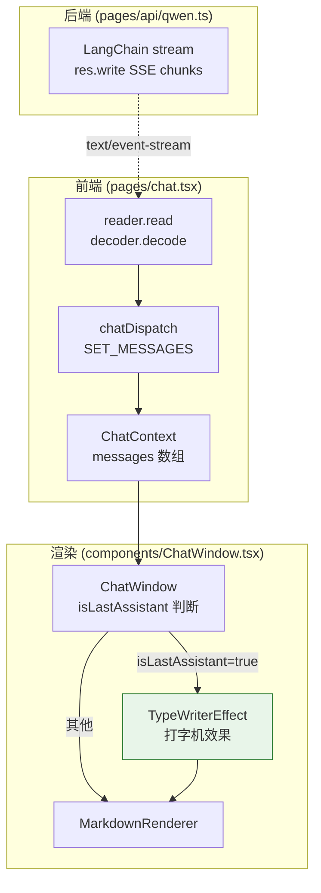
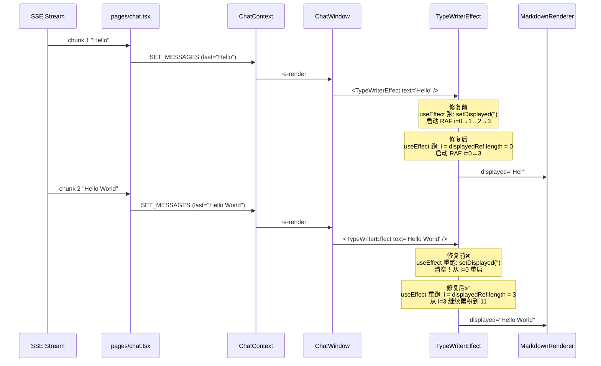

# Design: fix-qwen-chatbot-streaming-typewriter-restart-20260606-2240

> 结构化技术设计。从 `brainstorm.md`（raw capture）萃取并重组。
> Reviewer 关注：变更在系统哪里 → 涉及什么数据 → 怎么验证。

## Architecture Overview

**位置**：变更聚焦于 `components/TypeWriterEffect.tsx` 一个文件（标红/标绿）。后端 SSE 推送、ChatContext 状态机、ChatWindow 渲染逻辑均不动。

**架构模式**：无新模式引入，沿用既有"组件局部 RAF 动画"模式（仅修复其缺陷）。

**耦合边界**：
- TypeWriterEffect 仅依赖 MarkdownRenderer（不变）+ React hooks
- 不新增依赖、不新增 prop、不动公共 API
- 不修改 ChatWindow 传入 TypeWriterEffect 的方式（`<TypeWriterEffect text={message.content} />` 保持）

## Context

**当前状态**：
- qwen-chatbot 通过 `/api/qwen` SSE 流式接收通义千问回复
- 前端用 `pages/chat.tsx` 读流并 `chatDispatch SET_MESSAGES` 更新最后一条 assistant 消息
- ChatWindow 在最后一条 assistant 消息 + `isStreaming` 时用 `<TypeWriterEffect text={...} />` 渲染
- TypeWriterEffect 现有 useEffect（依赖 `[text, speed]`）在 text 每次 SSE chunk 增长时清空 displayed + 重启动画

**Bug 现象**：
- 用户感知：AI 回复"在一行闪烁几字符 → 突然整段全蹦"
- 根因：每次 text 变化都触发 `setDisplayed('')` + RAF 重启

**约束**：
- 必须保留打字机视觉效果（用户已确认）
- 不能新增 prop（YAGNI）
- 单文件改动优先，便于回滚
- 既有 3 个 TypeWriterEffect 单元测试不能回归

**干系人**：
- qwen-chatbot 终端用户（体验受影响方）
- 项目维护者（后续接入新模型/功能时不应被此 bug 干扰）

## Goals / Non-Goals

**Goals**：
- 修复流式输出时 TypeWriterEffect "闪烁 + 突然全蹦" 现象
- 保留打字机视觉效果（产品设计意图）
- 边界处理：text 变短 / 变空 / 已完成 等场景均无闪烁
- TypeWriterEffect 单元测试新增 ≥ 2 个 case（覆盖 "text 增长不重启" + "text 变短同步"）
- 既有 3 个 TypeWriterEffect 测试不回归
- 单文件改动 + 单文件测试改动，commit 粒度可原子回滚

**Non-Goals**：
- 不调整 `CHUNK_SIZE=3` / `speed=30` 默认值
- 不新增 `animated` / `enableRestart` 等 prop
- 不重写 useEffect 内部结构（除修复必要）
- 不重写后端 SSE chunk 频率
- 不动 chat.tsx 中 messages dispatch 频率
- 不动 ChatWindow.tsx（除非验证发现新 bug）
- 不动后端 qwen.ts / lib/langchain
- 不动测试阈值（AGENTS.md 已固定 65/75/70/65）
- 不做性能优化（除修复必要）

## Data Model

N/A — 无数据模型变更。本次为纯前端展示组件内部状态机修复。

## Decisions

### D1：修复方向 = 方案 A（修复 TypeWriterEffect 保留动画）

- **选择**：保留打字机效果，修复 useEffect 不再"清空 + 重启"
- **理由**：用户在前置 Q&A 中明确选择保留动画；保留产品设计意图；TDD 友好；改动最小
- **已考虑 alternative**：
  - 方案 B（移除 TypeWriterEffect）— 改动最简但丢失产品设计意图，用户否决
  - 方案 C（prop 化 TypeWriterEffect）— 增加 API 复杂度且 YAGNI，否决

### D2：useEffect 依赖列表 = `[text, speed]`

- **选择**：依赖保持 `[text, speed]`，**不**包含 `displayed.length` 或 `displayed`
- **理由**：若把 displayed 加进依赖，每次 RAF tick 触发 setDisplayed → displayed 变化 → effect 重新跑 → cleanup cancel 老 RAF → 启动新 RAF → 永远跑不完第一段。会产生动画循环 bug
- **已考虑 alternative**：
  - 加 `displayed.length` — 导致 effect 反复重启，循环 bug
  - 用 `useLayoutEffect` + ref — 同样问题
  - 完全不用 effect（在 render 中启动 RAF）— React 18+ 严格模式会双调用，需额外保护，复杂度更高

### D3：动画进度跟踪 = `useRef`（displayedRef）

- **选择**：用 `useRef<string>('')` 跟踪当前 displayed 长度，**不**依赖 state 同步
- **理由**：ref 变化不触发 effect，可频繁更新且不影响 React 调度。state 仍需保留以触发 re-render 显示
- **已考虑 alternative**：
  - 纯 state 同步 — 把 displayed 放依赖里（D2 已分析会循环 bug）
  - setState callback 形式 `setDisplayed((cur) => ...)` — 可避免 effect 依赖，但 effect 内部启动 RAF + cleanup cancel 的组合更清晰

### D4：text 变短处理 = 直接同步（不做动画回退）

- **选择**：当新 text 比 displayedRef.current 短时，`displayedRef.current = text; setDisplayed(text)`，不启动动画
- **理由**：变短是异常场景（如消息被截断/重置），不期望用户看到"打字机倒退"的诡异动画。直接同步最符合"显示最终状态"原则
- **已考虑 alternative**：
  - 动画回退（倒序显示）— 违反"打字机正向累积"心智模型
  - 保持 displayed 不变 — 会与 text 不一致，是数据漂移 bug

### D5：text === displayedRef.current 时跳过

- **选择**：若 `displayedRef.current === text`（完全追上），直接 return 不启动 RAF
- **理由**：避免无意义的 RAF tick 浪费；保证幂等
- **已考虑 alternative**：
  - 总是启动 RAF（无 op 优化）— 多余开销，且 if 内 `i < text.length` 永远为 false 时不会启动下次 tick，但首帧调度浪费

### D6：text === '' 处理 = 清空 + return

- **选择**：text 为空时 `displayedRef.current = ''; setDisplayed(''); return`
- **理由**：明确的"重置"信号（如消息被清空）；不需启动 RAF
- **已考虑 alternative**：
  - 用 `if (text.length === 0) return` — 不清空 displayed，会显示陈旧内容，是数据漂移 bug

### D7：CHUNK_SIZE / speed 默认值 = 不变

- **选择**：`CHUNK_SIZE=3`、`speed=30` 保持原值
- **理由**：本次只修复重启 bug，不调整性能参数；既有 e2e / 手动测试基线不变
- **已考虑 alternative**：调整默认值以"优化观感" — 超出本次范围（YAGNI + 防 scope creep）

### D8：是否动 ChatWindow / chat.tsx / 后端 = 不动

- **选择**：所有改动局限于 TypeWriterEffect.tsx + TypeWriterEffect.test.tsx
- **理由**：bug 根因在 TypeWriterEffect 内部；其他文件行为正确
- **已考虑 alternative**：在 ChatWindow 加 prop 透传控制动画（方案 C）— 已否决

## Data Flow

修复前 vs 修复后的关键路径：

**关键观察**：
- 修复前：每次 SSE chunk 到达都触发 `setDisplayed('')`（清空 + 重启），这是"闪烁"根因
- 修复后：useEffect 内部从 `displayedRef.current.length` 累积，**不**清空；效果是"平滑逐字增长"

## Risks / Trade-offs

| # | 风险 / 取舍 | 可能性 | 影响 | 缓解措施 |
|---|---|---|---|---|
| R1 | `displayedRef` 与 `displayed` state 漂移 | 低 | 中 | RAF tick 内**同时**更新两者（先写 ref 再 setState）；测试断言两者一致 |
| R2 | effect 取消老 RAF 后未及时启动新 RAF | 中 | 中 | cleanup 内 `cancelAnimationFrame` + 新 effect 立即 `requestAnimationFrame`；新增测试"text 增长不重启"直接覆盖 |
| R3 | `speed` 改变时累积进度丢失 | 中 | 低 | 接受（speed 变化时重新累积符合"用户主动调速"语义）；产品上可接受 |
| R4 | Markdown 重新解析导致渲染闪烁 | 中 | 低 | ReactMarkdown 有内部 memo；`text.slice(0, i)` 每次只增长 3 字符，渲染量小；视觉上无明显闪烁 |
| R5 | 测试中 RAF 不稳定导致 flaky | 高 | 中 | 用 `waitFor` + 大 `speed`（1000ms）；可选 `vi.useFakeTimers`；断言用 `not.toBe('')` 等反向断言（不依赖精确字符数） |
| R6 | e2e 录屏断言复杂 | 中 | 低 | 维持现有 e2e（01-send-message 跑通即可），不新增视觉断言；靠单元测试 + 手动验证 |
| R7 | 取舍：保留打字机效果增加实现复杂度 | — | — | 接受：产品设计意图 > 简化实现；方案 B 移除虽更简但用户否决 |

**回滚策略**：
- 单文件 revert：`git revert <feat-commit-hash>` 即可恢复 useEffect 旧实现
- 行为回滚：恢复到原 useEffect（`[text, speed]` + `setDisplayed('')` + 启动 RAF），功能完整（仅 UX 退化到"闪烁+全蹦"）
- 既有 3 个 TypeWriterEffect 测试可作为基线（修复后它们仍应通过；旧实现也通过）

## Testing Strategy

### 单元测试（vitest，本变更主战场）

**新增测试**（`TypeWriterEffect.test.tsx`）：

1. **`keeps displayed text growing without restart when text prop increases mid-stream`**
   - 模拟 SSE：text 从 `""` → `"Hello"` → `"Hello World"`
   - speed = 1000ms（让动画不会在测试时间内完成）
   - 断言：第二次 rerender 后，displayed 不为空、不等于完整 text、且前缀是 `"Hello"`

2. **`synchronizes displayed text when text prop becomes shorter than already-shown`**
   - 初始 text = `"Hello World"`，等动画完成（或 speed=0 立即完成）
   - rerender text = `"Hi"`
   - 断言：displayed 同步为 `"Hi"`（不保留陈旧内容，不做动画回退）

**既有测试不回归**：
- `renders empty container for empty text` — 保持通过
- `progressively reveals text via RAF` — 保持通过（speed=10 累积 5 字符）
- `reveals full text after RAF ticks` — 保持通过（speed=0 立即完成）

### 集成测试

- 无（本次为组件内部状态机修复，无 API / 网络 / 状态管理集成边界）
- 既有的 e2e 套件（`pnpm exec playwright test`）覆盖 SSE 端到端流程

### E2E 测试（Playwright）

- 不新增 e2e（避免视觉断言复杂度）
- 跑既有 `e2e/01-send-message.spec.ts` 验证流式回复能完整呈现（不报错）
- 跑既有 `e2e/06-error-retry.spec.ts` 验证错误重试不回归

### 边界条件

| 场景 | 行为 | 测试覆盖 |
|---|---|---|
| text = `""` | 清空 displayed，立即返回 | 既有测试 #1 |
| text 增长 | 从 displayedRef.length 累积，不清空 | **新增测试 #1** |
| text 变短 | 直接同步 displayed = text | **新增测试 #2** |
| text === displayedRef.current | 跳过（无 op） | 隐含于新增测试 #1 |
| speed 改变 | 重新累积（接受进度丢失） | 不单独测（产品可接受）|
| 组件卸载 | cleanup cancelAnimationFrame | 既有实现已正确（无需测） |

### 覆盖率目标

- TypeWriterEffect.tsx lines ≥ 90%（维持 / 提升既有）
- qwen-chatbot 全量：lines ≥ 65% / branches ≥ 75% / functions ≥ 70% / statements ≥ 65%（AGENTS.md 阈值）

## Migration Plan

**部署顺序**：
1. APPLY 阶段：在 worktree 内修改 TypeWriterEffect.tsx + TypeWriterEffect.test.tsx
2. 单元测试验证：vitest 跑通
3. commit 链：test（RED）→ feat（GREEN）→ refactor（可选第 3）
4. VERIFY 阶段：4 类全面测试（lint / typecheck / 单元+coverage / e2e）全绿
5. ARCHIVE 阶段：archive → commit → push → 询问用户清理

**回滚策略**：
- 单文件改动：仅 TypeWriterEffect.tsx
- 回滚操作：`git revert <feat-commit-hash>`（在 worktree 或 main 上）
- 回滚行为：恢复 useEffect 旧实现（清空+重启），功能完整，仅 UX 退化

**验收条件**：
- 单元测试全绿（既有 3 + 新增 2 = 5 个 case）
- qwen-chatbot 覆盖率 ≥ 65/75/70/65
- 既有 e2e 全绿
- 手动验证（用户浏览器）：发送长问题，观察流式回复"平滑逐字累积"（不闪烁、不突然全蹦）

**部署影响**：
- 前端 JS bundle 微小变化（仅 TypeWriterEffect 一个文件）
- 无后端变更
- 无数据库迁移
- 无环境变量变更
- 无 API 变更
- 向后兼容（TypeWriterEffect 的公共 API 不变：仅 `text` / `speed` / `className` props）

## Frontend Architecture

N/A — 无前端架构变更。本次为单一展示组件内部状态机修复，不涉及：
- 页面布局
- 路由
- 组件树层级
- 全局状态管理
- 视口 / 响应式策略

变更前后 TypeWriterEffect 在组件树中的位置不变（`ChatWindow → TypeWriterEffect → MarkdownRenderer`）。

## UI Design Tokens

N/A — 无 UI 设计令牌变更。本次不影响：
- 配色
- 间距
- 字体
- 阴影
- 圆角

TypeWriterEffect 的渲染输出仍为 `<MarkdownRenderer>`（不变），所有视觉令牌由 MarkdownRenderer / Tailwind 既有规则控制。

## Open Questions

无。设计已收敛：
- 修复方向（方案 A）已由用户在前置 Q&A 确认
- 所有 8 个决策（D1-D8）有明确选择 + 理由 + 已考虑的备选
- 边界场景已枚举 + 测试覆盖策略已规划
- 回滚策略已明确（单文件 revert）

后续若发现新需求（如需要"重新生成历史消息时启用打字机"），可走单独 change 引入 `animated` prop（方案 C）。
