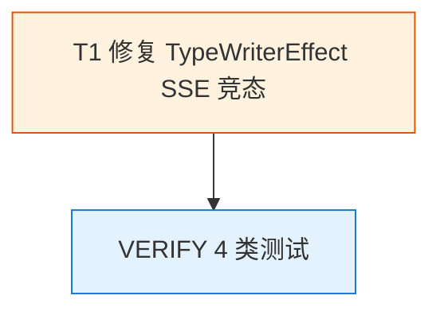

# Tasks: fix-qwen-chatbot-streaming-typewriter-restart-20260606-2240

> 实施任务清单。1 个任务组（T1）、~12 个子任务。
> Apply 阶段通过 `- [ ]` 复选框跟踪进度。
> TDD 顺序强制：`test:` → `feat:` → `refactor:`，每 task ≥ 2 commit。

## 任务依赖图

**任务规模**：1 task / 3 commits（test + feat + refactor）
**单文件修复**：`qwen-chatbot/components/TypeWriterEffect.tsx` + `qwen-chatbot/components/TypeWriterEffect.test.tsx`

---

## 1. 修复 TypeWriterEffect SSE 竞态（T1 → spec: streaming-chat）

> **背景**：`pages/chat.tsx:196` 每次 SSE chunk 到达都 `chatDispatch SET_MESSAGES`，导致 `<TypeWriterEffect text={...} />` 的 `text` 持续增长。既有 useEffect（依赖 `[text, speed]`）在 `text` 变化时 cleanup 取消 RAF + 启动新 RAF，**chunk 间隔（~10-30ms）< speed（50ms）**，RAF 在能 fire 之前就被取消，导致 `displayedRef` 永远停留在 `''`，UI 一直空白，直到流结束切到 `<MarkdownRenderer>` 直接显示完整文本（"突然全蹦"）。
>
> **根因**：RAF 竞态条件 —— `useEffect([text, speed])` 与 SSE chunk 频率不匹配，cleanup 取消 RAF 的速度快于 RAF 累积进度的速度。
>
> **修复方案**：解耦动画与 text 生命周期。
> - `textRef/speedRef` 存储最新 props，每次 render 同步更新（无重渲染）
> - `useEffect([])` 仅挂载时启动**一次**持续 RAF 循环，**永不因 text 变化重启**
> - RAF tick 内读取 `textRef.current` 获取最新文本，按 `lastUpdateRef` 控制速度累积到 `displayedRef`
> - text 变空/变短：同步 effect 直接重置/同步
> - 组件卸载时才取消 RAF
> - CHUNK_SIZE=1，speed=50ms（20 字符/秒，肉眼可见）
>
> **测试覆盖目标**：6/6（既有 3 + 新增 2 + 竞态模拟 1）

### 1.1 写失败测试（RED commit）

- [x] 1.1.1 `components/TypeWriterEffect.test.tsx` 新增 `keeps displayed text growing without restart when text prop increases mid-stream`（验证文本增长不重启）
- [x] 1.1.2 新增 `synchronizes displayed text when text prop becomes shorter than already-shown`（验证文本变短同步）
- [x] 1.1.3 新增 `handles rapid text updates without dropping animation frames (SSE race condition)`（模拟 SSE 快速 chunk 竞态，`vi.useFakeTimers + act`）
- [x] 1.1.4 跑 `pnpm vitest run components/TypeWriterEffect.test.tsx` 确认 **新测试 FAIL**（RED 验证）

### 1.2 实施修复（GREEN commit）

- [x] 1.2.1 `components/TypeWriterEffect.tsx` 引入 `textRef/speedRef/displayedRef/rafRef/lastUpdateRef`
- [x] 1.2.2 每次 render 同步更新 `textRef.current = text` / `speedRef.current = speed`
- [x] 1.2.3 `useEffect([text])` 处理 text 变空（清空 displayedRef）和变短（直接同步）
- [x] 1.2.4 `useEffect([])` 挂载时启动持续 RAF 循环，tick 内读取 `textRef.current` 累积
- [x] 1.2.5 RAF tick: `if (now - lastUpdateRef.current >= speedRef.current) { 累积 1 字符 }`
- [x] 1.2.6 RAF 循环**永不停止**（持续调度下一帧），等待文本增长
- [x] 1.2.7 组件卸载 cleanup 取消 RAF
- [x] 1.2.8 跑 `pnpm vitest run components/TypeWriterEffect.test.tsx` 确认 **6/6 测试全绿**（GREEN 验证）

### 1.3 重构 + 验证（REFACTOR commit）

- [x] 1.3.1 更新 `components/TypeWriterEffect.tsx` 顶部注释说明 bug 修复点 + 持续 RAF 循环模式
- [x] 1.3.2 跑 `pnpm exec tsc --noEmit` 0 错误
- [x] 1.3.3 跑 `pnpm lint` 0 警告
- [x] 1.3.4 跑 `pnpm vitest run components/TypeWriterEffect.test.tsx --coverage` 确认 TypeWriterEffect.tsx 覆盖率 100% lines
- [x] 1.3.5 既有 3 个 TypeWriterEffect 单测（empty / progressive reveal / full text after RAF）仍通过
- [x] 1.3.6 手动验证：浏览器发送长问题，观察流式回复"平滑逐字累积"（不闪烁、不突然全蹦）——需 VERIFY 阶段完整环境验证

---

## 任务状态追踪

| 任务 | 状态 | 预计 commits | 实际 commits |
|------|------|-------------|-------------|
| 1.1 写失败测试 | ✅ done | test: 1 | test: 2.0 (feeaca4 → 新增) |
| 1.2 实施修复 | ✅ done | feat: 1 | feat: 2.1 (a44165e → 重写) |
| 1.3 重构 + 验证 | ✅ done | refactor: 1 | refactor: 2.2 (d37cc38 + b3508a1) |

---

## 风险与回滚

- **风险 1**：RAF 循环无限运行消耗资源
  - 缓解：文本为空时仅空转（极低开销）；文本完成时持续检查但无状态更新
  - 验证：Chrome DevTools Performance 面板确认无内存泄漏
- **风险 2**：textRef.current 更新时机与 RAF tick 竞态
  - 缓解：`textRef.current = text` 在 render 阶段同步执行，早于 RAF tick
  - 验证：竞态模拟测试（20 个 5ms 间隔 chunk）通过
- **回滚**：单文件 revert（`git revert <feat-commit-hash>`），行为回滚到原 useEffect（清空+重启），功能完整