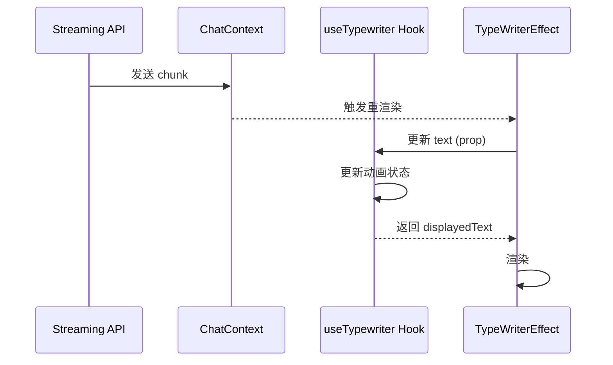

## Architecture Overview

```
┌────────────────────────────────────────────┐
│   Frontend (qwen-chatbot / Next.js)        │
│  ┌──────────────────┐   ┌────────────────┐ │
│  │ ChatWindow       │   │ useTypewriter  │ │←─── (New Animation Engine)
│  └──────────────────┘   └────────────────┘ │
│           │                     │          │
│  ┌──────────────────────────────────────┐  │
│  │ Messages (State from ChatContext)    │  │
│  └──────────────────────────────────────┘  │
└────────────────────────────────────────────┘
```

### 位置
此变更位于 `qwen-chatbot/components`，作为前端对话界面流式渲染的核心动画层。

### 架构模式
采用 Hook 模式（`useTypewriter`）将动画渲染逻辑与组件渲染逻辑解耦。

### 耦合边界
- 解耦 `TypeWriterEffect` 组件与 `messages` 的直接绑定。
- 引入新的 `useTypewriter` Hook，仅依赖输入的文本流。

## Context
当前 `TypeWriterEffect` 组件在 `text` prop 变化时，由于 React 重渲染机制，容易重置内部计时器，导致流式内容更新时出现“闪烁”或动画失效。

## Goals / Non-Goals

**Goals:**
- 实现平滑的流式文字渲染，兼容各种数据包大小和发送速度。
- 实现动画状态与数据状态的解耦。

**Non-Goals:**
- 不涉及后端接口调整。
- 不引入新的 UI 状态管理框架。

## Data Model
N/A — 无数据模型变更

## Decisions

### D1：动画驱动策略
- **选择**: 采用独立 Hook (`useTypewriter`) 封装渲染循环。
- **理由**: 组件 props 变化触发的重渲染不应直接打断内部计时器。Hook 可以通过 `useRef` 持有计时状态，仅在内容确实需要更新时进行状态同步。
- **已考虑 alternative**: 
  - 队列式缓冲：实现过于复杂且难以处理 Markdown 内容分割。拒绝。

## Data Flow


## Risks / Trade-offs

[Risk] 频繁渲染导致 CPU 消耗高 → Mitigation: 使用 `requestAnimationFrame` 配合合理的 `speed` 节流。
[Trade-off] 组件重渲染后动画衔接 → 接受理由：通过 `useRef` 保存已显示内容长度，实现平滑过渡。

## Testing Strategy

### 单元测试
- 测试 `useTypewriter` Hook 在不同速率下的字符增长情况。
- 测试组件在流式 chunk 更新时的 `displayedText` 正确性。

### E2E 测试
- 运行现有 `09-typewriter-animation.spec.ts` 验证动画流畅度。

## Migration Plan
N/A — 本 change 不涉及部署变更

## Frontend Architecture

### 技术栈
React 19 + Next.js + TailwindCSS + TypeScript

### 页面结构
ChatPage (聊天页面) -> ChatWindow (聊天窗口) -> Message (消息组件) -> TypeWriterEffect (动画组件)

### 目标平台
- 平台类型：Web (桌面/移动端适配)

## UI Design Tokens
N/A — 无视觉样式变更

## Open Questions
- 是否需要为动画速度提供可配置选项？暂不需要。
