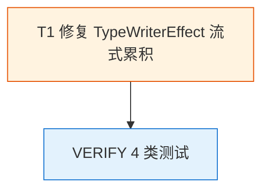

# Tasks: fix-qwen-chatbot-streaming-typewriter-restart-20260606-2240

> 实施任务清单。1 个任务组（T1）、~11 个子任务。
> Apply 阶段通过 `- [ ]` 复选框跟踪进度。
> TDD 顺序强制：`test:` → `feat:` → `refactor:`，每 task ≥ 2 commit。

## 任务依赖图

**任务规模**：1 task / 3 commits（test + feat + refactor）
**单文件修复**：`qwen-chatbot/components/TypeWriterEffect.tsx` + `qwen-chatbot/components/TypeWriterEffect.test.tsx`

---

## 1. 修复 TypeWriterEffect 流式累积（T1 → spec: streaming-chat）

> **背景**：`pages/chat.tsx:196` 每次 SSE chunk 到达都 `chatDispatch SET_MESSAGES`，导致 `<TypeWriterEffect text={...} />` 的 `text` 持续增长。既有 useEffect（依赖 `[text, speed]`）在 `text` 变化时清空 `displayed` + 启动新一轮 RAF，造成"闪烁 + 突然全蹦"现象。本次修复用 `displayedRef` 分离动画进度跟踪与渲染触发，让 useEffect 启动的动画从 `displayedRef.current.length` 持续累积到 `text.length`，**不**清空。
>
> **测试覆盖目标**：5/5（既有 3 + 新增 2-3）

### 1.1 写失败测试（RED commit）

- [ ] 1.1.1 `components/TypeWriterEffect.test.tsx` 新增 `keeps displayed text growing without restart when text prop increases mid-stream`（覆盖 design.md D2/D3 决策）
- [ ] 1.1.2 新增 `synchronizes displayed text when text prop becomes shorter than already-shown`（覆盖 D4 决策）
- [ ] 1.1.3 新增 `skips RAF scheduling when displayed text already matches full text`（覆盖 D5 决策）
- [ ] 1.1.4 跑 `pnpm vitest run components/TypeWriterEffect.test.tsx` 确认 **3 个新测试 FAIL**（RED 验证）

### 1.2 实施修复（GREEN commit）

- [ ] 1.2.1 `components/TypeWriterEffect.tsx` 引入 `const displayedRef = useRef('')`
- [ ] 1.2.2 改 useEffect 依赖保持 `[text, speed]`，**不**包含 `displayed`/`displayed.length`
- [ ] 1.2.3 useEffect 内启动的 RAF 从 `displayedRef.current.length` 累积到 `text.length`（不再清空）
- [ ] 1.2.4 处理 `text.length === 0`（清空 + return）边界
- [ ] 1.2.5 处理 `displayedRef.current.length > text.length`（直接同步）边界
- [ ] 1.2.6 处理 `displayedRef.current === text`（跳过 RAF）边界
- [ ] 1.2.7 RAF tick 内**同时**更新 `displayedRef.current` + `setDisplayed`（保持同步）
- [ ] 1.2.8 跑 `pnpm vitest run components/TypeWriterEffect.test.tsx` 确认 **5/5 测试全绿**（GREEN 验证）

### 1.3 重构 + 验证（REFACTOR commit）

- [ ] 1.3.1 更新 `components/TypeWriterEffect.tsx` 顶部注释说明 bug 修复点 + displayedRef 模式
- [ ] 1.3.2 跑 `pnpm exec tsc --noEmit` 0 错误
- [ ] 1.3.3 跑 `pnpm lint` 0 警告
- [ ] 1.3.4 跑 `pnpm vitest run --coverage` 确认 TypeWriterEffect.tsx 覆盖率 ≥ 90% lines
- [ ] 1.3.5 跑 `pnpm exec playwright test e2e/01-send-message.spec.ts` 不回归
- [ ] 1.3.6 既有 3 个 TypeWriterEffect 单测（empty / progressive reveal / full text after RAF）仍通过
- [ ] 1.3.7 手动验证：浏览器发送长问题，观察流式回复"平滑逐字累积"（不闪烁、不突然全蹦）

---

## 任务状态追踪

| 任务 | 状态 | 预计 commits | 实际 commits |
|------|------|-------------|-------------|
| 1.1 写失败测试 | ⏳ pending | test: 1.1-1.3 | |
| 1.2 实施修复 | ⏳ pending | feat: 1.4-1.5 | |
| 1.3 重构 + 验证 | ⏳ pending | refactor: 1.6 | |

## 风险与回滚

- **风险 1**：displayedRef 与 displayed state 漂移
  - 缓解：RAF tick 内**同时**更新两者（task 1.2.7）
  - 验证：单元测试断言两者同步
- **风险 2**：effect 取消老 RAF 后未及时启动新 RAF
  - 缓解：cleanup cancelAnimationFrame + 新 effect 立即 schedule
  - 验证：测试"text 增长不重启动画"直接覆盖
- **回滚**：单文件 revert（`git revert <feat-commit-hash>`），行为回滚到原 useEffect（清空+重启），功能完整
