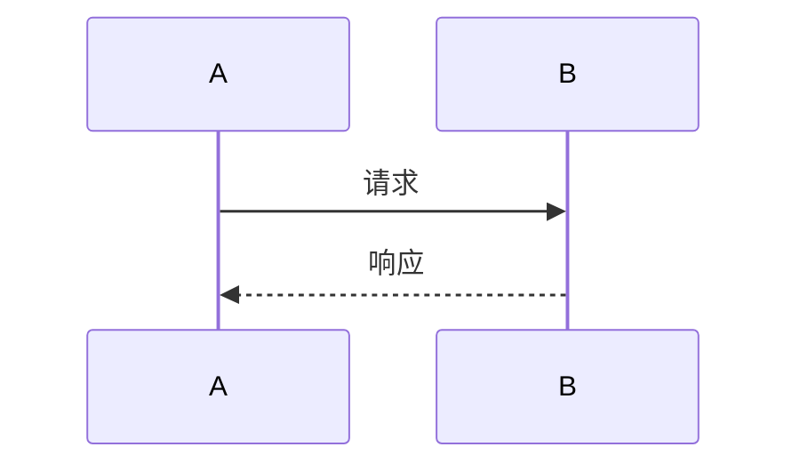

## Architecture Overview

<!--
ASCII 或 mermaid 架构图，标注变更在系统中的位置和边界。
这是评审者第一个应该看到的图——一眼理解"这个改动在哪里"。

格式建议：
```
┌────────────────────────────────────────────┐
│   Layer / Boundary                         │
│  ┌────────────┐   ┌──────────────────┐    │
│  │ 现有模块    │   │ 本次新增/修改    │←───┼── 变更焦点
│  └────────────┘   └──────────────────┘    │
└────────────────────────────────────────────┘
```

### 位置
变更在整个系统架构中的定位

### 架构模式
使用了什么架构模式？新引入的还是沿用既有模式？
（如：无状态 API、事件驱动、发布订阅、CQRS 等）

### 耦合边界
变更引入了哪些新的耦合关系？
- 新增依赖模块
- 新增外部依赖
- 新增数据共享约定
-->

## Context

<!--
Background, current state, constraints, stakeholders.
brainstorm.md 记录了探索过程（替代方案 + 选定方向）；
本档承接选定方向，展开完整技术设计。
-->

## Goals / Non-Goals

**Goals:**
<!-- What this design aims to achieve -->

**Non-Goals:**
<!-- What is explicitly out of scope -->

## Data Model

<!--
涉及数据持久化或新实体时，定义数据模型。
不涉及可写「N/A — 无数据模型变更」。

### 实体定义
| 实体 | 存储方式 | Key | 字段 | 生命周期 |
|------|---------|-----|------|---------|

### 状态迁移（如适用）
只对复杂状态变更需要。简单 CRUD 无需此子节。

状态图：
```mermaid
stateDiagram-v2
```

### 数据流图
展示数据在模块/组件/服务间的流转路径。
-->

## Decisions

<!--
所有技术决策的唯一来源（single source of truth）。
brainstorm.md 的 Agreed Approach 记录了「选了哪条路」，
本段记录「那条路上的每个岔口怎么选的」。

每个决策建议结构：
### D1：<决策标题>
- **选择**：<采用的做法>
- **理由**：<为何这样选>
- **已考虑 alternative**：<被拒方案 + 拒绝原因>
-->

## Data Flow

<!--
仅对复杂异步流程或非直观调用链需要。简单变更可写「N/A — 流程直观」。
使用 mermaid sequenceDiagram 描述关键路径上的步骤顺序。


-->

## Risks / Trade-offs

<!--
Known risks and trade-offs.
Format: [Risk] <描述> → Mitigation: <缓解措施>
[Trade-off] <取舍描述> → 接受理由
-->

## Testing Strategy

<!--
本变更如何验证？按层级描述测试策略。
简单变更可写「N/A — 验证策略已在 specs 中定义」。

### 单元测试
关键模块的单元测试覆盖要点

### 集成测试
- 需要 mock 的外部依赖
- 需要 stub 的内部模块
- 测试数据准备

### E2E 测试（如适用）

### 边界条件
- 异常场景
- 并发/竞态
- 安全边界
-->

## Migration Plan

<!--
部署顺序、rollback 策略、验收条件。
若不涉及部署变更（纯加套件、无 endpoint / DB 变更），
可写「N/A — 本 change 不涉及部署变更」。
-->

## Frontend Architecture

<!--
如果涉及前端 UI 变更，描述页面布局、组件树、视口策略。
这些信息将直接传递给 design-ui 阶段用于生成 UI 设计稿。
不涉及前端变更加「N/A — 无前端变更」。

### 技术栈
描述项目的前端框架、UI 库、CSS 方案

### 页面结构
列出涉及的路由和页面布局（如：侧边栏 + 主内容区）

### 组件树
核心组件的层级关系

### 目标平台
- 平台类型：{桌面端 / 移动端 / 响应式}
- 画布尺寸：{1200px 桌面 / 375px 移动}
- 布局模式：{固定宽度 / 流式 / 响应式}
- 断点策略：{如适用}
-->

## UI Design Tokens

<!--
设计令牌：颜色、间距、字体、阴影等 design tokens。
这些信息将传递给 design-ui 阶段用于样式一致性。
不涉及前端变更加「N/A — 无前端变更」。

### 配色方案
- 主色：{色值}
- 辅助色：{色值}
- 背景色：{色值}
- 文字色：{色值}
- 边框色：{色值}

### 字体
- 标题字体：{font-family}，字号范围
- 正文字体：{font-family}，字号

### 间距
- 页面内边距
- 组件间距
- 卡片内边距

### 圆角
- 按钮：{radius}
- 卡片：{radius}
- 输入框：{radius}
-->

## Open Questions

<!-- Outstanding decisions or unknowns to resolve -->
